# Implementation | After Trigger | Holds, Stalls, and Unresponsive

## Flow Diagram [(_View History_)](Implementation_After_Trigger_Holds_Stalls_and_Unresponsive-history.md)

```mermaid
%% If you read this, your Markdown visualizer does not handle MermaidJS syntax.
%% - If you are in VS Code, install extension `Markdown Preview Mermaid Support` at https://marketplace.visualstudio.com/items?itemName=bierner.markdown-mermaid
%% - If you are using sfdx-hardis, try to define env variable `MERMAID_MODES=cli,docker` ,then run again the command to regenerate markdown with SVG images.
%% - If you are within mkdocs-material, define mermaid plugin in `mkdocs.yml` as described in https://squidfunk.github.io/mkdocs-material/extensions/mermaid/
%% - As a last resort, you can copy-paste this MermaidJS code into https://mermaid.live/ to see the flow diagram

flowchart TB
START(["START<br/><b>AutoLaunched Flow</b></br>Type: <b> Record After Save</b>"]):::startClass
click START "#general-information" "3629678278"

myRule_1{"🔀 <em></em><br/>On Hold"}:::decisions
click myRule_1 "#myrule_1" "2247682196"

myRule_10{"🔀 <em></em><br/>Plan Stall Saved"}:::decisions
click myRule_10 "#myrule_10" "409859004"

myRule_13{"🔀 <em></em><br/>Plan Hold Released"}:::decisions
click myRule_13 "#myrule_13" "1873135879"

myRule_17{"🔀 <em></em><br/>Plan Passive"}:::decisions
click myRule_17 "#myrule_17" "1193666028"

myRule_20{"🔀 <em></em><br/>Passive to Active"}:::decisions
click myRule_20 "#myrule_20" "1908524052"

myRule_23{"🔀 <em></em><br/>Unresponsive"}:::decisions
click myRule_23 "#myrule_23" "3748636730"

myRule_27{"🔀 <em></em><br/>Responsive"}:::decisions
click myRule_27 "#myrule_27" "2512154723"

myRule_4{"🔀 <em></em><br/>Plan Stalled"}:::decisions
click myRule_4 "#myrule_4" "1223308331"

myRule_7{"🔀 <em></em><br/>No-Start"}:::decisions
click myRule_7 "#myrule_7" "1711180440"

myRule_10_A1[("➕ <em></em><br/>Billing Case")]:::recordCreates
click myRule_10_A1 "#myrule_10_a1" "996913349"

myRule_13_A2[("➕ <em></em><br/>Billing Case")]:::recordCreates
click myRule_13_A2 "#myrule_13_a2" "2937579390"

myRule_1_A1[("➕ <em></em><br/>Billing Case")]:::recordCreates
click myRule_1_A1 "#myrule_1_a1" "3305281691"

myRule_20_A2[("➕ <em></em><br/>Imp Case")]:::recordCreates
click myRule_20_A2 "#myrule_20_a2" "3510799197"

myRule_7_A2[("➕ <em></em><br/>Billing Case")]:::recordCreates
click myRule_7_A2 "#myrule_7_a2" "1928988495"

myRule_7_A4[("➕ <em></em><br/>Imps Case")]:::recordCreates
click myRule_7_A4 "#myrule_7_a4" "2224200046"

myRule_10_A2[("🛠️ <em></em><br/>Plan In Progress")]:::recordUpdates
click myRule_10_A2 "#myrule_10_a2" "1243385044"

myRule_10_A3[("🛠️ <em></em><br/>Move Back to In Progress")]:::recordUpdates
click myRule_10_A3 "#myrule_10_a3" "1400898365"

myRule_13_A1[("🛠️ <em></em><br/>Imp In Progress")]:::recordUpdates
click myRule_13_A1 "#myrule_13_a1" "3878602450"

myRule_17_A1[("🛠️ <em></em><br/>Plan = Passive")]:::recordUpdates
click myRule_17_A1 "#myrule_17_a1" "1398046154"

myRule_17_A2[("🛠️ <em></em><br/>Pay Submit Status")]:::recordUpdates
click myRule_17_A2 "#myrule_17_a2" "4226686416"

myRule_1_A2[("🛠️ <em></em><br/>Imp Status")]:::recordUpdates
click myRule_1_A2 "#myrule_1_a2" "2263528602"

myRule_20_A1[("🛠️ <em></em><br/>Plan Status")]:::recordUpdates
click myRule_20_A1 "#myrule_20_a1" "3938100200"

myRule_23_A1[("🛠️ <em></em><br/>Date")]:::recordUpdates
click myRule_23_A1 "#myrule_23_a1" "741396109"

myRule_27_A1[("🛠️ <em></em><br/>Date")]:::recordUpdates
click myRule_27_A1 "#myrule_27_a1" "3030111603"

myRule_4_A1[("🛠️ <em></em><br/>Plan Stall Stage")]:::recordUpdates
click myRule_4_A1 "#myrule_4_a1" "3902776505"

myRule_4_A2[("🛠️ <em></em><br/>Plan Status")]:::recordUpdates
click myRule_4_A2 "#myrule_4_a2" "167546484"

myRule_7_A1[("🛠️ <em></em><br/>No Start Status")]:::recordUpdates
click myRule_7_A1 "#myrule_7_a1" "913987934"

myRule_7_A3[("🛠️ <em></em><br/>Plan Status")]:::recordUpdates
click myRule_7_A3 "#myrule_7_a3" "446841869"

myRule_1 --> |"TRUE_On Hold"| myRule_1_A1
myRule_1 --> |"FALSE_On Hold"| myRule_4
myRule_10 --> |"TRUE_Plan Stall Saved"| myRule_10_A1
myRule_10 --> |"FALSE_Plan Stall Saved"| myRule_13
myRule_13 --> |"TRUE_Plan Hold Released"| myRule_13_A1
myRule_13 --> |"FALSE_Plan Hold Released"| myRule_17
myRule_17 --> |"TRUE_Plan Passive"| myRule_17_A1
myRule_17 --> |"FALSE_Plan Passive"| myRule_20
myRule_20 --> |"TRUE_Passive to Active"| myRule_20_A1
myRule_20 --> |"FALSE_Passive to Active"| myRule_23
myRule_23 --> |"TRUE_Unresponsive"| myRule_23_A1
myRule_23 --> |"FALSE_Unresponsive"| myRule_27
myRule_27 --> |"TRUE_Responsive"| myRule_27_A1
myRule_27 --> |"FALSE_Responsive"| END_myRule_27
myRule_4 --> |"TRUE_Plan Stalled"| myRule_4_A1
myRule_4 --> |"FALSE_Plan Stalled"| myRule_7
myRule_7 --> |"TRUE_No-Start"| myRule_7_A1
myRule_7 --> |"FALSE_No-Start"| myRule_10
myRule_10_A1 --> myRule_10_A2
myRule_13_A2 --> END_myRule_13_A2
myRule_1_A1 --> myRule_1_A2
myRule_20_A2 --> END_myRule_20_A2
myRule_7_A2 --> myRule_7_A3
myRule_7_A4 --> END_myRule_7_A4
myRule_10_A2 --> myRule_10_A3
myRule_10_A3 --> END_myRule_10_A3
myRule_13_A1 --> myRule_13_A2
myRule_17_A1 --> myRule_17_A2
myRule_17_A2 --> END_myRule_17_A2
myRule_1_A2 --> END_myRule_1_A2
myRule_20_A1 --> myRule_20_A2
myRule_23_A1 --> END_myRule_23_A1
myRule_27_A1 --> END_myRule_27_A1
myRule_4_A1 --> myRule_4_A2
myRule_4_A2 --> END_myRule_4_A2
myRule_7_A1 --> myRule_7_A2
myRule_7_A3 --> myRule_7_A4
START -->  myRule_1
END_myRule_27(( END )):::endClass
END_myRule_13_A2(( END )):::endClass
END_myRule_20_A2(( END )):::endClass
END_myRule_7_A4(( END )):::endClass
END_myRule_10_A3(( END )):::endClass
END_myRule_17_A2(( END )):::endClass
END_myRule_1_A2(( END )):::endClass
END_myRule_23_A1(( END )):::endClass
END_myRule_27_A1(( END )):::endClass
END_myRule_4_A2(( END )):::endClass


classDef actionCalls fill:#D4E4FC,color:black,text-decoration:none,max-height:100px
classDef assignments fill:#FBEED7,color:black,text-decoration:none,max-height:100px
classDef collectionProcessors fill:#F0E3FA,color:black,text-decoration:none,max-height:100px
classDef customErrors fill:#FFE9E9,color:black,text-decoration:none,max-height:100px
classDef decisions fill:#FDEAF6,color:black,text-decoration:none,max-height:100px
classDef loops fill:#FDEAF6,color:black,text-decoration:none,max-height:100px
classDef recordCreates fill:#FFF8C9,color:black,text-decoration:none,max-height:100px
classDef recordDeletes fill:#FFF8C9,color:black,text-decoration:none,max-height:100px
classDef recordLookups fill:#EDEAFF,color:black,text-decoration:none,max-height:100px
classDef recordUpdates fill:#FFF8C9,color:black,text-decoration:none,max-height:100px
classDef screens fill:#DFF6FF,color:black,text-decoration:none,max-height:100px
classDef subflows fill:#D4E4FC,color:black,text-decoration:none,max-height:100px
classDef startClass fill:#D9F2E6,color:black,text-decoration:none,max-height:100px
classDef endClass fill:#F9BABA,color:black,text-decoration:none,max-height:100px
classDef transforms fill:#FDEAF6,color:black,text-decoration:none,max-height:100px


```

<!-- Flow description -->

## General Information

|<!-- -->|<!-- -->|
|:---|:---|
|Object|Implementation__c|
|Process Type| Auto Launched Flow|
|Trigger Type| Record After Save|
|Record Trigger Type| Create And Update|
|Label|Implementation | After Trigger | Holds, Stalls, and Unresponsive|
|Status|Active|
|Description|Migrated from the Implementations | Stage Updates 6/22 process using multiple criteria. This flow handles what happens when an imp is stalled, on hold, unresponsive, or comes back from one of those statuses|
|Environments|Default|
|Interview Label|Implementation | After Trigger | Holds, Stalls, and Unresponsive {!$Flow.CurrentDateTime}|
| Builder Type (PM)|LightningFlowBuilder|
| Canvas Mode (PM)|AUTO_LAYOUT_CANVAS|
|Connector|[myRule_1](#myrule_1)|
|Next Node|[myRule_1](#myrule_1)|

## Formulas

|Name|Data Type|Expression|Description|
|:-- |:--:|:-- |:--  |
|formula_1_myRule_13_A2_1509873443|String|"Plan Implementation is no longer on hold.  Resume recurring billing subscriptions based off the Ubiquity Plan Effective Date, "+TEXT({!$Record.Ubiquity_Plan_Effective_Date__c}  )|<!-- -->|
|formula_2_myRule_23_A1_7858835662|Date|TODAY()|<!-- -->|
|formula_3_myRule_27_A1_2846545981|Date|TODAY()|<!-- -->|

## Flow Nodes Details

### myRule_1

|<!-- -->|<!-- -->|
|:---|:---|
|Type|Decision|
|Label|On Hold|
|Default Connector|[myRule_4](#myrule_4)|
|Default Connector Label|FALSE_On Hold|

#### Rule TRUE_myRule_1 (TRUE_On Hold)

|<!-- -->|<!-- -->|
|:---|:---|
|Connector|[myRule_1_A1](#myrule_1_a1)|
|Condition Logic|and|

|Condition Id|Left Value Reference|Operator|Right Value|
|:-- |:-- |:--:|:--: |
|1|$Record.Plan_Hold_Date__c| Is Changed|✅|
|2|$Record.Plan_Hold_Date__c| Is Null|⬜|

### myRule_10

|<!-- -->|<!-- -->|
|:---|:---|
|Type|Decision|
|Label|Plan Stall Saved|
|Default Connector|[myRule_13](#myrule_13)|
|Default Connector Label|FALSE_Plan Stall Saved|

#### Rule TRUE_myRule_10 (TRUE_Plan Stall Saved)

|<!-- -->|<!-- -->|
|:---|:---|
|Connector|[myRule_10_A1](#myrule_10_a1)|
|Condition Logic|and|

|Condition Id|Left Value Reference|Operator|Right Value|
|:-- |:-- |:--:|:--: |
|1|$Record.Plan_Saved_Date__c| Is Changed|✅|
|2|$Record.Plan_Saved_Date__c| Is Null|⬜|

### myRule_13

|<!-- -->|<!-- -->|
|:---|:---|
|Type|Decision|
|Label|Plan Hold Released|
|Default Connector|[myRule_17](#myrule_17)|
|Default Connector Label|FALSE_Plan Hold Released|

#### Rule TRUE_myRule_13 (TRUE_Plan Hold Released)

|<!-- -->|<!-- -->|
|:---|:---|
|Connector|[myRule_13_A1](#myrule_13_a1)|
|Condition Logic|and|

|Condition Id|Left Value Reference|Operator|Right Value|
|:-- |:-- |:--:|:--: |
|1|$Record.Actual_Plan_Release_Date__c| Is Changed|✅|
|2|$Record.Actual_Plan_Release_Date__c| Is Null|⬜|
|3|$Record.Implementation_Status__c| Equal To|On Hold|

### myRule_17

|<!-- -->|<!-- -->|
|:---|:---|
|Type|Decision|
|Label|Plan Passive|
|Default Connector|[myRule_20](#myrule_20)|
|Default Connector Label|FALSE_Plan Passive|

#### Rule TRUE_myRule_17 (TRUE_Plan Passive)

|<!-- -->|<!-- -->|
|:---|:---|
|Connector|[myRule_17_A1](#myrule_17_a1)|
|Condition Logic|and|

|Condition Id|Left Value Reference|Operator|Right Value|
|:-- |:-- |:--:|:--: |
|1|$Record.Implementation_Status__c| Is Changed|✅|
|2|$Record.Implementation_Status__c| Equal To|Passive|

### myRule_20

|<!-- -->|<!-- -->|
|:---|:---|
|Type|Decision|
|Label|Passive to Active|
|Default Connector|[myRule_23](#myrule_23)|
|Default Connector Label|FALSE_Passive to Active|

#### Rule TRUE_myRule_20 (TRUE_Passive to Active)

|<!-- -->|<!-- -->|
|:---|:---|
|Connector|[myRule_20_A1](#myrule_20_a1)|
|Condition Logic|and|

|Condition Id|Left Value Reference|Operator|Right Value|
|:-- |:-- |:--:|:--: |
|1|$Record.Implementation_Status__c| Is Changed|✅|
|2|$Record.Implementation_Status__c| Not Equal To|Passive|
|3|$Record.Plan__r.Status__c| Equal To|Passive|

### myRule_23

|<!-- -->|<!-- -->|
|:---|:---|
|Type|Decision|
|Label|Unresponsive|
|Default Connector|[myRule_27](#myrule_27)|
|Default Connector Label|FALSE_Unresponsive|

#### Rule TRUE_myRule_23 (TRUE_Unresponsive)

|<!-- -->|<!-- -->|
|:---|:---|
|Connector|[myRule_23_A1](#myrule_23_a1)|
|Condition Logic|and|

|Condition Id|Left Value Reference|Operator|Right Value|
|:-- |:-- |:--:|:--: |
|1|$Record.Unresponsive__c| Is Changed|✅|
|2|$Record.Unresponsive__c| Equal To|✅|

### myRule_27

|<!-- -->|<!-- -->|
|:---|:---|
|Type|Decision|
|Label|Responsive|
|Default Connector Label|FALSE_Responsive|

#### Rule TRUE_myRule_27 (TRUE_Responsive)

|<!-- -->|<!-- -->|
|:---|:---|
|Connector|[myRule_27_A1](#myrule_27_a1)|
|Condition Logic|and|

|Condition Id|Left Value Reference|Operator|Right Value|
|:-- |:-- |:--:|:--: |
|1|$Record.Unresponsive__c| Is Changed|✅|
|2|$Record.Unresponsive__c| Equal To|⬜|

### myRule_4

|<!-- -->|<!-- -->|
|:---|:---|
|Type|Decision|
|Label|Plan Stalled|
|Default Connector|[myRule_7](#myrule_7)|
|Default Connector Label|FALSE_Plan Stalled|

#### Rule TRUE_myRule_4 (TRUE_Plan Stalled)

|<!-- -->|<!-- -->|
|:---|:---|
|Connector|[myRule_4_A1](#myrule_4_a1)|
|Condition Logic|and|

|Condition Id|Left Value Reference|Operator|Right Value|
|:-- |:-- |:--:|:--: |
|1|$Record.Plan_Stall_Date__c| Is Changed|✅|
|2|$Record.Plan_Stall_Date__c| Is Null|⬜|

### myRule_7

|<!-- -->|<!-- -->|
|:---|:---|
|Type|Decision|
|Label|No-Start|
|Default Connector|[myRule_10](#myrule_10)|
|Default Connector Label|FALSE_No-Start|

#### Rule TRUE_myRule_7 (TRUE_No-Start)

|<!-- -->|<!-- -->|
|:---|:---|
|Connector|[myRule_7_A1](#myrule_7_a1)|
|Condition Logic|and|

|Condition Id|Left Value Reference|Operator|Right Value|
|:-- |:-- |:--:|:--: |
|1|$Record.No_Start_Date__c| Is Changed|✅|
|2|$Record.No_Start_Date__c| Is Null|⬜|

### myRule_10_A1

|<!-- -->|<!-- -->|
|:---|:---|
|Type|Record Create|
|Object|Case|
|Label|Billing Case|
|Store Output Automatically|✅|
|Connector|[myRule_10_A2](#myrule_10_a2)|

#### Input Assignments

|Field|Value|
|:-- |:--: |
|AccountId|$Record.Account__c|
|BusinessHoursId|01m00000000000J|
|Case_Source__c|Internal|
|Case_Type__c|Single Case|
|Category__c|Billing|
|Department__c|Billing|
|Description|Please set up recurring subscription terms as of today's date|
|Implementation__c|$Record.Id|
|Origin|Billing Inbox|
|OwnerId|00500000006yEak|
|Plan__c|$Record.Plan__c|
|Priority|High|
|RecordTypeId|01237000000Xu63|
|Status|New|
|Sub_Category__c|Billing schedule|
|Subject|Plan Saved - Please restart billing subscription|

### myRule_13_A2

|<!-- -->|<!-- -->|
|:---|:---|
|Type|Record Create|
|Object|Case|
|Label|Billing Case|
|Store Output Automatically|✅|

#### Input Assignments

|Field|Value|
|:-- |:--: |
|AccountId|$Record.Account__c|
|BusinessHoursId|01m00000000000J|
|Case_Source__c|Internal|
|Case_Type__c|Single Case|
|Category__c|Billing|
|Department__c|Billing|
|Description|formula_1_myRule_13_A2_1509873443|
|Implementation__c|$Record.Id|
|Origin|Billing Inbox|
|OwnerId|00500000006yEak|
|Plan__c|$Record.Plan__c|
|Priority|High|
|RecordTypeId|01237000000Xu63|
|Status|New|
|Sub_Category__c|Billing schedule|
|Subject|Plan hold released - start recurring billing|

### myRule_1_A1

|<!-- -->|<!-- -->|
|:---|:---|
|Type|Record Create|
|Object|Case|
|Label|Billing Case|
|Store Output Automatically|✅|
|Connector|[myRule_1_A2](#myrule_1_a2)|

#### Input Assignments

|Field|Value|
|:-- |:--: |
|AccountId|$Record.Account__c|
|BusinessHoursId|01m37000000PC36|
|Case_Source__c|Internal|
|Case_Type__c|Single Case|
|Category__c|Billing|
|Department__c|Billing|
|Description|1) Netsuite – Update plan status = On Hold 2) Paradigm – Turn off recurring billing subscription, if applicable|
|Implementation__c|$Record.Id|
|OwnerId|00500000006yEak|
|Plan__c|$Record.Plan__c|
|Priority|Medium|
|RecordTypeId|01237000000Xu63|
|Status|New|
|Subject|Plan On Hold - Update Paradigm and Netsuite|

### myRule_20_A2

|<!-- -->|<!-- -->|
|:---|:---|
|Type|Record Create|
|Object|Case|
|Label|Imp Case|
|Store Output Automatically|✅|

#### Input Assignments

|Field|Value|
|:-- |:--: |
|AccountId|$Record.Account__c|
|BusinessHoursId|01m1G000000XaE1|
|Case_Source__c|Internal|
|Case_Type__c|Single Case|
|Category__c|Implementation|
|Department__c|Implementations|
|Description|Implementation was passive and has now uploaded census and/or payroll.   Review to confirm proper Implementation Status and continue with next steps|
|Implementation__c|$Record.Id|
|Origin|Internal|
|OwnerId|$Record.OwnerId|
|Plan__c|$Record.Plan__c|
|Priority|Medium|
|RecordTypeId|012370000005thqAAA|
|Status|New|
|Subject|Action Required - Implementation No Longer Passive|

### myRule_7_A2

|<!-- -->|<!-- -->|
|:---|:---|
|Type|Record Create|
|Object|Case|
|Label|Billing Case|
|Store Output Automatically|✅|
|Connector|[myRule_7_A3](#myrule_7_a3)|

#### Input Assignments

|Field|Value|
|:-- |:--: |
|AccountId|$Record.Account__c|
|BusinessHoursId|01m00000000000J|
|Case_Source__c|Internal|
|Case_Type__c|Single Case|
|Category__c|Billing|
|Department__c|Billing|
|Description|1)	Paradigm - Remove all terms and terminated subscription. 2)	Paradigm - Write-off all outstanding invoices (if applicable). 3)	Netsuite – Subscription Status = Terminated 4)	Netsuite – Plan Status = No Start 5)	Netsuite – Termination Date = Date of this notice|
|Implementation__c|$Record.Id|
|Origin|Billing Inbox|
|OwnerId|00500000006yEak|
|Plan__c|$Record.Plan__c|
|Priority|High|
|RecordTypeId|01237000000Xu63|
|Status|New|
|Sub_Category__c|Billing Suspension|
|Subject|Plan no-start - Update Paradigm and Netsuite|

### myRule_7_A4

|<!-- -->|<!-- -->|
|:---|:---|
|Type|Record Create|
|Object|Case|
|Label|Imps Case|
|Store Output Automatically|✅|

#### Input Assignments

|Field|Value|
|:-- |:--: |
|AccountId|$Record.Account__c|
|BusinessHoursId|01m1G000000XaE1|
|Case_Source__c|Internal|
|Case_Type__c|Single Case|
|Department__c|Implementations|
|Description|No Start – review and update Paradigm|
|Implementation__c|$Record.Id|
|Origin|Transitions|
|OwnerId|00G37000000PDff|
|Plan__c|$Record.Plan__c|
|Priority|Medium|
|RecordTypeId|012370000005thqAAA|
|Status|Assigned|
|Subject|New No Start Notification|

### myRule_10_A2

|<!-- -->|<!-- -->|
|:---|:---|
|Type|Record Update|
|Label|Plan In Progress|
|Input Reference|$Record.Plans__r|
|Connector|[myRule_10_A3](#myrule_10_a3)|

#### Input Assignments

|Field|Value|
|:-- |:--: |
|Status__c|Implementation in Progress|

### myRule_10_A3

|<!-- -->|<!-- -->|
|:---|:---|
|Type|Record Update|
|Label|Move Back to In Progress|
|Input Reference|$Record|

#### Input Assignments

|Field|Value|
|:-- |:--: |
|Implementation_Status__c|In Progress|

### myRule_13_A1

|<!-- -->|<!-- -->|
|:---|:---|
|Type|Record Update|
|Label|Imp In Progress|
|Input Reference|$Record|
|Connector|[myRule_13_A2](#myrule_13_a2)|

#### Input Assignments

|Field|Value|
|:-- |:--: |
|Implementation_Status__c|In Progress|

### myRule_17_A1

|<!-- -->|<!-- -->|
|:---|:---|
|Type|Record Update|
|Label|Plan = Passive|
|Input Reference|$Record.Plan__r|
|Connector|[myRule_17_A2](#myrule_17_a2)|

#### Input Assignments

|Field|Value|
|:-- |:--: |
|Status__c|Passive|

### myRule_17_A2

|<!-- -->|<!-- -->|
|:---|:---|
|Type|Record Update|
|Label|Pay Submit Status|
|Input Reference|$Record.Plan__r|

#### Input Assignments

|Field|Value|
|:-- |:--: |
|Payroll_Submission_Status__c|Passive|

### myRule_1_A2

|<!-- -->|<!-- -->|
|:---|:---|
|Type|Record Update|
|Label|Imp Status|
|Input Reference|$Record|

#### Input Assignments

|Field|Value|
|:-- |:--: |
|Implementation_Status__c|On Hold|

### myRule_20_A1

|<!-- -->|<!-- -->|
|:---|:---|
|Type|Record Update|
|Label|Plan Status|
|Input Reference|$Record.Plan__r|
|Connector|[myRule_20_A2](#myrule_20_a2)|

#### Input Assignments

|Field|Value|
|:-- |:--: |
|Payroll_Submission_Status__c|Implementation|
|Status__c|Implementation in Progress|

### myRule_23_A1

|<!-- -->|<!-- -->|
|:---|:---|
|Type|Record Update|
|Label|Date|
|Input Reference|$Record|

#### Input Assignments

|Field|Value|
|:-- |:--: |
|Unresponsive_Date__c|formula_2_myRule_23_A1_7858835662|

### myRule_27_A1

|<!-- -->|<!-- -->|
|:---|:---|
|Type|Record Update|
|Label|Date|
|Input Reference|$Record|

#### Input Assignments

|Field|Value|
|:-- |:--: |
|Response_Date__c|formula_3_myRule_27_A1_2846545981|

### myRule_4_A1

|<!-- -->|<!-- -->|
|:---|:---|
|Type|Record Update|
|Label|Plan Stall Stage|
|Input Reference|$Record|
|Connector|[myRule_4_A2](#myrule_4_a2)|

#### Input Assignments

|Field|Value|
|:-- |:--: |
|Implementation_Status__c|Plan Stalled|

### myRule_4_A2

|<!-- -->|<!-- -->|
|:---|:---|
|Type|Record Update|
|Label|Plan Status|
|Input Reference|$Record.Plans__r|

#### Input Assignments

|Field|Value|
|:-- |:--: |
|Status__c|Implementation Stalled|

### myRule_7_A1

|<!-- -->|<!-- -->|
|:---|:---|
|Type|Record Update|
|Label|No Start Status|
|Input Reference|$Record|
|Connector|[myRule_7_A2](#myrule_7_a2)|

#### Input Assignments

|Field|Value|
|:-- |:--: |
|Implementation_Status__c|No Start|

### myRule_7_A3

|<!-- -->|<!-- -->|
|:---|:---|
|Type|Record Update|
|Label|Plan Status|
|Input Reference|$Record.Plans__r|
|Connector|[myRule_7_A4](#myrule_7_a4)|

#### Input Assignments

|Field|Value|
|:-- |:--: |
|Status__c|Inactive|

___

_Documentation generated from branch monitoring_myubiquity by [sfdx-hardis](https://sfdx-hardis.cloudity.com), featuring [salesforce-flow-visualiser](https://github.com/toddhalfpenny/salesforce-flow-visualiser)_