# Implementation | After Trigger | Send Client Emails

## Flow Diagram [(_View History_)](Implementation_After_Trigger_Send_Client_Emails-history.md)

```mermaid
%% If you read this, your Markdown visualizer does not handle MermaidJS syntax.
%% - If you are in VS Code, install extension `Markdown Preview Mermaid Support` at https://marketplace.visualstudio.com/items?itemName=bierner.markdown-mermaid
%% - If you are using sfdx-hardis, try to define env variable `MERMAID_MODES=cli,docker` ,then run again the command to regenerate markdown with SVG images.
%% - If you are within mkdocs-material, define mermaid plugin in `mkdocs.yml` as described in https://squidfunk.github.io/mkdocs-material/extensions/mermaid/
%% - As a last resort, you can copy-paste this MermaidJS code into https://mermaid.live/ to see the flow diagram

flowchart TB
START(["START<br/><b>AutoLaunched Flow</b></br>Type: <b> Record After Save</b>"]):::startClass
click START "#general-information" "848030785"

Finch_1st_Call_Follow_Up("📧 <em></em><br/>Finch 1st Call Follow Up"):::actionCalls
click Finch_1st_Call_Follow_Up "#finch_1st_call_follow_up" "762827503"

Finch_2nd_Call_Follow_Up("📧 <em></em><br/>Finch 2nd Call Follow Up"):::actionCalls
click Finch_2nd_Call_Follow_Up "#finch_2nd_call_follow_up" "1295479585"

Finch_Simply_1st_Call_Follow_Up("📧 <em></em><br/>Finch Simply 1st Call Follow Up"):::actionCalls
click Finch_Simply_1st_Call_Follow_Up "#finch_simply_1st_call_follow_up" "630327140"

Finch_Simply_2nd_Call_Follow_Up("📧 <em></em><br/>Finch Simply 2nd Call Follow Up"):::actionCalls
click Finch_Simply_2nd_Call_Follow_Up "#finch_simply_2nd_call_follow_up" "862648770"

Sallus_Post_1st_Call("📧 <em></em><br/>Sallus Post 1st Call"):::actionCalls
click Sallus_Post_1st_Call "#sallus_post_1st_call" "1131073640"

Sallus_Post_2nd_Call("📧 <em></em><br/>Sallus Post 2nd Call"):::actionCalls
click Sallus_Post_2nd_Call "#sallus_post_2nd_call" "3190505779"

Send_1st_Call_Follow_Up("📧 <em></em><br/>Send 1st Call Follow Up"):::actionCalls
click Send_1st_Call_Follow_Up "#send_1st_call_follow_up" "59779247"

Send_1st_Call_Follow_up_Unbundled("📧 <em></em><br/>Send 1st Call Follow up, Unbundled"):::actionCalls
click Send_1st_Call_Follow_up_Unbundled "#send_1st_call_follow_up_unbundled" "2978862302"

Send_2nd_Call_Follow_Up("📧 <em></em><br/>Send 2nd Call Follow Up"):::actionCalls
click Send_2nd_Call_Follow_Up "#send_2nd_call_follow_up" "3787546743"

Send_Conversion_Welcome_Email("📧 <em></em><br/>Send Conversion Welcome Email"):::actionCalls
click Send_Conversion_Welcome_Email "#send_conversion_welcome_email" "500509462"

Send_RKO_Conversion_Welcome_Email("📧 <em></em><br/>Send RKO Conversion Welcome Email"):::actionCalls
click Send_RKO_Conversion_Welcome_Email "#send_rko_conversion_welcome_email" "3519831446"

Send_Sallus_Welcome_Email("📧 <em></em><br/>Send Sallus Welcome Email"):::actionCalls
click Send_Sallus_Welcome_Email "#send_sallus_welcome_email" "3365825534"

Send_Schwab_Welcome_Email("📧 <em></em><br/>Send Schwab Welcome Email"):::actionCalls
click Send_Schwab_Welcome_Email "#send_schwab_welcome_email" "2635371675"

Send_Simply_Self_Service_Email("📧 <em></em><br/>Send Simply Self-Service Email"):::actionCalls
click Send_Simply_Self_Service_Email "#send_simply_self_service_email" "543273696"

Send_Solo_K_Conversion_Welcome_Email("📧 <em></em><br/>Send Solo K Conversion Welcome Email"):::actionCalls
click Send_Solo_K_Conversion_Welcome_Email "#send_solo_k_conversion_welcome_email" "3740683920"

Send_UBQT_Welcome_Email("📧 <em></em><br/>Send UBQT Welcome Email"):::actionCalls
click Send_UBQT_Welcome_Email "#send_ubqt_welcome_email" "1636620287"

Simply_Post_1st_Call("📧 <em></em><br/>Simply Post 1st Call"):::actionCalls
click Simply_Post_1st_Call "#simply_post_1st_call" "1174688666"

Simply_Post_2nd_Call("📧 <em></em><br/>Simply Post 2nd Call"):::actionCalls
click Simply_Post_2nd_Call "#simply_post_2nd_call" "4198434159"

Client_Verification_0{"🔀 <em></em><br/>Client Verification"}:::decisions
click Client_Verification_0 "#client_verification_0" "715230880"

Implementation_Started{"🔀 <em></em><br/>Implementation Started"}:::decisions
click Implementation_Started "#implementation_started" "2688788428"

Intro_Call{"🔀 <em></em><br/>Intro Call"}:::decisions
click Intro_Call "#intro_call" "1749829483"

X2nd_Call{"🔀 <em></em><br/>2nd Call"}:::decisions
click X2nd_Call "#x2nd_call" "614011601"

Get_AC[("🔍 <em></em><br/>Get AC")]:::recordLookups
click Get_AC "#get_ac" "3025382092"

Finch_1st_Call_Follow_Up --> END_Finch_1st_Call_Follow_Up
Finch_2nd_Call_Follow_Up --> END_Finch_2nd_Call_Follow_Up
Finch_Simply_1st_Call_Follow_Up --> END_Finch_Simply_1st_Call_Follow_Up
Finch_Simply_2nd_Call_Follow_Up --> END_Finch_Simply_2nd_Call_Follow_Up
Sallus_Post_1st_Call --> END_Sallus_Post_1st_Call
Sallus_Post_2nd_Call --> END_Sallus_Post_2nd_Call
Send_1st_Call_Follow_Up --> END_Send_1st_Call_Follow_Up
Send_1st_Call_Follow_up_Unbundled --> END_Send_1st_Call_Follow_up_Unbundled
Send_2nd_Call_Follow_Up --> END_Send_2nd_Call_Follow_Up
Send_Conversion_Welcome_Email --> END_Send_Conversion_Welcome_Email
Send_RKO_Conversion_Welcome_Email --> END_Send_RKO_Conversion_Welcome_Email
Send_Sallus_Welcome_Email --> END_Send_Sallus_Welcome_Email
Send_Schwab_Welcome_Email --> END_Send_Schwab_Welcome_Email
Send_Simply_Self_Service_Email --> END_Send_Simply_Self_Service_Email
Send_Solo_K_Conversion_Welcome_Email --> END_Send_Solo_K_Conversion_Welcome_Email
Send_UBQT_Welcome_Email --> END_Send_UBQT_Welcome_Email
Simply_Post_1st_Call --> END_Simply_Post_1st_Call
Simply_Post_2nd_Call --> END_Simply_Post_2nd_Call
Client_Verification_0 --> |"Client Found"| Implementation_Started
Client_Verification_0 --> |"Client Missing"| END_Client_Verification_0
Implementation_Started --> |"Record Created"| Send_UBQT_Welcome_Email
Implementation_Started --> |"RKO Conversion"| Send_RKO_Conversion_Welcome_Email
Implementation_Started --> |"Solo K Conversion"| Send_Solo_K_Conversion_Welcome_Email
Implementation_Started --> |"Conversion"| Send_Conversion_Welcome_Email
Implementation_Started --> |"Sallus Record Created"| Send_Sallus_Welcome_Email
Implementation_Started --> |"Simply Record Created"| Send_Simply_Self_Service_Email
Implementation_Started --> |"Schwab"| Send_Schwab_Welcome_Email
Implementation_Started --> |"Default Outcome"| Intro_Call
Intro_Call --> |"Intro Call Completed, Finch"| Finch_1st_Call_Follow_Up
Intro_Call --> |"Intro Call Completed, Finch Simply"| Finch_Simply_1st_Call_Follow_Up
Intro_Call --> |"Intro Call Completed, Simply Bundled"| Simply_Post_1st_Call
Intro_Call --> |"Intro Call Completed, Unbundled"| Send_1st_Call_Follow_up_Unbundled
Intro_Call --> |"Intro Call Completed"| Send_1st_Call_Follow_Up
Intro_Call --> |"Intro Call Completed Sallus"| Sallus_Post_1st_Call
Intro_Call --> |"Default Outcome"| X2nd_Call
X2nd_Call --> |"2nd Call Complete, Finch Simply"| Finch_Simply_2nd_Call_Follow_Up
X2nd_Call --> |"2nd Call Complete, Finch"| Finch_2nd_Call_Follow_Up
X2nd_Call --> |"2nd Call Complete"| Send_2nd_Call_Follow_Up
X2nd_Call --> |"2nd Call Complete, Simply"| Simply_Post_2nd_Call
X2nd_Call --> |"2nd Call Complete, Sallus"| Sallus_Post_2nd_Call
X2nd_Call --> |"Default Outcome"| END_X2nd_Call
Get_AC --> Client_Verification_0
START -->  Get_AC
END_Finch_1st_Call_Follow_Up(( END )):::endClass
END_Finch_2nd_Call_Follow_Up(( END )):::endClass
END_Finch_Simply_1st_Call_Follow_Up(( END )):::endClass
END_Finch_Simply_2nd_Call_Follow_Up(( END )):::endClass
END_Sallus_Post_1st_Call(( END )):::endClass
END_Sallus_Post_2nd_Call(( END )):::endClass
END_Send_1st_Call_Follow_Up(( END )):::endClass
END_Send_1st_Call_Follow_up_Unbundled(( END )):::endClass
END_Send_2nd_Call_Follow_Up(( END )):::endClass
END_Send_Conversion_Welcome_Email(( END )):::endClass
END_Send_RKO_Conversion_Welcome_Email(( END )):::endClass
END_Send_Sallus_Welcome_Email(( END )):::endClass
END_Send_Schwab_Welcome_Email(( END )):::endClass
END_Send_Simply_Self_Service_Email(( END )):::endClass
END_Send_Solo_K_Conversion_Welcome_Email(( END )):::endClass
END_Send_UBQT_Welcome_Email(( END )):::endClass
END_Simply_Post_1st_Call(( END )):::endClass
END_Simply_Post_2nd_Call(( END )):::endClass
END_Client_Verification_0(( END )):::endClass
END_X2nd_Call(( END )):::endClass


classDef actionCalls fill:#D4E4FC,color:black,text-decoration:none,max-height:100px
classDef assignments fill:#FBEED7,color:black,text-decoration:none,max-height:100px
classDef collectionProcessors fill:#F0E3FA,color:black,text-decoration:none,max-height:100px
classDef customErrors fill:#FFE9E9,color:black,text-decoration:none,max-height:100px
classDef decisions fill:#FDEAF6,color:black,text-decoration:none,max-height:100px
classDef loops fill:#FDEAF6,color:black,text-decoration:none,max-height:100px
classDef recordCreates fill:#FFF8C9,color:black,text-decoration:none,max-height:100px
classDef recordDeletes fill:#FFF8C9,color:black,text-decoration:none,max-height:100px
classDef recordLookups fill:#EDEAFF,color:black,text-decoration:none,max-height:100px
classDef recordUpdates fill:#FFF8C9,color:black,text-decoration:none,max-height:100px
classDef screens fill:#DFF6FF,color:black,text-decoration:none,max-height:100px
classDef subflows fill:#D4E4FC,color:black,text-decoration:none,max-height:100px
classDef startClass fill:#D9F2E6,color:black,text-decoration:none,max-height:100px
classDef endClass fill:#F9BABA,color:black,text-decoration:none,max-height:100px
classDef transforms fill:#FDEAF6,color:black,text-decoration:none,max-height:100px


```

<!-- Flow description -->

## General Information

|<!-- -->|<!-- -->|
|:---|:---|
|Object|Implementation__c|
|Process Type| Auto Launched Flow|
|Trigger Type| Record After Save|
|Record Trigger Type| Create And Update|
|Label|Implementation | After Trigger | Send Client Emails|
|Status|Active|
|Description|Update SImply Welcome Email to Self Service Email. Changed introductory call conditions from "Intro_Call_Complete__c" to "Introductory_Call__c" to better mesh with changes to Implementation | After Trigger | Update Imp Call Steps with new validations|
|Environments|Default|
|Interview Label|Implementation | After Trigger | Send Client Emails {!$Flow.CurrentDateTime}|
| Builder Type (PM)|LightningFlowBuilder|
| Canvas Mode (PM)|FREE_FORM_CANVAS|
| Origin Builder Type (PM)|LightningFlowBuilder|
|Connector|[Get_AC](#get_ac)|
|Next Node|[Get_AC](#get_ac)|

#### Filters (logic: **((1 AND ((4 AND 5) OR (6 AND 7))) OR 2) AND 3**)

|Filter Id|Field|Operator|Value|
|:-- |:-- |:--:|:--: |
|1|Implementation_Status__c| Contains|In Progress|
|2|Implementation_Status__c| Equal To|Awaiting Assignment|
|3|Suppress_All_Emails__c| Equal To|⬜|
|4|Intro_Call_Complete__c| Equal To|✅|
|5|Intro_Call_Complete__c| Is Changed|✅|
|6|Census_Call_Complete__c| Equal To|✅|
|7|Census_Call_Complete__c| Is Changed|✅|

## Variables

|Name|Data Type|Is Collection|Is Input|Is Output|Object Type|Description|
|:-- |:--:|:--:|:--:|:--:|:--:|:--  |
|aCon|SObject|⬜|✅|⬜|Associated_Contact__c|<!-- -->|
|completeTasks|SObject|✅|✅|⬜|Project_Task__c|<!-- -->|
|openProjTasks|SObject|✅|✅|⬜|Project_Task__c|<!-- -->|

## Formulas

|Name|Data Type|Expression|Description|
|:-- |:--:|:-- |:--  |
|isNew|Boolean|ISNEW()|<!-- -->|
|now|DateTime|NOW()|<!-- -->|
|today|Date|TODAY()|<!-- -->|

## Flow Nodes Details

### Finch_1st_Call_Follow_Up

|<!-- -->|<!-- -->|
|:---|:---|
|Type|Action Call|
|Label|Finch 1st Call Follow Up|
|Action Type|Email Alert|
|Action Name|Associated_Contact__c.Implementation_After_1st_Call_Finch|
|Flow Transaction Model|CurrentTransaction|
|Name Segment|Associated_Contact__c.Implementation_After_1st_Call_Finch|
|Offset|0|
| SObject Row Id (input)|aCon.Id|

### Finch_2nd_Call_Follow_Up

|<!-- -->|<!-- -->|
|:---|:---|
|Type|Action Call|
|Label|Finch 2nd Call Follow Up|
|Action Type|Email Alert|
|Action Name|Associated_Contact__c.Implementation_After_2nd_Call_Finch|
|Flow Transaction Model|CurrentTransaction|
|Name Segment|Associated_Contact__c.Implementation_After_2nd_Call_Finch|
|Offset|0|
| SObject Row Id (input)|aCon.Id|

### Finch_Simply_1st_Call_Follow_Up

|<!-- -->|<!-- -->|
|:---|:---|
|Type|Action Call|
|Label|Finch Simply 1st Call Follow Up|
|Action Type|Email Alert|
|Action Name|Associated_Contact__c.Implementation_After_1st_Call_Finch_Simply_Branded|
|Flow Transaction Model|CurrentTransaction|
|Name Segment|Associated_Contact__c.Implementation_After_1st_Call_Finch_Simply_Branded|
|Offset|0|
| SObject Row Id (input)|aCon.Id|

### Finch_Simply_2nd_Call_Follow_Up

|<!-- -->|<!-- -->|
|:---|:---|
|Type|Action Call|
|Label|Finch Simply 2nd Call Follow Up|
|Action Type|Email Alert|
|Action Name|Associated_Contact__c.Implementation_After_2nd_Call_Finch_Simply_Branded|
|Flow Transaction Model|CurrentTransaction|
|Name Segment|Associated_Contact__c.Implementation_After_2nd_Call_Finch_Simply_Branded|
|Offset|0|
| SObject Row Id (input)|aCon.Id|

### Sallus_Post_1st_Call

|<!-- -->|<!-- -->|
|:---|:---|
|Type|Action Call|
|Label|Sallus Post 1st Call|
|Action Type|Email Alert|
|Action Name|Associated_Contact__c.Implementation_After_1st_Call_Sallus|
|Flow Transaction Model|CurrentTransaction|
|Name Segment|Associated_Contact__c.Implementation_After_1st_Call_Sallus|
|Offset|0|
| SObject Row Id (input)|aCon.Id|

### Sallus_Post_2nd_Call

|<!-- -->|<!-- -->|
|:---|:---|
|Type|Action Call|
|Label|Sallus Post 2nd Call|
|Action Type|Email Alert|
|Action Name|Associated_Contact__c.Implementation_After_2nd_Call_Sallus|
|Flow Transaction Model|CurrentTransaction|
|Name Segment|Associated_Contact__c.Implementation_After_2nd_Call_Sallus|
|Offset|0|
| SObject Row Id (input)|aCon.Id|

### Send_1st_Call_Follow_Up

|<!-- -->|<!-- -->|
|:---|:---|
|Type|Action Call|
|Label|Send 1st Call Follow Up|
|Action Type|Email Alert|
|Action Name|Associated_Contact__c.Implementation_After_1st_Call|
|Flow Transaction Model|CurrentTransaction|
|Name Segment|Associated_Contact__c.Implementation_After_1st_Call|
|Offset|0|
| SObject Row Id (input)|aCon.Id|

### Send_1st_Call_Follow_up_Unbundled

|<!-- -->|<!-- -->|
|:---|:---|
|Type|Action Call|
|Label|Send 1st Call Follow up, Unbundled|
|Action Type|Email Alert|
|Action Name|Associated_Contact__c.Implementation_After_1st_Call_Unbundled|
|Flow Transaction Model|CurrentTransaction|
|Name Segment|Associated_Contact__c.Implementation_After_1st_Call_Unbundled|
|Offset|0|
| SObject Row Id (input)|aCon.Id|

### Send_2nd_Call_Follow_Up

|<!-- -->|<!-- -->|
|:---|:---|
|Type|Action Call|
|Label|Send 2nd Call Follow Up|
|Action Type|Email Alert|
|Action Name|Associated_Contact__c.Implementation_After_2nd_Call|
|Flow Transaction Model|CurrentTransaction|
|Name Segment|Associated_Contact__c.Implementation_After_2nd_Call|
|Offset|0|
| SObject Row Id (input)|aCon.Id|

### Send_Conversion_Welcome_Email

|<!-- -->|<!-- -->|
|:---|:---|
|Type|Action Call|
|Label|Send Conversion Welcome Email|
|Action Type|Email Alert|
|Action Name|Associated_Contact__c.Implementation_Started_Auto_Email_Conversion|
|Flow Transaction Model|CurrentTransaction|
|Name Segment|Associated_Contact__c.Implementation_Started_Auto_Email_Conversion|
|Offset|0|
| SObject Row Id (input)|aCon.Id|

### Send_RKO_Conversion_Welcome_Email

|<!-- -->|<!-- -->|
|:---|:---|
|Type|Action Call|
|Label|Send RKO Conversion Welcome Email|
|Action Type|Email Alert|
|Action Name|Associated_Contact__c.Implementation_Started_Auto_Email_RKO_Conversion|
|Flow Transaction Model|CurrentTransaction|
|Name Segment|Associated_Contact__c.Implementation_Started_Auto_Email_RKO_Conversion|
|Offset|0|
| SObject Row Id (input)|aCon.Id|

### Send_Sallus_Welcome_Email

|<!-- -->|<!-- -->|
|:---|:---|
|Type|Action Call|
|Label|Send Sallus Welcome Email|
|Action Type|Email Alert|
|Action Name|Associated_Contact__c.Implementation_Started_Auto_Email_Sallus|
|Flow Transaction Model|CurrentTransaction|
|Name Segment|Associated_Contact__c.Implementation_Started_Auto_Email_Sallus|
|Offset|0|
| SObject Row Id (input)|aCon.Id|

### Send_Schwab_Welcome_Email

|<!-- -->|<!-- -->|
|:---|:---|
|Type|Action Call|
|Label|Send Schwab Welcome Email|
|Action Type|Email Alert|
|Action Name|Associated_Contact__c.Implementation_Started_Auto_Email_UBQT_SCHWAB|
|Flow Transaction Model|CurrentTransaction|
|Name Segment|Associated_Contact__c.Implementation_Started_Auto_Email_UBQT_SCHWAB|
|Offset|0|
| SObject Row Id (input)|aCon.Id|

### Send_Simply_Self_Service_Email

|<!-- -->|<!-- -->|
|:---|:---|
|Type|Action Call|
|Label|Send Simply Self-Service Email|
|Action Type|Email Alert|
|Action Name|Associated_Contact__c.Implementation_Started_Auto_Email_Simply_Self_Service|
|Flow Transaction Model|CurrentTransaction|
|Name Segment|Associated_Contact__c.Implementation_Started_Auto_Email_Simply_Self_Service|
|Offset|0|
| SObject Row Id (input)|aCon.Id|

### Send_Solo_K_Conversion_Welcome_Email

|<!-- -->|<!-- -->|
|:---|:---|
|Type|Action Call|
|Label|Send Solo K Conversion Welcome Email|
|Action Type|Email Alert|
|Action Name|Associated_Contact__c.Implementation_Started_Auto_Email_SoloK_Conversion|
|Flow Transaction Model|CurrentTransaction|
|Name Segment|Associated_Contact__c.Implementation_Started_Auto_Email_SoloK_Conversion|
|Offset|0|
| SObject Row Id (input)|aCon.Id|

### Send_UBQT_Welcome_Email

|<!-- -->|<!-- -->|
|:---|:---|
|Type|Action Call|
|Label|Send UBQT Welcome Email|
|Action Type|Email Alert|
|Action Name|Associated_Contact__c.Implementation_Started_Auto_Email|
|Flow Transaction Model|CurrentTransaction|
|Name Segment|Associated_Contact__c.Implementation_Started_Auto_Email|
|Offset|0|
| SObject Row Id (input)|aCon.Id|

### Simply_Post_1st_Call

|<!-- -->|<!-- -->|
|:---|:---|
|Type|Action Call|
|Label|Simply Post 1st Call|
|Action Type|Email Alert|
|Action Name|Associated_Contact__c.Implementation_After_1st_Call_Simply|
|Flow Transaction Model|CurrentTransaction|
|Name Segment|Associated_Contact__c.Implementation_After_1st_Call_Simply|
|Offset|0|
| SObject Row Id (input)|aCon.Id|

### Simply_Post_2nd_Call

|<!-- -->|<!-- -->|
|:---|:---|
|Type|Action Call|
|Label|Simply Post 2nd Call|
|Action Type|Email Alert|
|Action Name|Associated_Contact__c.Implementation_After_2nd_Call_Simply|
|Flow Transaction Model|CurrentTransaction|
|Name Segment|Associated_Contact__c.Implementation_After_2nd_Call_Simply|
|Offset|0|
| SObject Row Id (input)|aCon.Id|

### Client_Verification_0

|<!-- -->|<!-- -->|
|:---|:---|
|Type|Decision|
|Label|Client Verification|
|Default Connector Label|Client Missing|

#### Rule Client_Found_0 (Client Found)

|<!-- -->|<!-- -->|
|:---|:---|
|Connector|[Implementation_Started](#implementation_started)|
|Condition Logic|and|

|Condition Id|Left Value Reference|Operator|Right Value|
|:-- |:-- |:--:|:--: |
|1|aCon.Id| Is Null|⬜|

### Implementation_Started

|<!-- -->|<!-- -->|
|:---|:---|
|Type|Decision|
|Label|Implementation Started|
|Default Connector|[Intro_Call](#intro_call)|
|Default Connector Label|Default Outcome|

#### Rule Record_Created (Record Created)

|<!-- -->|<!-- -->|
|:---|:---|
|Connector|[Send_UBQT_Welcome_Email](#send_ubqt_welcome_email)|
|Condition Logic|and|

|Condition Id|Left Value Reference|Operator|Right Value|
|:-- |:-- |:--:|:--: |
|1|$Record.Brand__c| Equal To|Ubiquity Retirement + Savings|
|2|$Record.Implementation_Status__c| Equal To|Awaiting Assignment|
|3|$Record.Custodian__c| Not Equal To|Schwab & Co., Inc.|
|4|$Record.Custodian__c| Not Equal To|Schwab Trust|
|5|isNew| Equal To|✅|
|6|$Record.Plan_Type__c| Equal To|New Plan|

#### Rule RKO_Conversion (RKO Conversion)

|<!-- -->|<!-- -->|
|:---|:---|
|Connector|[Send_RKO_Conversion_Welcome_Email](#send_rko_conversion_welcome_email)|
|Condition Logic|and|

|Condition Id|Left Value Reference|Operator|Right Value|
|:-- |:-- |:--:|:--: |
|1|$Record.Brand__c| Equal To|Ubiquity Retirement + Savings|
|2|$Record.Implementation_Status__c| Equal To|Awaiting Assignment|
|3|isNew| Equal To|✅|
|4|$Record.Plan_Type__c| Equal To|Conversion Plan|
|5|$Record.Service_Option__c| Equal To|RK Only|

#### Rule Solo_K_Conversion (Solo K Conversion)

|<!-- -->|<!-- -->|
|:---|:---|
|Connector|[Send_Solo_K_Conversion_Welcome_Email](#send_solo_k_conversion_welcome_email)|
|Condition Logic|and|

|Condition Id|Left Value Reference|Operator|Right Value|
|:-- |:-- |:--:|:--: |
|1|$Record.Brand__c| Equal To|Ubiquity Retirement + Savings|
|2|$Record.Implementation_Status__c| Equal To|Awaiting Assignment|
|3|isNew| Equal To|✅|
|4|$Record.Plan_Type__c| Equal To|Conversion Plan|
|5|$Record.Service_Option__c| Equal To|Single(k) Plus|

#### Rule Conversion (Conversion)

|<!-- -->|<!-- -->|
|:---|:---|
|Connector|[Send_Conversion_Welcome_Email](#send_conversion_welcome_email)|
|Condition Logic|and|

|Condition Id|Left Value Reference|Operator|Right Value|
|:-- |:-- |:--:|:--: |
|1|$Record.Brand__c| Equal To|Ubiquity Retirement + Savings|
|2|$Record.Implementation_Status__c| Equal To|Awaiting Assignment|
|3|isNew| Equal To|✅|
|4|$Record.Plan_Type__c| Equal To|Conversion Plan|

#### Rule Sallus_Record_Created (Sallus Record Created)

|<!-- -->|<!-- -->|
|:---|:---|
|Connector|[Send_Sallus_Welcome_Email](#send_sallus_welcome_email)|
|Condition Logic|and|

|Condition Id|Left Value Reference|Operator|Right Value|
|:-- |:-- |:--:|:--: |
|1|$Record.Brand__c| Equal To|Sallus Retirement|
|2|$Record.Implementation_Status__c| Equal To|Awaiting Assignment|
|3|isNew| Equal To|✅|

#### Rule Simply_Record_Created (Simply Record Created)

|<!-- -->|<!-- -->|
|:---|:---|
|Connector|[Send_Simply_Self_Service_Email](#send_simply_self_service_email)|
|Condition Logic|and|

|Condition Id|Left Value Reference|Operator|Right Value|
|:-- |:-- |:--:|:--: |
|1|$Record.Brand__c| Equal To|Simply Retirement|
|2|$Record.Implementation_Status__c| Equal To|Awaiting Assignment|
|3|isNew| Equal To|✅|

#### Rule Schwab (Schwab)

|<!-- -->|<!-- -->|
|:---|:---|
|Connector|[Send_Schwab_Welcome_Email](#send_schwab_welcome_email)|
|Condition Logic|and|

|Condition Id|Left Value Reference|Operator|Right Value|
|:-- |:-- |:--:|:--: |
|1|$Record.Custodian__c| Contains|Schwab|
|2|$Record.Implementation_Status__c| Equal To|Awaiting Assignment|
|3|isNew| Equal To|✅|

### Intro_Call

|<!-- -->|<!-- -->|
|:---|:---|
|Type|Decision|
|Label|Intro Call|
|Default Connector|[X2nd_Call](#x2nd_call)|
|Default Connector Label|Default Outcome|

#### Rule Intro_Call_Completed_Finch (Intro Call Completed, Finch)

|<!-- -->|<!-- -->|
|:---|:---|
|Connector|[Finch_1st_Call_Follow_Up](#finch_1st_call_follow_up)|
|Condition Logic|and|

|Condition Id|Left Value Reference|Operator|Right Value|
|:-- |:-- |:--:|:--: |
|1|$Record.Introductory_Call__c| Equal To|✅|
|2|$Record.Introductory_Call__c| Is Changed|✅|
|3|$Record.Offered_Finch__c| Equal To|✅|
|4|$Record.Single_Bank_and_Payroll_Schedule__c| Not Equal To|No|
|5|$Record.Finch_Opt_Out__c| Not Equal To|Yes|
|6|$Record.Interested_After_Aborting_Finch_Cred__c| Equal To|Not Interested|
|7|$Record.Brand__c| Equal To|Ubiquity Retirement + Savings|

#### Rule Intro_Call_Completed_Finch_Simply (Intro Call Completed, Finch Simply)

|<!-- -->|<!-- -->|
|:---|:---|
|Connector|[Finch_Simply_1st_Call_Follow_Up](#finch_simply_1st_call_follow_up)|
|Condition Logic|and|

|Condition Id|Left Value Reference|Operator|Right Value|
|:-- |:-- |:--:|:--: |
|1|$Record.Introductory_Call__c| Equal To|✅|
|2|$Record.Introductory_Call__c| Is Changed|✅|
|3|$Record.Offered_Finch__c| Equal To|✅|
|4|$Record.Single_Bank_and_Payroll_Schedule__c| Not Equal To|No|
|5|$Record.Finch_Opt_Out__c| Not Equal To|Yes|
|6|$Record.Interested_After_Aborting_Finch_Cred__c| Not Equal To|Not Interested|
|7|$Record.Brand__c| Equal To|Simply Retirement|

#### Rule Intro_Call_Completed_Simply_Bundled (Intro Call Completed, Simply Bundled)

|<!-- -->|<!-- -->|
|:---|:---|
|Connector|[Simply_Post_1st_Call](#simply_post_1st_call)|
|Condition Logic|and|

|Condition Id|Left Value Reference|Operator|Right Value|
|:-- |:-- |:--:|:--: |
|1|$Record.Introductory_Call__c| Equal To|✅|
|2|$Record.Introductory_Call__c| Is Changed|✅|
|3|$Record.Service_Option__c| Equal To|Simply Retirement Bundled|
|4|$Record.Brand__c| Contains|Simply|

#### Rule Intro_Call_Completed_Unbundled (Intro Call Completed, Unbundled)

|<!-- -->|<!-- -->|
|:---|:---|
|Connector|[Send_1st_Call_Follow_up_Unbundled](#send_1st_call_follow_up_unbundled)|
|Condition Logic|and|

|Condition Id|Left Value Reference|Operator|Right Value|
|:-- |:-- |:--:|:--: |
|1|$Record.Introductory_Call__c| Equal To|✅|
|2|$Record.Introductory_Call__c| Is Changed|✅|
|3|$Record.Service_Option__c| Equal To|Simply Retirement Unbundled|
|4|$Record.Brand__c| Contains|Simply|

#### Rule Intro_Call_Completed (Intro Call Completed)

|<!-- -->|<!-- -->|
|:---|:---|
|Connector|[Send_1st_Call_Follow_Up](#send_1st_call_follow_up)|
|Condition Logic|and|

|Condition Id|Left Value Reference|Operator|Right Value|
|:-- |:-- |:--:|:--: |
|1|$Record.Introductory_Call__c| Equal To|✅|
|2|$Record.Introductory_Call__c| Is Changed|✅|
|3|$Record.Brand__c| Equal To|Ubiquity Retirement + Savings|

#### Rule Intro_Call_Completed_Sallus (Intro Call Completed Sallus)

|<!-- -->|<!-- -->|
|:---|:---|
|Connector|[Sallus_Post_1st_Call](#sallus_post_1st_call)|
|Condition Logic|and|

|Condition Id|Left Value Reference|Operator|Right Value|
|:-- |:-- |:--:|:--: |
|1|$Record.Introductory_Call__c| Equal To|✅|
|2|$Record.Introductory_Call__c| Is Changed|✅|
|3|$Record.Brand__c| Equal To|Sallus Retirement|

### X2nd_Call

|<!-- -->|<!-- -->|
|:---|:---|
|Type|Decision|
|Label|2nd Call|
|Default Connector Label|Default Outcome|

#### Rule X2nd_Call_Complete_Finch_Simply (2nd Call Complete, Finch Simply)

|<!-- -->|<!-- -->|
|:---|:---|
|Connector|[Finch_Simply_2nd_Call_Follow_Up](#finch_simply_2nd_call_follow_up)|
|Condition Logic|and|

|Condition Id|Left Value Reference|Operator|Right Value|
|:-- |:-- |:--:|:--: |
|1|$Record.Census_Call_Complete__c| Equal To|✅|
|2|$Record__Prior.Census_Call_Complete__c| Equal To|⬜|
|3|$Record.Offered_Finch__c| Equal To|✅|
|4|$Record.Single_Bank_and_Payroll_Schedule__c| Not Equal To|No|
|5|$Record.Finch_Opt_Out__c| Not Equal To|Yes|
|6|$Record.Interested_After_Aborting_Finch_Cred__c| Not Equal To|Not Interested|
|7|$Record.Brand__c| Equal To|Simply Retirement|

#### Rule X2nd_Call_Complete_Finch (2nd Call Complete, Finch)

|<!-- -->|<!-- -->|
|:---|:---|
|Connector|[Finch_2nd_Call_Follow_Up](#finch_2nd_call_follow_up)|
|Condition Logic|and|

|Condition Id|Left Value Reference|Operator|Right Value|
|:-- |:-- |:--:|:--: |
|1|$Record.Census_Call_Complete__c| Equal To|✅|
|2|$Record__Prior.Census_Call_Complete__c| Equal To|⬜|
|3|$Record.Offered_Finch__c| Equal To|✅|
|4|$Record.Single_Bank_and_Payroll_Schedule__c| Not Equal To|No|
|5|$Record.Finch_Opt_Out__c| Not Equal To|Yes|
|6|$Record.Interested_After_Aborting_Finch_Cred__c| Not Equal To|Not Interested|
|7|$Record.Brand__c| Equal To|Ubiquity Retirement + Savings|

#### Rule X2nd_Call_Complete (2nd Call Complete)

|<!-- -->|<!-- -->|
|:---|:---|
|Connector|[Send_2nd_Call_Follow_Up](#send_2nd_call_follow_up)|
|Condition Logic|and|

|Condition Id|Left Value Reference|Operator|Right Value|
|:-- |:-- |:--:|:--: |
|1|$Record.Census_Call_Complete__c| Equal To|✅|
|2|$Record__Prior.Census_Call_Complete__c| Equal To|⬜|
|3|$Record.Brand__c| Equal To|Ubiquity Retirement + Savings|

#### Rule X2nd_Call_Complete_Simply (2nd Call Complete, Simply)

|<!-- -->|<!-- -->|
|:---|:---|
|Connector|[Simply_Post_2nd_Call](#simply_post_2nd_call)|
|Condition Logic|and|

|Condition Id|Left Value Reference|Operator|Right Value|
|:-- |:-- |:--:|:--: |
|1|$Record.Brand__c| Equal To|Simply Retirement|
|2|$Record.Census_Call_Complete__c| Equal To|✅|
|3|$Record__Prior.Census_Call_Complete__c| Equal To|⬜|

#### Rule X2nd_Call_Complete_Sallus (2nd Call Complete, Sallus)

|<!-- -->|<!-- -->|
|:---|:---|
|Connector|[Sallus_Post_2nd_Call](#sallus_post_2nd_call)|
|Condition Logic|and|

|Condition Id|Left Value Reference|Operator|Right Value|
|:-- |:-- |:--:|:--: |
|1|$Record.Census_Call_Complete__c| Equal To|✅|
|2|$Record__Prior.Census_Call_Complete__c| Equal To|⬜|
|3|$Record.Brand__c| Equal To|Sallus Retirement|

### Get_AC

|<!-- -->|<!-- -->|
|:---|:---|
|Type|Record Lookup|
|Object|Associated_Contact__c|
|Label|Get AC|
|Assign Null Values If No Records Found|✅|
|Output Reference|aCon|
|Queried Fields|Id|
|Connector|[Client_Verification_0](#client_verification_0)|

#### Filters (logic: **and**)

|Filter Id|Field|Operator|Value|
|:-- |:-- |:--:|:--: |
|1|Implementation__c| Equal To|$Record.Id|
|2|Primary__c| Equal To|✅|

___

_Documentation generated from branch monitoring_myubiquity by [sfdx-hardis](https://sfdx-hardis.cloudity.com), featuring [salesforce-flow-visualiser](https://github.com/toddhalfpenny/salesforce-flow-visualiser)_