# Implementation | After Update | Create Add-On Opp

## Flow Diagram [(_View History_)](Implementation_After_Update_Create_Add_On_Product-history.md)

```mermaid
%% If you read this, your Markdown visualizer does not handle MermaidJS syntax.
%% - If you are in VS Code, install extension `Markdown Preview Mermaid Support` at https://marketplace.visualstudio.com/items?itemName=bierner.markdown-mermaid
%% - If you are using sfdx-hardis, try to define env variable `MERMAID_MODES=cli,docker` ,then run again the command to regenerate markdown with SVG images.
%% - If you are within mkdocs-material, define mermaid plugin in `mkdocs.yml` as described in https://squidfunk.github.io/mkdocs-material/extensions/mermaid/
%% - As a last resort, you can copy-paste this MermaidJS code into https://mermaid.live/ to see the flow diagram

flowchart TB
START(["START<br/><b>AutoLaunched Flow</b></br>Type: <b> Record After Save</b>"]):::startClass
click START "#general-information" "3012474629"

Add_to_Collection[\"🟰 <em></em><br/>Add to Collection"/]:::assignments
click Add_to_Collection "#add_to_collection" "4057212199"

Clone_AC[\"🟰 <em></em><br/>Clone AC"/]:::assignments
click Clone_AC "#clone_ac" "2155961228"

Opp_Assignment[\"🟰 <em></em><br/>Opp Assignment"/]:::assignments
click Opp_Assignment "#opp_assignment" "2635234283"

AC_Loop{{"🔁 <em></em><br/>AC Loop"}}:::loops
click AC_Loop "#ac_loop" "699966091"

Create_ACs[("➕ <em></em><br/>Create ACs")]:::recordCreates
click Create_ACs "#create_acs" "1743603919"

Create_Opportunity[("➕ <em></em><br/>Create Opportunity")]:::recordCreates
click Create_Opportunity "#create_opportunity" "1220835669"

Get_Associated_Contacts[("🔍 <em></em><br/>Get Associated Contacts")]:::recordLookups
click Get_Associated_Contacts "#get_associated_contacts" "2435307338"

Add_to_Collection --> AC_Loop
Clone_AC --> Add_to_Collection
Opp_Assignment --> Create_Opportunity
AC_Loop --> |"For Each"|Clone_AC
AC_Loop ---> |"After Last"|Create_ACs
Create_ACs --> END_Create_ACs
Create_Opportunity --> Get_Associated_Contacts
Get_Associated_Contacts --> AC_Loop
START -->  Opp_Assignment
END_Create_ACs(( END )):::endClass


classDef actionCalls fill:#D4E4FC,color:black,text-decoration:none,max-height:100px
classDef assignments fill:#FBEED7,color:black,text-decoration:none,max-height:100px
classDef collectionProcessors fill:#F0E3FA,color:black,text-decoration:none,max-height:100px
classDef customErrors fill:#FFE9E9,color:black,text-decoration:none,max-height:100px
classDef decisions fill:#FDEAF6,color:black,text-decoration:none,max-height:100px
classDef loops fill:#FDEAF6,color:black,text-decoration:none,max-height:100px
classDef recordCreates fill:#FFF8C9,color:black,text-decoration:none,max-height:100px
classDef recordDeletes fill:#FFF8C9,color:black,text-decoration:none,max-height:100px
classDef recordLookups fill:#EDEAFF,color:black,text-decoration:none,max-height:100px
classDef recordUpdates fill:#FFF8C9,color:black,text-decoration:none,max-height:100px
classDef screens fill:#DFF6FF,color:black,text-decoration:none,max-height:100px
classDef subflows fill:#D4E4FC,color:black,text-decoration:none,max-height:100px
classDef startClass fill:#D9F2E6,color:black,text-decoration:none,max-height:100px
classDef endClass fill:#F9BABA,color:black,text-decoration:none,max-height:100px
classDef transforms fill:#FDEAF6,color:black,text-decoration:none,max-height:100px


```

<!-- Flow description -->

## General Information

|<!-- -->|<!-- -->|
|:---|:---|
|Object|Implementation__c|
|Process Type| Auto Launched Flow|
|Trigger Type| Record After Save|
|Record Trigger Type| Create And Update|
|Label|Implementation | After Update | Create Add-On Opp|
|Status|Obsolete|
|Does Require Record Changed To Meet Criteria|✅|
|Environments|Default|
|Interview Label|Implementation | After Update | Create Add-On Product {!$Flow.CurrentDateTime}|
| Builder Type (PM)|LightningFlowBuilder|
| Canvas Mode (PM)|AUTO_LAYOUT_CANVAS|
| Origin Builder Type (PM)|LightningFlowBuilder|
|Connector|[Opp_Assignment](#opp_assignment)|
|Next Node|[Opp_Assignment](#opp_assignment)|

#### Filters (logic: **and**)

|Filter Id|Field|Operator|Value|
|:-- |:-- |:--:|:--: |
|1|Payroll_Integration__c| Equal To|Yes|

## Variables

|Name|Data Type|Is Collection|Is Input|Is Output|Object Type|Description|
|:-- |:--:|:--:|:--:|:--:|:--:|:--  |
|acCollection|SObject|✅|✅|⬜|Associated_Contact__c|<!-- -->|
|addOnOpp|SObject|⬜|✅|⬜|Opportunity|<!-- -->|
|newAC|SObject|⬜|✅|⬜|Associated_Contact__c|<!-- -->|

## Formulas

|Name|Data Type|Expression|Description|
|:-- |:--:|:-- |:--  |
|closeDate|Date|Today()+7|<!-- -->|
|oppName|String|{!$Record.Name} + " – New Integration Request"|<!-- -->|

## Flow Nodes Details

### Add_to_Collection

|<!-- -->|<!-- -->|
|:---|:---|
|Type|Assignment|
|Label|Add to Collection|
|Connector|[AC_Loop](#ac_loop)|

#### Assignments

|Assign To Reference|Operator|Value|
|:-- |:--:|:--: |
|acCollection| Add|newAC|

### Clone_AC

|<!-- -->|<!-- -->|
|:---|:---|
|Type|Assignment|
|Label|Clone AC|
|Connector|[Add_to_Collection](#add_to_collection)|

#### Assignments

|Assign To Reference|Operator|Value|
|:-- |:--:|:--: |
|newAC.Account__c| Assign|AC_Loop.Account__c|
|newAC.Contact__c| Assign|AC_Loop.Contact__c|
|newAC.Contact_Role__c| Assign|AC_Loop.Contact_Role__c|
|newAC.Business_Unit__c| Assign|AC_Loop.Business_Unit__c|
|newAC.Opportunity__c| Assign|addOnOpp.Id|

### Opp_Assignment

|<!-- -->|<!-- -->|
|:---|:---|
|Type|Assignment|
|Label|Opp Assignment|
|Connector|[Create_Opportunity](#create_opportunity)|

#### Assignments

|Assign To Reference|Operator|Value|
|:-- |:--:|:--: |
|addOnOpp.OwnerId| Assign|00537000002STLD|
|addOnOpp.AccountId| Assign|$Record.Account__c|
|addOnOpp.Plan__c| Assign|$Record.Plan__c|
|addOnOpp.LeadSource| Assign|$Record.Opportunity_Name__r.LeadSource|
|addOnOpp.LeadSourceDetail__c| Assign|$Record.Opportunity_Name__r.LeadSourceDetail__c|
|addOnOpp.Product_Type__c| Assign|Add-On Product|
|addOnOpp.Business_Unit__c| Assign|$Record.Business_Unit__c|
|addOnOpp.CloseDate| Assign|closeDate|
|addOnOpp.Opportunity_Notes__c| Assign|$Record.Opportunity_Notes__c|
|addOnOpp.Name| Assign|oppName|
|addOnOpp.StageName| Assign|New Integration Request|
|addOnOpp.RecordTypeId| Assign|01237000000N0d7AAC|
|addOnOpp.Implementation__c| Assign|$Record.Id|

### AC_Loop

|<!-- -->|<!-- -->|
|:---|:---|
|Type|Loop|
|Label|AC Loop|
|Collection Reference|[Get_Associated_Contacts](#get_associated_contacts)|
|Iteration Order|Asc|
|Next Value Connector|[Clone_AC](#clone_ac)|
|No More Values Connector|[Create_ACs](#create_acs)|

### Create_ACs

|<!-- -->|<!-- -->|
|:---|:---|
|Type|Record Create|
|Label|Create ACs|
|Input Reference|acCollection|

### Create_Opportunity

|<!-- -->|<!-- -->|
|:---|:---|
|Type|Record Create|
|Label|Create Opportunity|
|Input Reference|addOnOpp|
|Connector|[Get_Associated_Contacts](#get_associated_contacts)|

### Get_Associated_Contacts

|<!-- -->|<!-- -->|
|:---|:---|
|Type|Record Lookup|
|Object|Associated_Contact__c|
|Label|Get Associated Contacts|
|Assign Null Values If No Records Found|⬜|
|Get First Record Only|⬜|
|Store Output Automatically|✅|
|Connector|[AC_Loop](#ac_loop)|

#### Filters (logic: **and**)

|Filter Id|Field|Operator|Value|
|:-- |:-- |:--:|:--: |
|1|Implementation__c| Equal To|$Record.Id|

___

_Documentation generated from branch monitoring_myubiquity by [sfdx-hardis](https://sfdx-hardis.cloudity.com), featuring [salesforce-flow-visualiser](https://github.com/toddhalfpenny/salesforce-flow-visualiser)_