# Implementation | After Update | Delete Project Tasks

## Flow Diagram [(_View History_)](Implementation_After_Update_Delete_Project_Tasks-history.md)

```mermaid
%% If you read this, your Markdown visualizer does not handle MermaidJS syntax.
%% - If you are in VS Code, install extension `Markdown Preview Mermaid Support` at https://marketplace.visualstudio.com/items?itemName=bierner.markdown-mermaid
%% - If you are using sfdx-hardis, try to define env variable `MERMAID_MODES=cli,docker` ,then run again the command to regenerate markdown with SVG images.
%% - If you are within mkdocs-material, define mermaid plugin in `mkdocs.yml` as described in https://squidfunk.github.io/mkdocs-material/extensions/mermaid/
%% - As a last resort, you can copy-paste this MermaidJS code into https://mermaid.live/ to see the flow diagram

flowchart TB
START(["START<br/><b>AutoLaunched Flow</b></br>Type: <b> Record After Save</b>"]):::startClass
click START "#general-information" "2335553766"

Add_to_Update_Collection[\"🟰 <em></em><br/>Add to Update Collection"/]:::assignments
click Add_to_Update_Collection "#add_to_update_collection" "4070939040"

NobodyWantsYou[\"🟰 <em></em><br/>NobodyWantsYou"/]:::assignments
click NobodyWantsYou "#nobodywantsyou" "967764645"

Eligible_Tasks_Found{"🔀 <em></em><br/>Eligible Tasks Found?"}:::decisions
click Eligible_Tasks_Found "#eligible_tasks_found" "488988833"

Loop_of_Shame{{"🔁 <em></em><br/>Loop of Shame"}}:::loops
click Loop_of_Shame "#loop_of_shame" "2789532820"

Grab_Project_Tasks[("🔍 <em></em><br/>Grab Project Tasks")]:::recordLookups
click Grab_Project_Tasks "#grab_project_tasks" "3183331150"

UntilNextTime[("🛠️ <em></em><br/>UntilNextTime")]:::recordUpdates
click UntilNextTime "#untilnexttime" "2734508173"

Add_to_Update_Collection --> Loop_of_Shame
NobodyWantsYou --> Add_to_Update_Collection
Eligible_Tasks_Found --> |"Yes"| Loop_of_Shame
Eligible_Tasks_Found --> |"Default Outcome"| END_Eligible_Tasks_Found
Loop_of_Shame --> |"For Each"|NobodyWantsYou
Loop_of_Shame ---> |"After Last"|UntilNextTime
Grab_Project_Tasks --> Eligible_Tasks_Found
UntilNextTime --> END_UntilNextTime
START -->  Grab_Project_Tasks
END_Eligible_Tasks_Found(( END )):::endClass
END_UntilNextTime(( END )):::endClass


classDef actionCalls fill:#D4E4FC,color:black,text-decoration:none,max-height:100px
classDef assignments fill:#FBEED7,color:black,text-decoration:none,max-height:100px
classDef collectionProcessors fill:#F0E3FA,color:black,text-decoration:none,max-height:100px
classDef customErrors fill:#FFE9E9,color:black,text-decoration:none,max-height:100px
classDef decisions fill:#FDEAF6,color:black,text-decoration:none,max-height:100px
classDef loops fill:#FDEAF6,color:black,text-decoration:none,max-height:100px
classDef recordCreates fill:#FFF8C9,color:black,text-decoration:none,max-height:100px
classDef recordDeletes fill:#FFF8C9,color:black,text-decoration:none,max-height:100px
classDef recordLookups fill:#EDEAFF,color:black,text-decoration:none,max-height:100px
classDef recordUpdates fill:#FFF8C9,color:black,text-decoration:none,max-height:100px
classDef screens fill:#DFF6FF,color:black,text-decoration:none,max-height:100px
classDef subflows fill:#D4E4FC,color:black,text-decoration:none,max-height:100px
classDef startClass fill:#D9F2E6,color:black,text-decoration:none,max-height:100px
classDef endClass fill:#F9BABA,color:black,text-decoration:none,max-height:100px
classDef transforms fill:#FDEAF6,color:black,text-decoration:none,max-height:100px


```

<!-- Flow description -->

## General Information

|<!-- -->|<!-- -->|
|:---|:---|
|Object|Implementation__c|
|Process Type| Auto Launched Flow|
|Trigger Type| Record After Save|
|Record Trigger Type| Update|
|Label|Implementation | After Update | Delete Project Tasks|
|Status|Active|
|Does Require Record Changed To Meet Criteria|✅|
|Description|Changed to mark tasks as "not needed" rather than deleting them - in case a plan comes out of "no start"|
|Environments|Default|
|Interview Label|Implementation | After Update | Delete Project Tasks {!$Flow.CurrentDateTime}|
| Builder Type (PM)|LightningFlowBuilder|
| Canvas Mode (PM)|AUTO_LAYOUT_CANVAS|
| Origin Builder Type (PM)|LightningFlowBuilder|
|Connector|[Grab_Project_Tasks](#grab_project_tasks)|
|Next Node|[Grab_Project_Tasks](#grab_project_tasks)|

#### Filters (logic: **and**)

|Filter Id|Field|Operator|Value|
|:-- |:-- |:--:|:--: |
|1|Implementation_Status__c| Equal To|No Start|

## Variables

|Name|Data Type|Is Collection|Is Input|Is Output|Object Type|Description|
|:-- |:--:|:--:|:--:|:--:|:--:|:--  |
|InitColl|SObject|✅|⬜|⬜|Project_Task__c|<!-- -->|
|UpdateColl|SObject|✅|⬜|⬜|Project_Task__c|<!-- -->|

## Flow Nodes Details

### Add_to_Update_Collection

|<!-- -->|<!-- -->|
|:---|:---|
|Type|Assignment|
|Label|Add to Update Collection|
|Connector|[Loop_of_Shame](#loop_of_shame)|

#### Assignments

|Assign To Reference|Operator|Value|
|:-- |:--:|:--: |
|UpdateColl| Add|[Loop_of_Shame](#loop_of_shame)|

### NobodyWantsYou

|<!-- -->|<!-- -->|
|:---|:---|
|Type|Assignment|
|Label|[NobodyWantsYou](#nobodywantsyou)|
|Connector|[Add_to_Update_Collection](#add_to_update_collection)|

#### Assignments

|Assign To Reference|Operator|Value|
|:-- |:--:|:--: |
|Loop_of_Shame.Status__c| Assign|Not Needed|
|Loop_of_Shame.Actual_Completion_Date__c| Assign|$Flow.CurrentDateTime|

### Eligible_Tasks_Found

|<!-- -->|<!-- -->|
|:---|:---|
|Type|Decision|
|Label|Eligible Tasks Found?|
|Default Connector Label|Default Outcome|

#### Rule Yes (Yes)

|<!-- -->|<!-- -->|
|:---|:---|
|Connector|[Loop_of_Shame](#loop_of_shame)|
|Condition Logic|and|

|Condition Id|Left Value Reference|Operator|Right Value|
|:-- |:-- |:--:|:--: |
|1|InitColl| Is Null|⬜|

### Loop_of_Shame

|<!-- -->|<!-- -->|
|:---|:---|
|Type|Loop|
|Label|Loop of Shame|
|Description|Individually telling each project task that they aren't needed anymore (bullying?)|
|Collection Reference|InitColl|
|Iteration Order|Asc|
|Next Value Connector|[NobodyWantsYou](#nobodywantsyou)|
|No More Values Connector|[UntilNextTime](#untilnexttime)|

### Grab_Project_Tasks

|<!-- -->|<!-- -->|
|:---|:---|
|Type|Record Lookup|
|Object|Project_Task__c|
|Label|Grab Project Tasks|
|Assign Null Values If No Records Found|✅|
|Output Reference|InitColl|
|Queried Fields|- Id - Status__c |
|Connector|[Eligible_Tasks_Found](#eligible_tasks_found)|

#### Filters (logic: **and**)

|Filter Id|Field|Operator|Value|
|:-- |:-- |:--:|:--: |
|1|Implementation__c| Equal To|$Record.Id|
|2|Status__c| Not Equal To|Completed|
|3|Status__c| Not Equal To|Not Needed|
|4|Status__c| Not Equal To|Declined|

### UntilNextTime

|<!-- -->|<!-- -->|
|:---|:---|
|Type|Record Update|
|Label|[UntilNextTime](#untilnexttime)|
|Input Reference|UpdateColl|

___

_Documentation generated from branch monitoring_myubiquity by [sfdx-hardis](https://sfdx-hardis.cloudity.com), featuring [salesforce-flow-visualiser](https://github.com/toddhalfpenny/salesforce-flow-visualiser)_