# Implementation | Before Trigger | Update Custodian Agreement Field

## Flow Diagram [(_View History_)](Implementation_Before_Trigger_Update_Custodian_Agreement_Field-history.md)

```mermaid
%% If you read this, your Markdown visualizer does not handle MermaidJS syntax.
%% - If you are in VS Code, install extension `Markdown Preview Mermaid Support` at https://marketplace.visualstudio.com/items?itemName=bierner.markdown-mermaid
%% - If you are using sfdx-hardis, try to define env variable `MERMAID_MODES=cli,docker` ,then run again the command to regenerate markdown with SVG images.
%% - If you are within mkdocs-material, define mermaid plugin in `mkdocs.yml` as described in https://squidfunk.github.io/mkdocs-material/extensions/mermaid/
%% - As a last resort, you can copy-paste this MermaidJS code into https://mermaid.live/ to see the flow diagram

flowchart TB
START(["START<br/><b>AutoLaunched Flow</b></br>Type: <b> Record Before Save</b>"]):::startClass
click START "#general-information" "3023402181"

Custodian_Account_Number_Received{"🔀 <em></em><br/>Custodian Account Number Received"}:::decisions
click Custodian_Account_Number_Received "#custodian_account_number_received" "1444734098"

X07c_Number_Validation{"🔀 <em></em><br/>07c Number Validation"}:::decisions
click X07c_Number_Validation "#x07c_number_validation" "3014818172"

Record_Date_Recieved[("🛠️ <em></em><br/>Record Date Received")]:::recordUpdates
click Record_Date_Recieved "#record_date_recieved" "3046006687"

Update_Custodian_Agreement_Checkbox[("🛠️ <em></em><br/>Update Custodian Agreement Checkbox")]:::recordUpdates
click Update_Custodian_Agreement_Checkbox "#update_custodian_agreement_checkbox" "671176401"

Custodian_Account_Number_Received --> |"Enter Date Field"| Record_Date_Recieved
Custodian_Account_Number_Received --> |"Skip Date Field"| X07c_Number_Validation
X07c_Number_Validation --> |"07c Found"| Update_Custodian_Agreement_Checkbox
X07c_Number_Validation --> |"07c Not Found"| END_X07c_Number_Validation
Record_Date_Recieved --> X07c_Number_Validation
Update_Custodian_Agreement_Checkbox --> END_Update_Custodian_Agreement_Checkbox
START -->  Custodian_Account_Number_Received
END_X07c_Number_Validation(( END )):::endClass
END_Update_Custodian_Agreement_Checkbox(( END )):::endClass


classDef actionCalls fill:#D4E4FC,color:black,text-decoration:none,max-height:100px
classDef assignments fill:#FBEED7,color:black,text-decoration:none,max-height:100px
classDef collectionProcessors fill:#F0E3FA,color:black,text-decoration:none,max-height:100px
classDef customErrors fill:#FFE9E9,color:black,text-decoration:none,max-height:100px
classDef decisions fill:#FDEAF6,color:black,text-decoration:none,max-height:100px
classDef loops fill:#FDEAF6,color:black,text-decoration:none,max-height:100px
classDef recordCreates fill:#FFF8C9,color:black,text-decoration:none,max-height:100px
classDef recordDeletes fill:#FFF8C9,color:black,text-decoration:none,max-height:100px
classDef recordLookups fill:#EDEAFF,color:black,text-decoration:none,max-height:100px
classDef recordUpdates fill:#FFF8C9,color:black,text-decoration:none,max-height:100px
classDef screens fill:#DFF6FF,color:black,text-decoration:none,max-height:100px
classDef subflows fill:#D4E4FC,color:black,text-decoration:none,max-height:100px
classDef startClass fill:#D9F2E6,color:black,text-decoration:none,max-height:100px
classDef endClass fill:#F9BABA,color:black,text-decoration:none,max-height:100px
classDef transforms fill:#FDEAF6,color:black,text-decoration:none,max-height:100px


```

<!-- Flow description -->

## General Information

|<!-- -->|<!-- -->|
|:---|:---|
|Object|Implementation__c|
|Process Type| Auto Launched Flow|
|Trigger Type| Record Before Save|
|Record Trigger Type| Create And Update|
|Label|Implementation | Before Trigger | Update Custodian Agreement Field|
|Status|Active|
|Description|When Custodian Account ID STARTS WITH 07c, change Custodian Agreement to True.|
|Environments|Default|
|Interview Label|Implementation | Before Trigger | Update Custodian Agreement Field {!$Flow.CurrentDateTime}|
| Builder Type (PM)|LightningFlowBuilder|
| Canvas Mode (PM)|FREE_FORM_CANVAS|
| Origin Builder Type (PM)|LightningFlowBuilder|
|Connector|[Custodian_Account_Number_Received](#custodian_account_number_received)|
|Next Node|[Custodian_Account_Number_Received](#custodian_account_number_received)|

#### Filters (logic: **and**)

|Filter Id|Field|Operator|Value|
|:-- |:-- |:--:|:--: |
|1|Custodian_Account_ID__c| Is Changed|✅|

## Formulas

|Name|Data Type|Expression|Description|
|:-- |:--:|:-- |:--  |
|today|Date|TODAY()|<!-- -->|

## Flow Nodes Details

### Custodian_Account_Number_Received

|<!-- -->|<!-- -->|
|:---|:---|
|Type|Decision|
|Label|Custodian Account Number Received|
|Default Connector|[X07c_Number_Validation](#x07c_number_validation)|
|Default Connector Label|Skip Date Field|

#### Rule Enter_Date_Field (Enter Date Field)

|<!-- -->|<!-- -->|
|:---|:---|
|Connector|[Record_Date_Recieved](#record_date_recieved)|
|Condition Logic|and|

|Condition Id|Left Value Reference|Operator|Right Value|
|:-- |:-- |:--:|:--: |
|1|$Record.Custodial_Account_Number_Received__c| Is Null|✅|
|2|$Record.Custodian_Account_ID__c| Is Null|⬜|

### X07c_Number_Validation

|<!-- -->|<!-- -->|
|:---|:---|
|Type|Decision|
|Label|07c Number Validation|
|Default Connector Label|07c Not Found|

#### Rule X07c_Found (07c Found)

|<!-- -->|<!-- -->|
|:---|:---|
|Connector|[Update_Custodian_Agreement_Checkbox](#update_custodian_agreement_checkbox)|
|Condition Logic|and|

|Condition Id|Left Value Reference|Operator|Right Value|
|:-- |:-- |:--:|:--: |
|1|$Record.Custodian_Account_ID__c| Starts With|07c|
|2|$Record.Custodian_Account_ID__c| Is Null|⬜|

### Record_Date_Recieved

|<!-- -->|<!-- -->|
|:---|:---|
|Type|Record Update|
|Label|Record Date Received|
|Input Reference|$Record|
|Connector|[X07c_Number_Validation](#x07c_number_validation)|

#### Input Assignments

|Field|Value|
|:-- |:--: |
|Custodial_Account_Number_Received__c|today|
|Custodial_Account_Setup__c|✅|

### Update_Custodian_Agreement_Checkbox

|<!-- -->|<!-- -->|
|:---|:---|
|Type|Record Update|
|Label|Update Custodian Agreement Checkbox|
|Input Reference|$Record|

#### Input Assignments

|Field|Value|
|:-- |:--: |
|Custodial_Agreement__c|✅|

___

_Documentation generated from branch monitoring_myubiquity by [sfdx-hardis](https://sfdx-hardis.cloudity.com), featuring [salesforce-flow-visualiser](https://github.com/toddhalfpenny/salesforce-flow-visualiser)_