# Implementation | Button | Plan Stalled

## Flow Diagram [(_View History_)](Implementation_Button_Plan_Stalled-history.md)

```mermaid
%% If you read this, your Markdown visualizer does not handle MermaidJS syntax.
%% - If you are in VS Code, install extension `Markdown Preview Mermaid Support` at https://marketplace.visualstudio.com/items?itemName=bierner.markdown-mermaid
%% - If you are using sfdx-hardis, try to define env variable `MERMAID_MODES=cli,docker` ,then run again the command to regenerate markdown with SVG images.
%% - If you are within mkdocs-material, define mermaid plugin in `mkdocs.yml` as described in https://squidfunk.github.io/mkdocs-material/extensions/mermaid/
%% - As a last resort, you can copy-paste this MermaidJS code into https://mermaid.live/ to see the flow diagram

flowchart TB
START(["START<br/><b>Screen Flow</b>"]):::startClass
click START "#general-information" "3944151998"

Get_Imp[("🔍 <em></em><br/>Get Imp")]:::recordLookups
click Get_Imp "#get_imp" "3841948095"

Update_Imp[("🛠️ <em></em><br/>Update Imp")]:::recordUpdates
click Update_Imp "#update_imp" "3306336449"

Plan_Stalled(["💻 <em></em><br/>Plan Stalled"]):::screens
click Plan_Stalled "#plan_stalled" "622638919"

Get_Imp --> Plan_Stalled
Update_Imp --> END_Update_Imp
Plan_Stalled --> Update_Imp
START -->  Get_Imp
END_Update_Imp(( END )):::endClass


classDef actionCalls fill:#D4E4FC,color:black,text-decoration:none,max-height:100px
classDef assignments fill:#FBEED7,color:black,text-decoration:none,max-height:100px
classDef collectionProcessors fill:#F0E3FA,color:black,text-decoration:none,max-height:100px
classDef customErrors fill:#FFE9E9,color:black,text-decoration:none,max-height:100px
classDef decisions fill:#FDEAF6,color:black,text-decoration:none,max-height:100px
classDef loops fill:#FDEAF6,color:black,text-decoration:none,max-height:100px
classDef recordCreates fill:#FFF8C9,color:black,text-decoration:none,max-height:100px
classDef recordDeletes fill:#FFF8C9,color:black,text-decoration:none,max-height:100px
classDef recordLookups fill:#EDEAFF,color:black,text-decoration:none,max-height:100px
classDef recordUpdates fill:#FFF8C9,color:black,text-decoration:none,max-height:100px
classDef screens fill:#DFF6FF,color:black,text-decoration:none,max-height:100px
classDef subflows fill:#D4E4FC,color:black,text-decoration:none,max-height:100px
classDef startClass fill:#D9F2E6,color:black,text-decoration:none,max-height:100px
classDef endClass fill:#F9BABA,color:black,text-decoration:none,max-height:100px
classDef transforms fill:#FDEAF6,color:black,text-decoration:none,max-height:100px


```

<!-- Flow description -->

## General Information

|<!-- -->|<!-- -->|
|:---|:---|
|Process Type| Flow|
|Label|Implementation | Button | Plan Stalled|
|Status|Active|
|Interview Label|Implementation | Button | Plan Stalled {!$Flow.CurrentDateTime}|
| Builder Type (PM)|LightningFlowBuilder|
| Canvas Mode (PM)|AUTO_LAYOUT_CANVAS|
| Origin Builder Type (PM)|LightningFlowBuilder|
|Connector|[Get_Imp](#get_imp)|
|Next Node|[Get_Imp](#get_imp)|

## Variables

|Name|Data Type|Is Collection|Is Input|Is Output|Object Type|Description|
|:-- |:--:|:--:|:--:|:--:|:--:|:--  |
|recordId|SObject|⬜|✅|⬜|Implementation__c|<!-- -->|

## Formulas

|Name|Data Type|Expression|Description|
|:-- |:--:|:-- |:--  |
|Today|Date|TODAY()|<!-- -->|

## Flow Nodes Details

### Get_Imp

|<!-- -->|<!-- -->|
|:---|:---|
|Type|Record Lookup|
|Object|Implementation__c|
|Label|Get Imp|
|Assign Null Values If No Records Found|⬜|
|Get First Record Only|✅|
|Store Output Automatically|✅|
|Connector|[Plan_Stalled](#plan_stalled)|

#### Filters (logic: **and**)

|Filter Id|Field|Operator|Value|
|:-- |:-- |:--:|:--: |
|1|Id| Equal To|recordId.Id|

### Update_Imp

|<!-- -->|<!-- -->|
|:---|:---|
|Type|Record Update|
|Object|Implementation__c|
|Label|Update Imp|

#### Filters (logic: **and**)

|Filter Id|Field|Operator|Value|
|:-- |:-- |:--:|:--: |
|1|Id| Equal To|Get_Imp.Id|

#### Input Assignments

|Field|Value|
|:-- |:--: |
|Implementation_Status__c|Plan Stalled|
|Plan_Stall_Date__c|Today|
|Plan_Stall_Notes__c|Get_Imp.Plan_Stall_Notes__c|
|Plan_Stalled_Reason__c|Get_Imp.Plan_Stalled_Reason__c|

### Plan_Stalled

|<!-- -->|<!-- -->|
|:---|:---|
|Type|Screen|
|Label|Plan Stalled|
|Allow Back|⬜|
|Allow Finish|✅|
|Allow Pause|⬜|
|Next Or Finish Button Label|Finish|
|Show Footer|✅|
|Show Header|⬜|
|Connector|[Update_Imp](#update_imp)|

#### Get_Imp.Plan_Stalled_Reason__c

|<!-- -->|<!-- -->|
|:---|:---|
|Field Type| Object Provided|
|Is Required|⬜|
|Object Field Reference|Get_Imp.Plan_Stalled_Reason__c|
|Style Properties|verticalAlignment: &nbsp;&nbsp;stringValue: top width: &nbsp;&nbsp;stringValue: 12 |

#### Get_Imp.Plan_Stall_Notes__c

|<!-- -->|<!-- -->|
|:---|:---|
|Field Type| Object Provided|
|Is Required|⬜|
|Object Field Reference|Get_Imp.Plan_Stall_Notes__c|
|Style Properties|verticalAlignment: &nbsp;&nbsp;stringValue: top width: &nbsp;&nbsp;stringValue: 12 |

___

_Documentation generated from branch monitoring_myubiquity by [sfdx-hardis](https://sfdx-hardis.cloudity.com), featuring [salesforce-flow-visualiser](https://github.com/toddhalfpenny/salesforce-flow-visualiser)_