# Implementation | On Creation | Send Advisor Onboarding Welcome Email

## Flow Diagram [(_View History_)](Implementation_On_Creation_Send_Advisor_Onboarding_Welcome_Email-history.md)

```mermaid
%% If you read this, your Markdown visualizer does not handle MermaidJS syntax.
%% - If you are in VS Code, install extension `Markdown Preview Mermaid Support` at https://marketplace.visualstudio.com/items?itemName=bierner.markdown-mermaid
%% - If you are using sfdx-hardis, try to define env variable `MERMAID_MODES=cli,docker` ,then run again the command to regenerate markdown with SVG images.
%% - If you are within mkdocs-material, define mermaid plugin in `mkdocs.yml` as described in https://squidfunk.github.io/mkdocs-material/extensions/mermaid/
%% - As a last resort, you can copy-paste this MermaidJS code into https://mermaid.live/ to see the flow diagram

flowchart TB
START(["START<br/><b>AutoLaunched Flow</b></br>Type: <b> Record After Save</b>"]):::startClass
click START "#general-information" "3347092350"

Send_Non_Simply_Advisor_Welcome_Email("📧 <em></em><br/>Send Non-Simply Advisor Welcome Email"):::actionCalls
click Send_Non_Simply_Advisor_Welcome_Email "#send_non_simply_advisor_welcome_email" "368804716"

Send_Simply_Advisor_Welcome_Email("📧 <em></em><br/>Send Simply Advisor Welcome Email"):::actionCalls
click Send_Simply_Advisor_Welcome_Email "#send_simply_advisor_welcome_email" "3955395052"

Add_to_Update_Collection[\"🟰 <em></em><br/>Add to Update Collection"/]:::assignments
click Add_to_Update_Collection "#add_to_update_collection" "3777425757"

Assign_Contact_Id[\"🟰 <em></em><br/>Assign Contact Id"/]:::assignments
click Assign_Contact_Id "#assign_contact_id" "1011531239"

Assign_Onboarding_Status[\"🟰 <em></em><br/>Assign Onboarding Status"/]:::assignments
click Assign_Onboarding_Status "#assign_onboarding_status" "915798201"

Assign_to_Collection_of_Contact_Ids[\"🟰 <em></em><br/>Assign to Collection of Contact Ids"/]:::assignments
click Assign_to_Collection_of_Contact_Ids "#assign_to_collection_of_contact_ids" "1387902342"

Copy_2_of_Assign_Onboarding_Status[\"🟰 <em></em><br/>Copy 2 of Assign Onboarding Status"/]:::assignments
click Copy_2_of_Assign_Onboarding_Status "#copy_2_of_assign_onboarding_status" "1816797495"

ACs_Found{"🔀 <em></em><br/>ACs Found?"}:::decisions
click ACs_Found "#acs_found" "2357320194"

Contacts_Found{"🔀 <em></em><br/>Contacts Found"}:::decisions
click Contacts_Found "#contacts_found" "4014801701"

Opp_BU{"🔀 <em></em><br/>Opp BU"}:::decisions
click Opp_BU "#opp_bu" "3933983472"

Recipient_Id_Found{"🔀 <em></em><br/>Recipient Id Found"}:::decisions
click Recipient_Id_Found "#recipient_id_found" "3399555575"

AC_Loop{{"🔁 <em></em><br/>AC Loop"}}:::loops
click AC_Loop "#ac_loop" "2764819618"

Contact_Loop{{"🔁 <em></em><br/>Contact Loop"}}:::loops
click Contact_Loop "#contact_loop" "4290057124"

Get_ACs[("🔍 <em></em><br/>Get ACs")]:::recordLookups
click Get_ACs "#get_acs" "443226887"

Get_Contacts[("🔍 <em></em><br/>Get Contacts")]:::recordLookups
click Get_Contacts "#get_contacts" "4216353789"

Update_Advisor_Contacts[("🛠️ <em></em><br/>Update Advisor Contacts")]:::recordUpdates
click Update_Advisor_Contacts "#update_advisor_contacts" "532095534"

Send_Non_Simply_Advisor_Welcome_Email --> END_Send_Non_Simply_Advisor_Welcome_Email
Send_Simply_Advisor_Welcome_Email --> END_Send_Simply_Advisor_Welcome_Email
Add_to_Update_Collection --> Contact_Loop
Assign_Contact_Id --> Assign_to_Collection_of_Contact_Ids
Assign_Onboarding_Status --> Add_to_Update_Collection
Assign_to_Collection_of_Contact_Ids --> AC_Loop
Copy_2_of_Assign_Onboarding_Status --> Add_to_Update_Collection
ACs_Found --> |"Yes, Found"| AC_Loop
ACs_Found --> |"Default Outcome"| END_ACs_Found
Contacts_Found --> |"Yes, Contacts Found"| Contact_Loop
Contacts_Found --> |"Default Outcome"| END_Contacts_Found
Opp_BU --> |"Simply"| Send_Simply_Advisor_Welcome_Email
Opp_BU --> |"Default Outcome"| Send_Non_Simply_Advisor_Welcome_Email
Recipient_Id_Found --> |"Not Found"| Assign_Onboarding_Status
Recipient_Id_Found --> |"Default Outcome"| Copy_2_of_Assign_Onboarding_Status
AC_Loop --> |"For Each"|Assign_Contact_Id
AC_Loop ---> |"After Last"|Get_Contacts
Contact_Loop --> |"For Each"|Recipient_Id_Found
Contact_Loop ---> |"After Last"|Update_Advisor_Contacts
Get_ACs --> ACs_Found
Get_Contacts --> Contacts_Found
Update_Advisor_Contacts --> Opp_BU
START --> |"Wait"| Get_ACs
END_Send_Non_Simply_Advisor_Welcome_Email(( END )):::endClass
END_Send_Simply_Advisor_Welcome_Email(( END )):::endClass
END_ACs_Found(( END )):::endClass
END_Contacts_Found(( END )):::endClass


classDef actionCalls fill:#D4E4FC,color:black,text-decoration:none,max-height:100px
classDef assignments fill:#FBEED7,color:black,text-decoration:none,max-height:100px
classDef collectionProcessors fill:#F0E3FA,color:black,text-decoration:none,max-height:100px
classDef customErrors fill:#FFE9E9,color:black,text-decoration:none,max-height:100px
classDef decisions fill:#FDEAF6,color:black,text-decoration:none,max-height:100px
classDef loops fill:#FDEAF6,color:black,text-decoration:none,max-height:100px
classDef recordCreates fill:#FFF8C9,color:black,text-decoration:none,max-height:100px
classDef recordDeletes fill:#FFF8C9,color:black,text-decoration:none,max-height:100px
classDef recordLookups fill:#EDEAFF,color:black,text-decoration:none,max-height:100px
classDef recordUpdates fill:#FFF8C9,color:black,text-decoration:none,max-height:100px
classDef screens fill:#DFF6FF,color:black,text-decoration:none,max-height:100px
classDef subflows fill:#D4E4FC,color:black,text-decoration:none,max-height:100px
classDef startClass fill:#D9F2E6,color:black,text-decoration:none,max-height:100px
classDef endClass fill:#F9BABA,color:black,text-decoration:none,max-height:100px
classDef transforms fill:#FDEAF6,color:black,text-decoration:none,max-height:100px


```

<!-- Flow description -->

## General Information

|<!-- -->|<!-- -->|
|:---|:---|
|Object|Implementation__c|
|Process Type| Auto Launched Flow|
|Trigger Type| Record After Save|
|Record Trigger Type| Create|
|Label|Implementation | On Creation | Send Advisor Onboarding Welcome Email|
|Status|Active|
|Description|Gave "Stop" variable a default value of false - was null and breaking decision in contact loop|
|Environments|Default|
|Interview Label|Implementation | On Creation | Send Advisor Onboarding Welcome Email {!$Flow.CurrentDateTime}|
| Builder Type (PM)|LightningFlowBuilder|
| Canvas Mode (PM)|AUTO_LAYOUT_CANVAS|
| Origin Builder Type (PM)|LightningFlowBuilder|

#### Scheduled Paths

|Label|Name|Offset Number|Offset Unit|Record Field|Time Source|Connector|
|:-- |:-- |:-- |:-- |:-- |:-- |:--  |
|Wait|Wait|5|Minutes|<!-- -->|RecordTriggerEvent|[Get_ACs](#get_acs)|

#### Filters (logic: **and**)

|Filter Id|Field|Operator|Value|
|:-- |:-- |:--:|:--: |
|1|Service_Option__c| Contains|Simply Retirement|

## Variables

|Name|Data Type|Is Collection|Is Input|Is Output|Object Type|Description|
|:-- |:--:|:--:|:--:|:--:|:--:|:--  |
|acsToCheck|SObject|✅|✅|⬜|Associated_Contact__c|<!-- -->|
|contactId|String|⬜|✅|⬜|<!-- -->|<!-- -->|
|contactIds|String|✅|✅|⬜|<!-- -->|<!-- -->|
|contactsToCheck|SObject|✅|✅|⬜|Contact|<!-- -->|
|contactsToUpdate|SObject|✅|✅|⬜|Contact|<!-- -->|
|emailsToSend|String|✅|✅|⬜|<!-- -->|<!-- -->|
|recipientId|String|⬜|✅|⬜|<!-- -->|<!-- -->|
|stop|Boolean|⬜|✅|⬜|<!-- -->|<!-- -->|

## Flow Nodes Details

### Send_Non_Simply_Advisor_Welcome_Email

|<!-- -->|<!-- -->|
|:---|:---|
|Type|Action Call|
|Label|Send Non-Simply Advisor Welcome Email|
|Action Type|Email Simple|
|Action Name|emailSimple|
|Flow Transaction Model|CurrentTransaction|
|Name Segment|emailSimple|
|Offset|0|
|Email Addresses Array (input)|emailsToSend|
|Sender Type (input)|OrgWideEmailAddress|
|Sender Address (input)|partnershipsupport@myubiquity.com|
|Related Record Id (input)|$Record.Id|
|Recipient Id (input)|recipientId|
|Log Email On Send (input)|✅|
|Email Template Id (input)|00XUo000001NYwU|

### Send_Simply_Advisor_Welcome_Email

|<!-- -->|<!-- -->|
|:---|:---|
|Type|Action Call|
|Label|Send Simply Advisor Welcome Email|
|Action Type|Email Simple|
|Action Name|emailSimple|
|Flow Transaction Model|CurrentTransaction|
|Name Segment|emailSimple|
|Offset|0|
|Email Addresses Array (input)|emailsToSend|
|Sender Type (input)|OrgWideEmailAddress|
|Sender Address (input)|partnershipsupport@myubiquity.com|
|Related Record Id (input)|$Record.Id|
|Recipient Id (input)|recipientId|
|Log Email On Send (input)|✅|
|Email Template Id (input)|00XUo000001R7uT|

### Add_to_Update_Collection

|<!-- -->|<!-- -->|
|:---|:---|
|Type|Assignment|
|Label|Add to Update Collection|
|Connector|[Contact_Loop](#contact_loop)|

#### Assignments

|Assign To Reference|Operator|Value|
|:-- |:--:|:--: |
|contactsToUpdate| Add|[Contact_Loop](#contact_loop)|

### Assign_Contact_Id

|<!-- -->|<!-- -->|
|:---|:---|
|Type|Assignment|
|Label|Assign Contact Id|
|Connector|[Assign_to_Collection_of_Contact_Ids](#assign_to_collection_of_contact_ids)|

#### Assignments

|Assign To Reference|Operator|Value|
|:-- |:--:|:--: |
|contactId| Assign|AC_Loop.Contact__c|

### Assign_Onboarding_Status

|<!-- -->|<!-- -->|
|:---|:---|
|Type|Assignment|
|Label|Assign Onboarding Status|
|Connector|[Add_to_Update_Collection](#add_to_update_collection)|

#### Assignments

|Assign To Reference|Operator|Value|
|:-- |:--:|:--: |
|Contact_Loop.Advisor_Onboarding_Status__c| Assign|In Progress|
|emailsToSend| Add|Contact_Loop.Email|
|recipientId| Assign|Contact_Loop.Id|
|stop| Assign|✅|

### Assign_to_Collection_of_Contact_Ids

|<!-- -->|<!-- -->|
|:---|:---|
|Type|Assignment|
|Label|Assign to Collection of Contact Ids|
|Connector|[AC_Loop](#ac_loop)|

#### Assignments

|Assign To Reference|Operator|Value|
|:-- |:--:|:--: |
|contactIds| Add|contactId|

### Copy_2_of_Assign_Onboarding_Status

|<!-- -->|<!-- -->|
|:---|:---|
|Type|Assignment|
|Label|Copy 2 of Assign Onboarding Status|
|Connector|[Add_to_Update_Collection](#add_to_update_collection)|

#### Assignments

|Assign To Reference|Operator|Value|
|:-- |:--:|:--: |
|Contact_Loop.Advisor_Onboarding_Status__c| Assign|In Progress|
|emailsToSend| Add|Contact_Loop.Email|

### ACs_Found

|<!-- -->|<!-- -->|
|:---|:---|
|Type|Decision|
|Label|ACs Found?|
|Default Connector Label|Default Outcome|

#### Rule Yes_Found (Yes, Found)

|<!-- -->|<!-- -->|
|:---|:---|
|Connector|[AC_Loop](#ac_loop)|
|Condition Logic|and|

|Condition Id|Left Value Reference|Operator|Right Value|
|:-- |:-- |:--:|:--: |
|1|acsToCheck| Is Empty|⬜|

### Contacts_Found

|<!-- -->|<!-- -->|
|:---|:---|
|Type|Decision|
|Label|Contacts Found|
|Default Connector Label|Default Outcome|

#### Rule Yes_Contacts_Found (Yes, Contacts Found)

|<!-- -->|<!-- -->|
|:---|:---|
|Connector|[Contact_Loop](#contact_loop)|
|Condition Logic|and|

|Condition Id|Left Value Reference|Operator|Right Value|
|:-- |:-- |:--:|:--: |
|1|contactsToCheck| Is Empty|⬜|

### Opp_BU

|<!-- -->|<!-- -->|
|:---|:---|
|Type|Decision|
|Label|Opp BU|
|Default Connector|[Send_Non_Simply_Advisor_Welcome_Email](#send_non_simply_advisor_welcome_email)|
|Default Connector Label|Default Outcome|

#### Rule Simply (Simply)

|<!-- -->|<!-- -->|
|:---|:---|
|Connector|[Send_Simply_Advisor_Welcome_Email](#send_simply_advisor_welcome_email)|
|Condition Logic|and|

|Condition Id|Left Value Reference|Operator|Right Value|
|:-- |:-- |:--:|:--: |
|1|$Record.Service_Option__c| Contains|Simply|

### Recipient_Id_Found

|<!-- -->|<!-- -->|
|:---|:---|
|Type|Decision|
|Label|Recipient Id Found|
|Default Connector|[Copy_2_of_Assign_Onboarding_Status](#copy_2_of_assign_onboarding_status)|
|Default Connector Label|Default Outcome|

#### Rule Not_Found (Not Found)

|<!-- -->|<!-- -->|
|:---|:---|
|Connector|[Assign_Onboarding_Status](#assign_onboarding_status)|
|Condition Logic|and|

|Condition Id|Left Value Reference|Operator|Right Value|
|:-- |:-- |:--:|:--: |
|1|stop| Equal To|⬜|

### AC_Loop

|<!-- -->|<!-- -->|
|:---|:---|
|Type|Loop|
|Label|AC Loop|
|Collection Reference|acsToCheck|
|Iteration Order|Asc|
|Next Value Connector|[Assign_Contact_Id](#assign_contact_id)|
|No More Values Connector|[Get_Contacts](#get_contacts)|

### Contact_Loop

|<!-- -->|<!-- -->|
|:---|:---|
|Type|Loop|
|Label|Contact Loop|
|Collection Reference|contactsToCheck|
|Iteration Order|Asc|
|Next Value Connector|[Recipient_Id_Found](#recipient_id_found)|
|No More Values Connector|[Update_Advisor_Contacts](#update_advisor_contacts)|

### Get_ACs

|<!-- -->|<!-- -->|
|:---|:---|
|Type|Record Lookup|
|Object|Associated_Contact__c|
|Label|Get ACs|
|Assign Null Values If No Records Found|✅|
|Output Reference|acsToCheck|
|Queried Fields|- Id - Contact_Role__c - Contact__c |
|Connector|[ACs_Found](#acs_found)|

#### Filters (logic: **and**)

|Filter Id|Field|Operator|Value|
|:-- |:-- |:--:|:--: |
|1|Implementation__c| Equal To|$Record.Id|
|2|Contact_Role__c| Equal To|Financial Advisor|

### Get_Contacts

|<!-- -->|<!-- -->|
|:---|:---|
|Type|Record Lookup|
|Object|Contact|
|Label|Get Contacts|
|Assign Null Values If No Records Found|✅|
|Output Reference|contactsToCheck|
|Queried Fields|- Id - Advisor_Onboarding_Status__c - Email |
|Connector|[Contacts_Found](#contacts_found)|

#### Filters (logic: **and**)

|Filter Id|Field|Operator|Value|
|:-- |:-- |:--:|:--: |
|1|Id| In|contactIds|
|2|Advisor_Onboarding_Status__c| Not Equal To|In Progress|
|3|Advisor_Onboarding_Status__c| Not Equal To|Onboarding Complete|
|4|Advisor_Onboarding_Status__c| Not Equal To|Opt Out|

### Update_Advisor_Contacts

|<!-- -->|<!-- -->|
|:---|:---|
|Type|Record Update|
|Label|Update Advisor Contacts|
|Input Reference|contactsToUpdate|
|Connector|[Opp_BU](#opp_bu)|

___

_Documentation generated from branch monitoring_myubiquity by [sfdx-hardis](https://sfdx-hardis.cloudity.com), featuring [salesforce-flow-visualiser](https://github.com/toddhalfpenny/salesforce-flow-visualiser)_