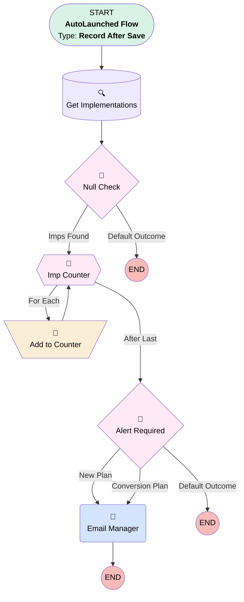

# Implementation | Trigger | Owner Nearing Max Cap

## Flow Diagram [(_View History_)](Implementation_Trigger_Owner_Nearing_Max_Cap-history.md)

<!-- Flow description -->

## General Information

|<!-- -->|<!-- -->|
|:---|:---|
|Object|Implementation__c|
|Process Type| Auto Launched Flow|
|Trigger Type| Record After Save|
|Record Trigger Type| Create And Update|
|Label|Implementation | Trigger | Owner Nearing Max Cap|
|Status|Active|
|Interview Label|Implementation | Trigger | Owner Nearing Max Cap {!$Flow.CurrentDateTime}|
| Builder Type (PM)|LightningFlowBuilder|
| Canvas Mode (PM)|FREE_FORM_CANVAS|
| Origin Builder Type (PM)|LightningFlowBuilder|
|Connector|[Get_Implementations](#get_implementations)|
|Next Node|[Get_Implementations](#get_implementations)|

#### Filters (logic: **(1 AND 3) OR 2**)

|Filter Id|Field|Operator|Value|
|:-- |:-- |:--:|:--: |
|1|Implementation_Status__c| Contains|In Progress|
|2|OwnerId| Is Changed|✅|
|3|Implementation_Status__c| Is Changed|✅|

## Variables

|Name|Data Type|Is Collection|Is Input|Is Output|Object Type|Description|
|:-- |:--:|:--:|:--:|:--:|:--:|:--  |
|impCollection|SObject|✅|✅|⬜|Implementation__c|<!-- -->|
|ImpCount|Number|⬜|✅|⬜|<!-- -->|<!-- -->|

## Flow Nodes Details

### Email_Manager

|<!-- -->|<!-- -->|
|:---|:---|
|Type|Action Call|
|Label|Email Manager|
|Action Type|Email Alert|
|Action Name|Implementation__c.Imps_Owner_Nearing_Max_Capacity|
|Flow Transaction Model|CurrentTransaction|
|Name Segment|Implementation__c.Imps_Owner_Nearing_Max_Capacity|
| SObject Row Id (input)|$Record.Id|

### Add_to_Counter

|<!-- -->|<!-- -->|
|:---|:---|
|Type|Assignment|
|Label|Add to Counter|
|Connector|[Imp_Counter](#imp_counter)|

#### Assignments

|Assign To Reference|Operator|Value|
|:-- |:--:|:--: |
|ImpCount| Add|1|

### Alert_Required

|<!-- -->|<!-- -->|
|:---|:---|
|Type|Decision|
|Label|Alert Required|
|Default Connector Label|Default Outcome|

#### Rule New_Plan (New Plan)

|<!-- -->|<!-- -->|
|:---|:---|
|Connector|[Email_Manager](#email_manager)|
|Condition Logic|and|

|Condition Id|Left Value Reference|Operator|Right Value|
|:-- |:-- |:--:|:--: |
|1|$Record.Plan_Type__c| Equal To|New Plan|
|2|ImpCount| Greater Than Or Equal To|50|

#### Rule Conversion_Plan (Conversion Plan)

|<!-- -->|<!-- -->|
|:---|:---|
|Connector|[Email_Manager](#email_manager)|
|Condition Logic|and|

|Condition Id|Left Value Reference|Operator|Right Value|
|:-- |:-- |:--:|:--: |
|1|$Record.Plan_Type__c| Equal To|Conversion Plan|
|2|ImpCount| Greater Than Or Equal To|20|

### Null_Check

|<!-- -->|<!-- -->|
|:---|:---|
|Type|Decision|
|Label|Null Check|
|Default Connector Label|Default Outcome|

#### Rule Imps_Found (Imps Found)

|<!-- -->|<!-- -->|
|:---|:---|
|Connector|[Imp_Counter](#imp_counter)|
|Condition Logic|and|

|Condition Id|Left Value Reference|Operator|Right Value|
|:-- |:-- |:--:|:--: |
|1|impCollection| Is Null|⬜|

### Imp_Counter

|<!-- -->|<!-- -->|
|:---|:---|
|Type|Loop|
|Label|Imp Counter|
|Collection Reference|impCollection|
|Iteration Order|Asc|
|Next Value Connector|[Add_to_Counter](#add_to_counter)|
|No More Values Connector|[Alert_Required](#alert_required)|

### Get_Implementations

|<!-- -->|<!-- -->|
|:---|:---|
|Type|Record Lookup|
|Object|Implementation__c|
|Label|Get Implementations|
|Assign Null Values If No Records Found|✅|
|Output Reference|impCollection|
|Queried Fields|Id|
|Connector|[Null_Check](#null_check)|

#### Filters (logic: **1 AND (2 OR 3 OR 4)**)

|Filter Id|Field|Operator|Value|
|:-- |:-- |:--:|:--: |
|1|OwnerId| Equal To|$Record.OwnerId|
|2|Implementation_Status__c| Equal To|In Progress - Plan Creation|
|3|Implementation_Status__c| Equal To|In Progress - Census & Payroll|
|4|Implementation_Status__c| Equal To|In Progress - Conversion & Payroll|

___

_Documentation generated from branch monitoring_myubiquity by [sfdx-hardis](https://sfdx-hardis.cloudity.com), featuring [salesforce-flow-visualiser](https://github.com/toddhalfpenny/salesforce-flow-visualiser)_