# Cases | Mark Cases as Spam

## Flow Diagram [(_View History_)](Implementations_Mark_Cases_as_Spam-history.md)

```mermaid
%% If you read this, your Markdown visualizer does not handle MermaidJS syntax.
%% - If you are in VS Code, install extension `Markdown Preview Mermaid Support` at https://marketplace.visualstudio.com/items?itemName=bierner.markdown-mermaid
%% - If you are using sfdx-hardis, try to define env variable `MERMAID_MODES=cli,docker` ,then run again the command to regenerate markdown with SVG images.
%% - If you are within mkdocs-material, define mermaid plugin in `mkdocs.yml` as described in https://squidfunk.github.io/mkdocs-material/extensions/mermaid/
%% - As a last resort, you can copy-paste this MermaidJS code into https://mermaid.live/ to see the flow diagram

flowchart TB
START(["START<br/><b>Case</b></br>Type: <b>On All Changes</b>"]):::startClass
click START "#general-information" "4108312648"

START --> myDecision
myDecision{"🔀 <em></em><br/>myDecision"}:::decisions
click myDecision "#mydecision" "358401611"

myDecision2{"🔀 <em></em><br/>myDecision2"}:::decisions
click myDecision2 "#mydecision2" "1782821676"

myDecision4{"🔀 <em></em><br/>myDecision4"}:::decisions
click myDecision4 "#mydecision4" "266209181"

myDecision6{"🔀 <em></em><br/>myDecision6"}:::decisions
click myDecision6 "#mydecision6" "2571891858"

myDecision8{"🔀 <em></em><br/>myDecision8"}:::decisions
click myDecision8 "#mydecision8" "2206162405"

myRule_1_pmetdec{"🔀 <em></em><br/>Previously Met Decision"}:::decisions
click myRule_1_pmetdec "#myrule_1_pmetdec" "4230153808"

myRule_3_pmetdec{"🔀 <em></em><br/>Previously Met Decision"}:::decisions
click myRule_3_pmetdec "#myrule_3_pmetdec" "717743673"

myRule_5_pmetdec{"🔀 <em></em><br/>Previously Met Decision"}:::decisions
click myRule_5_pmetdec "#myrule_5_pmetdec" "2591795037"

myRule_7_pmetdec{"🔀 <em></em><br/>Previously Met Decision"}:::decisions
click myRule_7_pmetdec "#myrule_7_pmetdec" "3215115743"

myRule_9_pmetdec{"🔀 <em></em><br/>Previously Met Decision"}:::decisions
click myRule_9_pmetdec "#myrule_9_pmetdec" "713600525"

myRule_1_A1[("🛠️ <em></em><br/>Send to Spam")]:::recordUpdates
click myRule_1_A1 "#myrule_1_a1" "2019499694"

myRule_3_A1[("🛠️ <em></em><br/>Send to Spam")]:::recordUpdates
click myRule_3_A1 "#myrule_3_a1" "2774503689"

myRule_5_A1[("🛠️ <em></em><br/>Send to Spam")]:::recordUpdates
click myRule_5_A1 "#myrule_5_a1" "1013492550"

myRule_7_A1[("🛠️ <em></em><br/>Send to Spam")]:::recordUpdates
click myRule_7_A1 "#myrule_7_a1" "2546773312"

myRule_9_A1[("🛠️ <em></em><br/>Send to Spam")]:::recordUpdates
click myRule_9_A1 "#myrule_9_a1" "3737070045"

myDecision --> |"DocuSign Notification Received"| myRule_1_pmetdec
myDecision --> |"default"| myDecision2
myDecision2 --> |"Paychex Auto Reply"| myRule_3_pmetdec
myDecision2 --> |"default"| myDecision4
myDecision4 --> |"Transamerica Auto Reply"| myRule_5_pmetdec
myDecision4 --> |"default"| myDecision6
myDecision6 --> |"@memomex.co Email"| myRule_7_pmetdec
myDecision6 --> |"default"| myDecision8
myDecision8 --> |"@partsgeek.com Email"| myRule_9_pmetdec
myDecision8 --> |"default"| END_myDecision8
myRule_1_pmetdec --> |"Previously Met - Null"| myRule_1_A1
myRule_1_pmetdec --> |"Not Previously Met"| myRule_1_A1
myRule_3_pmetdec --> |"Previously Met - Null"| myRule_3_A1
myRule_3_pmetdec --> |"Not Previously Met"| myRule_3_A1
myRule_5_pmetdec --> |"Previously Met - Null"| myRule_5_A1
myRule_5_pmetdec --> |"Not Previously Met"| myRule_5_A1
myRule_7_pmetdec --> |"Previously Met - Null"| myRule_7_A1
myRule_7_pmetdec --> |"Not Previously Met"| myRule_7_A1
myRule_9_pmetdec --> |"Previously Met - Null"| myRule_9_A1
myRule_9_pmetdec --> |"Not Previously Met"| myRule_9_A1
myRule_1_A1 --> END_myRule_1_A1
myRule_3_A1 --> END_myRule_3_A1
myRule_5_A1 --> END_myRule_5_A1
myRule_7_A1 --> END_myRule_7_A1
myRule_9_A1 --> END_myRule_9_A1
END_myDecision8(( END )):::endClass
END_myRule_1_A1(( END )):::endClass
END_myRule_3_A1(( END )):::endClass
END_myRule_5_A1(( END )):::endClass
END_myRule_7_A1(( END )):::endClass
END_myRule_9_A1(( END )):::endClass


classDef actionCalls fill:#D4E4FC,color:black,text-decoration:none,max-height:100px
classDef assignments fill:#FBEED7,color:black,text-decoration:none,max-height:100px
classDef collectionProcessors fill:#F0E3FA,color:black,text-decoration:none,max-height:100px
classDef customErrors fill:#FFE9E9,color:black,text-decoration:none,max-height:100px
classDef decisions fill:#FDEAF6,color:black,text-decoration:none,max-height:100px
classDef loops fill:#FDEAF6,color:black,text-decoration:none,max-height:100px
classDef recordCreates fill:#FFF8C9,color:black,text-decoration:none,max-height:100px
classDef recordDeletes fill:#FFF8C9,color:black,text-decoration:none,max-height:100px
classDef recordLookups fill:#EDEAFF,color:black,text-decoration:none,max-height:100px
classDef recordUpdates fill:#FFF8C9,color:black,text-decoration:none,max-height:100px
classDef screens fill:#DFF6FF,color:black,text-decoration:none,max-height:100px
classDef subflows fill:#D4E4FC,color:black,text-decoration:none,max-height:100px
classDef startClass fill:#D9F2E6,color:black,text-decoration:none,max-height:100px
classDef endClass fill:#F9BABA,color:black,text-decoration:none,max-height:100px
classDef transforms fill:#FDEAF6,color:black,text-decoration:none,max-height:100px


```

<!-- Flow description -->

## General Information

|<!-- -->|<!-- -->|
|:---|:---|
|Process Type| Workflow|
|Label|Cases | Mark Cases as Spam|
|Status|Active|
|Description|Mark emails confirming document signing as Spam when owned by Implementations|
|Interview Label|Implementations_Mark_Cases_as_Spam-7_InterviewLabel|
|Start Element Reference|[myDecision](#mydecision)|
| Object Type (PM)|Case|
| Object Variable (PM)|myVariable_current|
| Old Object Variable (PM)|myVariable_old|
| Trigger Type (PM)|onAllChanges|

## Variables

|Name|Data Type|Is Collection|Is Input|Is Output|Object Type|Description|
|:-- |:--:|:--:|:--:|:--:|:--:|:--  |
|myVariable_current|SObject|⬜|✅|✅|Case|<!-- -->|
|myVariable_old|SObject|⬜|✅|⬜|Case|<!-- -->|

## Flow Nodes Details

### myDecision

|<!-- -->|<!-- -->|
|:---|:---|
|Type|Decision|
|Label|[myDecision](#mydecision)|
|Default Connector|[myDecision2](#mydecision2)|
|Default Connector Label|default|
|Index (PM)|numberValue: 0 |

#### Rule myRule_1 (DocuSign Notification Received)

|<!-- -->|<!-- -->|
|:---|:---|
|Connector|[myRule_1_pmetdec](#myrule_1_pmetdec)|
|Condition Logic|1 AND 2|

|Condition Id|Left Value Reference|Operator|Right Value|
|:-- |:-- |:--:|:--: |
|1|myVariable_current.OwnerId| Equal To|00G37000000PDffEAG|
|2|myVariable_current.Subject| Contains|Signing Complete!|

### myDecision2

|<!-- -->|<!-- -->|
|:---|:---|
|Type|Decision|
|Label|[myDecision2](#mydecision2)|
|Default Connector|[myDecision4](#mydecision4)|
|Default Connector Label|default|
|Index (PM)|1|

#### Rule myRule_3 (Paychex Auto Reply)

|<!-- -->|<!-- -->|
|:---|:---|
|Connector|[myRule_3_pmetdec](#myrule_3_pmetdec)|
|Condition Logic|and|

|Condition Id|Left Value Reference|Operator|Right Value|
|:-- |:-- |:--:|:--: |
|1|myVariable_current.Subject| Equal To|***** OUT OF OFFICE ALERT *****|
|2|myVariable_current.AccountId| Equal To|00100000006h1V6AAI|

### myDecision4

|<!-- -->|<!-- -->|
|:---|:---|
|Type|Decision|
|Label|[myDecision4](#mydecision4)|
|Default Connector|[myDecision6](#mydecision6)|
|Default Connector Label|default|
|Index (PM)|2|

#### Rule myRule_5 (Transamerica Auto Reply)

|<!-- -->|<!-- -->|
|:---|:---|
|Connector|[myRule_5_pmetdec](#myrule_5_pmetdec)|
|Condition Logic|and|

|Condition Id|Left Value Reference|Operator|Right Value|
|:-- |:-- |:--:|:--: |
|1|myVariable_current.Subject| Equal To|Thank you for your e-mail|
|2|myVariable_current.SuppliedEmail| Equal To|trinetconnect@transamerica.com|

### myDecision6

|<!-- -->|<!-- -->|
|:---|:---|
|Type|Decision|
|Label|[myDecision6](#mydecision6)|
|Default Connector|[myDecision8](#mydecision8)|
|Default Connector Label|default|
|Index (PM)|3|

#### Rule myRule_7 (@memomex.co Email)

|<!-- -->|<!-- -->|
|:---|:---|
|Connector|[myRule_7_pmetdec](#myrule_7_pmetdec)|
|Condition Logic|and|

|Condition Id|Left Value Reference|Operator|Right Value|
|:-- |:-- |:--:|:--: |
|1|myVariable_current.SuppliedEmail| Contains|@memomex.co|

### myDecision8

|<!-- -->|<!-- -->|
|:---|:---|
|Type|Decision|
|Label|[myDecision8](#mydecision8)|
|Default Connector Label|default|
|Index (PM)|4|

#### Rule myRule_9 (@partsgeek.com Email)

|<!-- -->|<!-- -->|
|:---|:---|
|Connector|[myRule_9_pmetdec](#myrule_9_pmetdec)|
|Condition Logic|and|

|Condition Id|Left Value Reference|Operator|Right Value|
|:-- |:-- |:--:|:--: |
|1|myVariable_current.SuppliedEmail| Contains|@partsgeek.com|

### myRule_1_pmetdec

|<!-- -->|<!-- -->|
|:---|:---|
|Type|Decision|
|Label|Previously Met Decision|
|Default Connector|[myRule_1_A1](#myrule_1_a1)|
|Default Connector Label|Not Previously Met|

#### Rule myRule_1_pmetnullrule (Previously Met - Null)

|<!-- -->|<!-- -->|
|:---|:---|
|Connector|[myRule_1_A1](#myrule_1_a1)|
|Condition Logic|or|

|Condition Id|Left Value Reference|Operator|Right Value|
|:-- |:-- |:--:|:--: |
|1|myVariable_old| Is Null|✅|

#### Rule myRule_1_pmetrule (Previously Met - Prev)

|<!-- -->|<!-- -->|
|:---|:---|
|Condition Logic|1 AND 2|

|Condition Id|Left Value Reference|Operator|Right Value|
|:-- |:-- |:--:|:--: |
|1|myVariable_old.OwnerId| Equal To|00G37000000PDffEAG|
|2|myVariable_old.Subject| Contains|Signing Complete!|

### myRule_3_pmetdec

|<!-- -->|<!-- -->|
|:---|:---|
|Type|Decision|
|Label|Previously Met Decision|
|Default Connector|[myRule_3_A1](#myrule_3_a1)|
|Default Connector Label|Not Previously Met|

#### Rule myRule_3_pmetnullrule (Previously Met - Null)

|<!-- -->|<!-- -->|
|:---|:---|
|Connector|[myRule_3_A1](#myrule_3_a1)|
|Condition Logic|or|

|Condition Id|Left Value Reference|Operator|Right Value|
|:-- |:-- |:--:|:--: |
|1|myVariable_old| Is Null|✅|

#### Rule myRule_3_pmetrule (Previously Met - Prev)

|<!-- -->|<!-- -->|
|:---|:---|
|Condition Logic|and|

|Condition Id|Left Value Reference|Operator|Right Value|
|:-- |:-- |:--:|:--: |
|1|myVariable_old.Subject| Equal To|***** OUT OF OFFICE ALERT *****|
|2|myVariable_old.AccountId| Equal To|00100000006h1V6AAI|

### myRule_5_pmetdec

|<!-- -->|<!-- -->|
|:---|:---|
|Type|Decision|
|Label|Previously Met Decision|
|Default Connector|[myRule_5_A1](#myrule_5_a1)|
|Default Connector Label|Not Previously Met|

#### Rule myRule_5_pmetnullrule (Previously Met - Null)

|<!-- -->|<!-- -->|
|:---|:---|
|Connector|[myRule_5_A1](#myrule_5_a1)|
|Condition Logic|or|

|Condition Id|Left Value Reference|Operator|Right Value|
|:-- |:-- |:--:|:--: |
|1|myVariable_old| Is Null|✅|

#### Rule myRule_5_pmetrule (Previously Met - Prev)

|<!-- -->|<!-- -->|
|:---|:---|
|Condition Logic|and|

|Condition Id|Left Value Reference|Operator|Right Value|
|:-- |:-- |:--:|:--: |
|1|myVariable_old.Subject| Equal To|Thank you for your e-mail|
|2|myVariable_old.SuppliedEmail| Equal To|trinetconnect@transamerica.com|

### myRule_7_pmetdec

|<!-- -->|<!-- -->|
|:---|:---|
|Type|Decision|
|Label|Previously Met Decision|
|Default Connector|[myRule_7_A1](#myrule_7_a1)|
|Default Connector Label|Not Previously Met|

#### Rule myRule_7_pmetnullrule (Previously Met - Null)

|<!-- -->|<!-- -->|
|:---|:---|
|Connector|[myRule_7_A1](#myrule_7_a1)|
|Condition Logic|or|

|Condition Id|Left Value Reference|Operator|Right Value|
|:-- |:-- |:--:|:--: |
|1|myVariable_old| Is Null|✅|

#### Rule myRule_7_pmetrule (Previously Met - Prev)

|<!-- -->|<!-- -->|
|:---|:---|
|Condition Logic|and|

|Condition Id|Left Value Reference|Operator|Right Value|
|:-- |:-- |:--:|:--: |
|1|myVariable_old.SuppliedEmail| Contains|@memomex.co|

### myRule_9_pmetdec

|<!-- -->|<!-- -->|
|:---|:---|
|Type|Decision|
|Label|Previously Met Decision|
|Default Connector|[myRule_9_A1](#myrule_9_a1)|
|Default Connector Label|Not Previously Met|

#### Rule myRule_9_pmetnullrule (Previously Met - Null)

|<!-- -->|<!-- -->|
|:---|:---|
|Connector|[myRule_9_A1](#myrule_9_a1)|
|Condition Logic|or|

|Condition Id|Left Value Reference|Operator|Right Value|
|:-- |:-- |:--:|:--: |
|1|myVariable_old| Is Null|✅|

#### Rule myRule_9_pmetrule (Previously Met - Prev)

|<!-- -->|<!-- -->|
|:---|:---|
|Condition Logic|and|

|Condition Id|Left Value Reference|Operator|Right Value|
|:-- |:-- |:--:|:--: |
|1|myVariable_old.SuppliedEmail| Contains|@partsgeek.com|

### myRule_1_A1

|<!-- -->|<!-- -->|
|:---|:---|
|Type|Record Update|
|Object|Case|
|Label|Send to Spam|
|Evaluation Type (PM)|always|
|Extra Type Info (PM)|<!-- -->|
|Is Child Relationship (PM)|⬜|
|Reference (PM)|[Case]|
|Reference Target Field (PM)|<!-- -->|

#### Filters (logic: **and**)

|Filter Id|Field|Operator|Value|
|:-- |:-- |:--:|:--: |
|1|Id| Equal To|myVariable_current.Id|

#### Input Assignments

|Field|Value|
|:-- |:--: |
|OwnerId|00G37000000prxXEAQ|

### myRule_3_A1

|<!-- -->|<!-- -->|
|:---|:---|
|Type|Record Update|
|Object|Case|
|Label|Send to Spam|
|Evaluation Type (PM)|always|
|Extra Type Info (PM)|<!-- -->|
|Is Child Relationship (PM)|⬜|
|Reference (PM)|[Case]|
|Reference Target Field (PM)|<!-- -->|

#### Filters (logic: **and**)

|Filter Id|Field|Operator|Value|
|:-- |:-- |:--:|:--: |
|1|Id| Equal To|myVariable_current.Id|

#### Input Assignments

|Field|Value|
|:-- |:--: |
|OwnerId|00G37000000prxXEAQ|

### myRule_5_A1

|<!-- -->|<!-- -->|
|:---|:---|
|Type|Record Update|
|Object|Case|
|Label|Send to Spam|
|Evaluation Type (PM)|always|
|Extra Type Info (PM)|<!-- -->|
|Is Child Relationship (PM)|⬜|
|Reference (PM)|[Case]|
|Reference Target Field (PM)|<!-- -->|

#### Filters (logic: **and**)

|Filter Id|Field|Operator|Value|
|:-- |:-- |:--:|:--: |
|1|Id| Equal To|myVariable_current.Id|

#### Input Assignments

|Field|Value|
|:-- |:--: |
|OwnerId|00G37000000prxXEAQ|

### myRule_7_A1

|<!-- -->|<!-- -->|
|:---|:---|
|Type|Record Update|
|Object|Case|
|Label|Send to Spam|
|Evaluation Type (PM)|always|
|Extra Type Info (PM)|<!-- -->|
|Is Child Relationship (PM)|⬜|
|Reference (PM)|[Case]|
|Reference Target Field (PM)|<!-- -->|

#### Filters (logic: **and**)

|Filter Id|Field|Operator|Value|
|:-- |:-- |:--:|:--: |
|1|Id| Equal To|myVariable_current.Id|

#### Input Assignments

|Field|Value|
|:-- |:--: |
|OwnerId|00G37000000prxXEAQ|

### myRule_9_A1

|<!-- -->|<!-- -->|
|:---|:---|
|Type|Record Update|
|Object|Case|
|Label|Send to Spam|
|Evaluation Type (PM)|always|
|Extra Type Info (PM)|<!-- -->|
|Is Child Relationship (PM)|⬜|
|Reference (PM)|[Case]|
|Reference Target Field (PM)|<!-- -->|

#### Filters (logic: **and**)

|Filter Id|Field|Operator|Value|
|:-- |:-- |:--:|:--: |
|1|Id| Equal To|myVariable_current.Id|

#### Input Assignments

|Field|Value|
|:-- |:--: |
|OwnerId|00G37000000prxXEAQ|

___

_Documentation generated from branch monitoring_myubiquity by [sfdx-hardis](https://sfdx-hardis.cloudity.com), featuring [salesforce-flow-visualiser](https://github.com/toddhalfpenny/salesforce-flow-visualiser)_