# Implementations | Stage Date Recorded

## Flow Diagram [(_View History_)](Implementations_Stage_Date_Recorded-history.md)

```mermaid
%% If you read this, your Markdown visualizer does not handle MermaidJS syntax.
%% - If you are in VS Code, install extension `Markdown Preview Mermaid Support` at https://marketplace.visualstudio.com/items?itemName=bierner.markdown-mermaid
%% - If you are using sfdx-hardis, try to define env variable `MERMAID_MODES=cli,docker` ,then run again the command to regenerate markdown with SVG images.
%% - If you are within mkdocs-material, define mermaid plugin in `mkdocs.yml` as described in https://squidfunk.github.io/mkdocs-material/extensions/mermaid/
%% - As a last resort, you can copy-paste this MermaidJS code into https://mermaid.live/ to see the flow diagram

flowchart TB
START(["START<br/><b>Implementation__c</b></br>Type: <b>On All Changes</b>"]):::startClass
click START "#general-information" "2072033117"

START --> isChangedDecision2_myRule_1_Implementation_Stage_c
isChangedDecision2_myRule_1_Implementation_Stage_c{"🔀 <em></em><br/>isChangedDecision2_myRule_1_Implementation_Stage_c"}:::decisions
click isChangedDecision2_myRule_1_Implementation_Stage_c "#ischangeddecision2_myrule_1_implementation_stage_c" "3245723272"

myDecision{"🔀 <em></em><br/>myDecision"}:::decisions
click myDecision "#mydecision" "3404693608"

myDecision5{"🔀 <em></em><br/>myDecision5"}:::decisions
click myDecision5 "#mydecision5" "3862441215"

myRule_1_A1[("🛠️ <em></em><br/>Update Stage")]:::recordUpdates
click myRule_1_A1 "#myrule_1_a1" "3154480067"

myRule_6_A1[("🛠️ <em></em><br/>Update AC")]:::recordUpdates
click myRule_6_A1 "#myrule_6_a1" "1042749501"

isChangedDecision2_myRule_1_Implementation_Stage_c --> |"isChangedRule_2_myRule_1_Implementation_Stage_c"| myDecision
isChangedDecision2_myRule_1_Implementation_Stage_c --> |"default"| myDecision
myDecision --> |"Stage is Changed"| myRule_1_A1
myDecision --> |"default"| myDecision5
myDecision5 --> |"Imp is Created"| myRule_6_A1
myDecision5 --> |"default"| END_myDecision5
myRule_1_A1 --> myDecision5
myRule_6_A1 --> END_myRule_6_A1
END_myDecision5(( END )):::endClass
END_myRule_6_A1(( END )):::endClass


classDef actionCalls fill:#D4E4FC,color:black,text-decoration:none,max-height:100px
classDef assignments fill:#FBEED7,color:black,text-decoration:none,max-height:100px
classDef collectionProcessors fill:#F0E3FA,color:black,text-decoration:none,max-height:100px
classDef customErrors fill:#FFE9E9,color:black,text-decoration:none,max-height:100px
classDef decisions fill:#FDEAF6,color:black,text-decoration:none,max-height:100px
classDef loops fill:#FDEAF6,color:black,text-decoration:none,max-height:100px
classDef recordCreates fill:#FFF8C9,color:black,text-decoration:none,max-height:100px
classDef recordDeletes fill:#FFF8C9,color:black,text-decoration:none,max-height:100px
classDef recordLookups fill:#EDEAFF,color:black,text-decoration:none,max-height:100px
classDef recordUpdates fill:#FFF8C9,color:black,text-decoration:none,max-height:100px
classDef screens fill:#DFF6FF,color:black,text-decoration:none,max-height:100px
classDef subflows fill:#D4E4FC,color:black,text-decoration:none,max-height:100px
classDef startClass fill:#D9F2E6,color:black,text-decoration:none,max-height:100px
classDef endClass fill:#F9BABA,color:black,text-decoration:none,max-height:100px
classDef transforms fill:#FDEAF6,color:black,text-decoration:none,max-height:100px


```

<!-- Flow description -->

## General Information

|<!-- -->|<!-- -->|
|:---|:---|
|Process Type| Workflow|
|Label|Implementations | Stage Date Recorded|
|Status|Active|
|Description|When Implementation Stage is updated, record the date on Associated Contact|
|Interview Label|Implementations_Stage_Date_Recorded-8_InterviewLabel|
|Start Element Reference|[isChangedDecision2_myRule_1_Implementation_Stage_c](#ischangeddecision2_myrule_1_implementation_stage_c)|
| Object Type (PM)|Implementation__c|
| Object Variable (PM)|myVariable_current|
| Old Object Variable (PM)|myVariable_old|
| Trigger Type (PM)|onAllChanges|

## Variables

|Name|Data Type|Is Collection|Is Input|Is Output|Object Type|Description|
|:-- |:--:|:--:|:--:|:--:|:--:|:--  |
|myVariable_current|SObject|⬜|✅|✅|Implementation__c|<!-- -->|
|myVariable_old|SObject|⬜|✅|⬜|Implementation__c|<!-- -->|

## Formulas

|Name|Data Type|Expression|Description|
|:-- |:--:|:-- |:--  |
|formula_3_myRule_1_A1_8802059398|DateTime|NOW()|<!-- -->|
|formula_4_myRule_1_A1_5395992544|Date|TODAY()|<!-- -->|
|formula_7_myRule_6_3656746530|DateTime|NOW()|<!-- -->|
|formula_8_myRule_6_A1_9149723306|DateTime|NOW()|<!-- -->|
|formula_9_myRule_6_A1_6357616718|Date|TODAY()|<!-- -->|

## Flow Nodes Details

### isChangedDecision2_myRule_1_Implementation_Stage_c

|<!-- -->|<!-- -->|
|:---|:---|
|Type|Decision|
|Label|[isChangedDecision2_myRule_1_Implementation_Stage_c](#ischangeddecision2_myrule_1_implementation_stage_c)|
|Default Connector|[myDecision](#mydecision)|
|Default Connector Label|default|

#### Rule isChangedRule_2_myRule_1_Implementation_Stage_c (isChangedRule_2_myRule_1_Implementation_Stage_c)

|<!-- -->|<!-- -->|
|:---|:---|
|Connector|[myDecision](#mydecision)|
|Condition Logic|and|

|Condition Id|Left Value Reference|Operator|Right Value|
|:-- |:-- |:--:|:--: |
|1|myVariable_old| Is Null|⬜|
|2|myVariable_old.Implementation_Stage__c| Not Equal To|myVariable_current.Implementation_Stage__c|

### myDecision

|<!-- -->|<!-- -->|
|:---|:---|
|Type|Decision|
|Label|[myDecision](#mydecision)|
|Default Connector|[myDecision5](#mydecision5)|
|Default Connector Label|default|
|Index (PM)|numberValue: 0 |

#### Rule myRule_1 (Stage is Changed)

|<!-- -->|<!-- -->|
|:---|:---|
|Connector|[myRule_1_A1](#myrule_1_a1)|
|Condition Logic|and|

|Condition Id|Left Value Reference|Operator|Right Value|
|:-- |:-- |:--:|:--: |
|1|isChangedRule_2_myRule_1_Implementation_Stage_c| Equal To|✅|

### myDecision5

|<!-- -->|<!-- -->|
|:---|:---|
|Type|Decision|
|Label|[myDecision5](#mydecision5)|
|Default Connector Label|default|
|Index (PM)|1|

#### Rule myRule_6 (Imp is Created)

|<!-- -->|<!-- -->|
|:---|:---|
|Connector|[myRule_6_A1](#myrule_6_a1)|
|Condition Logic|and|

|Condition Id|Left Value Reference|Operator|Right Value|
|:-- |:-- |:--:|:--: |
|1|myVariable_current.Implementation_Stage__c| Equal To|Introduction|
|2|myVariable_current.CreatedDate| Equal To|formula_7_myRule_6_3656746530|

### myRule_1_A1

|<!-- -->|<!-- -->|
|:---|:---|
|Type|Record Update|
|Object|Associated_Contact__c|
|Label|Update Stage|
|Evaluation Type (PM)|always|
|Extra Type Info (PM)|<!-- -->|
|Is Child Relationship (PM)|✅|
|Reference (PM)|[Implementation__c].Master_Contact_Associations__r|
|Reference Target Field (PM)|<!-- -->|
|Connector|[myDecision5](#mydecision5)|

#### Filters (logic: **and**)

|Filter Id|Field|Operator|Value|
|:-- |:-- |:--:|:--: |
|1|Implementation__c| Equal To|myVariable_current.Id|

#### Input Assignments

|Field|Value|
|:-- |:--: |
|Implementation_Stage__c|myVariable_current.Implementation_Stage__c|
|Implementation_Updated_Date_Time__c|formula_3_myRule_1_A1_8802059398|
|Implementation_Updated__c|formula_4_myRule_1_A1_5395992544|

### myRule_6_A1

|<!-- -->|<!-- -->|
|:---|:---|
|Type|Record Update|
|Object|Associated_Contact__c|
|Label|Update AC|
|Evaluation Type (PM)|always|
|Extra Type Info (PM)|<!-- -->|
|Is Child Relationship (PM)|✅|
|Reference (PM)|[Implementation__c].Master_Contact_Associations__r|
|Reference Target Field (PM)|<!-- -->|

#### Filters (logic: **and**)

|Filter Id|Field|Operator|Value|
|:-- |:-- |:--:|:--: |
|1|Implementation__c| Equal To|myVariable_current.Id|

#### Input Assignments

|Field|Value|
|:-- |:--: |
|Implementation_Stage__c|myVariable_current.Implementation_Stage__c|
|Implementation_Updated_Date_Time__c|formula_8_myRule_6_A1_9149723306|
|Implementation_Updated__c|formula_9_myRule_6_A1_6357616718|

___

_Documentation generated from branch monitoring_myubiquity by [sfdx-hardis](https://sfdx-hardis.cloudity.com), featuring [salesforce-flow-visualiser](https://github.com/toddhalfpenny/salesforce-flow-visualiser)_