# Implementations | Stage Updates 6/22

## Flow Diagram [(_View History_)](Implementations_Stage_Updates_Workflow_3-history.md)

```mermaid
%% If you read this, your Markdown visualizer does not handle MermaidJS syntax.
%% - If you are in VS Code, install extension `Markdown Preview Mermaid Support` at https://marketplace.visualstudio.com/items?itemName=bierner.markdown-mermaid
%% - If you are using sfdx-hardis, try to define env variable `MERMAID_MODES=cli,docker` ,then run again the command to regenerate markdown with SVG images.
%% - If you are within mkdocs-material, define mermaid plugin in `mkdocs.yml` as described in https://squidfunk.github.io/mkdocs-material/extensions/mermaid/
%% - As a last resort, you can copy-paste this MermaidJS code into https://mermaid.live/ to see the flow diagram

flowchart TB
START(["START<br/><b>Implementation__c</b></br>Type: <b>On All Changes</b>"]):::startClass
click START "#general-information" "4004692124"

START --> isChangedDecision5_myRule_4_Liquidation_Date_c
isChangedDecision13_myRule_12_Plan_Hold_Date_c{"🔀 <em></em><br/>isChangedDecision13_myRule_12_Plan_Hold_Date_c"}:::decisions
click isChangedDecision13_myRule_12_Plan_Hold_Date_c "#ischangeddecision13_myrule_12_plan_hold_date_c" "792509827"

isChangedDecision16_myRule_15_Plan_Stall_Date_c{"🔀 <em></em><br/>isChangedDecision16_myRule_15_Plan_Stall_Date_c"}:::decisions
click isChangedDecision16_myRule_15_Plan_Stall_Date_c "#ischangeddecision16_myrule_15_plan_stall_date_c" "3870890379"

isChangedDecision19_myRule_18_No_Start_Date_c{"🔀 <em></em><br/>isChangedDecision19_myRule_18_No_Start_Date_c"}:::decisions
click isChangedDecision19_myRule_18_No_Start_Date_c "#ischangeddecision19_myrule_18_no_start_date_c" "529567978"

isChangedDecision22_myRule_21_Plan_Saved_Date_c{"🔀 <em></em><br/>isChangedDecision22_myRule_21_Plan_Saved_Date_c"}:::decisions
click isChangedDecision22_myRule_21_Plan_Saved_Date_c "#ischangeddecision22_myrule_21_plan_saved_date_c" "773407428"

isChangedDecision25_myRule_24_Actual_Plan_Release_Date_c{"🔀 <em></em><br/>isChangedDecision25_myRule_24_Actual_Plan_Release_Date_c"}:::decisions
click isChangedDecision25_myRule_24_Actual_Plan_Release_Date_c "#ischangeddecision25_myrule_24_actual_plan_release_date_c" "3838685326"

isChangedDecision29_myRule_28_Implementation_Status_c{"🔀 <em></em><br/>isChangedDecision29_myRule_28_Implementation_Status_c"}:::decisions
click isChangedDecision29_myRule_28_Implementation_Status_c "#ischangeddecision29_myrule_28_implementation_status_c" "674134686"

isChangedDecision32_myRule_31_Implementation_Status_c{"🔀 <em></em><br/>isChangedDecision32_myRule_31_Implementation_Status_c"}:::decisions
click isChangedDecision32_myRule_31_Implementation_Status_c "#ischangeddecision32_myrule_31_implementation_status_c" "1150585976"

isChangedDecision35_myRule_34_Unresponsive_c{"🔀 <em></em><br/>isChangedDecision35_myRule_34_Unresponsive_c"}:::decisions
click isChangedDecision35_myRule_34_Unresponsive_c "#ischangeddecision35_myrule_34_unresponsive_c" "1239625235"

isChangedDecision39_myRule_38_Unresponsive_c{"🔀 <em></em><br/>isChangedDecision39_myRule_38_Unresponsive_c"}:::decisions
click isChangedDecision39_myRule_38_Unresponsive_c "#ischangeddecision39_myrule_38_unresponsive_c" "3461378667"

isChangedDecision5_myRule_4_Liquidation_Date_c{"🔀 <em></em><br/>isChangedDecision5_myRule_4_Liquidation_Date_c"}:::decisions
click isChangedDecision5_myRule_4_Liquidation_Date_c "#ischangeddecision5_myrule_4_liquidation_date_c" "4215876275"

myDecision{"🔀 <em></em><br/>myDecision"}:::decisions
click myDecision "#mydecision" "669006805"

myDecision11{"🔀 <em></em><br/>myDecision11"}:::decisions
click myDecision11 "#mydecision11" "1447872197"

myDecision14{"🔀 <em></em><br/>myDecision14"}:::decisions
click myDecision14 "#mydecision14" "4195394881"

myDecision17{"🔀 <em></em><br/>myDecision17"}:::decisions
click myDecision17 "#mydecision17" "1962097462"

myDecision20{"🔀 <em></em><br/>myDecision20"}:::decisions
click myDecision20 "#mydecision20" "311658667"

myDecision23{"🔀 <em></em><br/>myDecision23"}:::decisions
click myDecision23 "#mydecision23" "3562474898"

myDecision27{"🔀 <em></em><br/>myDecision27"}:::decisions
click myDecision27 "#mydecision27" "2374093591"

myDecision3{"🔀 <em></em><br/>myDecision3"}:::decisions
click myDecision3 "#mydecision3" "1158616719"

myDecision30{"🔀 <em></em><br/>myDecision30"}:::decisions
click myDecision30 "#mydecision30" "1304064541"

myDecision33{"🔀 <em></em><br/>myDecision33"}:::decisions
click myDecision33 "#mydecision33" "2723863495"

myDecision37{"🔀 <em></em><br/>myDecision37"}:::decisions
click myDecision37 "#mydecision37" "4034061349"

myDecision7{"🔀 <em></em><br/>myDecision7"}:::decisions
click myDecision7 "#mydecision7" "1606975503"

myDecision9{"🔀 <em></em><br/>myDecision9"}:::decisions
click myDecision9 "#mydecision9" "3481236221"

myRule_10_pmetdec{"🔀 <em></em><br/>Previously Met Decision"}:::decisions
click myRule_10_pmetdec "#myrule_10_pmetdec" "751978145"

myRule_1_pmetdec{"🔀 <em></em><br/>Previously Met Decision"}:::decisions
click myRule_1_pmetdec "#myrule_1_pmetdec" "3902218676"

myRule_8_pmetdec{"🔀 <em></em><br/>Previously Met Decision"}:::decisions
click myRule_8_pmetdec "#myrule_8_pmetdec" "475787456"

myRule_12_A1[("➕ <em></em><br/>Billing Case")]:::recordCreates
click myRule_12_A1 "#myrule_12_a1" "746697485"

myRule_18_A2[("➕ <em></em><br/>Billing Case")]:::recordCreates
click myRule_18_A2 "#myrule_18_a2" "2097013097"

myRule_18_A4[("➕ <em></em><br/>Imps Case")]:::recordCreates
click myRule_18_A4 "#myrule_18_a4" "3883059871"

myRule_21_A1[("➕ <em></em><br/>Billing Case")]:::recordCreates
click myRule_21_A1 "#myrule_21_a1" "212951510"

myRule_24_A2[("➕ <em></em><br/>Billing Case")]:::recordCreates
click myRule_24_A2 "#myrule_24_a2" "809107855"

myRule_31_A2[("➕ <em></em><br/>Imp Case")]:::recordCreates
click myRule_31_A2 "#myrule_31_a2" "2571007177"

myRule_4_A1[("➕ <em></em><br/>Billing Case")]:::recordCreates
click myRule_4_A1 "#myrule_4_a1" "594819351"

myRule_10_A1[("🛠️ <em></em><br/>Matrix 07C Acct Update")]:::recordUpdates
click myRule_10_A1 "#myrule_10_a1" "4095848190"

myRule_10_A2[("🛠️ <em></em><br/>Update and Activate plan no funds")]:::recordUpdates
click myRule_10_A2 "#myrule_10_a2" "4018144099"

myRule_10_A3[("🛠️ <em></em><br/>Imp Complete")]:::recordUpdates
click myRule_10_A3 "#myrule_10_a3" "886104461"

myRule_10_A4[("🛠️ <em></em><br/>Plan to Client Support")]:::recordUpdates
click myRule_10_A4 "#myrule_10_a4" "1633704382"

myRule_10_A5[("🛠️ <em></em><br/>Plan to Platinum")]:::recordUpdates
click myRule_10_A5 "#myrule_10_a5" "3150984453"

myRule_12_A2[("🛠️ <em></em><br/>Imp Status")]:::recordUpdates
click myRule_12_A2 "#myrule_12_a2" "437426425"

myRule_15_A1[("🛠️ <em></em><br/>Plan Stall Stage")]:::recordUpdates
click myRule_15_A1 "#myrule_15_a1" "3045851524"

myRule_15_A2[("🛠️ <em></em><br/>Plan Status")]:::recordUpdates
click myRule_15_A2 "#myrule_15_a2" "2591507443"

myRule_18_A1[("🛠️ <em></em><br/>No Start Status")]:::recordUpdates
click myRule_18_A1 "#myrule_18_a1" "4227429516"

myRule_18_A3[("🛠️ <em></em><br/>Plan Status")]:::recordUpdates
click myRule_18_A3 "#myrule_18_a3" "1775588130"

myRule_1_A1[("🛠️ <em></em><br/>FPS Agreement Date")]:::recordUpdates
click myRule_1_A1 "#myrule_1_a1" "296235474"

myRule_21_A2[("🛠️ <em></em><br/>Plan In Progress")]:::recordUpdates
click myRule_21_A2 "#myrule_21_a2" "3317206729"

myRule_21_A3[("🛠️ <em></em><br/>Move Back to In Progress")]:::recordUpdates
click myRule_21_A3 "#myrule_21_a3" "389327614"

myRule_24_A1[("🛠️ <em></em><br/>Imp In Progress")]:::recordUpdates
click myRule_24_A1 "#myrule_24_a1" "3330895023"

myRule_28_A1[("🛠️ <em></em><br/>Plan = Passive")]:::recordUpdates
click myRule_28_A1 "#myrule_28_a1" "307634986"

myRule_28_A2[("🛠️ <em></em><br/>Pay Submit Status")]:::recordUpdates
click myRule_28_A2 "#myrule_28_a2" "494972558"

myRule_31_A1[("🛠️ <em></em><br/>Plan Status")]:::recordUpdates
click myRule_31_A1 "#myrule_31_a1" "3761358541"

myRule_34_A1[("🛠️ <em></em><br/>Date")]:::recordUpdates
click myRule_34_A1 "#myrule_34_a1" "3305058920"

myRule_38_A1[("🛠️ <em></em><br/>Date")]:::recordUpdates
click myRule_38_A1 "#myrule_38_a1" "3288969050"

myRule_8_A1[("🛠️ <em></em><br/>Matrix 07C Acct Update")]:::recordUpdates
click myRule_8_A1 "#myrule_8_a1" "2309708522"

myRule_8_A2[("🛠️ <em></em><br/>Update & Activate Plan")]:::recordUpdates
click myRule_8_A2 "#myrule_8_a2" "3054150970"

myRule_8_A3[("🛠️ <em></em><br/>Imp Complete")]:::recordUpdates
click myRule_8_A3 "#myrule_8_a3" "832893831"

myRule_8_A4[("🛠️ <em></em><br/>Plan to Client Support")]:::recordUpdates
click myRule_8_A4 "#myrule_8_a4" "2633791650"

myRule_8_A5[("🛠️ <em></em><br/>Plan to Platinum")]:::recordUpdates
click myRule_8_A5 "#myrule_8_a5" "80812351"

isChangedDecision13_myRule_12_Plan_Hold_Date_c --> |"isChangedRule_13_myRule_12_Plan_Hold_Date_c"| isChangedDecision16_myRule_15_Plan_Stall_Date_c
isChangedDecision13_myRule_12_Plan_Hold_Date_c --> |"default"| isChangedDecision16_myRule_15_Plan_Stall_Date_c
isChangedDecision16_myRule_15_Plan_Stall_Date_c --> |"isChangedRule_16_myRule_15_Plan_Stall_Date_c"| isChangedDecision19_myRule_18_No_Start_Date_c
isChangedDecision16_myRule_15_Plan_Stall_Date_c --> |"default"| isChangedDecision19_myRule_18_No_Start_Date_c
isChangedDecision19_myRule_18_No_Start_Date_c --> |"isChangedRule_19_myRule_18_No_Start_Date_c"| isChangedDecision22_myRule_21_Plan_Saved_Date_c
isChangedDecision19_myRule_18_No_Start_Date_c --> |"default"| isChangedDecision22_myRule_21_Plan_Saved_Date_c
isChangedDecision22_myRule_21_Plan_Saved_Date_c --> |"isChangedRule_22_myRule_21_Plan_Saved_Date_c"| isChangedDecision25_myRule_24_Actual_Plan_Release_Date_c
isChangedDecision22_myRule_21_Plan_Saved_Date_c --> |"default"| isChangedDecision25_myRule_24_Actual_Plan_Release_Date_c
isChangedDecision25_myRule_24_Actual_Plan_Release_Date_c --> |"isChangedRule_25_myRule_24_Actual_Plan_Release_Date_c"| isChangedDecision29_myRule_28_Implementation_Status_c
isChangedDecision25_myRule_24_Actual_Plan_Release_Date_c --> |"default"| isChangedDecision29_myRule_28_Implementation_Status_c
isChangedDecision29_myRule_28_Implementation_Status_c --> |"isChangedRule_29_myRule_28_Implementation_Status_c"| isChangedDecision32_myRule_31_Implementation_Status_c
isChangedDecision29_myRule_28_Implementation_Status_c --> |"default"| isChangedDecision32_myRule_31_Implementation_Status_c
isChangedDecision32_myRule_31_Implementation_Status_c --> |"isChangedRule_32_myRule_31_Implementation_Status_c"| isChangedDecision35_myRule_34_Unresponsive_c
isChangedDecision32_myRule_31_Implementation_Status_c --> |"default"| isChangedDecision35_myRule_34_Unresponsive_c
isChangedDecision35_myRule_34_Unresponsive_c --> |"isChangedRule_35_myRule_34_Unresponsive_c"| isChangedDecision39_myRule_38_Unresponsive_c
isChangedDecision35_myRule_34_Unresponsive_c --> |"default"| isChangedDecision39_myRule_38_Unresponsive_c
isChangedDecision39_myRule_38_Unresponsive_c --> |"isChangedRule_39_myRule_38_Unresponsive_c"| myDecision
isChangedDecision39_myRule_38_Unresponsive_c --> |"default"| myDecision
isChangedDecision5_myRule_4_Liquidation_Date_c --> |"isChangedRule_5_myRule_4_Liquidation_Date_c"| isChangedDecision13_myRule_12_Plan_Hold_Date_c
isChangedDecision5_myRule_4_Liquidation_Date_c --> |"default"| isChangedDecision13_myRule_12_Plan_Hold_Date_c
myDecision --> |"Docs Signed"| myRule_1_pmetdec
myDecision --> |"default"| myDecision3
myDecision11 --> |"On Hold"| myRule_12_A1
myDecision11 --> |"default"| myDecision14
myDecision14 --> |"Plan Stalled"| myRule_15_A1
myDecision14 --> |"default"| myDecision17
myDecision17 --> |"No-Start"| myRule_18_A1
myDecision17 --> |"default"| myDecision20
myDecision20 --> |"Plan Stall Saved"| myRule_21_A1
myDecision20 --> |"default"| myDecision23
myDecision23 --> |"Plan Hold Released"| myRule_24_A1
myDecision23 --> |"default"| myDecision27
myDecision27 --> |"Plan Passive"| myRule_28_A1
myDecision27 --> |"default"| myDecision30
myDecision3 --> |"Liquidation Date"| myRule_4_A1
myDecision3 --> |"default"| myDecision7
myDecision30 --> |"Passive to Active"| myRule_31_A1
myDecision30 --> |"default"| myDecision33
myDecision33 --> |"Unresponsive"| myRule_34_A1
myDecision33 --> |"default"| myDecision37
myDecision37 --> |"Responsive"| myRule_38_A1
myDecision37 --> |"default"| END_myDecision37
myDecision7 --> |"Imp Complete"| myRule_8_pmetdec
myDecision7 --> |"default"| myDecision9
myDecision9 --> |"Imp Complete no funds"| myRule_10_pmetdec
myDecision9 --> |"default"| myDecision11
myRule_10_pmetdec --> |"Previously Met - Null"| myRule_10_A1
myRule_10_pmetdec --> |"Previously Met - Prev"| myDecision11
myRule_10_pmetdec --> |"Not Previously Met"| myRule_10_A1
myRule_1_pmetdec --> |"Previously Met - Null"| myRule_1_A1
myRule_1_pmetdec --> |"Previously Met - Prev"| myDecision3
myRule_1_pmetdec --> |"Not Previously Met"| myRule_1_A1
myRule_8_pmetdec --> |"Previously Met - Null"| myRule_8_A1
myRule_8_pmetdec --> |"Previously Met - Prev"| myDecision9
myRule_8_pmetdec --> |"Not Previously Met"| myRule_8_A1
myRule_12_A1 --> myRule_12_A2
myRule_18_A2 --> myRule_18_A3
myRule_18_A4 --> END_myRule_18_A4
myRule_21_A1 --> myRule_21_A2
myRule_24_A2 --> END_myRule_24_A2
myRule_31_A2 --> END_myRule_31_A2
myRule_4_A1 --> myDecision7
myRule_10_A1 --> myRule_10_A2
myRule_10_A2 --> myRule_10_A3
myRule_10_A3 --> myRule_10_A4
myRule_10_A4 --> myRule_10_A5
myRule_10_A5 --> myDecision11
myRule_12_A2 --> END_myRule_12_A2
myRule_15_A1 --> myRule_15_A2
myRule_15_A2 --> END_myRule_15_A2
myRule_18_A1 --> myRule_18_A2
myRule_18_A3 --> myRule_18_A4
myRule_1_A1 --> myDecision3
myRule_21_A2 --> myRule_21_A3
myRule_21_A3 --> END_myRule_21_A3
myRule_24_A1 --> myRule_24_A2
myRule_28_A1 --> myRule_28_A2
myRule_28_A2 --> END_myRule_28_A2
myRule_31_A1 --> myRule_31_A2
myRule_34_A1 --> END_myRule_34_A1
myRule_38_A1 --> END_myRule_38_A1
myRule_8_A1 --> myRule_8_A2
myRule_8_A2 --> myRule_8_A3
myRule_8_A3 --> myRule_8_A4
myRule_8_A4 --> myRule_8_A5
myRule_8_A5 --> myDecision9
END_myDecision37(( END )):::endClass
END_myRule_18_A4(( END )):::endClass
END_myRule_24_A2(( END )):::endClass
END_myRule_31_A2(( END )):::endClass
END_myRule_12_A2(( END )):::endClass
END_myRule_15_A2(( END )):::endClass
END_myRule_21_A3(( END )):::endClass
END_myRule_28_A2(( END )):::endClass
END_myRule_34_A1(( END )):::endClass
END_myRule_38_A1(( END )):::endClass


classDef actionCalls fill:#D4E4FC,color:black,text-decoration:none,max-height:100px
classDef assignments fill:#FBEED7,color:black,text-decoration:none,max-height:100px
classDef collectionProcessors fill:#F0E3FA,color:black,text-decoration:none,max-height:100px
classDef customErrors fill:#FFE9E9,color:black,text-decoration:none,max-height:100px
classDef decisions fill:#FDEAF6,color:black,text-decoration:none,max-height:100px
classDef loops fill:#FDEAF6,color:black,text-decoration:none,max-height:100px
classDef recordCreates fill:#FFF8C9,color:black,text-decoration:none,max-height:100px
classDef recordDeletes fill:#FFF8C9,color:black,text-decoration:none,max-height:100px
classDef recordLookups fill:#EDEAFF,color:black,text-decoration:none,max-height:100px
classDef recordUpdates fill:#FFF8C9,color:black,text-decoration:none,max-height:100px
classDef screens fill:#DFF6FF,color:black,text-decoration:none,max-height:100px
classDef subflows fill:#D4E4FC,color:black,text-decoration:none,max-height:100px
classDef startClass fill:#D9F2E6,color:black,text-decoration:none,max-height:100px
classDef endClass fill:#F9BABA,color:black,text-decoration:none,max-height:100px
classDef transforms fill:#FDEAF6,color:black,text-decoration:none,max-height:100px


```

<!-- Flow description -->

## General Information

|<!-- -->|<!-- -->|
|:---|:---|
|Process Type| Workflow|
|Label|Implementations | Stage Updates 6/22|
|Status|Obsolete|
|Description|added step for complete wo funding. Removed node to create CST Handoff case per Cristina 6/7/23. Removed node to create conversion assets received compliance case, 7/6/23|
|Interview Label|Implementations_Stage_Updates_Workflow_3-52_InterviewLabel|
|Start Element Reference|[isChangedDecision5_myRule_4_Liquidation_Date_c](#ischangeddecision5_myrule_4_liquidation_date_c)|
| Object Type (PM)|Implementation__c|
| Object Variable (PM)|myVariable_current|
| Old Object Variable (PM)|myVariable_old|
| Trigger Type (PM)|onAllChanges|

## Variables

|Name|Data Type|Is Collection|Is Input|Is Output|Object Type|Description|
|:-- |:--:|:--:|:--:|:--:|:--:|:--  |
|myVariable_current|SObject|⬜|✅|✅|Implementation__c|<!-- -->|
|myVariable_old|SObject|⬜|✅|⬜|Implementation__c|<!-- -->|

## Formulas

|Name|Data Type|Expression|Description|
|:-- |:--:|:-- |:--  |
|formula_26_myRule_24_A2_7829341477|String|"Plan Implementation is no longer on hold.  Resume recurring billing subscriptions based off the Ubiquity Plan Effective Date, "+TEXT({!myVariable_current.Ubiquity_Plan_Effective_Date__c}  )|<!-- -->|
|formula_2_myRule_1_A1_7238975417|Date|TODAY()|<!-- -->|
|formula_36_myRule_34_A1_8974216206|Date|TODAY()|<!-- -->|
|formula_40_myRule_38_A1_8762917571|Date|TODAY()|<!-- -->|
|formula_6_myRule_4_A1_0274883379|String|"Start recurring billing subscriptions as of "+TEXT({!myVariable_current.Conv_Billing_Subscription_Start_Date__c} )|<!-- -->|
|formula_myRule_1|Boolean|( ISPICKVAL( {!myVariable_current.Plan_Type__c} , "New Plan" )  && NOT(ISNULL({!myVariable_current.Ubiquity_Plan_Documents_Signed__c}  )) && NOT(ISPICKVAL({!myVariable_current.Business_Unit__c} , "Simply Retirement")) )  ||  ( ISPICKVAL( {!myVariable_current.Plan_Type__c} , "Conversion Plan" )  && CONTAINS(TEXT({!myVariable_current.Custodian__c}), "Schwab") && NOT(ISNULL({!myVariable_current.Ubiquity_Plan_Documents_Signed__c} )) && NOT(ISNULL({!myVariable_current.Schwab_App_Client_Signed__c} )) && NOT(ISPICKVAL({!myVariable_current.Business_Unit__c} , "Simply Retirement")) )  ||  ( ISPICKVAL( {!myVariable_current.Plan_Type__c} , "Conversion Plan" )  && NOT(CONTAINS(TEXT({!myVariable_current.Custodian__c}), "Schwab")) && NOT(ISNULL({!myVariable_current.Ubiquity_Plan_Documents_Signed__c} )) && NOT(ISPICKVAL({!myVariable_current.Business_Unit__c} , "Simply Retirement")) )|<!-- -->|
|formula_myRule_1_pmetrule|Boolean|( ISPICKVAL( {!myVariable_old.Plan_Type__c} , "New Plan" )  && NOT(ISNULL({!myVariable_old.Ubiquity_Plan_Documents_Signed__c}  )) && NOT(ISPICKVAL({!myVariable_old.Business_Unit__c} , "Simply Retirement")) )  ||  ( ISPICKVAL( {!myVariable_old.Plan_Type__c} , "Conversion Plan" )  && CONTAINS(TEXT({!myVariable_old.Custodian__c}), "Schwab") && NOT(ISNULL({!myVariable_old.Ubiquity_Plan_Documents_Signed__c} )) && NOT(ISNULL({!myVariable_old.Schwab_App_Client_Signed__c} )) && NOT(ISPICKVAL({!myVariable_old.Business_Unit__c} , "Simply Retirement")) )  ||  ( ISPICKVAL( {!myVariable_old.Plan_Type__c} , "Conversion Plan" )  && NOT(CONTAINS(TEXT({!myVariable_old.Custodian__c}), "Schwab")) && NOT(ISNULL({!myVariable_old.Ubiquity_Plan_Documents_Signed__c} )) && NOT(ISPICKVAL({!myVariable_old.Business_Unit__c} , "Simply Retirement")) )|<!-- -->|

## Flow Nodes Details

### isChangedDecision13_myRule_12_Plan_Hold_Date_c

|<!-- -->|<!-- -->|
|:---|:---|
|Type|Decision|
|Label|[isChangedDecision13_myRule_12_Plan_Hold_Date_c](#ischangeddecision13_myrule_12_plan_hold_date_c)|
|Default Connector|[isChangedDecision16_myRule_15_Plan_Stall_Date_c](#ischangeddecision16_myrule_15_plan_stall_date_c)|
|Default Connector Label|default|

#### Rule isChangedRule_13_myRule_12_Plan_Hold_Date_c (isChangedRule_13_myRule_12_Plan_Hold_Date_c)

|<!-- -->|<!-- -->|
|:---|:---|
|Connector|[isChangedDecision16_myRule_15_Plan_Stall_Date_c](#ischangeddecision16_myrule_15_plan_stall_date_c)|
|Condition Logic|and|

|Condition Id|Left Value Reference|Operator|Right Value|
|:-- |:-- |:--:|:--: |
|1|myVariable_old| Is Null|⬜|
|2|myVariable_old.Plan_Hold_Date__c| Not Equal To|myVariable_current.Plan_Hold_Date__c|

### isChangedDecision16_myRule_15_Plan_Stall_Date_c

|<!-- -->|<!-- -->|
|:---|:---|
|Type|Decision|
|Label|[isChangedDecision16_myRule_15_Plan_Stall_Date_c](#ischangeddecision16_myrule_15_plan_stall_date_c)|
|Default Connector|[isChangedDecision19_myRule_18_No_Start_Date_c](#ischangeddecision19_myrule_18_no_start_date_c)|
|Default Connector Label|default|

#### Rule isChangedRule_16_myRule_15_Plan_Stall_Date_c (isChangedRule_16_myRule_15_Plan_Stall_Date_c)

|<!-- -->|<!-- -->|
|:---|:---|
|Connector|[isChangedDecision19_myRule_18_No_Start_Date_c](#ischangeddecision19_myrule_18_no_start_date_c)|
|Condition Logic|and|

|Condition Id|Left Value Reference|Operator|Right Value|
|:-- |:-- |:--:|:--: |
|1|myVariable_old| Is Null|⬜|
|2|myVariable_old.Plan_Stall_Date__c| Not Equal To|myVariable_current.Plan_Stall_Date__c|

### isChangedDecision19_myRule_18_No_Start_Date_c

|<!-- -->|<!-- -->|
|:---|:---|
|Type|Decision|
|Label|[isChangedDecision19_myRule_18_No_Start_Date_c](#ischangeddecision19_myrule_18_no_start_date_c)|
|Default Connector|[isChangedDecision22_myRule_21_Plan_Saved_Date_c](#ischangeddecision22_myrule_21_plan_saved_date_c)|
|Default Connector Label|default|

#### Rule isChangedRule_19_myRule_18_No_Start_Date_c (isChangedRule_19_myRule_18_No_Start_Date_c)

|<!-- -->|<!-- -->|
|:---|:---|
|Connector|[isChangedDecision22_myRule_21_Plan_Saved_Date_c](#ischangeddecision22_myrule_21_plan_saved_date_c)|
|Condition Logic|and|

|Condition Id|Left Value Reference|Operator|Right Value|
|:-- |:-- |:--:|:--: |
|1|myVariable_old| Is Null|⬜|
|2|myVariable_old.No_Start_Date__c| Not Equal To|myVariable_current.No_Start_Date__c|

### isChangedDecision22_myRule_21_Plan_Saved_Date_c

|<!-- -->|<!-- -->|
|:---|:---|
|Type|Decision|
|Label|[isChangedDecision22_myRule_21_Plan_Saved_Date_c](#ischangeddecision22_myrule_21_plan_saved_date_c)|
|Default Connector|[isChangedDecision25_myRule_24_Actual_Plan_Release_Date_c](#ischangeddecision25_myrule_24_actual_plan_release_date_c)|
|Default Connector Label|default|

#### Rule isChangedRule_22_myRule_21_Plan_Saved_Date_c (isChangedRule_22_myRule_21_Plan_Saved_Date_c)

|<!-- -->|<!-- -->|
|:---|:---|
|Connector|[isChangedDecision25_myRule_24_Actual_Plan_Release_Date_c](#ischangeddecision25_myrule_24_actual_plan_release_date_c)|
|Condition Logic|and|

|Condition Id|Left Value Reference|Operator|Right Value|
|:-- |:-- |:--:|:--: |
|1|myVariable_old| Is Null|⬜|
|2|myVariable_old.Plan_Saved_Date__c| Not Equal To|myVariable_current.Plan_Saved_Date__c|

### isChangedDecision25_myRule_24_Actual_Plan_Release_Date_c

|<!-- -->|<!-- -->|
|:---|:---|
|Type|Decision|
|Label|[isChangedDecision25_myRule_24_Actual_Plan_Release_Date_c](#ischangeddecision25_myrule_24_actual_plan_release_date_c)|
|Default Connector|[isChangedDecision29_myRule_28_Implementation_Status_c](#ischangeddecision29_myrule_28_implementation_status_c)|
|Default Connector Label|default|

#### Rule isChangedRule_25_myRule_24_Actual_Plan_Release_Date_c (isChangedRule_25_myRule_24_Actual_Plan_Release_Date_c)

|<!-- -->|<!-- -->|
|:---|:---|
|Connector|[isChangedDecision29_myRule_28_Implementation_Status_c](#ischangeddecision29_myrule_28_implementation_status_c)|
|Condition Logic|and|

|Condition Id|Left Value Reference|Operator|Right Value|
|:-- |:-- |:--:|:--: |
|1|myVariable_old| Is Null|⬜|
|2|myVariable_old.Actual_Plan_Release_Date__c| Not Equal To|myVariable_current.Actual_Plan_Release_Date__c|

### isChangedDecision29_myRule_28_Implementation_Status_c

|<!-- -->|<!-- -->|
|:---|:---|
|Type|Decision|
|Label|[isChangedDecision29_myRule_28_Implementation_Status_c](#ischangeddecision29_myrule_28_implementation_status_c)|
|Default Connector|[isChangedDecision32_myRule_31_Implementation_Status_c](#ischangeddecision32_myrule_31_implementation_status_c)|
|Default Connector Label|default|

#### Rule isChangedRule_29_myRule_28_Implementation_Status_c (isChangedRule_29_myRule_28_Implementation_Status_c)

|<!-- -->|<!-- -->|
|:---|:---|
|Connector|[isChangedDecision32_myRule_31_Implementation_Status_c](#ischangeddecision32_myrule_31_implementation_status_c)|
|Condition Logic|and|

|Condition Id|Left Value Reference|Operator|Right Value|
|:-- |:-- |:--:|:--: |
|1|myVariable_old| Is Null|⬜|
|2|myVariable_old.Implementation_Status__c| Not Equal To|myVariable_current.Implementation_Status__c|

### isChangedDecision32_myRule_31_Implementation_Status_c

|<!-- -->|<!-- -->|
|:---|:---|
|Type|Decision|
|Label|[isChangedDecision32_myRule_31_Implementation_Status_c](#ischangeddecision32_myrule_31_implementation_status_c)|
|Default Connector|[isChangedDecision35_myRule_34_Unresponsive_c](#ischangeddecision35_myrule_34_unresponsive_c)|
|Default Connector Label|default|

#### Rule isChangedRule_32_myRule_31_Implementation_Status_c (isChangedRule_32_myRule_31_Implementation_Status_c)

|<!-- -->|<!-- -->|
|:---|:---|
|Connector|[isChangedDecision35_myRule_34_Unresponsive_c](#ischangeddecision35_myrule_34_unresponsive_c)|
|Condition Logic|and|

|Condition Id|Left Value Reference|Operator|Right Value|
|:-- |:-- |:--:|:--: |
|1|myVariable_old| Is Null|⬜|
|2|myVariable_old.Implementation_Status__c| Not Equal To|myVariable_current.Implementation_Status__c|

### isChangedDecision35_myRule_34_Unresponsive_c

|<!-- -->|<!-- -->|
|:---|:---|
|Type|Decision|
|Label|[isChangedDecision35_myRule_34_Unresponsive_c](#ischangeddecision35_myrule_34_unresponsive_c)|
|Default Connector|[isChangedDecision39_myRule_38_Unresponsive_c](#ischangeddecision39_myrule_38_unresponsive_c)|
|Default Connector Label|default|

#### Rule isChangedRule_35_myRule_34_Unresponsive_c (isChangedRule_35_myRule_34_Unresponsive_c)

|<!-- -->|<!-- -->|
|:---|:---|
|Connector|[isChangedDecision39_myRule_38_Unresponsive_c](#ischangeddecision39_myrule_38_unresponsive_c)|
|Condition Logic|and|

|Condition Id|Left Value Reference|Operator|Right Value|
|:-- |:-- |:--:|:--: |
|1|myVariable_old| Is Null|⬜|
|2|myVariable_old.Unresponsive__c| Not Equal To|myVariable_current.Unresponsive__c|

### isChangedDecision39_myRule_38_Unresponsive_c

|<!-- -->|<!-- -->|
|:---|:---|
|Type|Decision|
|Label|[isChangedDecision39_myRule_38_Unresponsive_c](#ischangeddecision39_myrule_38_unresponsive_c)|
|Default Connector|[myDecision](#mydecision)|
|Default Connector Label|default|

#### Rule isChangedRule_39_myRule_38_Unresponsive_c (isChangedRule_39_myRule_38_Unresponsive_c)

|<!-- -->|<!-- -->|
|:---|:---|
|Connector|[myDecision](#mydecision)|
|Condition Logic|and|

|Condition Id|Left Value Reference|Operator|Right Value|
|:-- |:-- |:--:|:--: |
|1|myVariable_old| Is Null|⬜|
|2|myVariable_old.Unresponsive__c| Not Equal To|myVariable_current.Unresponsive__c|

### isChangedDecision5_myRule_4_Liquidation_Date_c

|<!-- -->|<!-- -->|
|:---|:---|
|Type|Decision|
|Label|[isChangedDecision5_myRule_4_Liquidation_Date_c](#ischangeddecision5_myrule_4_liquidation_date_c)|
|Default Connector|[isChangedDecision13_myRule_12_Plan_Hold_Date_c](#ischangeddecision13_myrule_12_plan_hold_date_c)|
|Default Connector Label|default|

#### Rule isChangedRule_5_myRule_4_Liquidation_Date_c (isChangedRule_5_myRule_4_Liquidation_Date_c)

|<!-- -->|<!-- -->|
|:---|:---|
|Connector|[isChangedDecision13_myRule_12_Plan_Hold_Date_c](#ischangeddecision13_myrule_12_plan_hold_date_c)|
|Condition Logic|and|

|Condition Id|Left Value Reference|Operator|Right Value|
|:-- |:-- |:--:|:--: |
|1|myVariable_old| Is Null|⬜|
|2|myVariable_old.Liquidation_Date__c| Not Equal To|myVariable_current.Liquidation_Date__c|

### myDecision

|<!-- -->|<!-- -->|
|:---|:---|
|Type|Decision|
|Label|[myDecision](#mydecision)|
|Default Connector|[myDecision3](#mydecision3)|
|Default Connector Label|default|
|Index (PM)|numberValue: 0 |

#### Rule myRule_1 (Docs Signed)

|<!-- -->|<!-- -->|
|:---|:---|
|Connector|[myRule_1_pmetdec](#myrule_1_pmetdec)|
|Condition Logic|and|

|Condition Id|Left Value Reference|Operator|Right Value|
|:-- |:-- |:--:|:--: |
|1|formula_myRule_1| Equal To|✅|

### myDecision11

|<!-- -->|<!-- -->|
|:---|:---|
|Type|Decision|
|Label|[myDecision11](#mydecision11)|
|Default Connector|[myDecision14](#mydecision14)|
|Default Connector Label|default|
|Index (PM)|4|

#### Rule myRule_12 (On Hold)

|<!-- -->|<!-- -->|
|:---|:---|
|Connector|[myRule_12_A1](#myrule_12_a1)|
|Condition Logic|and|

|Condition Id|Left Value Reference|Operator|Right Value|
|:-- |:-- |:--:|:--: |
|1|isChangedRule_13_myRule_12_Plan_Hold_Date_c| Equal To|✅|
|2|myVariable_current.Plan_Hold_Date__c| Is Null|⬜|

### myDecision14

|<!-- -->|<!-- -->|
|:---|:---|
|Type|Decision|
|Label|[myDecision14](#mydecision14)|
|Default Connector|[myDecision17](#mydecision17)|
|Default Connector Label|default|
|Index (PM)|5|

#### Rule myRule_15 (Plan Stalled)

|<!-- -->|<!-- -->|
|:---|:---|
|Connector|[myRule_15_A1](#myrule_15_a1)|
|Condition Logic|and|

|Condition Id|Left Value Reference|Operator|Right Value|
|:-- |:-- |:--:|:--: |
|1|isChangedRule_16_myRule_15_Plan_Stall_Date_c| Equal To|✅|
|2|myVariable_current.Plan_Stall_Date__c| Is Null|⬜|

### myDecision17

|<!-- -->|<!-- -->|
|:---|:---|
|Type|Decision|
|Label|[myDecision17](#mydecision17)|
|Default Connector|[myDecision20](#mydecision20)|
|Default Connector Label|default|
|Index (PM)|6|

#### Rule myRule_18 (No-Start)

|<!-- -->|<!-- -->|
|:---|:---|
|Connector|[myRule_18_A1](#myrule_18_a1)|
|Condition Logic|and|

|Condition Id|Left Value Reference|Operator|Right Value|
|:-- |:-- |:--:|:--: |
|1|isChangedRule_19_myRule_18_No_Start_Date_c| Equal To|✅|
|2|myVariable_current.No_Start_Date__c| Is Null|⬜|

### myDecision20

|<!-- -->|<!-- -->|
|:---|:---|
|Type|Decision|
|Label|[myDecision20](#mydecision20)|
|Default Connector|[myDecision23](#mydecision23)|
|Default Connector Label|default|
|Index (PM)|7|

#### Rule myRule_21 (Plan Stall Saved)

|<!-- -->|<!-- -->|
|:---|:---|
|Connector|[myRule_21_A1](#myrule_21_a1)|
|Condition Logic|and|

|Condition Id|Left Value Reference|Operator|Right Value|
|:-- |:-- |:--:|:--: |
|1|isChangedRule_22_myRule_21_Plan_Saved_Date_c| Equal To|✅|
|2|myVariable_current.Plan_Saved_Date__c| Is Null|⬜|

### myDecision23

|<!-- -->|<!-- -->|
|:---|:---|
|Type|Decision|
|Label|[myDecision23](#mydecision23)|
|Default Connector|[myDecision27](#mydecision27)|
|Default Connector Label|default|
|Index (PM)|8|

#### Rule myRule_24 (Plan Hold Released)

|<!-- -->|<!-- -->|
|:---|:---|
|Connector|[myRule_24_A1](#myrule_24_a1)|
|Condition Logic|and|

|Condition Id|Left Value Reference|Operator|Right Value|
|:-- |:-- |:--:|:--: |
|1|isChangedRule_25_myRule_24_Actual_Plan_Release_Date_c| Equal To|✅|
|2|myVariable_current.Actual_Plan_Release_Date__c| Is Null|⬜|
|3|myVariable_current.Implementation_Status__c| Equal To|On Hold|

### myDecision27

|<!-- -->|<!-- -->|
|:---|:---|
|Type|Decision|
|Label|[myDecision27](#mydecision27)|
|Default Connector|[myDecision30](#mydecision30)|
|Default Connector Label|default|
|Index (PM)|9|

#### Rule myRule_28 (Plan Passive)

|<!-- -->|<!-- -->|
|:---|:---|
|Connector|[myRule_28_A1](#myrule_28_a1)|
|Condition Logic|and|

|Condition Id|Left Value Reference|Operator|Right Value|
|:-- |:-- |:--:|:--: |
|1|isChangedRule_29_myRule_28_Implementation_Status_c| Equal To|✅|
|2|myVariable_current.Implementation_Status__c| Equal To|Passive|

### myDecision3

|<!-- -->|<!-- -->|
|:---|:---|
|Type|Decision|
|Label|[myDecision3](#mydecision3)|
|Default Connector|[myDecision7](#mydecision7)|
|Default Connector Label|default|
|Index (PM)|1|

#### Rule myRule_4 (Liquidation Date)

|<!-- -->|<!-- -->|
|:---|:---|
|Connector|[myRule_4_A1](#myrule_4_a1)|
|Condition Logic|and|

|Condition Id|Left Value Reference|Operator|Right Value|
|:-- |:-- |:--:|:--: |
|1|myVariable_current.Plan_Type__c| Equal To|Conversion Plan|
|2|isChangedRule_5_myRule_4_Liquidation_Date_c| Equal To|✅|

### myDecision30

|<!-- -->|<!-- -->|
|:---|:---|
|Type|Decision|
|Label|[myDecision30](#mydecision30)|
|Default Connector|[myDecision33](#mydecision33)|
|Default Connector Label|default|
|Index (PM)|10|

#### Rule myRule_31 (Passive to Active)

|<!-- -->|<!-- -->|
|:---|:---|
|Connector|[myRule_31_A1](#myrule_31_a1)|
|Condition Logic|and|

|Condition Id|Left Value Reference|Operator|Right Value|
|:-- |:-- |:--:|:--: |
|1|isChangedRule_32_myRule_31_Implementation_Status_c| Equal To|✅|
|2|myVariable_current.Implementation_Status__c| Not Equal To|Passive|
|3|myVariable_current.Plan__r.Status__c| Equal To|Passive|

### myDecision33

|<!-- -->|<!-- -->|
|:---|:---|
|Type|Decision|
|Label|[myDecision33](#mydecision33)|
|Default Connector|[myDecision37](#mydecision37)|
|Default Connector Label|default|
|Index (PM)|11|

#### Rule myRule_34 (Unresponsive)

|<!-- -->|<!-- -->|
|:---|:---|
|Connector|[myRule_34_A1](#myrule_34_a1)|
|Condition Logic|and|

|Condition Id|Left Value Reference|Operator|Right Value|
|:-- |:-- |:--:|:--: |
|1|isChangedRule_35_myRule_34_Unresponsive_c| Equal To|✅|
|2|myVariable_current.Unresponsive__c| Equal To|✅|

### myDecision37

|<!-- -->|<!-- -->|
|:---|:---|
|Type|Decision|
|Label|[myDecision37](#mydecision37)|
|Default Connector Label|default|
|Index (PM)|12|

#### Rule myRule_38 (Responsive)

|<!-- -->|<!-- -->|
|:---|:---|
|Connector|[myRule_38_A1](#myrule_38_a1)|
|Condition Logic|and|

|Condition Id|Left Value Reference|Operator|Right Value|
|:-- |:-- |:--:|:--: |
|1|isChangedRule_39_myRule_38_Unresponsive_c| Equal To|✅|
|2|myVariable_current.Unresponsive__c| Equal To|⬜|

### myDecision7

|<!-- -->|<!-- -->|
|:---|:---|
|Type|Decision|
|Label|[myDecision7](#mydecision7)|
|Default Connector|[myDecision9](#mydecision9)|
|Default Connector Label|default|
|Index (PM)|2|

#### Rule myRule_8 (Imp Complete)

|<!-- -->|<!-- -->|
|:---|:---|
|Connector|[myRule_8_pmetdec](#myrule_8_pmetdec)|
|Condition Logic|and|

|Condition Id|Left Value Reference|Operator|Right Value|
|:-- |:-- |:--:|:--: |
|1|myVariable_current.Implementation_Completion_Date__c| Is Null|⬜|
|2|myVariable_current.Complete_without_funding__c| Equal To|⬜|

### myDecision9

|<!-- -->|<!-- -->|
|:---|:---|
|Type|Decision|
|Label|[myDecision9](#mydecision9)|
|Default Connector|[myDecision11](#mydecision11)|
|Default Connector Label|default|
|Index (PM)|3|

#### Rule myRule_10 (Imp Complete no funds)

|<!-- -->|<!-- -->|
|:---|:---|
|Connector|[myRule_10_pmetdec](#myrule_10_pmetdec)|
|Condition Logic|and|

|Condition Id|Left Value Reference|Operator|Right Value|
|:-- |:-- |:--:|:--: |
|1|myVariable_current.Complete_without_funding__c| Equal To|✅|
|2|myVariable_current.Implementation_Completion_Date__c| Is Null|⬜|

### myRule_10_pmetdec

|<!-- -->|<!-- -->|
|:---|:---|
|Type|Decision|
|Label|Previously Met Decision|
|Default Connector|[myRule_10_A1](#myrule_10_a1)|
|Default Connector Label|Not Previously Met|

#### Rule myRule_10_pmetnullrule (Previously Met - Null)

|<!-- -->|<!-- -->|
|:---|:---|
|Connector|[myRule_10_A1](#myrule_10_a1)|
|Condition Logic|or|

|Condition Id|Left Value Reference|Operator|Right Value|
|:-- |:-- |:--:|:--: |
|1|myVariable_old| Is Null|✅|

#### Rule myRule_10_pmetrule (Previously Met - Prev)

|<!-- -->|<!-- -->|
|:---|:---|
|Connector|[myDecision11](#mydecision11)|
|Condition Logic|and|

|Condition Id|Left Value Reference|Operator|Right Value|
|:-- |:-- |:--:|:--: |
|1|myVariable_old.Complete_without_funding__c| Equal To|✅|
|2|myVariable_old.Implementation_Completion_Date__c| Is Null|⬜|

### myRule_1_pmetdec

|<!-- -->|<!-- -->|
|:---|:---|
|Type|Decision|
|Label|Previously Met Decision|
|Default Connector|[myRule_1_A1](#myrule_1_a1)|
|Default Connector Label|Not Previously Met|

#### Rule myRule_1_pmetnullrule (Previously Met - Null)

|<!-- -->|<!-- -->|
|:---|:---|
|Connector|[myRule_1_A1](#myrule_1_a1)|
|Condition Logic|or|

|Condition Id|Left Value Reference|Operator|Right Value|
|:-- |:-- |:--:|:--: |
|1|myVariable_old| Is Null|✅|

#### Rule myRule_1_pmetrule (Previously Met - Prev)

|<!-- -->|<!-- -->|
|:---|:---|
|Connector|[myDecision3](#mydecision3)|
|Condition Logic|and|

|Condition Id|Left Value Reference|Operator|Right Value|
|:-- |:-- |:--:|:--: |
|1|formula_myRule_1_pmetrule| Equal To|✅|

### myRule_8_pmetdec

|<!-- -->|<!-- -->|
|:---|:---|
|Type|Decision|
|Label|Previously Met Decision|
|Default Connector|[myRule_8_A1](#myrule_8_a1)|
|Default Connector Label|Not Previously Met|

#### Rule myRule_8_pmetnullrule (Previously Met - Null)

|<!-- -->|<!-- -->|
|:---|:---|
|Connector|[myRule_8_A1](#myrule_8_a1)|
|Condition Logic|or|

|Condition Id|Left Value Reference|Operator|Right Value|
|:-- |:-- |:--:|:--: |
|1|myVariable_old| Is Null|✅|

#### Rule myRule_8_pmetrule (Previously Met - Prev)

|<!-- -->|<!-- -->|
|:---|:---|
|Connector|[myDecision9](#mydecision9)|
|Condition Logic|and|

|Condition Id|Left Value Reference|Operator|Right Value|
|:-- |:-- |:--:|:--: |
|1|myVariable_old.Implementation_Completion_Date__c| Is Null|⬜|
|2|myVariable_old.Complete_without_funding__c| Equal To|⬜|

### myRule_12_A1

|<!-- -->|<!-- -->|
|:---|:---|
|Type|Record Create|
|Object|Case|
|Label|Billing Case|
|Connector|[myRule_12_A2](#myrule_12_a2)|

#### Input Assignments

|Field|Value|
|:-- |:--: |
|AccountId|myVariable_current.Account__c|
|BusinessHoursId|01m37000000PC36|
|Case_Source__c|Internal|
|Case_Type__c|Single Case|
|Category__c|Billing|
|Department__c|Billing|
|Description|1) Netsuite – Update plan status = On Hold 2) Paradigm – Turn off recurring billing subscription, if applicable|
|Implementation__c|myVariable_current.Id|
|OwnerId|00500000006yEak|
|Plan__c|myVariable_current.Plan__c|
|Priority|Medium|
|RecordTypeId|01237000000Xu63|
|Status|New|
|Subject|Plan On Hold - Update Paradigm and Netsuite|

### myRule_18_A2

|<!-- -->|<!-- -->|
|:---|:---|
|Type|Record Create|
|Object|Case|
|Label|Billing Case|
|Connector|[myRule_18_A3](#myrule_18_a3)|

#### Input Assignments

|Field|Value|
|:-- |:--: |
|AccountId|myVariable_current.Account__c|
|BusinessHoursId|01m00000000000J|
|Case_Source__c|Internal|
|Case_Type__c|Single Case|
|Category__c|Billing|
|Department__c|Billing|
|Description|1)	Paradigm - Remove all terms and terminated subscription. 2)	Paradigm - Write-off all outstanding invoices (if applicable). 3)	Netsuite – Subscription Status = Terminated 4)	Netsuite – Plan Status = No Start 5)	Netsuite – Termination Date = Date of this notice|
|Implementation__c|myVariable_current.Id|
|Origin|Billing Inbox|
|OwnerId|00500000006yEak|
|Plan__c|myVariable_current.Plan__c|
|Priority|High|
|RecordTypeId|01237000000Xu63|
|Status|New|
|Sub_Category__c|Billing Suspension|
|Subject|Plan no-start - Update Paradigm and Netsuite|

### myRule_18_A4

|<!-- -->|<!-- -->|
|:---|:---|
|Type|Record Create|
|Object|Case|
|Label|Imps Case|

#### Input Assignments

|Field|Value|
|:-- |:--: |
|AccountId|myVariable_current.Account__c|
|BusinessHoursId|01m1G000000XaE1|
|Case_Source__c|Internal|
|Case_Type__c|Single Case|
|Department__c|Implementations|
|Description|No Start – review and update Paradigm|
|Implementation__c|myVariable_current.Id|
|Origin|Transitions|
|OwnerId|00G37000000PDff|
|Plan__c|myVariable_current.Plan__c|
|Priority|Medium|
|RecordTypeId|012370000005thqAAA|
|Status|Assigned|
|Subject|New No Start Notification|

### myRule_21_A1

|<!-- -->|<!-- -->|
|:---|:---|
|Type|Record Create|
|Object|Case|
|Label|Billing Case|
|Connector|[myRule_21_A2](#myrule_21_a2)|

#### Input Assignments

|Field|Value|
|:-- |:--: |
|AccountId|myVariable_current.Account__c|
|BusinessHoursId|01m00000000000J|
|Case_Source__c|Internal|
|Case_Type__c|Single Case|
|Category__c|Billing|
|Department__c|Billing|
|Description|Please set up recurring subscription terms as of today's date|
|Implementation__c|myVariable_current.Id|
|Origin|Billing Inbox|
|OwnerId|00500000006yEak|
|Plan__c|myVariable_current.Plan__c|
|Priority|High|
|RecordTypeId|01237000000Xu63|
|Status|New|
|Sub_Category__c|Billing schedule|
|Subject|Plan Saved - Please restart billing subscription|

### myRule_24_A2

|<!-- -->|<!-- -->|
|:---|:---|
|Type|Record Create|
|Object|Case|
|Label|Billing Case|

#### Input Assignments

|Field|Value|
|:-- |:--: |
|AccountId|myVariable_current.Account__c|
|BusinessHoursId|01m00000000000J|
|Case_Source__c|Internal|
|Case_Type__c|Single Case|
|Category__c|Billing|
|Department__c|Billing|
|Description|formula_26_myRule_24_A2_7829341477|
|Implementation__c|myVariable_current.Id|
|Origin|Billing Inbox|
|OwnerId|00500000006yEak|
|Plan__c|myVariable_current.Plan__c|
|Priority|High|
|RecordTypeId|01237000000Xu63|
|Status|New|
|Sub_Category__c|Billing schedule|
|Subject|Plan hold released - start recurring billing|

### myRule_31_A2

|<!-- -->|<!-- -->|
|:---|:---|
|Type|Record Create|
|Object|Case|
|Label|Imp Case|

#### Input Assignments

|Field|Value|
|:-- |:--: |
|AccountId|myVariable_current.Account__c|
|BusinessHoursId|01m1G000000XaE1|
|Case_Source__c|Internal|
|Case_Type__c|Single Case|
|Category__c|Implementation|
|Department__c|Implementations|
|Description|Implementation was passive and has now uploaded census and/or payroll.   Review to confirm proper Implementation Status and continue with next steps|
|Implementation__c|myVariable_current.Id|
|Origin|Internal|
|OwnerId|myVariable_current.OwnerId|
|Plan__c|myVariable_current.Plan__c|
|Priority|Medium|
|RecordTypeId|012370000005thqAAA|
|Status|New|
|Subject|Action Required - Implementation No Longer Passive|

### myRule_4_A1

|<!-- -->|<!-- -->|
|:---|:---|
|Type|Record Create|
|Object|Case|
|Label|Billing Case|
|Connector|[myDecision7](#mydecision7)|

#### Input Assignments

|Field|Value|
|:-- |:--: |
|AccountId|myVariable_current.Account__c|
|BusinessHoursId|01m00000000000J|
|Case_Source__c|Internal|
|Category__c|Billing|
|Department__c|Billing|
|Description|formula_6_myRule_4_A1_0274883379|
|Implementation__c|myVariable_current.Id|
|Origin|Billing Inbox|
|OwnerId|00500000006yEak|
|Plan__c|myVariable_current.Plan__c|
|Priority|Medium|
|RecordTypeId|01237000000Xu63|
|Status|New|
|Subject|Billing Subscription Start Date Confirmed|
|Type|Stand Alone Case|

### myRule_10_A1

|<!-- -->|<!-- -->|
|:---|:---|
|Type|Record Update|
|Object|Account|
|Label|Matrix 07C Acct Update|
|Evaluation Type (PM)|always|
|Extra Type Info (PM)|<!-- -->|
|Is Child Relationship (PM)|⬜|
|Reference (PM)|[Implementation__c].Account|
|Reference Target Field (PM)|<!-- -->|
|Connector|[myRule_10_A2](#myrule_10_a2)|

#### Filters (logic: **and**)

|Filter Id|Field|Operator|Value|
|:-- |:-- |:--:|:--: |
|1|Id| Equal To|myVariable_current.Account__c|

#### Input Assignments

|Field|Value|
|:-- |:--: |
|Matrix_07C_Account__c|myVariable_current.Matrix_07C_Account__c|

### myRule_10_A2

|<!-- -->|<!-- -->|
|:---|:---|
|Type|Record Update|
|Object|Plan__c|
|Label|Update and Activate plan no funds|
|Evaluation Type (PM)|always|
|Extra Type Info (PM)|<!-- -->|
|Is Child Relationship (PM)|⬜|
|Reference (PM)|[Implementation__c].Plan|
|Reference Target Field (PM)|<!-- -->|
|Connector|[myRule_10_A3](#myrule_10_a3)|

#### Filters (logic: **and**)

|Filter Id|Field|Operator|Value|
|:-- |:-- |:--:|:--: |
|1|Id| Equal To|myVariable_current.Plan__c|

#### Input Assignments

|Field|Value|
|:-- |:--: |
|Advisor_Fees_Paid_from_ESA__c|myVariable_current.Advisor_Fees_Paid_from_ESA__c|
|Auto_Enrollment_Deferral_Escalation_Rate__c|myVariable_current.Auto_Enrollment_Deferral_Escalation_Rate__c|
|Auto_Enrollment__c|myVariable_current.Auto_Enrollment__c|
|Brokerage_Accounts_PCRA__c|myVariable_current.Brokerage_Accounts_PCRA__c|
|CST_Client_Support_Team__c|myVariable_current.CST_Client_Support_Team__c|
|Custodian_Account_ID__c|myVariable_current.Custodian_Account_ID__c|
|Custodian__c|myVariable_current.Custodian__c|
|Deferral_Change_Frequency__c|myVariable_current.Deferral_Change_Frequency__c|
|Discretionary_Match_Formula_Notes__c|myVariable_current.Discretionary_Match_Formula_Notes__c|
|Discretionary_Match__c|myVariable_current.Discretionary_Match__c|
|Eligibility_Age__c|myVariable_current.Eligibility_Age__c|
|Fund_List__c|myVariable_current.Fund_List__c|
|Hardships__c|myVariable_current.Hardship_Distrobutions__c|
|Kotapay_Client_Signed__c|myVariable_current.Kotapay_Client_Signed__c|
|Kotapay_Complete__c|myVariable_current.Kotapay_Complete__c|
|Kotapay_Doc_Created__c|myVariable_current.Kotapay_Doc_Created__c|
|Kotapay_UBQT_Signed__c|myVariable_current.Kotapay_UBQT_Signed__c|
|Loans__c|myVariable_current.Loans__c|
|Matrix_07C_Account__c|myVariable_current.Matrix_07C_Account__c|
|Paradigm_Plan_ID__c|myVariable_current.Paradigm_Plan_ID__c|
|Participant_Fees_Paid_from_ESA__c|myVariable_current.Participant_Fees_Paid_from_ESA__c|
|Payroll_Schedule__c|myVariable_current.Payroll_Schedule__c|
|Plan_Eligibility__c|myVariable_current.Plan_Eligibilty__c|
|Plan_Entry_Frequency__c|myVariable_current.Plan_Entry_Frequency__c|
|Profit_Sharing__c|myVariable_current.Profit_Sharing__c|
|QACA_Safe_Harbor_Vesting_Schedule__c|myVariable_current.QACA_Safe_Harbor_Vesting_Schedule__c|
|Roth__c|myVariable_current.Roth__c|
|Safe_Harbor_Match_Determination_Period__c|myVariable_current.Safe_Harbor_Match_Determination_Period__c|
|Safe_Harbor__c|myVariable_current.Safe_Harbor__c|
|Service_Option__c|myVariable_current.Service_Option__c|
|Status__c|Active Not Funded|
|Testing_Method__c|myVariable_current.Testing_Method__c|
|Ubiquity_Admin_Fees_Paid_by_ESA__c|myVariable_current.Ubiquity_Admin_Fees_Paid_by_ESA__c|
|Ubiquity_Plan_Effective_Date__c|myVariable_current.Ubiquity_Plan_Effective_Date__c|
|Vesting_Schedule__c|myVariable_current.Profit_Sharing_Vesting_Schedule__c|
|X1st_Payroll_Submission__c|myVariable_current.X1st_Payroll_Date__c|

### myRule_10_A3

|<!-- -->|<!-- -->|
|:---|:---|
|Type|Record Update|
|Object|Implementation__c|
|Label|Imp Complete|
|Evaluation Type (PM)|always|
|Extra Type Info (PM)|<!-- -->|
|Is Child Relationship (PM)|⬜|
|Reference (PM)|[Implementation__c]|
|Reference Target Field (PM)|<!-- -->|
|Connector|[myRule_10_A4](#myrule_10_a4)|

#### Filters (logic: **and**)

|Filter Id|Field|Operator|Value|
|:-- |:-- |:--:|:--: |
|1|Id| Equal To|myVariable_current.Id|

#### Input Assignments

|Field|Value|
|:-- |:--: |
|Implementation_Status__c|Completed|

### myRule_10_A4

|<!-- -->|<!-- -->|
|:---|:---|
|Type|Record Update|
|Object|Plan__c|
|Label|Plan to Client Support|
|Evaluation Type (PM)|criteria|
|Extra Type Info (PM)|<!-- -->|
|Is Child Relationship (PM)|⬜|
|Reference (PM)|[Implementation__c].Plan|
|Reference Target Field (PM)|<!-- -->|
|Connector|[myRule_10_A5](#myrule_10_a5)|

#### Filters (logic: **and**)

|Filter Id|Field|Operator|Value|
|:-- |:-- |:--:|:--: |
|1|Id| Equal To|myVariable_current.Plan__c|
|2|Number_of_Employees__c| Less Than|100|

#### Input Assignments

|Field|Value|
|:-- |:--: |
|OwnerId|00G1G000001N3PA|

### myRule_10_A5

|<!-- -->|<!-- -->|
|:---|:---|
|Type|Record Update|
|Object|Plan__c|
|Label|Plan to Platinum|
|Evaluation Type (PM)|criteria|
|Extra Type Info (PM)|<!-- -->|
|Is Child Relationship (PM)|⬜|
|Reference (PM)|[Implementation__c].Plan|
|Reference Target Field (PM)|<!-- -->|
|Connector|[myDecision11](#mydecision11)|

#### Filters (logic: **and**)

|Filter Id|Field|Operator|Value|
|:-- |:-- |:--:|:--: |
|1|Id| Equal To|myVariable_current.Plan__c|
|2|Number_of_Employees__c| Greater Than|100|

#### Input Assignments

|Field|Value|
|:-- |:--: |
|OwnerId|00G370000014GsN|

### myRule_12_A2

|<!-- -->|<!-- -->|
|:---|:---|
|Type|Record Update|
|Object|Implementation__c|
|Label|Imp Status|
|Evaluation Type (PM)|always|
|Extra Type Info (PM)|<!-- -->|
|Is Child Relationship (PM)|⬜|
|Reference (PM)|[Implementation__c]|
|Reference Target Field (PM)|<!-- -->|

#### Filters (logic: **and**)

|Filter Id|Field|Operator|Value|
|:-- |:-- |:--:|:--: |
|1|Id| Equal To|myVariable_current.Id|

#### Input Assignments

|Field|Value|
|:-- |:--: |
|Implementation_Status__c|On Hold|

### myRule_15_A1

|<!-- -->|<!-- -->|
|:---|:---|
|Type|Record Update|
|Object|Implementation__c|
|Label|Plan Stall Stage|
|Evaluation Type (PM)|always|
|Extra Type Info (PM)|<!-- -->|
|Is Child Relationship (PM)|⬜|
|Reference (PM)|[Implementation__c]|
|Reference Target Field (PM)|<!-- -->|
|Connector|[myRule_15_A2](#myrule_15_a2)|

#### Filters (logic: **and**)

|Filter Id|Field|Operator|Value|
|:-- |:-- |:--:|:--: |
|1|Id| Equal To|myVariable_current.Id|

#### Input Assignments

|Field|Value|
|:-- |:--: |
|Implementation_Status__c|Plan Stalled|

### myRule_15_A2

|<!-- -->|<!-- -->|
|:---|:---|
|Type|Record Update|
|Object|Plan__c|
|Label|Plan Status|
|Evaluation Type (PM)|always|
|Extra Type Info (PM)|<!-- -->|
|Is Child Relationship (PM)|✅|
|Reference (PM)|[Implementation__c].Plans__r|
|Reference Target Field (PM)|<!-- -->|

#### Filters (logic: **and**)

|Filter Id|Field|Operator|Value|
|:-- |:-- |:--:|:--: |
|1|Implementation__c| Equal To|myVariable_current.Id|

#### Input Assignments

|Field|Value|
|:-- |:--: |
|Status__c|Implementation Stalled|

### myRule_18_A1

|<!-- -->|<!-- -->|
|:---|:---|
|Type|Record Update|
|Object|Implementation__c|
|Label|No Start Status|
|Evaluation Type (PM)|always|
|Extra Type Info (PM)|<!-- -->|
|Is Child Relationship (PM)|⬜|
|Reference (PM)|[Implementation__c]|
|Reference Target Field (PM)|<!-- -->|
|Connector|[myRule_18_A2](#myrule_18_a2)|

#### Filters (logic: **and**)

|Filter Id|Field|Operator|Value|
|:-- |:-- |:--:|:--: |
|1|Id| Equal To|myVariable_current.Id|

#### Input Assignments

|Field|Value|
|:-- |:--: |
|Implementation_Status__c|No Start|

### myRule_18_A3

|<!-- -->|<!-- -->|
|:---|:---|
|Type|Record Update|
|Object|Plan__c|
|Label|Plan Status|
|Evaluation Type (PM)|always|
|Extra Type Info (PM)|<!-- -->|
|Is Child Relationship (PM)|✅|
|Reference (PM)|[Implementation__c].Plans__r|
|Reference Target Field (PM)|<!-- -->|
|Connector|[myRule_18_A4](#myrule_18_a4)|

#### Filters (logic: **and**)

|Filter Id|Field|Operator|Value|
|:-- |:-- |:--:|:--: |
|1|Implementation__c| Equal To|myVariable_current.Id|

#### Input Assignments

|Field|Value|
|:-- |:--: |
|Status__c|Inactive|

### myRule_1_A1

|<!-- -->|<!-- -->|
|:---|:---|
|Type|Record Update|
|Object|Plan__c|
|Label|FPS Agreement Date|
|Evaluation Type (PM)|always|
|Extra Type Info (PM)|<!-- -->|
|Is Child Relationship (PM)|⬜|
|Reference (PM)|[Implementation__c].Plan|
|Reference Target Field (PM)|<!-- -->|
|Connector|[myDecision3](#mydecision3)|

#### Filters (logic: **and**)

|Filter Id|Field|Operator|Value|
|:-- |:-- |:--:|:--: |
|1|Id| Equal To|myVariable_current.Plan__c|

#### Input Assignments

|Field|Value|
|:-- |:--: |
|FPS_Agreement_Signed__c|formula_2_myRule_1_A1_7238975417|

### myRule_21_A2

|<!-- -->|<!-- -->|
|:---|:---|
|Type|Record Update|
|Object|Plan__c|
|Label|Plan In Progress|
|Evaluation Type (PM)|always|
|Extra Type Info (PM)|<!-- -->|
|Is Child Relationship (PM)|✅|
|Reference (PM)|[Implementation__c].Plans__r|
|Reference Target Field (PM)|<!-- -->|
|Connector|[myRule_21_A3](#myrule_21_a3)|

#### Filters (logic: **and**)

|Filter Id|Field|Operator|Value|
|:-- |:-- |:--:|:--: |
|1|Implementation__c| Equal To|myVariable_current.Id|

#### Input Assignments

|Field|Value|
|:-- |:--: |
|Status__c|Implementation in Progress|

### myRule_21_A3

|<!-- -->|<!-- -->|
|:---|:---|
|Type|Record Update|
|Object|Implementation__c|
|Label|Move Back to In Progress|
|Evaluation Type (PM)|always|
|Extra Type Info (PM)|<!-- -->|
|Is Child Relationship (PM)|⬜|
|Reference (PM)|[Implementation__c]|
|Reference Target Field (PM)|<!-- -->|

#### Filters (logic: **and**)

|Filter Id|Field|Operator|Value|
|:-- |:-- |:--:|:--: |
|1|Id| Equal To|myVariable_current.Id|

#### Input Assignments

|Field|Value|
|:-- |:--: |
|Implementation_Status__c|In Progress|

### myRule_24_A1

|<!-- -->|<!-- -->|
|:---|:---|
|Type|Record Update|
|Object|Implementation__c|
|Label|Imp In Progress|
|Evaluation Type (PM)|always|
|Extra Type Info (PM)|<!-- -->|
|Is Child Relationship (PM)|⬜|
|Reference (PM)|[Implementation__c]|
|Reference Target Field (PM)|<!-- -->|
|Connector|[myRule_24_A2](#myrule_24_a2)|

#### Filters (logic: **and**)

|Filter Id|Field|Operator|Value|
|:-- |:-- |:--:|:--: |
|1|Id| Equal To|myVariable_current.Id|

#### Input Assignments

|Field|Value|
|:-- |:--: |
|Implementation_Status__c|In Progress|

### myRule_28_A1

|<!-- -->|<!-- -->|
|:---|:---|
|Type|Record Update|
|Object|Plan__c|
|Label|Plan = Passive|
|Evaluation Type (PM)|always|
|Extra Type Info (PM)|<!-- -->|
|Is Child Relationship (PM)|⬜|
|Reference (PM)|[Implementation__c].Plan|
|Reference Target Field (PM)|<!-- -->|
|Connector|[myRule_28_A2](#myrule_28_a2)|

#### Filters (logic: **and**)

|Filter Id|Field|Operator|Value|
|:-- |:-- |:--:|:--: |
|1|Id| Equal To|myVariable_current.Plan__c|

#### Input Assignments

|Field|Value|
|:-- |:--: |
|Status__c|Passive|

### myRule_28_A2

|<!-- -->|<!-- -->|
|:---|:---|
|Type|Record Update|
|Object|Plan__c|
|Label|Pay Submit Status|
|Evaluation Type (PM)|always|
|Extra Type Info (PM)|<!-- -->|
|Is Child Relationship (PM)|⬜|
|Reference (PM)|[Implementation__c].Plan|
|Reference Target Field (PM)|<!-- -->|

#### Filters (logic: **and**)

|Filter Id|Field|Operator|Value|
|:-- |:-- |:--:|:--: |
|1|Id| Equal To|myVariable_current.Plan__c|

#### Input Assignments

|Field|Value|
|:-- |:--: |
|Payroll_Submission_Status__c|Passive|

### myRule_31_A1

|<!-- -->|<!-- -->|
|:---|:---|
|Type|Record Update|
|Object|Plan__c|
|Label|Plan Status|
|Evaluation Type (PM)|always|
|Extra Type Info (PM)|<!-- -->|
|Is Child Relationship (PM)|⬜|
|Reference (PM)|[Implementation__c].Plan|
|Reference Target Field (PM)|<!-- -->|
|Connector|[myRule_31_A2](#myrule_31_a2)|

#### Filters (logic: **and**)

|Filter Id|Field|Operator|Value|
|:-- |:-- |:--:|:--: |
|1|Id| Equal To|myVariable_current.Plan__c|

#### Input Assignments

|Field|Value|
|:-- |:--: |
|Payroll_Submission_Status__c|Implementation|
|Status__c|Implementation in Progress|

### myRule_34_A1

|<!-- -->|<!-- -->|
|:---|:---|
|Type|Record Update|
|Object|Implementation__c|
|Label|Date|
|Evaluation Type (PM)|always|
|Extra Type Info (PM)|<!-- -->|
|Is Child Relationship (PM)|⬜|
|Reference (PM)|[Implementation__c]|
|Reference Target Field (PM)|<!-- -->|

#### Filters (logic: **and**)

|Filter Id|Field|Operator|Value|
|:-- |:-- |:--:|:--: |
|1|Id| Equal To|myVariable_current.Id|

#### Input Assignments

|Field|Value|
|:-- |:--: |
|Unresponsive_Date__c|formula_36_myRule_34_A1_8974216206|

### myRule_38_A1

|<!-- -->|<!-- -->|
|:---|:---|
|Type|Record Update|
|Object|Implementation__c|
|Label|Date|
|Evaluation Type (PM)|always|
|Extra Type Info (PM)|<!-- -->|
|Is Child Relationship (PM)|⬜|
|Reference (PM)|[Implementation__c]|
|Reference Target Field (PM)|<!-- -->|

#### Filters (logic: **and**)

|Filter Id|Field|Operator|Value|
|:-- |:-- |:--:|:--: |
|1|Id| Equal To|myVariable_current.Id|

#### Input Assignments

|Field|Value|
|:-- |:--: |
|Response_Date__c|formula_40_myRule_38_A1_8762917571|

### myRule_8_A1

|<!-- -->|<!-- -->|
|:---|:---|
|Type|Record Update|
|Object|Account|
|Label|Matrix 07C Acct Update|
|Evaluation Type (PM)|always|
|Extra Type Info (PM)|<!-- -->|
|Is Child Relationship (PM)|⬜|
|Reference (PM)|[Implementation__c].Account|
|Reference Target Field (PM)|<!-- -->|
|Connector|[myRule_8_A2](#myrule_8_a2)|

#### Filters (logic: **and**)

|Filter Id|Field|Operator|Value|
|:-- |:-- |:--:|:--: |
|1|Id| Equal To|myVariable_current.Account__c|

#### Input Assignments

|Field|Value|
|:-- |:--: |
|Matrix_07C_Account__c|myVariable_current.Matrix_07C_Account__c|

### myRule_8_A2

|<!-- -->|<!-- -->|
|:---|:---|
|Type|Record Update|
|Object|Plan__c|
|Label|Update & Activate Plan|
|Evaluation Type (PM)|always|
|Extra Type Info (PM)|<!-- -->|
|Is Child Relationship (PM)|✅|
|Reference (PM)|[Implementation__c].Plans__r|
|Reference Target Field (PM)|<!-- -->|
|Connector|[myRule_8_A3](#myrule_8_a3)|

#### Filters (logic: **and**)

|Filter Id|Field|Operator|Value|
|:-- |:-- |:--:|:--: |
|1|Implementation__c| Equal To|myVariable_current.Id|

#### Input Assignments

|Field|Value|
|:-- |:--: |
|Advisor_Fees_Paid_from_ESA__c|myVariable_current.Advisor_Fees_Paid_from_ESA__c|
|Auto_Enrollment_Deferral_Escalation_Rate__c|myVariable_current.Auto_Enrollment_Deferral_Escalation_Rate__c|
|Auto_Enrollment__c|myVariable_current.Auto_Enrollment__c|
|Brokerage_Accounts_PCRA__c|myVariable_current.Brokerage_Accounts_PCRA__c|
|CST_Client_Support_Team__c|myVariable_current.CST_Client_Support_Team__c|
|Custodian_Account_ID__c|myVariable_current.Custodian_Account_ID__c|
|Custodian__c|myVariable_current.Custodian__c|
|Deferral_Change_Frequency__c|myVariable_current.Deferral_Change_Frequency__c|
|Discretionary_Match_Formula_Notes__c|myVariable_current.Discretionary_Match_Formula_Notes__c|
|Discretionary_Match__c|myVariable_current.Discretionary_Match__c|
|Eligibility_Age__c|myVariable_current.Eligibility_Age__c|
|Fund_List__c|myVariable_current.Fund_List__c|
|Hardships__c|myVariable_current.Hardship_Distrobutions__c|
|Kotapay_Client_Signed__c|myVariable_current.Kotapay_Client_Signed__c|
|Kotapay_Complete__c|myVariable_current.Kotapay_Complete__c|
|Kotapay_Doc_Created__c|myVariable_current.Kotapay_Doc_Created__c|
|Kotapay_UBQT_Signed__c|myVariable_current.Kotapay_UBQT_Signed__c|
|Loans__c|myVariable_current.Loans__c|
|Matrix_07C_Account__c|myVariable_current.Matrix_07C_Account__c|
|Paradigm_Plan_ID__c|myVariable_current.Paradigm_Plan_ID__c|
|Participant_Fee_Payment__c|myVariable_current.Sponsor_to_Pay_Participant_Fees__c|
|Participant_Fees_Paid_from_ESA__c|myVariable_current.Participant_Fees_Paid_from_ESA__c|
|Payroll_Schedule__c|myVariable_current.Payroll_Schedule__c|
|Plan_Eligibility__c|myVariable_current.Plan_Eligibilty__c|
|Plan_Entry_Frequency__c|myVariable_current.Plan_Entry_Frequency__c|
|Profit_Sharing__c|myVariable_current.Profit_Sharing__c|
|QACA_Safe_Harbor_Vesting_Schedule__c|myVariable_current.QACA_Safe_Harbor_Vesting_Schedule__c|
|Roth__c|myVariable_current.Roth__c|
|Safe_Harbor_Match_Determination_Period__c|myVariable_current.Safe_Harbor_Match_Determination_Period__c|
|Safe_Harbor__c|myVariable_current.Safe_Harbor__c|
|Service_Option__c|myVariable_current.Service_Option__c|
|Status__c|Active|
|Testing_Method__c|myVariable_current.Testing_Method__c|
|Ubiquity_Admin_Fees_Paid_by_ESA__c|myVariable_current.Ubiquity_Admin_Fees_Paid_by_ESA__c|
|Ubiquity_Plan_Effective_Date__c|myVariable_current.Ubiquity_Plan_Effective_Date__c|
|Vesting_Schedule__c|myVariable_current.Profit_Sharing_Vesting_Schedule__c|
|X1st_Payroll_Submission__c|myVariable_current.X1st_Payroll_Date__c|

### myRule_8_A3

|<!-- -->|<!-- -->|
|:---|:---|
|Type|Record Update|
|Object|Implementation__c|
|Label|Imp Complete|
|Evaluation Type (PM)|always|
|Extra Type Info (PM)|<!-- -->|
|Is Child Relationship (PM)|⬜|
|Reference (PM)|[Implementation__c]|
|Reference Target Field (PM)|<!-- -->|
|Connector|[myRule_8_A4](#myrule_8_a4)|

#### Filters (logic: **and**)

|Filter Id|Field|Operator|Value|
|:-- |:-- |:--:|:--: |
|1|Id| Equal To|myVariable_current.Id|

#### Input Assignments

|Field|Value|
|:-- |:--: |
|Implementation_Status__c|Completed|

### myRule_8_A4

|<!-- -->|<!-- -->|
|:---|:---|
|Type|Record Update|
|Object|Plan__c|
|Label|Plan to Client Support|
|Evaluation Type (PM)|criteria|
|Extra Type Info (PM)|<!-- -->|
|Is Child Relationship (PM)|✅|
|Reference (PM)|[Implementation__c].Plans__r|
|Reference Target Field (PM)|<!-- -->|
|Connector|[myRule_8_A5](#myrule_8_a5)|

#### Filters (logic: **and**)

|Filter Id|Field|Operator|Value|
|:-- |:-- |:--:|:--: |
|1|Implementation__c| Equal To|myVariable_current.Id|
|2|Number_of_Employees__c| Less Than|100|

#### Input Assignments

|Field|Value|
|:-- |:--: |
|OwnerId|00G1G000001N3PA|

### myRule_8_A5

|<!-- -->|<!-- -->|
|:---|:---|
|Type|Record Update|
|Object|Plan__c|
|Label|Plan to Platinum|
|Evaluation Type (PM)|criteria|
|Extra Type Info (PM)|<!-- -->|
|Is Child Relationship (PM)|✅|
|Reference (PM)|[Implementation__c].Plans__r|
|Reference Target Field (PM)|<!-- -->|
|Connector|[myDecision9](#mydecision9)|

#### Filters (logic: **and**)

|Filter Id|Field|Operator|Value|
|:-- |:-- |:--:|:--: |
|1|Implementation__c| Equal To|myVariable_current.Id|
|2|Number_of_Employees__c| Greater Than|100|

#### Input Assignments

|Field|Value|
|:-- |:--: |
|OwnerId|00G370000014GsN|

___

_Documentation generated from branch monitoring_myubiquity by [sfdx-hardis](https://sfdx-hardis.cloudity.com), featuring [salesforce-flow-visualiser](https://github.com/toddhalfpenny/salesforce-flow-visualiser)_