# JBSystemFlow_Lead

## Flow Diagram [(_View History_)](JBSystemFlow_Lead-history.md)

```mermaid
%% If you read this, your Markdown visualizer does not handle MermaidJS syntax.
%% - If you are in VS Code, install extension `Markdown Preview Mermaid Support` at https://marketplace.visualstudio.com/items?itemName=bierner.markdown-mermaid
%% - If you are using sfdx-hardis, try to define env variable `MERMAID_MODES=cli,docker` ,then run again the command to regenerate markdown with SVG images.
%% - If you are within mkdocs-material, define mermaid plugin in `mkdocs.yml` as described in https://squidfunk.github.io/mkdocs-material/extensions/mermaid/
%% - As a last resort, you can copy-paste this MermaidJS code into https://mermaid.live/ to see the flow diagram

flowchart TB
START(["START"]):::startClass
click START "#general-information" "3130550132"

START --> JB_Decision_Null_Check_SalesforceObj16824681605f6caff95553aa25933ea3
SalesforceObj16824681605f6caff95553aa25933ea3_FireJBTrigger("⚙️ <em></em><br/>SalesforceObj16824681605f6caff95553aa25933ea3_FireJBTrigger"):::actionCalls
click SalesforceObj16824681605f6caff95553aa25933ea3_FireJBTrigger "#salesforceobj16824681605f6caff95553aa25933ea3_firejbtrigger" "1688766622"

JB_Decision_Null_Check_SalesforceObj16824681605f6caff95553aa25933ea3{"🔀 <em></em><br/>JB_Decision_Null_Check_SalesforceObj16824681605f6caff95553aa25933ea3"}:::decisions
click JB_Decision_Null_Check_SalesforceObj16824681605f6caff95553aa25933ea3 "#jb_decision_null_check_salesforceobj16824681605f6caff95553aa25933ea3" "3069652875"

JB_SalesforceObj16824681605f6caff95553aa25933ea3_Decision{"🔀 <em></em><br/>JB_SalesforceObj16824681605f6caff95553aa25933ea3_Decision"}:::decisions
click JB_SalesforceObj16824681605f6caff95553aa25933ea3_Decision "#jb_salesforceobj16824681605f6caff95553aa25933ea3_decision" "323797600"

SalesforceObj16824681605f6caff95553aa25933ea3_FireJBTrigger --> END_SalesforceObj16824681605f6caff95553aa25933ea3_FireJBTrigger
JB_Decision_Null_Check_SalesforceObj16824681605f6caff95553aa25933ea3 --> |"JB_SalesforceObj16824681605f6caff95553aa25933ea3_Parameters_Null"| JB_SalesforceObj16824681605f6caff95553aa25933ea3_Decision
JB_Decision_Null_Check_SalesforceObj16824681605f6caff95553aa25933ea3 --> |"default"| END_JB_Decision_Null_Check_SalesforceObj16824681605f6caff95553aa25933ea3
JB_SalesforceObj16824681605f6caff95553aa25933ea3_Decision --> |"SalesforceObj16824681605f6caff95553aa25933ea3"| SalesforceObj16824681605f6caff95553aa25933ea3_FireJBTrigger
JB_SalesforceObj16824681605f6caff95553aa25933ea3_Decision --> |"default"| END_JB_SalesforceObj16824681605f6caff95553aa25933ea3_Decision
END_SalesforceObj16824681605f6caff95553aa25933ea3_FireJBTrigger(( END )):::endClass
END_JB_Decision_Null_Check_SalesforceObj16824681605f6caff95553aa25933ea3(( END )):::endClass
END_JB_SalesforceObj16824681605f6caff95553aa25933ea3_Decision(( END )):::endClass


classDef actionCalls fill:#D4E4FC,color:black,text-decoration:none,max-height:100px
classDef assignments fill:#FBEED7,color:black,text-decoration:none,max-height:100px
classDef collectionProcessors fill:#F0E3FA,color:black,text-decoration:none,max-height:100px
classDef customErrors fill:#FFE9E9,color:black,text-decoration:none,max-height:100px
classDef decisions fill:#FDEAF6,color:black,text-decoration:none,max-height:100px
classDef loops fill:#FDEAF6,color:black,text-decoration:none,max-height:100px
classDef recordCreates fill:#FFF8C9,color:black,text-decoration:none,max-height:100px
classDef recordDeletes fill:#FFF8C9,color:black,text-decoration:none,max-height:100px
classDef recordLookups fill:#EDEAFF,color:black,text-decoration:none,max-height:100px
classDef recordUpdates fill:#FFF8C9,color:black,text-decoration:none,max-height:100px
classDef screens fill:#DFF6FF,color:black,text-decoration:none,max-height:100px
classDef subflows fill:#D4E4FC,color:black,text-decoration:none,max-height:100px
classDef startClass fill:#D9F2E6,color:black,text-decoration:none,max-height:100px
classDef endClass fill:#F9BABA,color:black,text-decoration:none,max-height:100px
classDef transforms fill:#FDEAF6,color:black,text-decoration:none,max-height:100px


```

<!-- Flow description -->

## General Information

|<!-- -->|<!-- -->|
|:---|:---|
|Process Type| Auto Launched Flow|
|Label|JBSystemFlow_Lead|
|Status|Active|
|Start Element Reference|[JB_Decision_Null_Check_SalesforceObj16824681605f6caff95553aa25933ea3](#jb_decision_null_check_salesforceobj16824681605f6caff95553aa25933ea3)|

## Variables

|Name|Data Type|Is Collection|Is Input|Is Output|Object Type|Description|
|:-- |:--:|:--:|:--:|:--:|:--:|:--  |
|new_object|SObject|⬜|✅|⬜|Lead|<!-- -->|
|old_object|SObject|⬜|✅|⬜|Lead|<!-- -->|

## Flow Nodes Details

### SalesforceObj16824681605f6caff95553aa25933ea3_FireJBTrigger

|<!-- -->|<!-- -->|
|:---|:---|
|Type|Action Call|
|Label|[SalesforceObj16824681605f6caff95553aa25933ea3_FireJBTrigger](#salesforceobj16824681605f6caff95553aa25933ea3_firejbtrigger)|
|Action Type|Apex|
|Action Name|et4ae5__JBintFireBulkEvent|
|Flow Transaction Model|CurrentTransaction|
|Name Segment|et4ae5__JBintFireBulkEvent|
| Contact Key (input)|{"relationshipIdName":"Id","relationshipName":"","isPolymorphic":false,"referenceObjectName":"Lead"}|
| Salesforce Object Id (input)|new_object.Id|
| Salesforce Object Name (input)|Lead|
| Event Definition Key (input)|SalesforceObj16824681605f6caff95553aa25933ea3|
| Owner M I D (input)|534007981|
| Version Number (input)|3|
| Contact Person Type (input)|Lead|
| Event Data Config (input)|{"objects":[{"relationshipIdName":"","referenceObject":"","isPolymorphic":false,"relationshipName":"","dePrefix":"Lead:","fields":["Id","Email","Lead_Notes__c","HasOptedOutOfEmail"]}]}|

### JB_Decision_Null_Check_SalesforceObj16824681605f6caff95553aa25933ea3

|<!-- -->|<!-- -->|
|:---|:---|
|Type|Decision|
|Label|[JB_Decision_Null_Check_SalesforceObj16824681605f6caff95553aa25933ea3](#jb_decision_null_check_salesforceobj16824681605f6caff95553aa25933ea3)|
|Default Connector Label|default|

#### Rule JB_SalesforceObj16824681605f6caff95553aa25933ea3_Parameters_Null (JB_SalesforceObj16824681605f6caff95553aa25933ea3_Parameters_Null)

|<!-- -->|<!-- -->|
|:---|:---|
|Connector|[JB_SalesforceObj16824681605f6caff95553aa25933ea3_Decision](#jb_salesforceobj16824681605f6caff95553aa25933ea3_decision)|
|Condition Logic|1|

|Condition Id|Left Value Reference|Operator|Right Value|
|:-- |:-- |:--:|:--: |
|1|old_object| Is Null|✅|

### JB_SalesforceObj16824681605f6caff95553aa25933ea3_Decision

|<!-- -->|<!-- -->|
|:---|:---|
|Type|Decision|
|Label|[JB_SalesforceObj16824681605f6caff95553aa25933ea3_Decision](#jb_salesforceobj16824681605f6caff95553aa25933ea3_decision)|
|Default Connector Label|default|

#### Rule SalesforceObj16824681605f6caff95553aa25933ea3 (SalesforceObj16824681605f6caff95553aa25933ea3)

|<!-- -->|<!-- -->|
|:---|:---|
|Connector|[SalesforceObj16824681605f6caff95553aa25933ea3_FireJBTrigger](#salesforceobj16824681605f6caff95553aa25933ea3_firejbtrigger)|
|Condition Logic|(1 AND 2)|

|Condition Id|Left Value Reference|Operator|Right Value|
|:-- |:-- |:--:|:--: |
|1|new_object.Email| Starts With|jbaniqued|
|2|new_object.Email| Ends With|@myubiquity.com|

___

_Documentation generated from branch monitoring_myubiquity by [sfdx-hardis](https://sfdx-hardis.cloudity.com), featuring [salesforce-flow-visualiser](https://github.com/toddhalfpenny/salesforce-flow-visualiser)_