# JIRA | Case Status Changes

## Flow Diagram [(_View History_)](JIRA_Case_Status_Changes-history.md)

```mermaid
%% If you read this, your Markdown visualizer does not handle MermaidJS syntax.
%% - If you are in VS Code, install extension `Markdown Preview Mermaid Support` at https://marketplace.visualstudio.com/items?itemName=bierner.markdown-mermaid
%% - If you are using sfdx-hardis, try to define env variable `MERMAID_MODES=cli,docker` ,then run again the command to regenerate markdown with SVG images.
%% - If you are within mkdocs-material, define mermaid plugin in `mkdocs.yml` as described in https://squidfunk.github.io/mkdocs-material/extensions/mermaid/
%% - As a last resort, you can copy-paste this MermaidJS code into https://mermaid.live/ to see the flow diagram

flowchart TB
START(["START<br/><b>Case</b></br>Type: <b>On All Changes</b>"]):::startClass
click START "#general-information" "227076491"

START --> isChangedDecision2_myRule_1_JIRA_Status_c
isChangedDecision2_myRule_1_JIRA_Status_c{"🔀 <em></em><br/>isChangedDecision2_myRule_1_JIRA_Status_c"}:::decisions
click isChangedDecision2_myRule_1_JIRA_Status_c "#ischangeddecision2_myrule_1_jira_status_c" "931422276"

isChangedDecision5_myRule_4_JIRA_Status_c{"🔀 <em></em><br/>isChangedDecision5_myRule_4_JIRA_Status_c"}:::decisions
click isChangedDecision5_myRule_4_JIRA_Status_c "#ischangeddecision5_myrule_4_jira_status_c" "1353220269"

isChangedDecision8_myRule_7_JIRA_Status_c{"🔀 <em></em><br/>isChangedDecision8_myRule_7_JIRA_Status_c"}:::decisions
click isChangedDecision8_myRule_7_JIRA_Status_c "#ischangeddecision8_myrule_7_jira_status_c" "2847027340"

myDecision{"🔀 <em></em><br/>myDecision"}:::decisions
click myDecision "#mydecision" "1367996173"

myDecision3{"🔀 <em></em><br/>myDecision3"}:::decisions
click myDecision3 "#mydecision3" "3926972264"

myDecision6{"🔀 <em></em><br/>myDecision6"}:::decisions
click myDecision6 "#mydecision6" "2725808382"

myRule_1_A1[("🛠️ <em></em><br/>Update Parent Case")]:::recordUpdates
click myRule_1_A1 "#myrule_1_a1" "1475978781"

myRule_4_A1[("🛠️ <em></em><br/>Update Parent")]:::recordUpdates
click myRule_4_A1 "#myrule_4_a1" "3909390224"

myRule_7_A1[("🛠️ <em></em><br/>Parent Update")]:::recordUpdates
click myRule_7_A1 "#myrule_7_a1" "1690909109"

isChangedDecision2_myRule_1_JIRA_Status_c --> |"isChangedRule_2_myRule_1_JIRA_Status_c"| isChangedDecision5_myRule_4_JIRA_Status_c
isChangedDecision2_myRule_1_JIRA_Status_c --> |"default"| isChangedDecision5_myRule_4_JIRA_Status_c
isChangedDecision5_myRule_4_JIRA_Status_c --> |"isChangedRule_5_myRule_4_JIRA_Status_c"| isChangedDecision8_myRule_7_JIRA_Status_c
isChangedDecision5_myRule_4_JIRA_Status_c --> |"default"| isChangedDecision8_myRule_7_JIRA_Status_c
isChangedDecision8_myRule_7_JIRA_Status_c --> |"isChangedRule_8_myRule_7_JIRA_Status_c"| myDecision
isChangedDecision8_myRule_7_JIRA_Status_c --> |"default"| myDecision
myDecision --> |"JIRA Status | Needs Information"| myRule_1_A1
myDecision --> |"default"| myDecision3
myDecision3 --> |"JIRA Status | Deployed to Production"| myRule_4_A1
myDecision3 --> |"default"| myDecision6
myDecision6 --> |"JIRA Status | Verified or Closed"| myRule_7_A1
myDecision6 --> |"default"| END_myDecision6
myRule_1_A1 --> END_myRule_1_A1
myRule_4_A1 --> END_myRule_4_A1
myRule_7_A1 --> END_myRule_7_A1
END_myDecision6(( END )):::endClass
END_myRule_1_A1(( END )):::endClass
END_myRule_4_A1(( END )):::endClass
END_myRule_7_A1(( END )):::endClass


classDef actionCalls fill:#D4E4FC,color:black,text-decoration:none,max-height:100px
classDef assignments fill:#FBEED7,color:black,text-decoration:none,max-height:100px
classDef collectionProcessors fill:#F0E3FA,color:black,text-decoration:none,max-height:100px
classDef customErrors fill:#FFE9E9,color:black,text-decoration:none,max-height:100px
classDef decisions fill:#FDEAF6,color:black,text-decoration:none,max-height:100px
classDef loops fill:#FDEAF6,color:black,text-decoration:none,max-height:100px
classDef recordCreates fill:#FFF8C9,color:black,text-decoration:none,max-height:100px
classDef recordDeletes fill:#FFF8C9,color:black,text-decoration:none,max-height:100px
classDef recordLookups fill:#EDEAFF,color:black,text-decoration:none,max-height:100px
classDef recordUpdates fill:#FFF8C9,color:black,text-decoration:none,max-height:100px
classDef screens fill:#DFF6FF,color:black,text-decoration:none,max-height:100px
classDef subflows fill:#D4E4FC,color:black,text-decoration:none,max-height:100px
classDef startClass fill:#D9F2E6,color:black,text-decoration:none,max-height:100px
classDef endClass fill:#F9BABA,color:black,text-decoration:none,max-height:100px
classDef transforms fill:#FDEAF6,color:black,text-decoration:none,max-height:100px


```

<!-- Flow description -->

## General Information

|<!-- -->|<!-- -->|
|:---|:---|
|Process Type| Workflow|
|Label|JIRA | Case Status Changes|
|Status|Active|
|Description|Changes Salesforce Case Status based on JIRA Status change|
|Interview Label|JIRA_Case_Status_Changes-12_InterviewLabel|
|Start Element Reference|[isChangedDecision2_myRule_1_JIRA_Status_c](#ischangeddecision2_myrule_1_jira_status_c)|
| Object Type (PM)|Case|
| Object Variable (PM)|myVariable_current|
| Old Object Variable (PM)|myVariable_old|
| Trigger Type (PM)|onAllChanges|

## Variables

|Name|Data Type|Is Collection|Is Input|Is Output|Object Type|Description|
|:-- |:--:|:--:|:--:|:--:|:--:|:--  |
|myVariable_current|SObject|⬜|✅|✅|Case|<!-- -->|
|myVariable_old|SObject|⬜|✅|⬜|Case|<!-- -->|

## Flow Nodes Details

### isChangedDecision2_myRule_1_JIRA_Status_c

|<!-- -->|<!-- -->|
|:---|:---|
|Type|Decision|
|Label|[isChangedDecision2_myRule_1_JIRA_Status_c](#ischangeddecision2_myrule_1_jira_status_c)|
|Default Connector|[isChangedDecision5_myRule_4_JIRA_Status_c](#ischangeddecision5_myrule_4_jira_status_c)|
|Default Connector Label|default|

#### Rule isChangedRule_2_myRule_1_JIRA_Status_c (isChangedRule_2_myRule_1_JIRA_Status_c)

|<!-- -->|<!-- -->|
|:---|:---|
|Connector|[isChangedDecision5_myRule_4_JIRA_Status_c](#ischangeddecision5_myrule_4_jira_status_c)|
|Condition Logic|and|

|Condition Id|Left Value Reference|Operator|Right Value|
|:-- |:-- |:--:|:--: |
|1|myVariable_old| Is Null|⬜|
|2|myVariable_old.JIRA_Status__c| Not Equal To|myVariable_current.JIRA_Status__c|

### isChangedDecision5_myRule_4_JIRA_Status_c

|<!-- -->|<!-- -->|
|:---|:---|
|Type|Decision|
|Label|[isChangedDecision5_myRule_4_JIRA_Status_c](#ischangeddecision5_myrule_4_jira_status_c)|
|Default Connector|[isChangedDecision8_myRule_7_JIRA_Status_c](#ischangeddecision8_myrule_7_jira_status_c)|
|Default Connector Label|default|

#### Rule isChangedRule_5_myRule_4_JIRA_Status_c (isChangedRule_5_myRule_4_JIRA_Status_c)

|<!-- -->|<!-- -->|
|:---|:---|
|Connector|[isChangedDecision8_myRule_7_JIRA_Status_c](#ischangeddecision8_myrule_7_jira_status_c)|
|Condition Logic|and|

|Condition Id|Left Value Reference|Operator|Right Value|
|:-- |:-- |:--:|:--: |
|1|myVariable_old| Is Null|⬜|
|2|myVariable_old.JIRA_Status__c| Not Equal To|myVariable_current.JIRA_Status__c|

### isChangedDecision8_myRule_7_JIRA_Status_c

|<!-- -->|<!-- -->|
|:---|:---|
|Type|Decision|
|Label|[isChangedDecision8_myRule_7_JIRA_Status_c](#ischangeddecision8_myrule_7_jira_status_c)|
|Default Connector|[myDecision](#mydecision)|
|Default Connector Label|default|

#### Rule isChangedRule_8_myRule_7_JIRA_Status_c (isChangedRule_8_myRule_7_JIRA_Status_c)

|<!-- -->|<!-- -->|
|:---|:---|
|Connector|[myDecision](#mydecision)|
|Condition Logic|and|

|Condition Id|Left Value Reference|Operator|Right Value|
|:-- |:-- |:--:|:--: |
|1|myVariable_old| Is Null|⬜|
|2|myVariable_old.JIRA_Status__c| Not Equal To|myVariable_current.JIRA_Status__c|

### myDecision

|<!-- -->|<!-- -->|
|:---|:---|
|Type|Decision|
|Label|[myDecision](#mydecision)|
|Default Connector|[myDecision3](#mydecision3)|
|Default Connector Label|default|
|Index (PM)|numberValue: 0 |

#### Rule myRule_1 (JIRA Status | Needs Information)

|<!-- -->|<!-- -->|
|:---|:---|
|Connector|[myRule_1_A1](#myrule_1_a1)|
|Condition Logic|and|

|Condition Id|Left Value Reference|Operator|Right Value|
|:-- |:-- |:--:|:--: |
|1|isChangedRule_2_myRule_1_JIRA_Status_c| Equal To|✅|
|2|myVariable_current.JIRA_Status__c| Equal To|Needs Information|
|3|myVariable_current.Status| Not Equal To|Response Received|

### myDecision3

|<!-- -->|<!-- -->|
|:---|:---|
|Type|Decision|
|Label|[myDecision3](#mydecision3)|
|Default Connector|[myDecision6](#mydecision6)|
|Default Connector Label|default|
|Index (PM)|1|

#### Rule myRule_4 (JIRA Status | Deployed to Production)

|<!-- -->|<!-- -->|
|:---|:---|
|Connector|[myRule_4_A1](#myrule_4_a1)|
|Condition Logic|and|

|Condition Id|Left Value Reference|Operator|Right Value|
|:-- |:-- |:--:|:--: |
|1|isChangedRule_5_myRule_4_JIRA_Status_c| Equal To|✅|
|2|myVariable_current.JIRA_Status__c| Equal To|Done|

### myDecision6

|<!-- -->|<!-- -->|
|:---|:---|
|Type|Decision|
|Label|[myDecision6](#mydecision6)|
|Default Connector Label|default|
|Index (PM)|2|

#### Rule myRule_7 (JIRA Status | Verified or Closed)

|<!-- -->|<!-- -->|
|:---|:---|
|Connector|[myRule_7_A1](#myrule_7_a1)|
|Condition Logic|1 AND (2 OR 3)|

|Condition Id|Left Value Reference|Operator|Right Value|
|:-- |:-- |:--:|:--: |
|1|isChangedRule_8_myRule_7_JIRA_Status_c| Equal To|✅|
|2|myVariable_current.JIRA_Status__c| Equal To|Won't Do|
|3|myVariable_current.JIRA_Status__c| Equal To|Backlog Consideration|

### myRule_1_A1

|<!-- -->|<!-- -->|
|:---|:---|
|Type|Record Update|
|Object|Case|
|Label|Update Parent Case|
|Evaluation Type (PM)|criteria|
|Extra Type Info (PM)|<!-- -->|
|Is Child Relationship (PM)|⬜|
|Reference (PM)|[Case].Parent Case ID|
|Reference Target Field (PM)|<!-- -->|

#### Filters (logic: **and**)

|Filter Id|Field|Operator|Value|
|:-- |:-- |:--:|:--: |
|1|Id| Equal To|myVariable_current.ParentId|
|2|Status| Not Equal To|New JIRA Comment|

#### Input Assignments

|Field|Value|
|:-- |:--: |
|Status|Response Received|

### myRule_4_A1

|<!-- -->|<!-- -->|
|:---|:---|
|Type|Record Update|
|Object|Case|
|Label|Update Parent|
|Evaluation Type (PM)|always|
|Extra Type Info (PM)|<!-- -->|
|Is Child Relationship (PM)|⬜|
|Reference (PM)|[Case].Parent Case ID|
|Reference Target Field (PM)|<!-- -->|

#### Filters (logic: **and**)

|Filter Id|Field|Operator|Value|
|:-- |:-- |:--:|:--: |
|1|Id| Equal To|myVariable_current.ParentId|

#### Input Assignments

|Field|Value|
|:-- |:--: |
|Status|Child Case Resolved|

### myRule_7_A1

|<!-- -->|<!-- -->|
|:---|:---|
|Type|Record Update|
|Object|Case|
|Label|Parent Update|
|Evaluation Type (PM)|always|
|Extra Type Info (PM)|<!-- -->|
|Is Child Relationship (PM)|⬜|
|Reference (PM)|[Case].Parent Case ID|
|Reference Target Field (PM)|<!-- -->|

#### Filters (logic: **and**)

|Filter Id|Field|Operator|Value|
|:-- |:-- |:--:|:--: |
|1|Id| Equal To|myVariable_current.ParentId|

#### Input Assignments

|Field|Value|
|:-- |:--: |
|Status|Child Case Resolved|

___

_Documentation generated from branch monitoring_myubiquity by [sfdx-hardis](https://sfdx-hardis.cloudity.com), featuring [salesforce-flow-visualiser](https://github.com/toddhalfpenny/salesforce-flow-visualiser)_