# Case | Scheduled | Late Payroll Cases to Close

## Flow Diagram [(_View History_)](Late_Payroll_Cases_to_Close-history.md)

```mermaid
%% If you read this, your Markdown visualizer does not handle MermaidJS syntax.
%% - If you are in VS Code, install extension `Markdown Preview Mermaid Support` at https://marketplace.visualstudio.com/items?itemName=bierner.markdown-mermaid
%% - If you are using sfdx-hardis, try to define env variable `MERMAID_MODES=cli,docker` ,then run again the command to regenerate markdown with SVG images.
%% - If you are within mkdocs-material, define mermaid plugin in `mkdocs.yml` as described in https://squidfunk.github.io/mkdocs-material/extensions/mermaid/
%% - As a last resort, you can copy-paste this MermaidJS code into https://mermaid.live/ to see the flow diagram

flowchart TB
START(["START<br/><b>AutoLaunched Flow</b></br>Type: <b> Scheduled</b>"]):::startClass
click START "#general-information" "1615441403"

Close_Late_Payroll_Cases[("🛠️ <em></em><br/>Close Late Payroll Cases")]:::recordUpdates
click Close_Late_Payroll_Cases "#close_late_payroll_cases" "3005797288"

Close_Late_Payroll_Cases --> END_Close_Late_Payroll_Cases
START -->  Close_Late_Payroll_Cases
END_Close_Late_Payroll_Cases(( END )):::endClass


classDef actionCalls fill:#D4E4FC,color:black,text-decoration:none,max-height:100px
classDef assignments fill:#FBEED7,color:black,text-decoration:none,max-height:100px
classDef collectionProcessors fill:#F0E3FA,color:black,text-decoration:none,max-height:100px
classDef customErrors fill:#FFE9E9,color:black,text-decoration:none,max-height:100px
classDef decisions fill:#FDEAF6,color:black,text-decoration:none,max-height:100px
classDef loops fill:#FDEAF6,color:black,text-decoration:none,max-height:100px
classDef recordCreates fill:#FFF8C9,color:black,text-decoration:none,max-height:100px
classDef recordDeletes fill:#FFF8C9,color:black,text-decoration:none,max-height:100px
classDef recordLookups fill:#EDEAFF,color:black,text-decoration:none,max-height:100px
classDef recordUpdates fill:#FFF8C9,color:black,text-decoration:none,max-height:100px
classDef screens fill:#DFF6FF,color:black,text-decoration:none,max-height:100px
classDef subflows fill:#D4E4FC,color:black,text-decoration:none,max-height:100px
classDef startClass fill:#D9F2E6,color:black,text-decoration:none,max-height:100px
classDef endClass fill:#F9BABA,color:black,text-decoration:none,max-height:100px
classDef transforms fill:#FDEAF6,color:black,text-decoration:none,max-height:100px


```

<!-- Flow description -->

## General Information

|<!-- -->|<!-- -->|
|:---|:---|
|Process Type| Auto Launched Flow|
|Trigger Type| Scheduled|
|Label|Case | Scheduled | Late Payroll Cases to Close|
|Status|Active|
|Description|Identifies and closes Late Payroll Cases for cases that are no longer behind on payroll|
|Interview Label|Late Payroll Cases to Close {!$Flow.CurrentDateTime}|
| Builder Type (PM)|LightningFlowBuilder|
| Origin Builder Type (PM)|LightningFlowBuilder|
|Connector|[Close_Late_Payroll_Cases](#close_late_payroll_cases)|
|Next Node|[Close_Late_Payroll_Cases](#close_late_payroll_cases)|

#### Schedules

|Frequency|Start Date|Start Time|
|:-- |:--:|:--: |
|Weekly|Jun 2, 2020|10:30|

## Variables

|Name|Data Type|Is Collection|Is Input|Is Output|Object Type|Description|
|:-- |:--:|:--:|:--:|:--:|:--:|:--  |
|LatePayrollCasestoClose|String|✅|⬜|⬜|<!-- -->|<!-- -->|

## Flow Nodes Details

### Close_Late_Payroll_Cases

|<!-- -->|<!-- -->|
|:---|:---|
|Type|Record Update|
|Object|Case|
|Label|Close Late Payroll Cases|
|Description|Closes late payroll cases that are linked to plans no longer behind on payroll|

#### Filters (logic: **and**)

|Filter Id|Field|Operator|Value|
|:-- |:-- |:--:|:--: |
|1|Days_Behind_On_Payroll__c| Less Than Or Equal To|10|
|2|RecordTypeId| Equal To|01237000000Aho7AAC|
|3|Status| Not Equal To|Resolved|
|4|Subject| Equal To|Past Due Payroll|

#### Input Assignments

|Field|Value|
|:-- |:--: |
|Request_Reason__c|Client Forgot to Submit|
|Status|Resolved|

___

_Documentation generated from branch monitoring_myubiquity by [sfdx-hardis](https://sfdx-hardis.cloudity.com), featuring [salesforce-flow-visualiser](https://github.com/toddhalfpenny/salesforce-flow-visualiser)_