# Lead | Button | Phone Lead Quick Create

## Flow Diagram [(_View History_)](Lead_Button_Phone_Lead_Quick_Create-history.md)

```mermaid
%% If you read this, your Markdown visualizer does not handle MermaidJS syntax.
%% - If you are in VS Code, install extension `Markdown Preview Mermaid Support` at https://marketplace.visualstudio.com/items?itemName=bierner.markdown-mermaid
%% - If you are using sfdx-hardis, try to define env variable `MERMAID_MODES=cli,docker` ,then run again the command to regenerate markdown with SVG images.
%% - If you are within mkdocs-material, define mermaid plugin in `mkdocs.yml` as described in https://squidfunk.github.io/mkdocs-material/extensions/mermaid/
%% - As a last resort, you can copy-paste this MermaidJS code into https://mermaid.live/ to see the flow diagram

flowchart TB
START(["START<br/><b>Screen Flow</b>"]):::startClass
click START "#general-information" "943760191"

Navigate_to_Record("⚡ <em></em><br/>Navigate to Record"):::actionCalls
click Navigate_to_Record "#navigate_to_record" "2451363764"

Phone_Lead_Defaults[\"🟰 <em></em><br/>Phone Lead Defaults"/]:::assignments
click Phone_Lead_Defaults "#phone_lead_defaults" "2502017355"

Return_Id_Value[\"🟰 <em></em><br/>Return Id Value"/]:::assignments
click Return_Id_Value "#return_id_value" "3966066427"

Create_Lead[("➕ <em></em><br/>Create Lead")]:::recordCreates
click Create_Lead "#create_lead" "3789762385"

Required_Fields(["💻 <em></em><br/>Required Fields"]):::screens
click Required_Fields "#required_fields" "1985297419"

Navigate_to_Record --> END_Navigate_to_Record
Phone_Lead_Defaults --> Create_Lead
Return_Id_Value --> Navigate_to_Record
Create_Lead --> Return_Id_Value
Required_Fields --> Phone_Lead_Defaults
START -->  Required_Fields
END_Navigate_to_Record(( END )):::endClass


classDef actionCalls fill:#D4E4FC,color:black,text-decoration:none,max-height:100px
classDef assignments fill:#FBEED7,color:black,text-decoration:none,max-height:100px
classDef collectionProcessors fill:#F0E3FA,color:black,text-decoration:none,max-height:100px
classDef customErrors fill:#FFE9E9,color:black,text-decoration:none,max-height:100px
classDef decisions fill:#FDEAF6,color:black,text-decoration:none,max-height:100px
classDef loops fill:#FDEAF6,color:black,text-decoration:none,max-height:100px
classDef recordCreates fill:#FFF8C9,color:black,text-decoration:none,max-height:100px
classDef recordDeletes fill:#FFF8C9,color:black,text-decoration:none,max-height:100px
classDef recordLookups fill:#EDEAFF,color:black,text-decoration:none,max-height:100px
classDef recordUpdates fill:#FFF8C9,color:black,text-decoration:none,max-height:100px
classDef screens fill:#DFF6FF,color:black,text-decoration:none,max-height:100px
classDef subflows fill:#D4E4FC,color:black,text-decoration:none,max-height:100px
classDef startClass fill:#D9F2E6,color:black,text-decoration:none,max-height:100px
classDef endClass fill:#F9BABA,color:black,text-decoration:none,max-height:100px
classDef transforms fill:#FDEAF6,color:black,text-decoration:none,max-height:100px


```

<!-- Flow description -->

## General Information

|<!-- -->|<!-- -->|
|:---|:---|
|Process Type| Flow|
|Label|Lead | Button | Phone Lead Quick Create|
|Status|Active|
|Description|Create Phone Lead with defaulted fields.  9-18-23 JI: Updated screen to show custom submission button instead of "Next".|
|Environments|Default|
|Interview Label|Lead | Button | Phone Lead Quick Create {!$Flow.CurrentDateTime}|
| Builder Type (PM)|LightningFlowBuilder|
| Canvas Mode (PM)|FREE_FORM_CANVAS|
| Origin Builder Type (PM)|LightningFlowBuilder|
|Connector|[Required_Fields](#required_fields)|
|Next Node|[Required_Fields](#required_fields)|

## Variables

|Name|Data Type|Is Collection|Is Input|Is Output|Object Type|Description|
|:-- |:--:|:--:|:--:|:--:|:--:|:--  |
|newLead|SObject|⬜|✅|✅|Lead|<!-- -->|
|recordId|String|⬜|✅|✅|<!-- -->|<!-- -->|

## Formulas

|Name|Data Type|Expression|Description|
|:-- |:--:|:-- |:--  |
|leadCreated|String|"Phone Lead Created Successfully"|<!-- -->|
|leadURL|String|HYPERLINK("/" & {!recordId}, "here", '_self')|<!-- -->|
|ViewLead|String|"View Lead"|<!-- -->|

## Flow Nodes Details

### Navigate_to_Record

|<!-- -->|<!-- -->|
|:---|:---|
|Type|Action Call|
|Label|Navigate to Record|
|Action Type|Component|
|Action Name|c:navigateEverywhereLFA|
|Flow Transaction Model|CurrentTransaction|
|Name Segment|c:navigateEverywhereLFA|
|Store Output Automatically|✅|
|Destination Action (input)|view|
|Destination Record Id (input)|recordId|
|Destination Type (input)|record|

### Phone_Lead_Defaults

|<!-- -->|<!-- -->|
|:---|:---|
|Type|Assignment|
|Label|Phone Lead Defaults|
|Connector|[Create_Lead](#create_lead)|

#### Assignments

|Assign To Reference|Operator|Value|
|:-- |:--:|:--: |
|newLead.LeadSource| Assign|Direct|
|newLead.LeadSourceDetail__c| Assign|Phone Call|
|newLead.Method_of_First_Contact__c| Assign|Phone|
|newLead.Status| Assign|Working|
|newLead.FirstName| Assign|First_Name|
|newLead.LastName| Assign|Last_Name|
|newLead.NumberOfEmployees| Assign|NumberofEmployees|
|newLead.Business_Industry__c| Assign|BusinessIndustry|
|newLead.Company| Assign|Company|
|newLead.State| Assign|Address.province|
|newLead.PostalCode| Assign|Address.postalCode|
|newLead.Country| Assign|Address.country|
|newLead.Street| Assign|Address.street|
|newLead.City| Assign|Address.city|
|newLead.OwnerId| Assign|$User.Id|

### Return_Id_Value

|<!-- -->|<!-- -->|
|:---|:---|
|Type|Assignment|
|Label|Return Id Value|
|Connector|[Navigate_to_Record](#navigate_to_record)|

#### Assignments

|Assign To Reference|Operator|Value|
|:-- |:--:|:--: |
|recordId| Assign|newLead.Id|

### Create_Lead

|<!-- -->|<!-- -->|
|:---|:---|
|Type|Record Create|
|Label|Create Lead|
|Input Reference|newLead|
|Connector|[Return_Id_Value](#return_id_value)|

### Required_Fields

|<!-- -->|<!-- -->|
|:---|:---|
|Type|Screen|
|Label|Required Fields|
|Allow Back|⬜|
|Allow Finish|✅|
|Allow Pause|⬜|
|Next Or Finish Button Label|Create New Phone Lead|
|Show Footer|✅|
|Show Header|⬜|
|Connector|[Phone_Lead_Defaults](#phone_lead_defaults)|

#### First_Name

|<!-- -->|<!-- -->|
|:---|:---|
|Data Type|String|
|Field Text|First Name|
|Field Type| Input Field|
|Is Required|⬜|
|Style Properties|verticalAlignment: &nbsp;&nbsp;stringValue: top width: &nbsp;&nbsp;stringValue: 12 |

#### Last_Name

|<!-- -->|<!-- -->|
|:---|:---|
|Data Type|String|
|Field Text|Last Name|
|Field Type| Input Field|
|Is Required|✅|
|Style Properties|verticalAlignment: &nbsp;&nbsp;stringValue: top width: &nbsp;&nbsp;stringValue: 12 |

#### Company

|<!-- -->|<!-- -->|
|:---|:---|
|Data Type|String|
|Field Text|Company|
|Field Type| Input Field|
|Is Required|✅|
|Style Properties|verticalAlignment: &nbsp;&nbsp;stringValue: top width: &nbsp;&nbsp;stringValue: 12 |

#### NumberofEmployees

|<!-- -->|<!-- -->|
|:---|:---|
|Data Type|Number|
|Field Text|Number of Employees|
|Field Type| Input Field|
|Is Required|⬜|
|Scale|0|
|Style Properties|verticalAlignment: &nbsp;&nbsp;stringValue: top width: &nbsp;&nbsp;stringValue: 12 |

#### Business_Industry

|<!-- -->|<!-- -->|
|:---|:---|
|Data Type|String|
|Choice References|- BusinessIndustry - NotYetKnown |
|Default Selected Choice Reference|NotYetKnown|
|Field Text|Business Industry|
|Field Type| Dropdown Box|
|Is Required|✅|
|Style Properties|verticalAlignment: &nbsp;&nbsp;stringValue: top width: &nbsp;&nbsp;stringValue: 12 |

#### Address

|<!-- -->|<!-- -->|
|:---|:---|
|Extension Name|flowruntime:address|
|Field Type| Component Instance|
|Inputs On Next Nav To Assoc Scrn| Use Stored Values|
|Is Required|✅|
|Store Output Automatically|✅|
|Style Properties|verticalAlignment: &nbsp;&nbsp;stringValue: top width: &nbsp;&nbsp;stringValue: 12 |
|Country (input)|United States|

___

_Documentation generated from branch monitoring_myubiquity by [sfdx-hardis](https://sfdx-hardis.cloudity.com), featuring [salesforce-flow-visualiser](https://github.com/toddhalfpenny/salesforce-flow-visualiser)_