# Lead | Button | Quick Lead Create

## Flow Diagram [(_View History_)](Lead_Button_Quick_Lead_Create-history.md)

```mermaid
%% If you read this, your Markdown visualizer does not handle MermaidJS syntax.
%% - If you are in VS Code, install extension `Markdown Preview Mermaid Support` at https://marketplace.visualstudio.com/items?itemName=bierner.markdown-mermaid
%% - If you are using sfdx-hardis, try to define env variable `MERMAID_MODES=cli,docker` ,then run again the command to regenerate markdown with SVG images.
%% - If you are within mkdocs-material, define mermaid plugin in `mkdocs.yml` as described in https://squidfunk.github.io/mkdocs-material/extensions/mermaid/
%% - As a last resort, you can copy-paste this MermaidJS code into https://mermaid.live/ to see the flow diagram

flowchart TB
START(["START<br/><b>Screen Flow</b>"]):::startClass
click START "#general-information" "4130186783"

Navigate_to_Record("⚡ <em></em><br/>Navigate to Record"):::actionCalls
click Navigate_to_Record "#navigate_to_record" "2966327878"

Assign_Choice_Count[\"🟰 <em></em><br/>Assign Choice Count"/]:::assignments
click Assign_Choice_Count "#assign_choice_count" "4085300254"

Assign_Lead_Type[\"🟰 <em></em><br/>Assign Lead Type"/]:::assignments
click Assign_Lead_Type "#assign_lead_type" "2836518401"

Assign_lead_type_default[\"🟰 <em></em><br/>Assign lead type default"/]:::assignments
click Assign_lead_type_default "#assign_lead_type_default" "2941714834"

Generate_Initial_Lead_Choice[\"🟰 <em></em><br/>Generate Initial Lead Choice"/]:::assignments
click Generate_Initial_Lead_Choice "#generate_initial_lead_choice" "2890373194"

Generate_Initial_Lead_Choice_0[\"🟰 <em></em><br/>Generate Initial Lead Choice"/]:::assignments
click Generate_Initial_Lead_Choice_0 "#generate_initial_lead_choice_0" "2031228600"

Global_Defaults_and_Screen_Input_Assignment[\"🟰 <em></em><br/>Global Defaults and Screen Input Assignment"/]:::assignments
click Global_Defaults_and_Screen_Input_Assignment "#global_defaults_and_screen_input_assignment" "170959703"

Return_Id_Value[\"🟰 <em></em><br/>Return Id Value"/]:::assignments
click Return_Id_Value "#return_id_value" "3966066427"

Set_Phone_Defaults[\"🟰 <em></em><br/>Set Phone Defaults"/]:::assignments
click Set_Phone_Defaults "#set_phone_defaults" "2323103150"

Set_Schwab_Defaults[\"🟰 <em></em><br/>Set Schwab Defaults"/]:::assignments
click Set_Schwab_Defaults "#set_schwab_defaults" "344038828"

Wipe_New_Lead[\"🟰 <em></em><br/>Wipe New Lead"/]:::assignments
click Wipe_New_Lead "#wipe_new_lead" "2426742707"

Check_user_lead_button_permissions{"🔀 <em></em><br/>Check user lead button permissions"}:::decisions
click Check_user_lead_button_permissions "#check_user_lead_button_permissions" "3903760689"

Choice_bypass_check{"🔀 <em></em><br/>Choice bypass check"}:::decisions
click Choice_bypass_check "#choice_bypass_check" "3954923120"

Type_Split{"🔀 <em></em><br/>Type Split"}:::decisions
click Type_Split "#type_split" "205935664"

Create_Lead[("➕ <em></em><br/>Create Lead")]:::recordCreates
click Create_Lead "#create_lead" "3789762385"

leadTypeScreen(["💻 <em></em><br/>leadTypeScreen"]):::screens
click leadTypeScreen "#leadtypescreen" "2807001534"

Required_Fields(["💻 <em></em><br/>Required Fields"]):::screens
click Required_Fields "#required_fields" "816305258"

Navigate_to_Record --> END_Navigate_to_Record
Assign_Choice_Count --> Choice_bypass_check
Assign_Lead_Type --> Wipe_New_Lead
Assign_lead_type_default --> Wipe_New_Lead
Generate_Initial_Lead_Choice --> Check_user_lead_button_permissions
Generate_Initial_Lead_Choice_0 --> Assign_Choice_Count
Global_Defaults_and_Screen_Input_Assignment --> Create_Lead
Return_Id_Value --> Navigate_to_Record
Set_Phone_Defaults --> Required_Fields
Set_Schwab_Defaults --> Required_Fields
Wipe_New_Lead --> Type_Split
Check_user_lead_button_permissions --> |"Schwab City"| Generate_Initial_Lead_Choice_0
Check_user_lead_button_permissions --> |"Default Outcome"| Assign_Choice_Count
Choice_bypass_check --> |"One and done"| Assign_lead_type_default
Choice_bypass_check --> |"Burden of Choice"| leadTypeScreen
Type_Split --> |"Schwab Lead"| Set_Schwab_Defaults
Type_Split --> |"Phone Lead"| Set_Phone_Defaults
Type_Split --> |"Default Outcome"| END_Type_Split
Create_Lead --> Return_Id_Value
leadTypeScreen --> Assign_Lead_Type
Required_Fields --> Global_Defaults_and_Screen_Input_Assignment
START -->  Generate_Initial_Lead_Choice
END_Navigate_to_Record(( END )):::endClass
END_Type_Split(( END )):::endClass


classDef actionCalls fill:#D4E4FC,color:black,text-decoration:none,max-height:100px
classDef assignments fill:#FBEED7,color:black,text-decoration:none,max-height:100px
classDef collectionProcessors fill:#F0E3FA,color:black,text-decoration:none,max-height:100px
classDef customErrors fill:#FFE9E9,color:black,text-decoration:none,max-height:100px
classDef decisions fill:#FDEAF6,color:black,text-decoration:none,max-height:100px
classDef loops fill:#FDEAF6,color:black,text-decoration:none,max-height:100px
classDef recordCreates fill:#FFF8C9,color:black,text-decoration:none,max-height:100px
classDef recordDeletes fill:#FFF8C9,color:black,text-decoration:none,max-height:100px
classDef recordLookups fill:#EDEAFF,color:black,text-decoration:none,max-height:100px
classDef recordUpdates fill:#FFF8C9,color:black,text-decoration:none,max-height:100px
classDef screens fill:#DFF6FF,color:black,text-decoration:none,max-height:100px
classDef subflows fill:#D4E4FC,color:black,text-decoration:none,max-height:100px
classDef startClass fill:#D9F2E6,color:black,text-decoration:none,max-height:100px
classDef endClass fill:#F9BABA,color:black,text-decoration:none,max-height:100px
classDef transforms fill:#FDEAF6,color:black,text-decoration:none,max-height:100px


```

<!-- Flow description -->

## General Information

|<!-- -->|<!-- -->|
|:---|:---|
|Process Type| Flow|
|Label|Lead | Button | Quick Lead Create|
|Status|Active|
|Description|Created to combine multiple "Create Lead" buttons into one.  Originally only for "Phone Lead" and "Schwab Lead", but can be expanded.  Looks at user's permissions to determine a list of lead "types" to choose from.  If only one type is found, bypass choice step.  The lead type determines its defaults and what fields display on the dynamic form.|
|Environments|Default|
|Interview Label|Lead | Button | Quick Lead Create {!$Flow.CurrentDateTime}|
| Builder Type (PM)|LightningFlowBuilder|
| Canvas Mode (PM)|FREE_FORM_CANVAS|
| Origin Builder Type (PM)|LightningFlowBuilder|
|Connector|[Generate_Initial_Lead_Choice](#generate_initial_lead_choice)|
|Next Node|[Generate_Initial_Lead_Choice](#generate_initial_lead_choice)|

## Variables

|Name|Data Type|Is Collection|Is Input|Is Output|Object Type|Description|
|:-- |:--:|:--:|:--:|:--:|:--:|:--  |
|leadType|String|⬜|⬜|⬜|<!-- -->|<!-- -->|
|newLead|SObject|⬜|✅|✅|Lead|<!-- -->|
|PicklistLeadTypeChoice|SObject|⬜|⬜|⬜|PicklistValueInfo|<!-- -->|
|picklistLeadTypeChoices|SObject|✅|⬜|⬜|PicklistValueInfo|<!-- -->|
|recordId|String|⬜|✅|✅|<!-- -->|<!-- -->|
|typeChoiceCount|Number|⬜|⬜|⬜|<!-- -->|<!-- -->|

## Flow Nodes Details

### Navigate_to_Record

|<!-- -->|<!-- -->|
|:---|:---|
|Type|Action Call|
|Label|Navigate to Record|
|Action Type|Component|
|Action Name|c:navigateEverywhereLFA|
|Flow Transaction Model|CurrentTransaction|
|Name Segment|c:navigateEverywhereLFA|
|Offset|0|
|Store Output Automatically|✅|
|Destination Record Id (input)|recordId|
|Destination Type (input)|record|
|Destination Action (input)|view|

### Assign_Choice_Count

|<!-- -->|<!-- -->|
|:---|:---|
|Type|Assignment|
|Label|Assign Choice Count|
|Connector|[Choice_bypass_check](#choice_bypass_check)|

#### Assignments

|Assign To Reference|Operator|Value|
|:-- |:--:|:--: |
|typeChoiceCount| Assign Count|picklistLeadTypeChoices|

### Assign_Lead_Type

|<!-- -->|<!-- -->|
|:---|:---|
|Type|Assignment|
|Label|Assign Lead Type|
|Connector|[Wipe_New_Lead](#wipe_new_lead)|

#### Assignments

|Assign To Reference|Operator|Value|
|:-- |:--:|:--: |
|leadType| Assign|Select_lead_type|

### Assign_lead_type_default

|<!-- -->|<!-- -->|
|:---|:---|
|Type|Assignment|
|Label|Assign lead type default|
|Connector|[Wipe_New_Lead](#wipe_new_lead)|

#### Assignments

|Assign To Reference|Operator|Value|
|:-- |:--:|:--: |
|leadType| Assign|PicklistLeadTypeChoice.Value|

### Generate_Initial_Lead_Choice

|<!-- -->|<!-- -->|
|:---|:---|
|Type|Assignment|
|Label|Generate Initial Lead Choice|
|Connector|[Check_user_lead_button_permissions](#check_user_lead_button_permissions)|

#### Assignments

|Assign To Reference|Operator|Value|
|:-- |:--:|:--: |
|PicklistLeadTypeChoice.Value| Assign|Phone|
|picklistLeadTypeChoices| Add|PicklistLeadTypeChoice|

### Generate_Initial_Lead_Choice_0

|<!-- -->|<!-- -->|
|:---|:---|
|Type|Assignment|
|Label|Generate Initial Lead Choice|
|Connector|[Assign_Choice_Count](#assign_choice_count)|

#### Assignments

|Assign To Reference|Operator|Value|
|:-- |:--:|:--: |
|PicklistLeadTypeChoice.Value| Assign|Schwab|
|picklistLeadTypeChoices| Add|PicklistLeadTypeChoice|

### Global_Defaults_and_Screen_Input_Assignment

|<!-- -->|<!-- -->|
|:---|:---|
|Type|Assignment|
|Label|Global Defaults and Screen Input Assignment|
|Connector|[Create_Lead](#create_lead)|

#### Assignments

|Assign To Reference|Operator|Value|
|:-- |:--:|:--: |
|newLead.Status| Assign|Working|
|newLead.FirstName| Assign|First_Name|
|newLead.LastName| Assign|Last_Name|
|newLead.NumberOfEmployees| Assign|NumberofEmployees|
|newLead.Business_Industry__c| Assign|Business_Industry|
|newLead.Company| Assign|Company|
|newLead.State| Assign|Address.province|
|newLead.PostalCode| Assign|Address.postalCode|
|newLead.Country| Assign|Address.country|
|newLead.Street| Assign|Address.street|
|newLead.City| Assign|Address.city|
|newLead.OwnerId| Assign|$User.Id|
|newLead.LeadSourceDetail__c| Assign|Lead_Source_Detail|
|newLead.Plan_Type__c| Assign|Plan_Type|
|newLead.Product_Type__c| Assign|Product_Type|
|newLead.Company_FEIN__c| Assign|EIN|

### Return_Id_Value

|<!-- -->|<!-- -->|
|:---|:---|
|Type|Assignment|
|Label|Return Id Value|
|Connector|[Navigate_to_Record](#navigate_to_record)|

#### Assignments

|Assign To Reference|Operator|Value|
|:-- |:--:|:--: |
|recordId| Assign|newLead.Id|

### Set_Phone_Defaults

|<!-- -->|<!-- -->|
|:---|:---|
|Type|Assignment|
|Label|Set Phone Defaults|
|Connector|[Required_Fields](#required_fields)|

#### Assignments

|Assign To Reference|Operator|Value|
|:-- |:--:|:--: |
|newLead.Method_of_First_Contact__c| Assign|Phone|

### Set_Schwab_Defaults

|<!-- -->|<!-- -->|
|:---|:---|
|Type|Assignment|
|Label|Set Schwab Defaults|
|Connector|[Required_Fields](#required_fields)|

#### Assignments

|Assign To Reference|Operator|Value|
|:-- |:--:|:--: |
|newLead.Method_of_First_Contact__c| Assign|Partner Referral|
|newLead.Connected_Partner__c| Assign|Schwab|
|newLead.Lead_Origin__c| Assign|Rep Generated|
|newLead.LeadSource| Assign|Schwab|

### Wipe_New_Lead

|<!-- -->|<!-- -->|
|:---|:---|
|Type|Assignment|
|Label|Wipe New Lead|
|Description|In case they used "previous" button on next screen|
|Connector|[Type_Split](#type_split)|

#### Assignments

|Assign To Reference|Operator|Value|
|:-- |:--:|:--: |
|newLead| Assign|<!-- -->|

### Check_user_lead_button_permissions

|<!-- -->|<!-- -->|
|:---|:---|
|Type|Decision|
|Label|Check user lead button permissions|
|Default Connector|[Assign_Choice_Count](#assign_choice_count)|
|Default Connector Label|Default Outcome|

#### Rule Schwab_City (Schwab City)

|<!-- -->|<!-- -->|
|:---|:---|
|Connector|[Generate_Initial_Lead_Choice_0](#generate_initial_lead_choice_0)|
|Condition Logic|and|

|Condition Id|Left Value Reference|Operator|Right Value|
|:-- |:-- |:--:|:--: |
|1|$Permission.Schwab_Lead_Button| Equal To|✅|

### Choice_bypass_check

|<!-- -->|<!-- -->|
|:---|:---|
|Type|Decision|
|Label|Choice bypass check|
|Description|If user only has access to one choice, auto select it and proceed|
|Default Connector|[leadTypeScreen](#leadtypescreen)|
|Default Connector Label|Burden of Choice|

#### Rule One_and_done (One and done)

|<!-- -->|<!-- -->|
|:---|:---|
|Connector|[Assign_lead_type_default](#assign_lead_type_default)|
|Condition Logic|and|

|Condition Id|Left Value Reference|Operator|Right Value|
|:-- |:-- |:--:|:--: |
|1|typeChoiceCount| Equal To|1|

### Type_Split

|<!-- -->|<!-- -->|
|:---|:---|
|Type|Decision|
|Label|Type Split|
|Description|For setting defaults|
|Default Connector Label|Default Outcome|

#### Rule Schwab_Lead (Schwab Lead)

|<!-- -->|<!-- -->|
|:---|:---|
|Connector|[Set_Schwab_Defaults](#set_schwab_defaults)|
|Condition Logic|and|

|Condition Id|Left Value Reference|Operator|Right Value|
|:-- |:-- |:--:|:--: |
|1|leadType| Equal To|Schwab|

#### Rule Phone_Lead (Phone Lead)

|<!-- -->|<!-- -->|
|:---|:---|
|Connector|[Set_Phone_Defaults](#set_phone_defaults)|
|Condition Logic|and|

|Condition Id|Left Value Reference|Operator|Right Value|
|:-- |:-- |:--:|:--: |
|1|leadType| Equal To|Phone|

### Create_Lead

|<!-- -->|<!-- -->|
|:---|:---|
|Type|Record Create|
|Label|Create Lead|
|Input Reference|newLead|
|Connector|[Return_Id_Value](#return_id_value)|

### leadTypeScreen

|<!-- -->|<!-- -->|
|:---|:---|
|Type|Screen|
|Label|[leadTypeScreen](#leadtypescreen)|
|Allow Back|⬜|
|Allow Finish|✅|
|Allow Pause|⬜|
|Show Footer|✅|
|Show Header|⬜|
|Connector|[Assign_Lead_Type](#assign_lead_type)|

#### typeSelectionHeader

|<!-- -->|<!-- -->|
|:---|:---|
|Field Text|
<strong style="font-size: 18px;">New Lead</strong>
|
|Field Type| Display Text|
|Style Properties|verticalAlignment: &nbsp;&nbsp;stringValue: top width: &nbsp;&nbsp;stringValue: 12 |

#### Select_lead_type

|<!-- -->|<!-- -->|
|:---|:---|
|Data Type|String|
|Choice References|leadTypeChoiceSet|
|Field Text|Select lead type|
|Field Type| Radio Buttons|
|Inputs On Next Nav To Assoc Scrn| Use Stored Values|
|Is Required|✅|
|Style Properties|verticalAlignment: &nbsp;&nbsp;stringValue: top width: &nbsp;&nbsp;stringValue: 12 |

### Required_Fields

|<!-- -->|<!-- -->|
|:---|:---|
|Type|Screen|
|Label|Required Fields|
|Allow Back|✅|
|Allow Finish|✅|
|Allow Pause|⬜|
|Next Or Finish Button Label|Create New Lead|
|Show Footer|✅|
|Show Header|⬜|
|Connector|[Global_Defaults_and_Screen_Input_Assignment](#global_defaults_and_screen_input_assignment)|

#### reactiveTest

|<!-- -->|<!-- -->|
|:---|:---|
|Field Text|
<strong style="font-size: 18px;">New {!leadType} Lead</strong>
|
|Field Type| Display Text|
|Style Properties|verticalAlignment: &nbsp;&nbsp;stringValue: top width: &nbsp;&nbsp;stringValue: 12 |

#### First_Name

|<!-- -->|<!-- -->|
|:---|:---|
|Data Type|String|
|Field Text|First Name|
|Field Type| Input Field|
|Inputs On Next Nav To Assoc Scrn| Reset Values|
|Is Required|⬜|
|Style Properties|verticalAlignment: &nbsp;&nbsp;stringValue: top width: &nbsp;&nbsp;stringValue: 12 |

#### Last_Name

|<!-- -->|<!-- -->|
|:---|:---|
|Data Type|String|
|Field Text|Last Name|
|Field Type| Input Field|
|Inputs On Next Nav To Assoc Scrn| Reset Values|
|Is Required|✅|
|Style Properties|verticalAlignment: &nbsp;&nbsp;stringValue: top width: &nbsp;&nbsp;stringValue: 12 |

#### Company

|<!-- -->|<!-- -->|
|:---|:---|
|Data Type|String|
|Field Text|Company|
|Field Type| Input Field|
|Inputs On Next Nav To Assoc Scrn| Reset Values|
|Is Required|✅|
|Style Properties|verticalAlignment: &nbsp;&nbsp;stringValue: top width: &nbsp;&nbsp;stringValue: 12 |

#### newLead.Phone

|<!-- -->|<!-- -->|
|:---|:---|
|Field Type| Object Provided|
|Inputs On Next Nav To Assoc Scrn| Reset Values|
|Is Required|⬜|
|Object Field Reference|newLead.Phone|
|Style Properties|verticalAlignment: &nbsp;&nbsp;stringValue: top width: &nbsp;&nbsp;stringValue: 12 |

#### newLead.Email

|<!-- -->|<!-- -->|
|:---|:---|
|Field Type| Object Provided|
|Inputs On Next Nav To Assoc Scrn| Reset Values|
|Is Required|⬜|
|Object Field Reference|newLead.Email|
|Style Properties|verticalAlignment: &nbsp;&nbsp;stringValue: top width: &nbsp;&nbsp;stringValue: 12 |

#### NumberofEmployees

|<!-- -->|<!-- -->|
|:---|:---|
|Data Type|Number|
|Field Text|Number of Employees|
|Field Type| Input Field|
|Inputs On Next Nav To Assoc Scrn| Reset Values|
|Is Required|⬜|
|Scale|0|
|Style Properties|verticalAlignment: &nbsp;&nbsp;stringValue: top width: &nbsp;&nbsp;stringValue: 12 |

#### EIN

|<!-- -->|<!-- -->|
|:---|:---|
|Data Type|String|
|Field Text|EIN|
|Field Type| Input Field|
|Inputs On Next Nav To Assoc Scrn| Use Stored Values|
|Is Required|⬜|
|Style Properties|verticalAlignment: &nbsp;&nbsp;stringValue: top width: &nbsp;&nbsp;stringValue: 12 |

#### Business_Industry

|<!-- -->|<!-- -->|
|:---|:---|
|Data Type|String|
|Choice References|- BusinessIndustry - NotYetKnown |
|Default Selected Choice Reference|NotYetKnown|
|Field Text|Business Industry|
|Field Type| Dropdown Box|
|Inputs On Next Nav To Assoc Scrn| Reset Values|
|Is Required|✅|
|Style Properties|verticalAlignment: &nbsp;&nbsp;stringValue: top width: &nbsp;&nbsp;stringValue: 12 |

#### Lead_Source_Detail

|<!-- -->|<!-- -->|
|:---|:---|
|Data Type|String|
|Choice References|SchwabLeadSourceDetails|
|Default Value|Schwab-CC|
|Field Text|Lead Source Detail|
|Field Type| Dropdown Box|
|Inputs On Next Nav To Assoc Scrn| Reset Values|
|Is Required|✅|
|Style Properties|verticalAlignment: &nbsp;&nbsp;stringValue: top width: &nbsp;&nbsp;stringValue: 12 |
|Visibility Rule|conditionLogic: and conditions: &nbsp;&nbsp;leftValueReference: leadType &nbsp;&nbsp;operator: EqualTo &nbsp;&nbsp;rightValue: &nbsp;&nbsp;&nbsp;&nbsp;stringValue: Schwab |

#### newLead.Connected_Partner_Rep__c

|<!-- -->|<!-- -->|
|:---|:---|
|Field Type| Object Provided|
|Inputs On Next Nav To Assoc Scrn| Reset Values|
|Is Required|⬜|
|Object Field Reference|newLead.Connected_Partner_Rep__c|
|Style Properties|verticalAlignment: &nbsp;&nbsp;stringValue: top width: &nbsp;&nbsp;stringValue: 12 |
|Visibility Rule|conditionLogic: and conditions: &nbsp;&nbsp;leftValueReference: leadType &nbsp;&nbsp;operator: EqualTo &nbsp;&nbsp;rightValue: &nbsp;&nbsp;&nbsp;&nbsp;stringValue: Schwab |

#### Product_Type

|<!-- -->|<!-- -->|
|:---|:---|
|Data Type|String|
|Choice References|productTypes|
|Field Text|Product Type|
|Field Type| Dropdown Box|
|Inputs On Next Nav To Assoc Scrn| Use Stored Values|
|Is Required|⬜|
|Style Properties|verticalAlignment: &nbsp;&nbsp;stringValue: top width: &nbsp;&nbsp;stringValue: 12 |

#### Plan_Type

|<!-- -->|<!-- -->|
|:---|:---|
|Data Type|String|
|Choice References|- newPlanChoice - conversionPlanChoice |
|Field Text|Plan Type|
|Field Type| Dropdown Box|
|Inputs On Next Nav To Assoc Scrn| Use Stored Values|
|Is Required|⬜|
|Style Properties|verticalAlignment: &nbsp;&nbsp;stringValue: top width: &nbsp;&nbsp;stringValue: 12 |
|Visibility Rule|conditionLogic: and conditions: &nbsp;&nbsp;leftValueReference: Product_Type &nbsp;&nbsp;operator: IsNull &nbsp;&nbsp;rightValue: &nbsp;&nbsp;&nbsp;&nbsp;booleanValue: false |

#### newLead.Lead_Notes__c

|<!-- -->|<!-- -->|
|:---|:---|
|Field Type| Object Provided|
|Inputs On Next Nav To Assoc Scrn| Use Stored Values|
|Is Required|⬜|
|Object Field Reference|newLead.Lead_Notes__c|
|Style Properties|verticalAlignment: &nbsp;&nbsp;stringValue: top width: &nbsp;&nbsp;stringValue: 12 |

#### Address

|<!-- -->|<!-- -->|
|:---|:---|
|Extension Name|flowruntime:address|
|Field Type| Component Instance|
|Inputs On Next Nav To Assoc Scrn| Reset Values|
|Is Required|✅|
|Store Output Automatically|✅|
|Style Properties|verticalAlignment: &nbsp;&nbsp;stringValue: top width: &nbsp;&nbsp;stringValue: 12 |
|Country (input)|United States|
|Address Label (input)|Address|
|Show Address Lookup (input)|✅|
|Address Lookup Label (input)|Search Address|

___

_Documentation generated from branch monitoring_myubiquity by [sfdx-hardis](https://sfdx-hardis.cloudity.com), featuring [salesforce-flow-visualiser](https://github.com/toddhalfpenny/salesforce-flow-visualiser)_