# Lead | Before Save | Default Values for Partnerships

## Flow Diagram [(_View History_)](Lead_Default_Values_for_Partnerships-history.md)

```mermaid
%% If you read this, your Markdown visualizer does not handle MermaidJS syntax.
%% - If you are in VS Code, install extension `Markdown Preview Mermaid Support` at https://marketplace.visualstudio.com/items?itemName=bierner.markdown-mermaid
%% - If you are using sfdx-hardis, try to define env variable `MERMAID_MODES=cli,docker` ,then run again the command to regenerate markdown with SVG images.
%% - If you are within mkdocs-material, define mermaid plugin in `mkdocs.yml` as described in https://squidfunk.github.io/mkdocs-material/extensions/mermaid/
%% - As a last resort, you can copy-paste this MermaidJS code into https://mermaid.live/ to see the flow diagram

flowchart TB
START(["START<br/><b>AutoLaunched Flow</b></br>Type: <b> Record Before Save</b>"]):::startClass
click START "#general-information" "1662531998"

Assign_Advisor_Defaults[\"🟰 <em></em><br/>Assign Advisor Defaults"/]:::assignments
click Assign_Advisor_Defaults "#assign_advisor_defaults" "3560750911"

Assign_Default_Sallus_Values[\"🟰 <em></em><br/>Assign Default Sallus Values"/]:::assignments
click Assign_Default_Sallus_Values "#assign_default_sallus_values" "3086036255"

Assign_Default_Simply_Values[\"🟰 <em></em><br/>Assign Default Simply Values"/]:::assignments
click Assign_Default_Simply_Values "#assign_default_simply_values" "2086634151"

Assign_Employer_Defaults[\"🟰 <em></em><br/>Assign Employer Defaults"/]:::assignments
click Assign_Employer_Defaults "#assign_employer_defaults" "3838898795"

Assign_Sallus_default_LSD[\"🟰 <em></em><br/>Assign Sallus default LSD"/]:::assignments
click Assign_Sallus_default_LSD "#assign_sallus_default_lsd" "2101019114"

Assign_Simply_TPA_Defaults[\"🟰 <em></em><br/>Assign Simply TPA Defaults"/]:::assignments
click Assign_Simply_TPA_Defaults "#assign_simply_tpa_defaults" "1710309178"

Fix_Sallus_Source_Source_Detail[\"🟰 <em></em><br/>Fix Sallus Source + Source Detail"/]:::assignments
click Fix_Sallus_Source_Source_Detail "#fix_sallus_source_source_detail" "422786463"

Set_custom_lsd[\"🟰 <em></em><br/>Set custom lsd"/]:::assignments
click Set_custom_lsd "#set_custom_lsd" "1918355263"

Set_Generic_Simply_Advisor_Values[\"🟰 <em></em><br/>Set Generic Simply Advisor Values"/]:::assignments
click Set_Generic_Simply_Advisor_Values "#set_generic_simply_advisor_values" "726564758"

Set_OneDigital_Values[\"🟰 <em></em><br/>Set OneDigital Values"/]:::assignments
click Set_OneDigital_Values "#set_onedigital_values" "618541366"

Set_PSIvet_Values[\"🟰 <em></em><br/>Set PSIvet Values"/]:::assignments
click Set_PSIvet_Values "#set_psivet_values" "2869583309"

Set_Simply_Direct_Values[\"🟰 <em></em><br/>Set Simply Direct Values"/]:::assignments
click Set_Simply_Direct_Values "#set_simply_direct_values" "1955258876"

Set_Simply_TPA_Values[\"🟰 <em></em><br/>Set Simply TPA Values"/]:::assignments
click Set_Simply_TPA_Values "#set_simply_tpa_values" "2427644376"

Check_for_custom_LSD{"🔀 <em></em><br/>Check for custom LSD"}:::decisions
click Check_for_custom_LSD "#check_for_custom_lsd" "472174345"

Check_for_sallus_lead_source_detail{"🔀 <em></em><br/>Check for sallus lead source detail"}:::decisions
click Check_for_sallus_lead_source_detail "#check_for_sallus_lead_source_detail" "906878224"

Lead_Type_Check{"🔀 <em></em><br/>Lead Type Check"}:::decisions
click Lead_Type_Check "#lead_type_check" "3656879693"

myRule_3{"🔀 <em></em><br/>Sallus Lead"}:::decisions
click myRule_3 "#myrule_3" "1877791898"

Sallus_Advisor_Correction{"🔀 <em></em><br/>Sallus Advisor Correction"}:::decisions
click Sallus_Advisor_Correction "#sallus_advisor_correction" "1035592679"

Simply_Lead_Check{"🔀 <em></em><br/>Simply Lead Check"}:::decisions
click Simply_Lead_Check "#simply_lead_check" "2077707533"

Simply_Source_Check{"🔀 <em></em><br/>Simply Source Check"}:::decisions
click Simply_Source_Check "#simply_source_check" "36150330"

Specific_Partner_Check{"🔀 <em></em><br/>Specific Partner Check"}:::decisions
click Specific_Partner_Check "#specific_partner_check" "961276963"

Find_Proposal[("🔍 <em></em><br/>Find Proposal")]:::recordLookups
click Find_Proposal "#find_proposal" "2473400661"

Assign_Advisor_Defaults --> Simply_Source_Check
Assign_Default_Sallus_Values --> Check_for_sallus_lead_source_detail
Assign_Default_Simply_Values --> Lead_Type_Check
Assign_Employer_Defaults --> Simply_Source_Check
Assign_Sallus_default_LSD --> END_Assign_Sallus_default_LSD
Assign_Simply_TPA_Defaults --> Simply_Source_Check
Fix_Sallus_Source_Source_Detail --> Assign_Default_Sallus_Values
Set_custom_lsd --> END_Set_custom_lsd
Set_Generic_Simply_Advisor_Values --> END_Set_Generic_Simply_Advisor_Values
Set_OneDigital_Values --> END_Set_OneDigital_Values
Set_PSIvet_Values --> END_Set_PSIvet_Values
Set_Simply_Direct_Values --> END_Set_Simply_Direct_Values
Set_Simply_TPA_Values --> END_Set_Simply_TPA_Values
Check_for_custom_LSD --> |"Custom lsd found"| Set_custom_lsd
Check_for_custom_LSD --> |"Default Outcome"| Set_Generic_Simply_Advisor_Values
Check_for_sallus_lead_source_detail --> |"Missing Sallus LSD"| Assign_Sallus_default_LSD
Check_for_sallus_lead_source_detail --> |"Default Outcome"| END_Check_for_sallus_lead_source_detail
Lead_Type_Check --> |"Simply TPA"| Assign_Simply_TPA_Defaults
Lead_Type_Check --> |"Simply Advisor"| Assign_Advisor_Defaults
Lead_Type_Check --> |"Simply Employer"| Assign_Employer_Defaults
Lead_Type_Check --> |"Default Outcome"| Simply_Source_Check
myRule_3 --> |"TRUE_Sallus Lead"| Sallus_Advisor_Correction
myRule_3 --> |"FALSE_Sallus Lead"| Simply_Lead_Check
Sallus_Advisor_Correction --> |"Incoming Sallus Advisor"| Fix_Sallus_Source_Source_Detail
Sallus_Advisor_Correction --> |"Default Outcome"| Assign_Default_Sallus_Values
Simply_Lead_Check --> |"New Simply Lead Created"| Assign_Default_Simply_Values
Simply_Lead_Check --> |"FALSE_Simply Lead Created"| Lead_Type_Check
Simply_Source_Check --> |"Simply Advisor Sourced Lead"| Specific_Partner_Check
Simply_Source_Check --> |"Simply TPA Sourced Lead"| Set_Simply_TPA_Values
Simply_Source_Check --> |"Simply Direct"| Set_Simply_Direct_Values
Simply_Source_Check --> |"Default Outcome"| END_Simply_Source_Check
Specific_Partner_Check --> |"PSIvet"| Set_PSIvet_Values
Specific_Partner_Check --> |"OneDigital"| Set_OneDigital_Values
Specific_Partner_Check --> |"Generic Simply Advisor"| Find_Proposal
Find_Proposal --> Check_for_custom_LSD
START -->  myRule_3
END_Assign_Sallus_default_LSD(( END )):::endClass
END_Set_custom_lsd(( END )):::endClass
END_Set_Generic_Simply_Advisor_Values(( END )):::endClass
END_Set_OneDigital_Values(( END )):::endClass
END_Set_PSIvet_Values(( END )):::endClass
END_Set_Simply_Direct_Values(( END )):::endClass
END_Set_Simply_TPA_Values(( END )):::endClass
END_Check_for_sallus_lead_source_detail(( END )):::endClass
END_Simply_Source_Check(( END )):::endClass


classDef actionCalls fill:#D4E4FC,color:black,text-decoration:none,max-height:100px
classDef assignments fill:#FBEED7,color:black,text-decoration:none,max-height:100px
classDef collectionProcessors fill:#F0E3FA,color:black,text-decoration:none,max-height:100px
classDef customErrors fill:#FFE9E9,color:black,text-decoration:none,max-height:100px
classDef decisions fill:#FDEAF6,color:black,text-decoration:none,max-height:100px
classDef loops fill:#FDEAF6,color:black,text-decoration:none,max-height:100px
classDef recordCreates fill:#FFF8C9,color:black,text-decoration:none,max-height:100px
classDef recordDeletes fill:#FFF8C9,color:black,text-decoration:none,max-height:100px
classDef recordLookups fill:#EDEAFF,color:black,text-decoration:none,max-height:100px
classDef recordUpdates fill:#FFF8C9,color:black,text-decoration:none,max-height:100px
classDef screens fill:#DFF6FF,color:black,text-decoration:none,max-height:100px
classDef subflows fill:#D4E4FC,color:black,text-decoration:none,max-height:100px
classDef startClass fill:#D9F2E6,color:black,text-decoration:none,max-height:100px
classDef endClass fill:#F9BABA,color:black,text-decoration:none,max-height:100px
classDef transforms fill:#FDEAF6,color:black,text-decoration:none,max-height:100px


```

<!-- Flow description -->

## General Information

|<!-- -->|<!-- -->|
|:---|:---|
|Object|Lead|
|Process Type| Auto Launched Flow|
|Trigger Type| Record Before Save|
|Record Trigger Type| Create And Update|
|Label|Lead | Before Save | Default Values for Partnerships|
|Status|Active|
|Does Require Record Changed To Meet Criteria|✅|
|Description|Updated for leafhouse build to apply leafhouse LSD  Migrated from the Lead | Default Values for Partnerships process using multiple criteria. Sets default values to Partnership Leads|
|Environments|Default|
|Interview Label|Lead | Default Values for Partnerships {!$Flow.CurrentDateTime}|
| Builder Type (PM)|LightningFlowBuilder|
| Canvas Mode (PM)|AUTO_LAYOUT_CANVAS|
|Connector|[myRule_3](#myrule_3)|
|Next Node|[myRule_3](#myrule_3)|

#### Filters (logic: **1 OR 2 OR 3 OR 4**)

|Filter Id|Field|Operator|Value|
|:-- |:-- |:--:|:--: |
|1|Business_Unit__c| Equal To|Simply Retirement|
|2|LeadSource| Contains|Sallus|
|3|LeadSourceDetail__c| Contains|Sallus|
|4|LeadSource| Equal To|Simply Retirement|

## Formulas

|Name|Data Type|Expression|Description|
|:-- |:--:|:-- |:--  |
|formula_TRUE_myRule_1|Boolean|ISNEW() && ISPICKVAL({!$Record.Business_Unit__c}, "Simply Retirement")|<!-- -->|
|isNew|Boolean|ISNEW()|The classic|

## Flow Nodes Details

### Assign_Advisor_Defaults

|<!-- -->|<!-- -->|
|:---|:---|
|Type|Assignment|
|Label|Assign Advisor Defaults|
|Connector|[Simply_Source_Check](#simply_source_check)|

#### Assignments

|Assign To Reference|Operator|Value|
|:-- |:--:|:--: |
|$Record.RecordTypeId| Assign|012000000000n0fAAA|
|$Record.LeadSourceDetail__c| Assign|Simply Advisor|

### Assign_Default_Sallus_Values

|<!-- -->|<!-- -->|
|:---|:---|
|Type|Assignment|
|Label|Assign Default Sallus Values|
|Connector|[Check_for_sallus_lead_source_detail](#check_for_sallus_lead_source_detail)|

#### Assignments

|Assign To Reference|Operator|Value|
|:-- |:--:|:--: |
|$Record.How_did_you_hear_about_Ubiquity__c| Assign|Partner|
|$Record.Method_of_First_Contact__c| Assign|Partner Referral|

### Assign_Default_Simply_Values

|<!-- -->|<!-- -->|
|:---|:---|
|Type|Assignment|
|Label|Assign Default Simply Values|
|Connector|[Lead_Type_Check](#lead_type_check)|

#### Assignments

|Assign To Reference|Operator|Value|
|:-- |:--:|:--: |
|$Record.Connected_Partner__c| Assign|Simply Retirement|
|$Record.How_did_you_hear_about_Ubiquity__c| Assign|Simply Retirement|
|$Record.LeadSource| Assign|Simply Retirement|
|$Record.Method_of_First_Contact__c| Assign|Partner Referral|
|$Record.Product_Type__c| Assign|401(k)|
|$Record.Territory__c| Assign|Major Partner|
|$Record.Business_Unit__c| Assign|Simply Retirement|
|$Record.LeadSource| Assign|Simply Retirement|

### Assign_Employer_Defaults

|<!-- -->|<!-- -->|
|:---|:---|
|Type|Assignment|
|Label|Assign Employer Defaults|
|Connector|[Simply_Source_Check](#simply_source_check)|

#### Assignments

|Assign To Reference|Operator|Value|
|:-- |:--:|:--: |
|$Record.Auto_Enrollment__c| Assign|EACA|

### Assign_Sallus_default_LSD

|<!-- -->|<!-- -->|
|:---|:---|
|Type|Assignment|
|Label|Assign Sallus default LSD|

#### Assignments

|Assign To Reference|Operator|Value|
|:-- |:--:|:--: |
|$Record.LeadSourceDetail__c| Assign|Sallus Team|

### Assign_Simply_TPA_Defaults

|<!-- -->|<!-- -->|
|:---|:---|
|Type|Assignment|
|Label|Assign Simply TPA Defaults|
|Connector|[Simply_Source_Check](#simply_source_check)|

#### Assignments

|Assign To Reference|Operator|Value|
|:-- |:--:|:--: |
|$Record.RecordTypeId| Assign|012000000000n0fAAA|
|$Record.LeadSourceDetail__c| Assign|Simply TPA|

### Fix_Sallus_Source_Source_Detail

|<!-- -->|<!-- -->|
|:---|:---|
|Type|Assignment|
|Label|Fix Sallus Source + Source Detail|
|Connector|[Assign_Default_Sallus_Values](#assign_default_sallus_values)|

#### Assignments

|Assign To Reference|Operator|Value|
|:-- |:--:|:--: |
|$Record.LeadSource| Assign|Sallus|
|$Record.LeadSourceDetail__c| Assign|Sallus Team|

### Set_custom_lsd

|<!-- -->|<!-- -->|
|:---|:---|
|Type|Assignment|
|Label|Set custom lsd|

#### Assignments

|Assign To Reference|Operator|Value|
|:-- |:--:|:--: |
|$Record.LeadSourceDetail__c| Assign|Find_Proposal.Lead_Source_Detail__c|

### Set_Generic_Simply_Advisor_Values

|<!-- -->|<!-- -->|
|:---|:---|
|Type|Assignment|
|Label|Set Generic Simply Advisor Values|

#### Assignments

|Assign To Reference|Operator|Value|
|:-- |:--:|:--: |
|$Record.LeadSourceDetail__c| Assign|Simply Advisor|

### Set_OneDigital_Values

|<!-- -->|<!-- -->|
|:---|:---|
|Type|Assignment|
|Label|Set OneDigital Values|

#### Assignments

|Assign To Reference|Operator|Value|
|:-- |:--:|:--: |
|$Record.X3_38__c| Assign|OneDigital|
|$Record.LeadSourceDetail__c| Assign|OneDigital|

### Set_PSIvet_Values

|<!-- -->|<!-- -->|
|:---|:---|
|Type|Assignment|
|Label|Set PSIvet Values|

#### Assignments

|Assign To Reference|Operator|Value|
|:-- |:--:|:--: |
|$Record.LeadSourceDetail__c| Assign|PSIvet|
|$Record.Associated_Contact_Role__c| Assign|Financial Advisor|
|$Record.Associated_Partner_Role__c| Assign|Financial Advisory Firm|

### Set_Simply_Direct_Values

|<!-- -->|<!-- -->|
|:---|:---|
|Type|Assignment|
|Label|Set Simply Direct Values|

#### Assignments

|Assign To Reference|Operator|Value|
|:-- |:--:|:--: |
|$Record.LeadSourceDetail__c| Assign|Simply Direct|

### Set_Simply_TPA_Values

|<!-- -->|<!-- -->|
|:---|:---|
|Type|Assignment|
|Label|Set Simply TPA Values|

#### Assignments

|Assign To Reference|Operator|Value|
|:-- |:--:|:--: |
|$Record.LeadSourceDetail__c| Assign|Simply TPA|

### Check_for_custom_LSD

|<!-- -->|<!-- -->|
|:---|:---|
|Type|Decision|
|Label|Check for custom LSD|
|Default Connector|[Set_Generic_Simply_Advisor_Values](#set_generic_simply_advisor_values)|
|Default Connector Label|Default Outcome|

#### Rule Custom_lsd_found (Custom lsd found)

|<!-- -->|<!-- -->|
|:---|:---|
|Connector|[Set_custom_lsd](#set_custom_lsd)|
|Condition Logic|and|

|Condition Id|Left Value Reference|Operator|Right Value|
|:-- |:-- |:--:|:--: |
|1|Find_Proposal.Lead_Source_Detail__c| Is Blank|⬜|

### Check_for_sallus_lead_source_detail

|<!-- -->|<!-- -->|
|:---|:---|
|Type|Decision|
|Label|Check for sallus lead source detail|
|Default Connector Label|Default Outcome|

#### Rule Missing_Sallus_LSD (Missing Sallus LSD)

|<!-- -->|<!-- -->|
|:---|:---|
|Connector|[Assign_Sallus_default_LSD](#assign_sallus_default_lsd)|
|Condition Logic|or|

|Condition Id|Left Value Reference|Operator|Right Value|
|:-- |:-- |:--:|:--: |
|1|$Record.LeadSourceDetail__c| Is Blank|✅|
|2|$Record.LeadSourceDetail__c| Equal To|Sallus|

### Lead_Type_Check

|<!-- -->|<!-- -->|
|:---|:---|
|Type|Decision|
|Label|Lead Type Check|
|Default Connector|[Simply_Source_Check](#simply_source_check)|
|Default Connector Label|Default Outcome|

#### Rule Simply_TPA (Simply TPA)

|<!-- -->|<!-- -->|
|:---|:---|
|Does Require Record Changed To Meet Criteria|✅|
|Connector|[Assign_Simply_TPA_Defaults](#assign_simply_tpa_defaults)|
|Condition Logic|and|

|Condition Id|Left Value Reference|Operator|Right Value|
|:-- |:-- |:--:|:--: |
|1|$Record.Business_Unit__c| Equal To|Simply Retirement|
|2|$Record.Lead_Type__c| Equal To|TPA|

#### Rule Simply_Advisor (Simply Advisor)

|<!-- -->|<!-- -->|
|:---|:---|
|Does Require Record Changed To Meet Criteria|✅|
|Connector|[Assign_Advisor_Defaults](#assign_advisor_defaults)|
|Condition Logic|and|

|Condition Id|Left Value Reference|Operator|Right Value|
|:-- |:-- |:--:|:--: |
|1|$Record.Business_Unit__c| Equal To|Simply Retirement|
|2|$Record.Lead_Type__c| Equal To|Advisor|

#### Rule Simply_Employer (Simply Employer)

|<!-- -->|<!-- -->|
|:---|:---|
|Does Require Record Changed To Meet Criteria|✅|
|Connector|[Assign_Employer_Defaults](#assign_employer_defaults)|
|Condition Logic|and|

|Condition Id|Left Value Reference|Operator|Right Value|
|:-- |:-- |:--:|:--: |
|1|$Record.Business_Unit__c| Equal To|Simply Retirement|
|2|$Record.Lead_Type__c| Equal To|Employer|

### myRule_3

|<!-- -->|<!-- -->|
|:---|:---|
|Type|Decision|
|Label|Sallus Lead|
|Default Connector|[Simply_Lead_Check](#simply_lead_check)|
|Default Connector Label|FALSE_Sallus Lead|

#### Rule TRUE_myRule_3 (TRUE_Sallus Lead)

|<!-- -->|<!-- -->|
|:---|:---|
|Does Require Record Changed To Meet Criteria|✅|
|Connector|[Sallus_Advisor_Correction](#sallus_advisor_correction)|
|Condition Logic|or|

|Condition Id|Left Value Reference|Operator|Right Value|
|:-- |:-- |:--:|:--: |
|1|$Record.LeadSource| Contains|Sallus|
|2|$Record.LeadSourceDetail__c| Contains|Sallus|

### Sallus_Advisor_Correction

|<!-- -->|<!-- -->|
|:---|:---|
|Type|Decision|
|Label|Sallus Advisor Correction|
|Description|Expecting a lead with source = Advisor, LSD = Sallus|
|Default Connector|[Assign_Default_Sallus_Values](#assign_default_sallus_values)|
|Default Connector Label|Default Outcome|

#### Rule Incoming_Sallus_Advisor (Incoming Sallus Advisor)

|<!-- -->|<!-- -->|
|:---|:---|
|Connector|[Fix_Sallus_Source_Source_Detail](#fix_sallus_source_source_detail)|
|Condition Logic|and|

|Condition Id|Left Value Reference|Operator|Right Value|
|:-- |:-- |:--:|:--: |
|1|$Record.Lead_Type__c| Equal To|Advisor|
|2|$Record.LeadSourceDetail__c| Equal To|Sallus|
|3|$Record.LeadSource| Equal To|Advisor|

### Simply_Lead_Check

|<!-- -->|<!-- -->|
|:---|:---|
|Type|Decision|
|Label|Simply Lead Check|
|Default Connector|[Lead_Type_Check](#lead_type_check)|
|Default Connector Label|FALSE_Simply Lead Created|

#### Rule New_Simply_Lead_Created (New Simply Lead Created)

|<!-- -->|<!-- -->|
|:---|:---|
|Connector|[Assign_Default_Simply_Values](#assign_default_simply_values)|
|Condition Logic|1 AND (2 OR 3)|

|Condition Id|Left Value Reference|Operator|Right Value|
|:-- |:-- |:--:|:--: |
|1|isNew| Equal To|✅|
|2|$Record.Business_Unit__c| Equal To|Simply Retirement|
|3|$Record.LeadSource| Equal To|Simply Retirement|

### Simply_Source_Check

|<!-- -->|<!-- -->|
|:---|:---|
|Type|Decision|
|Label|Simply Source Check|
|Description|Strict conditions for simply direct, due to some false positives and evolving data/fields.  Never change lead source detail to "direct" from another simply lead source detail.|
|Default Connector Label|Default Outcome|

#### Rule Simply_Advisor_Sourced_Lead (Simply Advisor Sourced Lead)

|<!-- -->|<!-- -->|
|:---|:---|
|Does Require Record Changed To Meet Criteria|✅|
|Connector|[Specific_Partner_Check](#specific_partner_check)|
|Condition Logic|(1 OR 3) AND 2 AND 4|

|Condition Id|Left Value Reference|Operator|Right Value|
|:-- |:-- |:--:|:--: |
|1|$Record.LeadSourceDetail__c| Contains|Advisor|
|2|$Record.Business_Unit__c| Equal To|Simply Retirement|
|3|$Record.Associated_Contact_Role__c| Contains|Advisor|
|4|$Record.Lead_Type__c| Equal To|Employer|

#### Rule Simply_TPA_Sourced_Lead (Simply TPA Sourced Lead)

|<!-- -->|<!-- -->|
|:---|:---|
|Does Require Record Changed To Meet Criteria|✅|
|Connector|[Set_Simply_TPA_Values](#set_simply_tpa_values)|
|Condition Logic|1 AND 2 AND (3 OR 4)|

|Condition Id|Left Value Reference|Operator|Right Value|
|:-- |:-- |:--:|:--: |
|1|$Record.Lead_Type__c| Equal To|Employer|
|2|$Record.Business_Unit__c| Equal To|Simply Retirement|
|3|$Record.LeadSourceDetail__c| Equal To|Simply TPA|
|4|$Record.Associated_Contact__r.Role__c| Contains|TPA|

#### Rule Simply_Direct (Simply Direct)

|<!-- -->|<!-- -->|
|:---|:---|
|Does Require Record Changed To Meet Criteria|✅|
|Connector|[Set_Simply_Direct_Values](#set_simply_direct_values)|
|Condition Logic|and|

|Condition Id|Left Value Reference|Operator|Right Value|
|:-- |:-- |:--:|:--: |
|1|$Record.Business_Unit__c| Equal To|Simply Retirement|
|2|$Record.Lead_Type__c| Equal To|Employer|
|3|$Record.Associated_Contact__c| Is Null|✅|
|4|$Record.Referrer_s_Email__c| Is Null|✅|
|5|$Record.Associated_Partner__c| Is Null|✅|
|6|$Record.LeadSourceDetail__c| Not Equal To|Simply Advisor|
|7|$Record.LeadSourceDetail__c| Not Equal To|Simply TPA|

### Specific_Partner_Check

|<!-- -->|<!-- -->|
|:---|:---|
|Type|Decision|
|Label|Specific Partner Check|
|Description|Is this a generic simply advisor source, or is it sourced by a partner that we're tracking seperately?|
|Default Connector|[Find_Proposal](#find_proposal)|
|Default Connector Label|Generic Simply Advisor|

#### Rule PSIvet (PSIvet)

|<!-- -->|<!-- -->|
|:---|:---|
|Connector|[Set_PSIvet_Values](#set_psivet_values)|
|Condition Logic|or|

|Condition Id|Left Value Reference|Operator|Right Value|
|:-- |:-- |:--:|:--: |
|1|$Record.Associated_Contact__r.Email| Equal To|darby.affeldt@northstarfinancial.com|
|2|$Record.Referrer_s_Email__c| Equal To|darby.affeldt@northstarfinancial.com|

#### Rule OneDigital (OneDigital)

|<!-- -->|<!-- -->|
|:---|:---|
|Connector|[Set_OneDigital_Values](#set_onedigital_values)|
|Condition Logic|or|

|Condition Id|Left Value Reference|Operator|Right Value|
|:-- |:-- |:--:|:--: |
|1|$Record.Referrer_s_Email__c| Contains|@onedigital.com|
|2|$Record.Associated_Contact__r.Email| Contains|@onedigital.com|

### Find_Proposal

|<!-- -->|<!-- -->|
|:---|:---|
|Type|Record Lookup|
|Object|Proposal__c|
|Label|Find Proposal|
|Assign Null Values If No Records Found|⬜|
|Get First Record Only|✅|
|Queried Fields|- Id - Lead_Source_Detail__c |
|Sort Field|LastModifiedDate|
|Sort Order|Desc|
|Store Output Automatically|✅|
|Connector|[Check_for_custom_LSD](#check_for_custom_lsd)|

#### Filters (logic: **and**)

|Filter Id|Field|Operator|Value|
|:-- |:-- |:--:|:--: |
|1|Company_Email__c| Equal To|$Record.Email|

___

_Documentation generated from branch monitoring_myubiquity by [sfdx-hardis](https://sfdx-hardis.cloudity.com), featuring [salesforce-flow-visualiser](https://github.com/toddhalfpenny/salesforce-flow-visualiser)_