# Lead | Default Values for Partnerships

## Flow Diagram [(_View History_)](Lead_Default_Values_for_Simply_Retirement-history.md)

```mermaid
%% If you read this, your Markdown visualizer does not handle MermaidJS syntax.
%% - If you are in VS Code, install extension `Markdown Preview Mermaid Support` at https://marketplace.visualstudio.com/items?itemName=bierner.markdown-mermaid
%% - If you are using sfdx-hardis, try to define env variable `MERMAID_MODES=cli,docker` ,then run again the command to regenerate markdown with SVG images.
%% - If you are within mkdocs-material, define mermaid plugin in `mkdocs.yml` as described in https://squidfunk.github.io/mkdocs-material/extensions/mermaid/
%% - As a last resort, you can copy-paste this MermaidJS code into https://mermaid.live/ to see the flow diagram

flowchart TB
START(["START<br/><b>Lead</b></br>Type: <b>On All Changes</b>"]):::startClass
click START "#general-information" "345227885"

START --> myDecision
myRule_5_A1("⚡ <em></em><br/>Update TPA"):::actionCalls
click myRule_5_A1 "#myrule_5_a1" "4223941558"

myDecision{"🔀 <em></em><br/>myDecision"}:::decisions
click myDecision "#mydecision" "2055077088"

myDecision10{"🔀 <em></em><br/>myDecision10"}:::decisions
click myDecision10 "#mydecision10" "2650280079"

myDecision2{"🔀 <em></em><br/>myDecision2"}:::decisions
click myDecision2 "#mydecision2" "3147917471"

myDecision4{"🔀 <em></em><br/>myDecision4"}:::decisions
click myDecision4 "#mydecision4" "1129432937"

myDecision6{"🔀 <em></em><br/>myDecision6"}:::decisions
click myDecision6 "#mydecision6" "858312959"

myDecision8{"🔀 <em></em><br/>myDecision8"}:::decisions
click myDecision8 "#mydecision8" "4166079407"

myRule_11_pmetdec{"🔀 <em></em><br/>Previously Met Decision"}:::decisions
click myRule_11_pmetdec "#myrule_11_pmetdec" "441510044"

myRule_3_pmetdec{"🔀 <em></em><br/>Previously Met Decision"}:::decisions
click myRule_3_pmetdec "#myrule_3_pmetdec" "6146532"

myRule_5_pmetdec{"🔀 <em></em><br/>Previously Met Decision"}:::decisions
click myRule_5_pmetdec "#myrule_5_pmetdec" "1301547334"

myRule_7_pmetdec{"🔀 <em></em><br/>Previously Met Decision"}:::decisions
click myRule_7_pmetdec "#myrule_7_pmetdec" "3475740374"

myRule_9_pmetdec{"🔀 <em></em><br/>Previously Met Decision"}:::decisions
click myRule_9_pmetdec "#myrule_9_pmetdec" "3917085771"

myRule_11_A1[("🛠️ <em></em><br/>Update Lead")]:::recordUpdates
click myRule_11_A1 "#myrule_11_a1" "544415024"

myRule_1_A1[("🛠️ <em></em><br/>Populate Simply Values")]:::recordUpdates
click myRule_1_A1 "#myrule_1_a1" "2362394632"

myRule_1_A2[("🛠️ <em></em><br/>Advisory Firm")]:::recordUpdates
click myRule_1_A2 "#myrule_1_a2" "212135795"

myRule_3_A1[("🛠️ <em></em><br/>Default Values")]:::recordUpdates
click myRule_3_A1 "#myrule_3_a1" "2787908826"

myRule_7_A1[("🛠️ <em></em><br/>Update Lead Source Detail")]:::recordUpdates
click myRule_7_A1 "#myrule_7_a1" "912428685"

myRule_7_A2[("🛠️ <em></em><br/>Update Record Type")]:::recordUpdates
click myRule_7_A2 "#myrule_7_a2" "3237054543"

myRule_7_A3[("🛠️ <em></em><br/>Update Lead Source Detail")]:::recordUpdates
click myRule_7_A3 "#myrule_7_a3" "205916013"

myRule_9_A1[("🛠️ <em></em><br/>Update LSD")]:::recordUpdates
click myRule_9_A1 "#myrule_9_a1" "2574685009"

myRule_5_A1 --> myDecision6
myDecision --> |"Simply Lead Created"| myRule_1_A1
myDecision --> |"default"| myDecision2
myDecision10 --> |"TPA Lead"| myRule_11_pmetdec
myDecision10 --> |"default"| END_myDecision10
myDecision2 --> |"Sallus Lead"| myRule_3_pmetdec
myDecision2 --> |"default"| myDecision4
myDecision4 --> |"Lead Assigned"| myRule_5_pmetdec
myDecision4 --> |"default"| myDecision6
myDecision6 --> |"Advisor Lead"| myRule_7_pmetdec
myDecision6 --> |"default"| myDecision8
myDecision8 --> |"Direct Lead"| myRule_9_pmetdec
myDecision8 --> |"default"| myDecision10
myRule_11_pmetdec --> |"Previously Met - Null"| myRule_11_A1
myRule_11_pmetdec --> |"Not Previously Met"| myRule_11_A1
myRule_3_pmetdec --> |"Previously Met - Null"| myRule_3_A1
myRule_3_pmetdec --> |"Previously Met - Prev"| myDecision4
myRule_3_pmetdec --> |"Not Previously Met"| myRule_3_A1
myRule_5_pmetdec --> |"Previously Met - Null"| myRule_5_A1
myRule_5_pmetdec --> |"Previously Met - Prev"| myDecision6
myRule_5_pmetdec --> |"Not Previously Met"| myRule_5_A1
myRule_7_pmetdec --> |"Previously Met - Null"| myRule_7_A1
myRule_7_pmetdec --> |"Not Previously Met"| myRule_7_A1
myRule_9_pmetdec --> |"Previously Met - Null"| myRule_9_A1
myRule_9_pmetdec --> |"Not Previously Met"| myRule_9_A1
myRule_11_A1 --> END_myRule_11_A1
myRule_1_A1 --> myRule_1_A2
myRule_1_A2 --> myDecision2
myRule_3_A1 --> myDecision4
myRule_7_A1 --> myRule_7_A2
myRule_7_A2 --> myRule_7_A3
myRule_7_A3 --> END_myRule_7_A3
myRule_9_A1 --> END_myRule_9_A1
END_myDecision10(( END )):::endClass
END_myRule_11_A1(( END )):::endClass
END_myRule_7_A3(( END )):::endClass
END_myRule_9_A1(( END )):::endClass


classDef actionCalls fill:#D4E4FC,color:black,text-decoration:none,max-height:100px
classDef assignments fill:#FBEED7,color:black,text-decoration:none,max-height:100px
classDef collectionProcessors fill:#F0E3FA,color:black,text-decoration:none,max-height:100px
classDef customErrors fill:#FFE9E9,color:black,text-decoration:none,max-height:100px
classDef decisions fill:#FDEAF6,color:black,text-decoration:none,max-height:100px
classDef loops fill:#FDEAF6,color:black,text-decoration:none,max-height:100px
classDef recordCreates fill:#FFF8C9,color:black,text-decoration:none,max-height:100px
classDef recordDeletes fill:#FFF8C9,color:black,text-decoration:none,max-height:100px
classDef recordLookups fill:#EDEAFF,color:black,text-decoration:none,max-height:100px
classDef recordUpdates fill:#FFF8C9,color:black,text-decoration:none,max-height:100px
classDef screens fill:#DFF6FF,color:black,text-decoration:none,max-height:100px
classDef subflows fill:#D4E4FC,color:black,text-decoration:none,max-height:100px
classDef startClass fill:#D9F2E6,color:black,text-decoration:none,max-height:100px
classDef endClass fill:#F9BABA,color:black,text-decoration:none,max-height:100px
classDef transforms fill:#FDEAF6,color:black,text-decoration:none,max-height:100px


```

<!-- Flow description -->

## General Information

|<!-- -->|<!-- -->|
|:---|:---|
|Process Type| Workflow|
|Label|Lead | Default Values for Partnerships|
|Status|Obsolete|
|Description|Sets default values to Partnership Leads|
|Interview Label|Lead_Default_Values_for_Simply_Retirement-29_InterviewLabel|
|Start Element Reference|[myDecision](#mydecision)|
| Object Type (PM)|Lead|
| Object Variable (PM)|myVariable_current|
| Old Object Variable (PM)|myVariable_old|
| Trigger Type (PM)|onAllChanges|

## Variables

|Name|Data Type|Is Collection|Is Input|Is Output|Object Type|Description|
|:-- |:--:|:--:|:--:|:--:|:--:|:--  |
|myVariable_current|SObject|⬜|✅|✅|Lead|<!-- -->|
|myVariable_old|SObject|⬜|✅|⬜|Lead|<!-- -->|

## Formulas

|Name|Data Type|Expression|Description|
|:-- |:--:|:-- |:--  |
|formula_myRule_1|Boolean|ISNEW() && ISPICKVAL({!myVariable_current.Business_Unit__c}, "Simply Retirement")|<!-- -->|

## Flow Nodes Details

### myRule_5_A1

|<!-- -->|<!-- -->|
|:---|:---|
|Type|Action Call|
|Label|Update TPA|
|Action Type|Flow|
|Action Name|Lead_Process_Assign_TPA_Ownership|
|Flow Transaction Model|CurrentTransaction|
|Name Segment|Lead_Process_Assign_TPA_Ownership|
| Action Call Type (PM)|flow|
|Flow Selection (PM)|Lead | Process | Assign TPA Ownership|
|Owner Id (input)|myVariable_current.OwnerId|
|Email (input)|myVariable_current.Email|
|Connector|[myDecision6](#mydecision6)|

### myDecision

|<!-- -->|<!-- -->|
|:---|:---|
|Type|Decision|
|Label|[myDecision](#mydecision)|
|Default Connector|[myDecision2](#mydecision2)|
|Default Connector Label|default|
|Index (PM)|numberValue: 0 |

#### Rule myRule_1 (Simply Lead Created)

|<!-- -->|<!-- -->|
|:---|:---|
|Connector|[myRule_1_A1](#myrule_1_a1)|
|Condition Logic|and|

|Condition Id|Left Value Reference|Operator|Right Value|
|:-- |:-- |:--:|:--: |
|1|formula_myRule_1| Equal To|✅|

### myDecision10

|<!-- -->|<!-- -->|
|:---|:---|
|Type|Decision|
|Label|[myDecision10](#mydecision10)|
|Default Connector Label|default|
|Index (PM)|5|

#### Rule myRule_11 (TPA Lead)

|<!-- -->|<!-- -->|
|:---|:---|
|Connector|[myRule_11_pmetdec](#myrule_11_pmetdec)|
|Condition Logic|and|

|Condition Id|Left Value Reference|Operator|Right Value|
|:-- |:-- |:--:|:--: |
|1|myVariable_current.Lead_Type__c| Equal To|TPA|
|2|myVariable_current.Business_Unit__c| Equal To|Simply Retirement|
|3|myVariable_current.RecordTypeId| Not Equal To|012000000000n0fAAA|

### myDecision2

|<!-- -->|<!-- -->|
|:---|:---|
|Type|Decision|
|Label|[myDecision2](#mydecision2)|
|Default Connector|[myDecision4](#mydecision4)|
|Default Connector Label|default|
|Index (PM)|1|

#### Rule myRule_3 (Sallus Lead)

|<!-- -->|<!-- -->|
|:---|:---|
|Connector|[myRule_3_pmetdec](#myrule_3_pmetdec)|
|Condition Logic|and|

|Condition Id|Left Value Reference|Operator|Right Value|
|:-- |:-- |:--:|:--: |
|1|myVariable_current.LeadSourceDetail__c| Equal To|Sallus|

### myDecision4

|<!-- -->|<!-- -->|
|:---|:---|
|Type|Decision|
|Label|[myDecision4](#mydecision4)|
|Default Connector|[myDecision6](#mydecision6)|
|Default Connector Label|default|
|Index (PM)|2|

#### Rule myRule_5 (Lead Assigned)

|<!-- -->|<!-- -->|
|:---|:---|
|Connector|[myRule_5_pmetdec](#myrule_5_pmetdec)|
|Condition Logic|and|

|Condition Id|Left Value Reference|Operator|Right Value|
|:-- |:-- |:--:|:--: |
|1|myVariable_current.Business_Unit__c| Equal To|Simply Retirement|
|2|myVariable_current.Status| Equal To|Assigned|
|3|myVariable_current.Lead_Type__c| Equal To|Employer|
|4|myVariable_current.OwnerId| Starts With|5|

### myDecision6

|<!-- -->|<!-- -->|
|:---|:---|
|Type|Decision|
|Label|[myDecision6](#mydecision6)|
|Default Connector|[myDecision8](#mydecision8)|
|Default Connector Label|default|
|Index (PM)|3|

#### Rule myRule_7 (Advisor Lead)

|<!-- -->|<!-- -->|
|:---|:---|
|Connector|[myRule_7_pmetdec](#myrule_7_pmetdec)|
|Condition Logic|(1 AND 2 AND 4 AND 5) OR (3 AND 4 AND 5)|

|Condition Id|Left Value Reference|Operator|Right Value|
|:-- |:-- |:--:|:--: |
|1|myVariable_current.Advisor_State__c| Is Null|⬜|
|2|myVariable_current.Lead_Type__c| Equal To|Employer|
|3|myVariable_current.Lead_Type__c| Equal To|Advisor|
|4|myVariable_current.Business_Unit__c| Equal To|Simply Retirement|
|5|myVariable_current.RecordTypeId| Not Equal To|012000000000n0fAAA|

### myDecision8

|<!-- -->|<!-- -->|
|:---|:---|
|Type|Decision|
|Label|[myDecision8](#mydecision8)|
|Default Connector|[myDecision10](#mydecision10)|
|Default Connector Label|default|
|Index (PM)|4|

#### Rule myRule_9 (Direct Lead)

|<!-- -->|<!-- -->|
|:---|:---|
|Connector|[myRule_9_pmetdec](#myrule_9_pmetdec)|
|Condition Logic|and|

|Condition Id|Left Value Reference|Operator|Right Value|
|:-- |:-- |:--:|:--: |
|1|myVariable_current.Advisor_State__c| Is Null|✅|
|2|myVariable_current.Business_Unit__c| Equal To|Simply Retirement|
|3|myVariable_current.Lead_Type__c| Equal To|Employer|

### myRule_11_pmetdec

|<!-- -->|<!-- -->|
|:---|:---|
|Type|Decision|
|Label|Previously Met Decision|
|Default Connector|[myRule_11_A1](#myrule_11_a1)|
|Default Connector Label|Not Previously Met|

#### Rule myRule_11_pmetnullrule (Previously Met - Null)

|<!-- -->|<!-- -->|
|:---|:---|
|Connector|[myRule_11_A1](#myrule_11_a1)|
|Condition Logic|or|

|Condition Id|Left Value Reference|Operator|Right Value|
|:-- |:-- |:--:|:--: |
|1|myVariable_old| Is Null|✅|

#### Rule myRule_11_pmetrule (Previously Met - Prev)

|<!-- -->|<!-- -->|
|:---|:---|
|Condition Logic|and|

|Condition Id|Left Value Reference|Operator|Right Value|
|:-- |:-- |:--:|:--: |
|1|myVariable_old.Lead_Type__c| Equal To|TPA|
|2|myVariable_old.Business_Unit__c| Equal To|Simply Retirement|
|3|myVariable_old.RecordTypeId| Not Equal To|012000000000n0fAAA|

### myRule_3_pmetdec

|<!-- -->|<!-- -->|
|:---|:---|
|Type|Decision|
|Label|Previously Met Decision|
|Default Connector|[myRule_3_A1](#myrule_3_a1)|
|Default Connector Label|Not Previously Met|

#### Rule myRule_3_pmetnullrule (Previously Met - Null)

|<!-- -->|<!-- -->|
|:---|:---|
|Connector|[myRule_3_A1](#myrule_3_a1)|
|Condition Logic|or|

|Condition Id|Left Value Reference|Operator|Right Value|
|:-- |:-- |:--:|:--: |
|1|myVariable_old| Is Null|✅|

#### Rule myRule_3_pmetrule (Previously Met - Prev)

|<!-- -->|<!-- -->|
|:---|:---|
|Connector|[myDecision4](#mydecision4)|
|Condition Logic|and|

|Condition Id|Left Value Reference|Operator|Right Value|
|:-- |:-- |:--:|:--: |
|1|myVariable_old.LeadSourceDetail__c| Equal To|Sallus|

### myRule_5_pmetdec

|<!-- -->|<!-- -->|
|:---|:---|
|Type|Decision|
|Label|Previously Met Decision|
|Default Connector|[myRule_5_A1](#myrule_5_a1)|
|Default Connector Label|Not Previously Met|

#### Rule myRule_5_pmetnullrule (Previously Met - Null)

|<!-- -->|<!-- -->|
|:---|:---|
|Connector|[myRule_5_A1](#myrule_5_a1)|
|Condition Logic|or|

|Condition Id|Left Value Reference|Operator|Right Value|
|:-- |:-- |:--:|:--: |
|1|myVariable_old| Is Null|✅|

#### Rule myRule_5_pmetrule (Previously Met - Prev)

|<!-- -->|<!-- -->|
|:---|:---|
|Connector|[myDecision6](#mydecision6)|
|Condition Logic|and|

|Condition Id|Left Value Reference|Operator|Right Value|
|:-- |:-- |:--:|:--: |
|1|myVariable_old.Business_Unit__c| Equal To|Simply Retirement|
|2|myVariable_old.Status| Equal To|Assigned|
|3|myVariable_old.Lead_Type__c| Equal To|Employer|
|4|myVariable_old.OwnerId| Starts With|5|

### myRule_7_pmetdec

|<!-- -->|<!-- -->|
|:---|:---|
|Type|Decision|
|Label|Previously Met Decision|
|Default Connector|[myRule_7_A1](#myrule_7_a1)|
|Default Connector Label|Not Previously Met|

#### Rule myRule_7_pmetnullrule (Previously Met - Null)

|<!-- -->|<!-- -->|
|:---|:---|
|Connector|[myRule_7_A1](#myrule_7_a1)|
|Condition Logic|or|

|Condition Id|Left Value Reference|Operator|Right Value|
|:-- |:-- |:--:|:--: |
|1|myVariable_old| Is Null|✅|

#### Rule myRule_7_pmetrule (Previously Met - Prev)

|<!-- -->|<!-- -->|
|:---|:---|
|Condition Logic|(1 AND 2 AND 4 AND 5) OR (3 AND 4 AND 5)|

|Condition Id|Left Value Reference|Operator|Right Value|
|:-- |:-- |:--:|:--: |
|1|myVariable_old.Advisor_State__c| Is Null|⬜|
|2|myVariable_old.Lead_Type__c| Equal To|Employer|
|3|myVariable_old.Lead_Type__c| Equal To|Advisor|
|4|myVariable_old.Business_Unit__c| Equal To|Simply Retirement|
|5|myVariable_old.RecordTypeId| Not Equal To|012000000000n0fAAA|

### myRule_9_pmetdec

|<!-- -->|<!-- -->|
|:---|:---|
|Type|Decision|
|Label|Previously Met Decision|
|Default Connector|[myRule_9_A1](#myrule_9_a1)|
|Default Connector Label|Not Previously Met|

#### Rule myRule_9_pmetnullrule (Previously Met - Null)

|<!-- -->|<!-- -->|
|:---|:---|
|Connector|[myRule_9_A1](#myrule_9_a1)|
|Condition Logic|or|

|Condition Id|Left Value Reference|Operator|Right Value|
|:-- |:-- |:--:|:--: |
|1|myVariable_old| Is Null|✅|

#### Rule myRule_9_pmetrule (Previously Met - Prev)

|<!-- -->|<!-- -->|
|:---|:---|
|Condition Logic|and|

|Condition Id|Left Value Reference|Operator|Right Value|
|:-- |:-- |:--:|:--: |
|1|myVariable_old.Advisor_State__c| Is Null|✅|
|2|myVariable_old.Business_Unit__c| Equal To|Simply Retirement|
|3|myVariable_old.Lead_Type__c| Equal To|Employer|

### myRule_11_A1

|<!-- -->|<!-- -->|
|:---|:---|
|Type|Record Update|
|Object|Lead|
|Label|Update Lead|
|Evaluation Type (PM)|always|
|Extra Type Info (PM)|<!-- -->|
|Is Child Relationship (PM)|⬜|
|Reference (PM)|[Lead]|
|Reference Target Field (PM)|<!-- -->|

#### Filters (logic: **and**)

|Filter Id|Field|Operator|Value|
|:-- |:-- |:--:|:--: |
|1|Id| Equal To|myVariable_current.Id|

#### Input Assignments

|Field|Value|
|:-- |:--: |
|LeadSourceDetail__c|Simply TPA|
|RecordTypeId|012000000000n0fAAA|

### myRule_1_A1

|<!-- -->|<!-- -->|
|:---|:---|
|Type|Record Update|
|Object|Lead|
|Label|Populate Simply Values|
|Evaluation Type (PM)|always|
|Extra Type Info (PM)|<!-- -->|
|Is Child Relationship (PM)|⬜|
|Reference (PM)|[Lead]|
|Reference Target Field (PM)|<!-- -->|
|Connector|[myRule_1_A2](#myrule_1_a2)|

#### Filters (logic: **and**)

|Filter Id|Field|Operator|Value|
|:-- |:-- |:--:|:--: |
|1|Id| Equal To|myVariable_current.Id|

#### Input Assignments

|Field|Value|
|:-- |:--: |
|Auto_Enrollment__c|EACA|
|Connected_Partner__c|Simply Retirement|
|How_did_you_hear_about_Ubiquity__c|Simply Retirement|
|LeadSource|Simply Retirement|
|Method_of_First_Contact__c|Partner Referral|
|Plan_Type__c|New Plan|
|Product_Type__c|401(k)|
|Service_Option__c|Simply Retirement Bundled|
|Territory__c|Major Partner|
|X3_38__c|Wilshire|

### myRule_1_A2

|<!-- -->|<!-- -->|
|:---|:---|
|Type|Record Update|
|Object|Lead|
|Label|Advisory Firm|
|Evaluation Type (PM)|criteria|
|Extra Type Info (PM)|<!-- -->|
|Is Child Relationship (PM)|⬜|
|Reference (PM)|[Lead]|
|Reference Target Field (PM)|<!-- -->|
|Connector|[myDecision2](#mydecision2)|

#### Filters (logic: **and**)

|Filter Id|Field|Operator|Value|
|:-- |:-- |:--:|:--: |
|1|Id| Equal To|myVariable_current.Id|
|2|Advisory_Firm__c| Is Null|<!-- -->|
|3|Lead_Type__c| Equal To|Advisor|

#### Input Assignments

|Field|Value|
|:-- |:--: |
|Company|myVariable_current.Advisory_Firm__c|

### myRule_3_A1

|<!-- -->|<!-- -->|
|:---|:---|
|Type|Record Update|
|Object|Lead|
|Label|Default Values|
|Evaluation Type (PM)|always|
|Extra Type Info (PM)|<!-- -->|
|Is Child Relationship (PM)|⬜|
|Reference (PM)|[Lead]|
|Reference Target Field (PM)|<!-- -->|
|Connector|[myDecision4](#mydecision4)|

#### Filters (logic: **and**)

|Filter Id|Field|Operator|Value|
|:-- |:-- |:--:|:--: |
|1|Id| Equal To|myVariable_current.Id|

#### Input Assignments

|Field|Value|
|:-- |:--: |
|How_did_you_hear_about_Ubiquity__c|Partner (Schwab, JPM)|
|Method_of_First_Contact__c|Partner Referral|

### myRule_7_A1

|<!-- -->|<!-- -->|
|:---|:---|
|Type|Record Update|
|Object|Lead|
|Label|Update Lead Source Detail|
|Evaluation Type (PM)|criteria|
|Extra Type Info (PM)|<!-- -->|
|Is Child Relationship (PM)|⬜|
|Reference (PM)|[Lead]|
|Reference Target Field (PM)|<!-- -->|
|Connector|[myRule_7_A2](#myrule_7_a2)|

#### Filters (logic: **and**)

|Filter Id|Field|Operator|Value|
|:-- |:-- |:--:|:--: |
|1|Id| Equal To|myVariable_current.Id|
|2|Referrer_s_Email__c| Not Equal To|darby.affeldt@northstarfinancial.com|

#### Input Assignments

|Field|Value|
|:-- |:--: |
|LeadSourceDetail__c|Simply Advisor|

### myRule_7_A2

|<!-- -->|<!-- -->|
|:---|:---|
|Type|Record Update|
|Object|Lead|
|Label|Update Record Type|
|Evaluation Type (PM)|criteria|
|Extra Type Info (PM)|<!-- -->|
|Is Child Relationship (PM)|⬜|
|Reference (PM)|[Lead]|
|Reference Target Field (PM)|<!-- -->|
|Connector|[myRule_7_A3](#myrule_7_a3)|

#### Filters (logic: **and**)

|Filter Id|Field|Operator|Value|
|:-- |:-- |:--:|:--: |
|1|Id| Equal To|myVariable_current.Id|
|2|Lead_Type__c| Equal To|Advisor|

#### Input Assignments

|Field|Value|
|:-- |:--: |
|RecordTypeId|012000000000n0fAAA|

### myRule_7_A3

|<!-- -->|<!-- -->|
|:---|:---|
|Type|Record Update|
|Object|Lead|
|Label|Update Lead Source Detail|
|Evaluation Type (PM)|criteria|
|Extra Type Info (PM)|<!-- -->|
|Is Child Relationship (PM)|⬜|
|Reference (PM)|[Lead]|
|Reference Target Field (PM)|<!-- -->|

#### Filters (logic: **and**)

|Filter Id|Field|Operator|Value|
|:-- |:-- |:--:|:--: |
|1|Id| Equal To|myVariable_current.Id|
|2|Referrer_s_Email__c| Equal To|darby.affeldt@northstarfinancial.com|

#### Input Assignments

|Field|Value|
|:-- |:--: |
|Associated_Contact_Role__c|Financial Advisor|
|Associated_Partner_Role__c|Financial Advisory Firm|
|LeadSourceDetail__c|PSIvet|

### myRule_9_A1

|<!-- -->|<!-- -->|
|:---|:---|
|Type|Record Update|
|Object|Lead|
|Label|Update LSD|
|Evaluation Type (PM)|always|
|Extra Type Info (PM)|<!-- -->|
|Is Child Relationship (PM)|⬜|
|Reference (PM)|[Lead]|
|Reference Target Field (PM)|<!-- -->|

#### Filters (logic: **and**)

|Filter Id|Field|Operator|Value|
|:-- |:-- |:--:|:--: |
|1|Id| Equal To|myVariable_current.Id|

#### Input Assignments

|Field|Value|
|:-- |:--: |
|LeadSourceDetail__c|Simply Direct|

___

_Documentation generated from branch monitoring_myubiquity by [sfdx-hardis](https://sfdx-hardis.cloudity.com), featuring [salesforce-flow-visualiser](https://github.com/toddhalfpenny/salesforce-flow-visualiser)_