# Lead | After Trigger | Map Defaults Upon Conversion

## Flow Diagram [(_View History_)](Lead_Map_Defaults_Upon_Conversion_1-history.md)

```mermaid
%% If you read this, your Markdown visualizer does not handle MermaidJS syntax.
%% - If you are in VS Code, install extension `Markdown Preview Mermaid Support` at https://marketplace.visualstudio.com/items?itemName=bierner.markdown-mermaid
%% - If you are using sfdx-hardis, try to define env variable `MERMAID_MODES=cli,docker` ,then run again the command to regenerate markdown with SVG images.
%% - If you are within mkdocs-material, define mermaid plugin in `mkdocs.yml` as described in https://squidfunk.github.io/mkdocs-material/extensions/mermaid/
%% - As a last resort, you can copy-paste this MermaidJS code into https://mermaid.live/ to see the flow diagram

flowchart TB
START(["START<br/><b>AutoLaunched Flow</b></br>Type: <b> Record After Save</b>"]):::startClass
click START "#general-information" "1914049844"

Assign_advisor_contact_values[\"🟰 <em></em><br/>Assign advisor contact values"/]:::assignments
click Assign_advisor_contact_values "#assign_advisor_contact_values" "4135008296"

Assign_advisor_defaults[\"🟰 <em></em><br/>Assign advisor defaults"/]:::assignments
click Assign_advisor_defaults "#assign_advisor_defaults" "2054662446"

Assign_Child_Partner_Account_Defaults[\"🟰 <em></em><br/>Assign Child Partner Account Defaults"/]:::assignments
click Assign_Child_Partner_Account_Defaults "#assign_child_partner_account_defaults" "2119745243"

Assign_connected_partner_rep[\"🟰 <em></em><br/>Assign connected partner rep"/]:::assignments
click Assign_connected_partner_rep "#assign_connected_partner_rep" "955653514"

Assign_new_employee_count[\"🟰 <em></em><br/>Assign new employee count"/]:::assignments
click Assign_new_employee_count "#assign_new_employee_count" "1417233566"

Assign_TPA_contact_values[\"🟰 <em></em><br/>Assign TPA contact values"/]:::assignments
click Assign_TPA_contact_values "#assign_tpa_contact_values" "1147835326"

Assign_TPA_values[\"🟰 <em></em><br/>Assign TPA values"/]:::assignments
click Assign_TPA_values "#assign_tpa_values" "929386549"

Check_account_employee_count{"🔀 <em></em><br/>Check account employee count"}:::decisions
click Check_account_employee_count "#check_account_employee_count" "2805263994"

Check_if_match_found{"🔀 <em></em><br/>Check if match found"}:::decisions
click Check_if_match_found "#check_if_match_found" "404602678"

Converted_Records_Found_Check{"🔀 <em></em><br/>Converted Records Found Check"}:::decisions
click Converted_Records_Found_Check "#converted_records_found_check" "4150100668"

Does_account_need_update_check{"🔀 <em></em><br/>Does account need update check"}:::decisions
click Does_account_need_update_check "#does_account_need_update_check" "3428670299"

Does_contact_need_update_check{"🔀 <em></em><br/>Does contact need update check"}:::decisions
click Does_contact_need_update_check "#does_contact_need_update_check" "1642733415"

Master_account_found_check{"🔀 <em></em><br/>Master account found check"}:::decisions
click Master_account_found_check "#master_account_found_check" "3874565510"

myRule_1{"🔀 <em></em><br/>Connected Partner Lead Converted"}:::decisions
click myRule_1 "#myrule_1" "1594634345"

myRule_3{"🔀 <em></em><br/>Advisor Lead Converted"}:::decisions
click myRule_3 "#myrule_3" "1489611654"

myRule_5{"🔀 <em></em><br/>TPA Lead Converted"}:::decisions
click myRule_5 "#myrule_5" "2444691138"

myRule_7{"🔀 <em></em><br/>Single(k) Schwab Lead Converted"}:::decisions
click myRule_7 "#myrule_7" "3852623"

Find_New_Account[("🔍 <em></em><br/>Find New Account")]:::recordLookups
click Find_New_Account "#find_new_account" "1463871805"

Find_New_Contact[("🔍 <em></em><br/>Find New Contact")]:::recordLookups
click Find_New_Contact "#find_new_contact" "2795954762"

Get_partner_default[("🔍 <em></em><br/>Get partner default")]:::recordLookups
click Get_partner_default "#get_partner_default" "1504787297"

Search_for_default_master_account[("🔍 <em></em><br/>Search for default master account")]:::recordLookups
click Search_for_default_master_account "#search_for_default_master_account" "3406499107"

myRule_7_A1[("🛠️ <em></em><br/>Update Opp")]:::recordUpdates
click myRule_7_A1 "#myrule_7_a1" "1270920541"

Update_converted_account[("🛠️ <em></em><br/>Update converted account")]:::recordUpdates
click Update_converted_account "#update_converted_account" "2658372452"

Update_converted_contact[("🛠️ <em></em><br/>Update converted contact")]:::recordUpdates
click Update_converted_contact "#update_converted_contact" "2838916764"

Assign_advisor_contact_values --> Assign_advisor_defaults
Assign_advisor_defaults --> myRule_5
Assign_Child_Partner_Account_Defaults --> Assign_advisor_contact_values
Assign_connected_partner_rep --> myRule_3
Assign_new_employee_count --> Does_account_need_update_check
Assign_TPA_contact_values --> Assign_TPA_values
Assign_TPA_values --> Check_account_employee_count
Check_account_employee_count --> |"Employee count needs sync"| Assign_new_employee_count
Check_account_employee_count --> |"Default Outcome"| Does_account_need_update_check
Check_if_match_found --> |"Match found"| Search_for_default_master_account
Check_if_match_found --> |"Default Outcome"| Assign_advisor_contact_values
Converted_Records_Found_Check --> |"Account present"| myRule_1
Converted_Records_Found_Check --> |"Default Outcome"| END_Converted_Records_Found_Check
Does_account_need_update_check --> |"Need account update"| Update_converted_account
Does_account_need_update_check --> |"Default Outcome"| Does_contact_need_update_check
Does_contact_need_update_check --> |"Need contact update"| Update_converted_contact
Does_contact_need_update_check --> |"Default Outcome"| myRule_7
Master_account_found_check --> |"master spotted"| Assign_Child_Partner_Account_Defaults
Master_account_found_check --> |"Default Outcome"| Assign_advisor_contact_values
myRule_1 --> |"TRUE_Connected Partner Lead Converted"| Assign_connected_partner_rep
myRule_1 --> |"FALSE_Connected Partner Lead Converted"| myRule_3
myRule_3 --> |"TRUE_Advisor Lead Converted"| Get_partner_default
myRule_3 --> |"FALSE_Advisor Lead Converted"| myRule_5
myRule_5 --> |"TRUE_TPA Lead Converted"| Assign_TPA_contact_values
myRule_5 --> |"FALSE_TPA Lead Converted"| Check_account_employee_count
myRule_7 --> |"TRUE_Single(k) Schwab Lead Converted"| myRule_7_A1
myRule_7 --> |"FALSE_Single(k) Schwab Lead Converted"| END_myRule_7
Find_New_Account --> Find_New_Contact
Find_New_Contact --> Converted_Records_Found_Check
Get_partner_default --> Check_if_match_found
Search_for_default_master_account --> Master_account_found_check
myRule_7_A1 --> END_myRule_7_A1
Update_converted_account --> Does_contact_need_update_check
Update_converted_contact --> myRule_7
START -->  Find_New_Account
END_Converted_Records_Found_Check(( END )):::endClass
END_myRule_7(( END )):::endClass
END_myRule_7_A1(( END )):::endClass


classDef actionCalls fill:#D4E4FC,color:black,text-decoration:none,max-height:100px
classDef assignments fill:#FBEED7,color:black,text-decoration:none,max-height:100px
classDef collectionProcessors fill:#F0E3FA,color:black,text-decoration:none,max-height:100px
classDef customErrors fill:#FFE9E9,color:black,text-decoration:none,max-height:100px
classDef decisions fill:#FDEAF6,color:black,text-decoration:none,max-height:100px
classDef loops fill:#FDEAF6,color:black,text-decoration:none,max-height:100px
classDef recordCreates fill:#FFF8C9,color:black,text-decoration:none,max-height:100px
classDef recordDeletes fill:#FFF8C9,color:black,text-decoration:none,max-height:100px
classDef recordLookups fill:#EDEAFF,color:black,text-decoration:none,max-height:100px
classDef recordUpdates fill:#FFF8C9,color:black,text-decoration:none,max-height:100px
classDef screens fill:#DFF6FF,color:black,text-decoration:none,max-height:100px
classDef subflows fill:#D4E4FC,color:black,text-decoration:none,max-height:100px
classDef startClass fill:#D9F2E6,color:black,text-decoration:none,max-height:100px
classDef endClass fill:#F9BABA,color:black,text-decoration:none,max-height:100px
classDef transforms fill:#FDEAF6,color:black,text-decoration:none,max-height:100px


```

<!-- Flow description -->

## General Information

|<!-- -->|<!-- -->|
|:---|:---|
|Object|Lead|
|Process Type| Auto Launched Flow|
|Trigger Type| Record After Save|
|Record Trigger Type| Create And Update|
|Label|Lead | After Trigger | Map Defaults Upon Conversion|
|Status|Active|
|Does Require Record Changed To Meet Criteria|✅|
|Description|Added fix for 0 employees simply sales.  Syncs employee count from lead to account.  Migrated from the Lead | Map Defaults Upon Conversion process using multiple criteria. Map Account and Contact Opportunity Field Defaults Based on conditional Lead data.|
|Environments|Default|
|Interview Label|Lead | After Trigger | Map Defaults Upon Conversion {!$Flow.CurrentDateTime}|
| Builder Type (PM)|LightningFlowBuilder|
| Canvas Mode (PM)|AUTO_LAYOUT_CANVAS|
|Connector|[Find_New_Account](#find_new_account)|
|Next Node|[Find_New_Account](#find_new_account)|

#### Filters (logic: **and**)

|Filter Id|Field|Operator|Value|
|:-- |:-- |:--:|:--: |
|1|IsConverted| Equal To|✅|

## Variables

|Name|Data Type|Is Collection|Is Input|Is Output|Object Type|Description|
|:-- |:--:|:--:|:--:|:--:|:--:|:--  |
|accountNeedsUpdate|Boolean|⬜|⬜|⬜|<!-- -->|<!-- -->|
|contactNeedsUpdate|Boolean|⬜|⬜|⬜|<!-- -->|<!-- -->|
|partnerAccountDefault|SObject|⬜|⬜|⬜|Partner_Account_Default__mdt|<!-- -->|

## Formulas

|Name|Data Type|Expression|Description|
|:-- |:--:|:-- |:--  |
|defaultChildAccountName|String|IF(ISBLANK({!partnerAccountDefault.New_Account_Name__c}),{!$Record.Company},{!partnerAccountDefault.New_Account_Name__c}) + " - " + {!$Record.FirstName} + " " + {!$Record.LastName}|<!-- -->|

## Flow Nodes Details

### Assign_advisor_contact_values

|<!-- -->|<!-- -->|
|:---|:---|
|Type|Assignment|
|Label|Assign advisor contact values|
|Connector|[Assign_advisor_defaults](#assign_advisor_defaults)|

#### Assignments

|Assign To Reference|Operator|Value|
|:-- |:--:|:--: |
|Find_New_Contact.NPN_Number__c| Assign|$Record.Advisor_NPN__c|
|Find_New_Contact.Partner_Client_Status__c| Assign|No Clients|
|Find_New_Contact.Partner_Status__c| Assign|Prospect|
|Find_New_Contact.RecordTypeId| Assign|0121G000000bptXQAQ|
|Find_New_Contact.Role__c| Assign|Advisor|
|contactNeedsUpdate| Assign|✅|

### Assign_advisor_defaults

|<!-- -->|<!-- -->|
|:---|:---|
|Type|Assignment|
|Label|Assign advisor defaults|
|Connector|[myRule_5](#myrule_5)|

#### Assignments

|Assign To Reference|Operator|Value|
|:-- |:--:|:--: |
|Find_New_Account.Channel__c| Assign|Advisors|
|Find_New_Account.Partner_Client_Status__c| Assign|No Clients|
|Find_New_Account.Partner_Status__c| Assign|Prospect|
|Find_New_Account.RecordTypeId| Assign|01200000000CecZAAS|
|accountNeedsUpdate| Assign|✅|

### Assign_Child_Partner_Account_Defaults

|<!-- -->|<!-- -->|
|:---|:---|
|Type|Assignment|
|Label|Assign Child Partner Account Defaults|
|Connector|[Assign_advisor_contact_values](#assign_advisor_contact_values)|

#### Assignments

|Assign To Reference|Operator|Value|
|:-- |:--:|:--: |
|Find_New_Account.ParentId| Assign|Search_for_default_master_account.Id|
|Find_New_Account.Name| Assign|defaultChildAccountName|

### Assign_connected_partner_rep

|<!-- -->|<!-- -->|
|:---|:---|
|Type|Assignment|
|Label|Assign connected partner rep|
|Connector|[myRule_3](#myrule_3)|

#### Assignments

|Assign To Reference|Operator|Value|
|:-- |:--:|:--: |
|Find_New_Account.Connected_Partner_Rep__c| Assign|$Record.Connected_Partner_Rep__c|
|accountNeedsUpdate| Assign|✅|

### Assign_new_employee_count

|<!-- -->|<!-- -->|
|:---|:---|
|Type|Assignment|
|Label|Assign new employee count|
|Connector|[Does_account_need_update_check](#does_account_need_update_check)|

#### Assignments

|Assign To Reference|Operator|Value|
|:-- |:--:|:--: |
|Find_New_Account.NumberOfEmployees| Assign|$Record.NumberOfEmployees|
|accountNeedsUpdate| Assign|✅|

### Assign_TPA_contact_values

|<!-- -->|<!-- -->|
|:---|:---|
|Type|Assignment|
|Label|Assign TPA contact values|
|Connector|[Assign_TPA_values](#assign_tpa_values)|

#### Assignments

|Assign To Reference|Operator|Value|
|:-- |:--:|:--: |
|Find_New_Contact.Partner_Client_Status__c| Assign|No Clients|
|Find_New_Contact.Partner_Status__c| Assign|Prospect|
|Find_New_Contact.RecordTypeId| Assign|0121G000000bptXQAQ|
|Find_New_Contact.Role__c| Assign|TPA - Sales|
|contactNeedsUpdate| Assign|✅|

### Assign_TPA_values

|<!-- -->|<!-- -->|
|:---|:---|
|Type|Assignment|
|Label|Assign TPA values|
|Connector|[Check_account_employee_count](#check_account_employee_count)|

#### Assignments

|Assign To Reference|Operator|Value|
|:-- |:--:|:--: |
|Find_New_Account.Channel__c| Assign|TPA|
|Find_New_Account.Partner_Client_Status__c| Assign|No Clients|
|Find_New_Account.Partner_Status__c| Assign|Prospect|
|Find_New_Account.RecordTypeId| Assign|01200000000CecZAAS|
|accountNeedsUpdate| Assign|✅|

### Check_account_employee_count

|<!-- -->|<!-- -->|
|:---|:---|
|Type|Decision|
|Label|Check account employee count|
|Description|Ensures account employee count mirrors lead field.  Primarily for simply auto conversions|
|Default Connector|[Does_account_need_update_check](#does_account_need_update_check)|
|Default Connector Label|Default Outcome|

#### Rule Employee_count_needs_sync (Employee count needs sync)

|<!-- -->|<!-- -->|
|:---|:---|
|Connector|[Assign_new_employee_count](#assign_new_employee_count)|
|Condition Logic|and|

|Condition Id|Left Value Reference|Operator|Right Value|
|:-- |:-- |:--:|:--: |
|1|$Record.NumberOfEmployees| Not Equal To|Find_New_Account.NumberOfEmployees|

### Check_if_match_found

|<!-- -->|<!-- -->|
|:---|:---|
|Type|Decision|
|Label|Check if match found|
|Default Connector|[Assign_advisor_contact_values](#assign_advisor_contact_values)|
|Default Connector Label|Default Outcome|

#### Rule Match_found (Match found)

|<!-- -->|<!-- -->|
|:---|:---|
|Connector|[Search_for_default_master_account](#search_for_default_master_account)|
|Condition Logic|and|

|Condition Id|Left Value Reference|Operator|Right Value|
|:-- |:-- |:--:|:--: |
|1|partnerAccountDefault| Is Null|⬜|

### Converted_Records_Found_Check

|<!-- -->|<!-- -->|
|:---|:---|
|Type|Decision|
|Label|Converted Records Found Check|
|Default Connector Label|Default Outcome|

#### Rule Account_present (Account present)

|<!-- -->|<!-- -->|
|:---|:---|
|Connector|[myRule_1](#myrule_1)|
|Condition Logic|and|

|Condition Id|Left Value Reference|Operator|Right Value|
|:-- |:-- |:--:|:--: |
|1|[Find_New_Account](#find_new_account)| Is Null|⬜|
|2|[Find_New_Contact](#find_new_contact)| Is Null|⬜|

### Does_account_need_update_check

|<!-- -->|<!-- -->|
|:---|:---|
|Type|Decision|
|Label|Does account need update check|
|Default Connector|[Does_contact_need_update_check](#does_contact_need_update_check)|
|Default Connector Label|Default Outcome|

#### Rule Need_account_update (Need account update)

|<!-- -->|<!-- -->|
|:---|:---|
|Connector|[Update_converted_account](#update_converted_account)|
|Condition Logic|and|

|Condition Id|Left Value Reference|Operator|Right Value|
|:-- |:-- |:--:|:--: |
|1|accountNeedsUpdate| Equal To|✅|

### Does_contact_need_update_check

|<!-- -->|<!-- -->|
|:---|:---|
|Type|Decision|
|Label|Does contact need update check|
|Default Connector|[myRule_7](#myrule_7)|
|Default Connector Label|Default Outcome|

#### Rule Need_contact_update (Need contact update)

|<!-- -->|<!-- -->|
|:---|:---|
|Connector|[Update_converted_contact](#update_converted_contact)|
|Condition Logic|and|

|Condition Id|Left Value Reference|Operator|Right Value|
|:-- |:-- |:--:|:--: |
|1|contactNeedsUpdate| Equal To|✅|

### Master_account_found_check

|<!-- -->|<!-- -->|
|:---|:---|
|Type|Decision|
|Label|Master account found check|
|Default Connector|[Assign_advisor_contact_values](#assign_advisor_contact_values)|
|Default Connector Label|Default Outcome|

#### Rule master_spotted (master spotted)

|<!-- -->|<!-- -->|
|:---|:---|
|Connector|[Assign_Child_Partner_Account_Defaults](#assign_child_partner_account_defaults)|
|Condition Logic|and|

|Condition Id|Left Value Reference|Operator|Right Value|
|:-- |:-- |:--:|:--: |
|1|[Search_for_default_master_account](#search_for_default_master_account)| Is Null|⬜|

### myRule_1

|<!-- -->|<!-- -->|
|:---|:---|
|Type|Decision|
|Label|Connected Partner Lead Converted|
|Default Connector|[myRule_3](#myrule_3)|
|Default Connector Label|FALSE_Connected Partner Lead Converted|

#### Rule TRUE_myRule_1 (TRUE_Connected Partner Lead Converted)

|<!-- -->|<!-- -->|
|:---|:---|
|Connector|[Assign_connected_partner_rep](#assign_connected_partner_rep)|
|Condition Logic|and|

|Condition Id|Left Value Reference|Operator|Right Value|
|:-- |:-- |:--:|:--: |
|1|$Record.Connected_Partner_Rep__c| Is Null|⬜|

### myRule_3

|<!-- -->|<!-- -->|
|:---|:---|
|Type|Decision|
|Label|Advisor Lead Converted|
|Default Connector|[myRule_5](#myrule_5)|
|Default Connector Label|FALSE_Advisor Lead Converted|

#### Rule TRUE_myRule_3 (TRUE_Advisor Lead Converted)

|<!-- -->|<!-- -->|
|:---|:---|
|Connector|[Get_partner_default](#get_partner_default)|
|Condition Logic|1 AND 2 AND 3 AND (4 OR 5)|

|Condition Id|Left Value Reference|Operator|Right Value|
|:-- |:-- |:--:|:--: |
|1|$Record.ConvertedContactId| Is Null|⬜|
|2|$Record.ConvertedAccountId| Is Null|⬜|
|3|$Record.Lead_Type__c| Equal To|Advisor|
|4|$Record.RecordTypeId| Equal To|012000000000n0fAAA|
|5|$Record.Business_Unit__c| Equal To|Simply Retirement|

### myRule_5

|<!-- -->|<!-- -->|
|:---|:---|
|Type|Decision|
|Label|TPA Lead Converted|
|Default Connector|[Check_account_employee_count](#check_account_employee_count)|
|Default Connector Label|FALSE_TPA Lead Converted|

#### Rule TRUE_myRule_5 (TRUE_TPA Lead Converted)

|<!-- -->|<!-- -->|
|:---|:---|
|Connector|[Assign_TPA_contact_values](#assign_tpa_contact_values)|
|Condition Logic|1 AND 2 AND 3 AND (4 OR 5)|

|Condition Id|Left Value Reference|Operator|Right Value|
|:-- |:-- |:--:|:--: |
|1|$Record.ConvertedContactId| Is Null|⬜|
|2|$Record.ConvertedAccountId| Is Null|⬜|
|3|$Record.Lead_Type__c| Equal To|TPA|
|4|$Record.RecordTypeId| Equal To|012000000000n0fAAA|
|5|$Record.Business_Unit__c| Equal To|Simply Retirement|

### myRule_7

|<!-- -->|<!-- -->|
|:---|:---|
|Type|Decision|
|Label|Single(k) Schwab Lead Converted|
|Default Connector Label|FALSE_Single(k) Schwab Lead Converted|

#### Rule TRUE_myRule_7 (TRUE_Single(k) Schwab Lead Converted)

|<!-- -->|<!-- -->|
|:---|:---|
|Connector|[myRule_7_A1](#myrule_7_a1)|
|Condition Logic|and|

|Condition Id|Left Value Reference|Operator|Right Value|
|:-- |:-- |:--:|:--: |
|1|$Record.LeadSourceDetail__c| Contains|Schwab|
|2|$Record.Product_Type__c| Equal To|Single(k)|

### Find_New_Account

|<!-- -->|<!-- -->|
|:---|:---|
|Type|Record Lookup|
|Object|Account|
|Label|Find New Account|
|Assign Null Values If No Records Found|⬜|
|Get First Record Only|✅|
|Store Output Automatically|✅|
|Connector|[Find_New_Contact](#find_new_contact)|

#### Filters (logic: **and**)

|Filter Id|Field|Operator|Value|
|:-- |:-- |:--:|:--: |
|1|Id| Equal To|$Record.ConvertedAccountId|

### Find_New_Contact

|<!-- -->|<!-- -->|
|:---|:---|
|Type|Record Lookup|
|Object|Contact|
|Label|Find New Contact|
|Assign Null Values If No Records Found|⬜|
|Get First Record Only|✅|
|Store Output Automatically|✅|
|Connector|[Converted_Records_Found_Check](#converted_records_found_check)|

#### Filters (logic: **and**)

|Filter Id|Field|Operator|Value|
|:-- |:-- |:--:|:--: |
|1|Id| Equal To|$Record.ConvertedContactId|

### Get_partner_default

|<!-- -->|<!-- -->|
|:---|:---|
|Type|Record Lookup|
|Object|Partner_Account_Default__mdt|
|Label|Get partner default|
|Assign Null Values If No Records Found|✅|
|Output Reference|partnerAccountDefault|
|Queried Fields|- Id - New_Account_Name__c - Default_Master_Account_Name__c - Account_Name_Match__c |
|Connector|[Check_if_match_found](#check_if_match_found)|

#### Filters (logic: **and**)

|Filter Id|Field|Operator|Value|
|:-- |:-- |:--:|:--: |
|1|Account_Name_Match__c| Equal To|$Record.Company|
|2|IsActive__c| Equal To|✅|

### Search_for_default_master_account

|<!-- -->|<!-- -->|
|:---|:---|
|Type|Record Lookup|
|Object|Account|
|Label|Search for default master account|
|Assign Null Values If No Records Found|⬜|
|Get First Record Only|✅|
|Store Output Automatically|✅|
|Connector|[Master_account_found_check](#master_account_found_check)|

#### Filters (logic: **and**)

|Filter Id|Field|Operator|Value|
|:-- |:-- |:--:|:--: |
|1|Name| Equal To|partnerAccountDefault.Default_Master_Account_Name__c|

### myRule_7_A1

|<!-- -->|<!-- -->|
|:---|:---|
|Type|Record Update|
|Object|Opportunity|
|Label|Update Opp|

#### Filters (logic: **and**)

|Filter Id|Field|Operator|Value|
|:-- |:-- |:--:|:--: |
|1|Id| Equal To|$Record.ConvertedOpportunityId|

#### Input Assignments

|Field|Value|
|:-- |:--: |
|Custodian__c|Schwab & Co., Inc.|

### Update_converted_account

|<!-- -->|<!-- -->|
|:---|:---|
|Type|Record Update|
|Label|Update converted account|
|Input Reference|[Find_New_Account](#find_new_account)|
|Connector|[Does_contact_need_update_check](#does_contact_need_update_check)|

### Update_converted_contact

|<!-- -->|<!-- -->|
|:---|:---|
|Type|Record Update|
|Label|Update converted contact|
|Input Reference|[Find_New_Contact](#find_new_contact)|
|Connector|[myRule_7](#myrule_7)|

___

_Documentation generated from branch monitoring_myubiquity by [sfdx-hardis](https://sfdx-hardis.cloudity.com), featuring [salesforce-flow-visualiser](https://github.com/toddhalfpenny/salesforce-flow-visualiser)_