# Lead | Update Partner Status on Contact

## Flow Diagram [(_View History_)](Lead_Update_Partner_Status_on_Contact-history.md)

```mermaid
%% If you read this, your Markdown visualizer does not handle MermaidJS syntax.
%% - If you are in VS Code, install extension `Markdown Preview Mermaid Support` at https://marketplace.visualstudio.com/items?itemName=bierner.markdown-mermaid
%% - If you are using sfdx-hardis, try to define env variable `MERMAID_MODES=cli,docker` ,then run again the command to regenerate markdown with SVG images.
%% - If you are within mkdocs-material, define mermaid plugin in `mkdocs.yml` as described in https://squidfunk.github.io/mkdocs-material/extensions/mermaid/
%% - As a last resort, you can copy-paste this MermaidJS code into https://mermaid.live/ to see the flow diagram

flowchart TB
START(["START<br/><b>Lead</b></br>Type: <b>On All Changes</b>"]):::startClass
click START "#general-information" "857209812"

START --> myDecision
myDecision{"🔀 <em></em><br/>myDecision"}:::decisions
click myDecision "#mydecision" "1967209924"

myDecision2{"🔀 <em></em><br/>myDecision2"}:::decisions
click myDecision2 "#mydecision2" "2852569876"

myDecision4{"🔀 <em></em><br/>myDecision4"}:::decisions
click myDecision4 "#mydecision4" "2923448473"

myDecision7{"🔀 <em></em><br/>myDecision7"}:::decisions
click myDecision7 "#mydecision7" "3321897268"

myRule_1_A1[("🛠️ <em></em><br/>Update "Latest Lead Referred Date"")]:::recordUpdates
click myRule_1_A1 "#myrule_1_a1" "3541238264"

myRule_3_A1[("🛠️ <em></em><br/>Fill "Latest Lead Referred Date"")]:::recordUpdates
click myRule_3_A1 "#myrule_3_a1" "913071908"

myRule_5_A1[("🛠️ <em></em><br/>Update Partner Status")]:::recordUpdates
click myRule_5_A1 "#myrule_5_a1" "2794443160"

myRule_8_A1[("🛠️ <em></em><br/>Update Partner Status")]:::recordUpdates
click myRule_8_A1 "#myrule_8_a1" "3434247111"

myDecision --> |"Contact Associated"| myRule_1_A1
myDecision --> |"default"| myDecision2
myDecision2 --> |"Contact Associated, No Prior Lead"| myRule_3_A1
myDecision2 --> |"default"| myDecision4
myDecision4 --> |"Recent Associated Contact"| myRule_5_A1
myDecision4 --> |"default"| myDecision7
myDecision7 --> |"Old Association"| myRule_8_A1
myDecision7 --> |"default"| END_myDecision7
myRule_1_A1 --> myDecision2
myRule_3_A1 --> myDecision4
myRule_5_A1 --> END_myRule_5_A1
myRule_8_A1 --> END_myRule_8_A1
END_myDecision7(( END )):::endClass
END_myRule_5_A1(( END )):::endClass
END_myRule_8_A1(( END )):::endClass


classDef actionCalls fill:#D4E4FC,color:black,text-decoration:none,max-height:100px
classDef assignments fill:#FBEED7,color:black,text-decoration:none,max-height:100px
classDef collectionProcessors fill:#F0E3FA,color:black,text-decoration:none,max-height:100px
classDef customErrors fill:#FFE9E9,color:black,text-decoration:none,max-height:100px
classDef decisions fill:#FDEAF6,color:black,text-decoration:none,max-height:100px
classDef loops fill:#FDEAF6,color:black,text-decoration:none,max-height:100px
classDef recordCreates fill:#FFF8C9,color:black,text-decoration:none,max-height:100px
classDef recordDeletes fill:#FFF8C9,color:black,text-decoration:none,max-height:100px
classDef recordLookups fill:#EDEAFF,color:black,text-decoration:none,max-height:100px
classDef recordUpdates fill:#FFF8C9,color:black,text-decoration:none,max-height:100px
classDef screens fill:#DFF6FF,color:black,text-decoration:none,max-height:100px
classDef subflows fill:#D4E4FC,color:black,text-decoration:none,max-height:100px
classDef startClass fill:#D9F2E6,color:black,text-decoration:none,max-height:100px
classDef endClass fill:#F9BABA,color:black,text-decoration:none,max-height:100px
classDef transforms fill:#FDEAF6,color:black,text-decoration:none,max-height:100px


```

<!-- Flow description -->

## General Information

|<!-- -->|<!-- -->|
|:---|:---|
|Process Type| Workflow|
|Label|Lead | Update Partner Status on Contact|
|Status|Obsolete|
|Description|Updates Partner Status Field Based on "Latest Lead Referred Date"|
|Interview Label|Lead_Update_Partner_Status_on_Contact-6_InterviewLabel|
|Start Element Reference|[myDecision](#mydecision)|
| Object Type (PM)|Lead|
| Object Variable (PM)|myVariable_current|
| Old Object Variable (PM)|myVariable_old|
| Trigger Type (PM)|onAllChanges|

## Variables

|Name|Data Type|Is Collection|Is Input|Is Output|Object Type|Description|
|:-- |:--:|:--:|:--:|:--:|:--:|:--  |
|myVariable_current|SObject|⬜|✅|✅|Lead|<!-- -->|
|myVariable_old|SObject|⬜|✅|⬜|Lead|<!-- -->|

## Formulas

|Name|Data Type|Expression|Description|
|:-- |:--:|:-- |:--  |
|formula_6_myRule_5_3029554330|Date|DATE(YEAR(TODAY()) - 1, MONTH(TODAY()), DAY(TODAY()))|<!-- -->|
|formula_9_myRule_8_2363345978|Date|DATE(YEAR(TODAY()) - 1, MONTH(TODAY()), DAY(TODAY()))|<!-- -->|

## Flow Nodes Details

### myDecision

|<!-- -->|<!-- -->|
|:---|:---|
|Type|Decision|
|Label|[myDecision](#mydecision)|
|Default Connector|[myDecision2](#mydecision2)|
|Default Connector Label|default|
|Index (PM)|numberValue: 0 |

#### Rule myRule_1 (Contact Associated)

|<!-- -->|<!-- -->|
|:---|:---|
|Connector|[myRule_1_A1](#myrule_1_a1)|
|Condition Logic|and|

|Condition Id|Left Value Reference|Operator|Right Value|
|:-- |:-- |:--:|:--: |
|1|myVariable_current.Associated_Contact__c| Is Null|⬜|
|2|myVariable_current.Associated_Contact__r.Latest_Lead_Referred_Date__c| Is Null|⬜|

### myDecision2

|<!-- -->|<!-- -->|
|:---|:---|
|Type|Decision|
|Label|[myDecision2](#mydecision2)|
|Default Connector|[myDecision4](#mydecision4)|
|Default Connector Label|default|
|Index (PM)|1|

#### Rule myRule_3 (Contact Associated, No Prior Lead)

|<!-- -->|<!-- -->|
|:---|:---|
|Connector|[myRule_3_A1](#myrule_3_a1)|
|Condition Logic|and|

|Condition Id|Left Value Reference|Operator|Right Value|
|:-- |:-- |:--:|:--: |
|1|myVariable_current.Associated_Contact__c| Is Null|⬜|
|2|myVariable_current.Associated_Contact__r.Latest_Lead_Referred_Date__c| Is Null|✅|

### myDecision4

|<!-- -->|<!-- -->|
|:---|:---|
|Type|Decision|
|Label|[myDecision4](#mydecision4)|
|Default Connector|[myDecision7](#mydecision7)|
|Default Connector Label|default|
|Index (PM)|2|

#### Rule myRule_5 (Recent Associated Contact)

|<!-- -->|<!-- -->|
|:---|:---|
|Connector|[myRule_5_A1](#myrule_5_a1)|
|Condition Logic|and|

|Condition Id|Left Value Reference|Operator|Right Value|
|:-- |:-- |:--:|:--: |
|1|myVariable_current.Associated_Contact__c| Is Null|⬜|
|2|myVariable_current.Lead_Close_Date__c| Greater Than Or Equal To|formula_6_myRule_5_3029554330|

### myDecision7

|<!-- -->|<!-- -->|
|:---|:---|
|Type|Decision|
|Label|[myDecision7](#mydecision7)|
|Default Connector Label|default|
|Index (PM)|3|

#### Rule myRule_8 (Old Association)

|<!-- -->|<!-- -->|
|:---|:---|
|Connector|[myRule_8_A1](#myrule_8_a1)|
|Condition Logic|and|

|Condition Id|Left Value Reference|Operator|Right Value|
|:-- |:-- |:--:|:--: |
|1|myVariable_current.Associated_Contact__c| Is Null|⬜|
|2|myVariable_current.Lead_Close_Date__c| Less Than|formula_9_myRule_8_2363345978|

### myRule_1_A1

|<!-- -->|<!-- -->|
|:---|:---|
|Type|Record Update|
|Object|Contact|
|Label|Update "Latest Lead Referred Date"|
|Evaluation Type (PM)|criteria|
|Extra Type Info (PM)|<!-- -->|
|Is Child Relationship (PM)|⬜|
|Reference (PM)|[Lead].Associated Contact|
|Reference Target Field (PM)|<!-- -->|
|Connector|[myDecision2](#mydecision2)|

#### Filters (logic: **and**)

|Filter Id|Field|Operator|Value|
|:-- |:-- |:--:|:--: |
|1|Id| Equal To|myVariable_current.Associated_Contact__c|
|2|Latest_Lead_Referred_Date__c| Less Than|myVariable_current.CreatedDate|

#### Input Assignments

|Field|Value|
|:-- |:--: |
|Latest_Lead_Referred_Date__c|myVariable_current.CreatedDate|

### myRule_3_A1

|<!-- -->|<!-- -->|
|:---|:---|
|Type|Record Update|
|Object|Contact|
|Label|Fill "Latest Lead Referred Date"|
|Evaluation Type (PM)|always|
|Extra Type Info (PM)|<!-- -->|
|Is Child Relationship (PM)|⬜|
|Reference (PM)|[Lead].Associated Contact|
|Reference Target Field (PM)|<!-- -->|
|Connector|[myDecision4](#mydecision4)|

#### Filters (logic: **and**)

|Filter Id|Field|Operator|Value|
|:-- |:-- |:--:|:--: |
|1|Id| Equal To|myVariable_current.Associated_Contact__c|

#### Input Assignments

|Field|Value|
|:-- |:--: |
|Latest_Lead_Referred_Date__c|myVariable_current.CreatedDate|

### myRule_5_A1

|<!-- -->|<!-- -->|
|:---|:---|
|Type|Record Update|
|Object|Contact|
|Label|Update Partner Status|
|Evaluation Type (PM)|always|
|Extra Type Info (PM)|<!-- -->|
|Is Child Relationship (PM)|⬜|
|Reference (PM)|[Lead].Associated Contact|
|Reference Target Field (PM)|<!-- -->|

#### Filters (logic: **and**)

|Filter Id|Field|Operator|Value|
|:-- |:-- |:--:|:--: |
|1|Id| Equal To|myVariable_current.Associated_Contact__c|

#### Input Assignments

|Field|Value|
|:-- |:--: |
|Partner_Status__c|Active Referrer|

### myRule_8_A1

|<!-- -->|<!-- -->|
|:---|:---|
|Type|Record Update|
|Object|Contact|
|Label|Update Partner Status|
|Evaluation Type (PM)|criteria|
|Extra Type Info (PM)|<!-- -->|
|Is Child Relationship (PM)|⬜|
|Reference (PM)|[Lead].Associated Contact|
|Reference Target Field (PM)|<!-- -->|

#### Filters (logic: **and**)

|Filter Id|Field|Operator|Value|
|:-- |:-- |:--:|:--: |
|1|Id| Equal To|myVariable_current.Associated_Contact__c|
|2|Partner_Status__c| Not Equal To|Active Referrer|

#### Input Assignments

|Field|Value|
|:-- |:--: |
|Partner_Status__c|Passive Referrer|

___

_Documentation generated from branch monitoring_myubiquity by [sfdx-hardis](https://sfdx-hardis.cloudity.com), featuring [salesforce-flow-visualiser](https://github.com/toddhalfpenny/salesforce-flow-visualiser)_