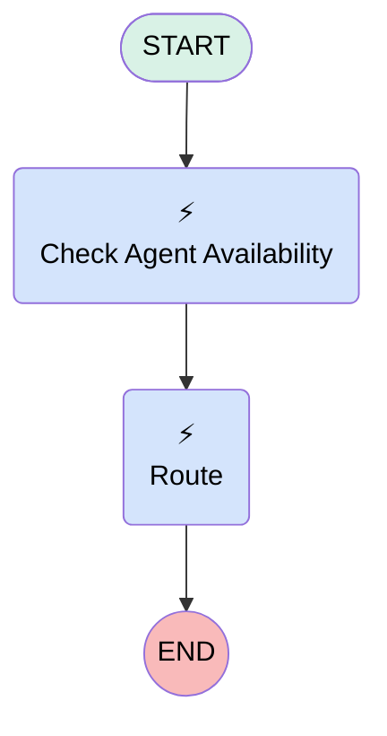

# Messaging | Route | Check Agent Availability

## Flow Diagram [(_View History_)](Messaging_Route_Check_Agent_Availability-history.md)

<!-- Flow description -->

## General Information

|<!-- -->|<!-- -->|
|:---|:---|
|Process Type| Routing Flow|
|Label|Messaging | Route | Check Agent Availability|
|Status|⚠️ Draft|
|Environments|Default|
|Interview Label|Messaging | Route | Check Agent Availability {!$Flow.CurrentDateTime}|
| Builder Type (PM)|LightningFlowBuilder|
| Canvas Mode (PM)|AUTO_LAYOUT_CANVAS|
| Origin Builder Type (PM)|LightningFlowBuilder|
|Connector|[Check_Agent_Availability](#check_agent_availability)|
|Next Node|[Check_Agent_Availability](#check_agent_availability)|

## Variables

|Name|Data Type|Is Collection|Is Input|Is Output|Object Type|Description|
|:-- |:--:|:--:|:--:|:--:|:--:|:--  |
|availableAgents|Number|⬜|⬜|✅|<!-- -->|<!-- -->|
|recordId|String|⬜|✅|⬜|<!-- -->|<!-- -->|
|waitTime|Number|⬜|⬜|✅|<!-- -->|<!-- -->|

## Flow Nodes Details

### Check_Agent_Availability

|<!-- -->|<!-- -->|
|:---|:---|
|Type|Action Call|
|Label|Check Agent Availability|
|Action Type|Check Availability For Routing|
|Action Name|checkAvailabilityForRouting|
|Flow Transaction Model|CurrentTransaction|
|Name Segment|checkAvailabilityForRouting|
|Output Parameters|- assignToReference: availableAgents &nbsp;&nbsp;name: onlineAgentsCount - assignToReference: waitTime &nbsp;&nbsp;name: estimatedWaitTime |
|Service Channel Id (input)|0N91G000000blNbSAI|
|Routing Type (input)|QueueBased|
|Service Channel Dev Name (input)|sfdc_liveagent|
|Service Channel Label (input)|Chat|
|Queue Id (input)|00GHo000001jiNBMAY|
|Queue Label (input)|Omni Login Help|
|Skill Option (input)|<!-- -->|
|Skill Requirements Resource Item (input)|<!-- -->|
|Agent Id (input)|<!-- -->|
|Agent Label (input)|<!-- -->|
|Selected Outputs (input)|GET_ALL|
|Connector|[Route](#route)|

### Route

|<!-- -->|<!-- -->|
|:---|:---|
|Type|Action Call|
|Label|[Route](#route)|
|Action Type|Route Work|
|Action Name|routeWork|
|Flow Transaction Model|CurrentTransaction|
|Name Segment|routeWork|
|Record Id (input)|recordId|
|Service Channel Id (input)|0N9Ho000000DFI0KAO|
|Service Channel Label (input)|Messaging|
|Service Channel Dev Name (input)|sfdc_livemessage|
|Routing Type (input)|QueueBased|
|Routing Config Id (input)|<!-- -->|
|Routing Config Label (input)|<!-- -->|
|Queue Id (input)|00GHo000001jiNBMAY|
|Agent Id (input)|<!-- -->|
|Agent Label (input)|<!-- -->|
|Queue Label (input)|Omni Login Help|
|Skill Option (input)|<!-- -->|
|Skill Requirements Resource Item (input)|<!-- -->|
|Bot Id (input)|<!-- -->|
|Bot Label (input)|<!-- -->|

___

_Documentation generated from branch monitoring_myubiquity by [sfdx-hardis](https://sfdx-hardis.cloudity.com), featuring [salesforce-flow-visualiser](https://github.com/toddhalfpenny/salesforce-flow-visualiser)_