# Messaging | Route | Route to Test Queue

## Flow Diagram [(_View History_)](Messaging_Route_Route_to_Test_Queue-history.md)

```mermaid
%% If you read this, your Markdown visualizer does not handle MermaidJS syntax.
%% - If you are in VS Code, install extension `Markdown Preview Mermaid Support` at https://marketplace.visualstudio.com/items?itemName=bierner.markdown-mermaid
%% - If you are using sfdx-hardis, try to define env variable `MERMAID_MODES=cli,docker` ,then run again the command to regenerate markdown with SVG images.
%% - If you are within mkdocs-material, define mermaid plugin in `mkdocs.yml` as described in https://squidfunk.github.io/mkdocs-material/extensions/mermaid/
%% - As a last resort, you can copy-paste this MermaidJS code into https://mermaid.live/ to see the flow diagram

flowchart TB
START(["START"]):::startClass
click START "#general-information" "2652523478"

Route_Work("⚡ <em></em><br/>Route Work"):::actionCalls
click Route_Work "#route_work" "3943603590"

Route_Work --> END_Route_Work
START -->  Route_Work
END_Route_Work(( END )):::endClass


classDef actionCalls fill:#D4E4FC,color:black,text-decoration:none,max-height:100px
classDef assignments fill:#FBEED7,color:black,text-decoration:none,max-height:100px
classDef collectionProcessors fill:#F0E3FA,color:black,text-decoration:none,max-height:100px
classDef customErrors fill:#FFE9E9,color:black,text-decoration:none,max-height:100px
classDef decisions fill:#FDEAF6,color:black,text-decoration:none,max-height:100px
classDef loops fill:#FDEAF6,color:black,text-decoration:none,max-height:100px
classDef recordCreates fill:#FFF8C9,color:black,text-decoration:none,max-height:100px
classDef recordDeletes fill:#FFF8C9,color:black,text-decoration:none,max-height:100px
classDef recordLookups fill:#EDEAFF,color:black,text-decoration:none,max-height:100px
classDef recordUpdates fill:#FFF8C9,color:black,text-decoration:none,max-height:100px
classDef screens fill:#DFF6FF,color:black,text-decoration:none,max-height:100px
classDef subflows fill:#D4E4FC,color:black,text-decoration:none,max-height:100px
classDef startClass fill:#D9F2E6,color:black,text-decoration:none,max-height:100px
classDef endClass fill:#F9BABA,color:black,text-decoration:none,max-height:100px
classDef transforms fill:#FDEAF6,color:black,text-decoration:none,max-height:100px


```

<!-- Flow description -->

## General Information

|<!-- -->|<!-- -->|
|:---|:---|
|Process Type| Routing Flow|
|Label|Messaging | Route | Route to Test Queue|
|Status|Active|
|Environments|Default|
|Interview Label|Messaging | Route | Route to Test Queue {!$Flow.CurrentDateTime}|
| Builder Type (PM)|LightningFlowBuilder|
| Canvas Mode (PM)|AUTO_LAYOUT_CANVAS|
| Origin Builder Type (PM)|LightningFlowBuilder|
|Connector|[Route_Work](#route_work)|
|Next Node|[Route_Work](#route_work)|

## Variables

|Name|Data Type|Is Collection|Is Input|Is Output|Object Type|Description|
|:-- |:--:|:--:|:--:|:--:|:--:|:--  |
|Email|String|⬜|✅|⬜|<!-- -->|<!-- -->|
|FirstName|String|⬜|✅|⬜|<!-- -->|<!-- -->|
|LastName|String|⬜|✅|⬜|<!-- -->|<!-- -->|
|Omni_Role|String|⬜|✅|⬜|<!-- -->|<!-- -->|
|recordId|String|⬜|✅|⬜|<!-- -->|<!-- -->|
|Subject|String|⬜|✅|⬜|<!-- -->|<!-- -->|

## Flow Nodes Details

### Route_Work

|<!-- -->|<!-- -->|
|:---|:---|
|Type|Action Call|
|Label|Route Work|
|Action Type|Route Work|
|Action Name|routeWork|
|Flow Transaction Model|CurrentTransaction|
|Name Segment|routeWork|
|Offset|0|
|Record Id (input)|recordId|
|Service Channel Id (input)|0N9Ho000000DFI0KAO|
|Service Channel Label (input)|Messaging|
|Service Channel Dev Name (input)|sfdc_livemessage|
|Routing Type (input)|QueueBased|
|Routing Config Id (input)|<!-- -->|
|Routing Config Label (input)|<!-- -->|
|Queue Id (input)|00GHo000002SGEbMAO|
|Agent Id (input)|<!-- -->|
|Agent Label (input)|<!-- -->|
|Queue Label (input)|Omni Sales|
|Skill Option (input)|<!-- -->|
|Skill Requirements Resource Item (input)|<!-- -->|
|Bot Id (input)|<!-- -->|
|Bot Label (input)|<!-- -->|
|Copilot Id (input)|<!-- -->|
|Copilot Label (input)|<!-- -->|

___

_Documentation generated from branch monitoring_myubiquity by [sfdx-hardis](https://sfdx-hardis.cloudity.com), featuring [salesforce-flow-visualiser](https://github.com/toddhalfpenny/salesforce-flow-visualiser)_