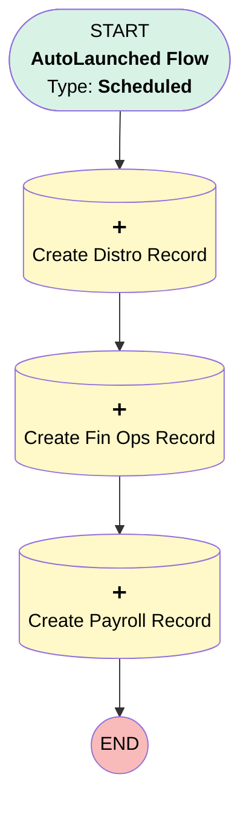

# Operations Metrics | Scheduled | Create Weekly Records

## Flow Diagram [(_View History_)](Operations_Metrics_Scheduled_Create_Weekly_Records-history.md)

<!-- Flow description -->

## General Information

|<!-- -->|<!-- -->|
|:---|:---|
|Process Type| Auto Launched Flow|
|Trigger Type| Scheduled|
|Label|Operations Metrics | Scheduled | Create Weekly Records|
|Status|Active|
|Environments|Default|
|Interview Label|Operations Metrics | Scheduled | Create Weekly Records {!$Flow.CurrentDateTime}|
| Builder Type (PM)|LightningFlowBuilder|
| Canvas Mode (PM)|AUTO_LAYOUT_CANVAS|
| Origin Builder Type (PM)|LightningFlowBuilder|
|Connector|[Create_Distro_Record](#create_distro_record)|
|Next Node|[Create_Distro_Record](#create_distro_record)|

#### Schedules

|Frequency|Start Date|Start Time|
|:-- |:--:|:--: |
|Weekly|Sep 3, 2023|04:00|

## Formulas

|Name|Data Type|Expression|Description|
|:-- |:--:|:-- |:--  |
|weekEnd|Date|TODAY()|<!-- -->|
|weekStart|Date|TODAY() - 7|<!-- -->|

## Flow Nodes Details

### Create_Distro_Record

|<!-- -->|<!-- -->|
|:---|:---|
|Type|Record Create|
|Object|Operations_Metrics__c|
|Label|Create Distro Record|
|Store Output Automatically|✅|
|Connector|[Create_Fin_Ops_Record](#create_fin_ops_record)|

#### Input Assignments

|Field|Value|
|:-- |:--: |
|OwnerId|005Ho00000AnvFJ|
|Type__c|Distributions|
|Week_End__c|weekEnd|
|Week_Start__c|weekStart|

### Create_Fin_Ops_Record

|<!-- -->|<!-- -->|
|:---|:---|
|Type|Record Create|
|Object|Operations_Metrics__c|
|Label|Create Fin Ops Record|
|Store Output Automatically|✅|
|Connector|[Create_Payroll_Record](#create_payroll_record)|

#### Input Assignments

|Field|Value|
|:-- |:--: |
|OwnerId|005Ho00000AnvFJ|
|Type__c|Fin Ops|
|Week_End__c|weekEnd|
|Week_Start__c|weekStart|

### Create_Payroll_Record

|<!-- -->|<!-- -->|
|:---|:---|
|Type|Record Create|
|Object|Operations_Metrics__c|
|Label|Create Payroll Record|
|Store Output Automatically|✅|

#### Input Assignments

|Field|Value|
|:-- |:--: |
|OwnerId|005Ho00000AnvFJ|
|Type__c|Payroll|
|Week_End__c|weekEnd|
|Week_Start__c|weekStart|

___

_Documentation generated from branch monitoring_myubiquity by [sfdx-hardis](https://sfdx-hardis.cloudity.com), featuring [salesforce-flow-visualiser](https://github.com/toddhalfpenny/salesforce-flow-visualiser)_