# Opportunity | After Save | Product Trigger

## Flow Diagram [(_View History_)](Opportunity_After_Save_Product_Trigger-history.md)

```mermaid
%% If you read this, your Markdown visualizer does not handle MermaidJS syntax.
%% - If you are in VS Code, install extension `Markdown Preview Mermaid Support` at https://marketplace.visualstudio.com/items?itemName=bierner.markdown-mermaid
%% - If you are using sfdx-hardis, try to define env variable `MERMAID_MODES=cli,docker` ,then run again the command to regenerate markdown with SVG images.
%% - If you are within mkdocs-material, define mermaid plugin in `mkdocs.yml` as described in https://squidfunk.github.io/mkdocs-material/extensions/mermaid/
%% - As a last resort, you can copy-paste this MermaidJS code into https://mermaid.live/ to see the flow diagram

flowchart TB
START(["START<br/><b>AutoLaunched Flow</b></br>Type: <b> Record After Save</b>"]):::startClass
click START "#general-information" "3437490951"

Assign_updated_PB[\"🟰 <em></em><br/>Assign updated PB"/]:::assignments
click Assign_updated_PB "#assign_updated_pb" "3812923808"

Define_current_PB[\"🟰 <em></em><br/>Define current PB"/]:::assignments
click Define_current_PB "#define_current_pb" "1697256785"

Uncheck_Reset_Box[\"🟰 <em></em><br/>Uncheck Reset Box"/]:::assignments
click Uncheck_Reset_Box "#uncheck_reset_box" "1025497881"

Are_there_new_line_items{"🔀 <em></em><br/>Are there new line items"}:::decisions
click Are_there_new_line_items "#are_there_new_line_items" "3417285130"

Are_there_old_opp_products{"🔀 <em></em><br/>Are there old opp products"}:::decisions
click Are_there_old_opp_products "#are_there_old_opp_products" "736232326"

Check_for_current_pricebook{"🔀 <em></em><br/>Check for current pricebook"}:::decisions
click Check_for_current_pricebook "#check_for_current_pricebook" "4079564266"

Check_if_PB_change_needed{"🔀 <em></em><br/>Check if PB change needed"}:::decisions
click Check_if_PB_change_needed "#check_if_pb_change_needed" "1211695010"

Is_an_opp_update_needed{"🔀 <em></em><br/>Is an opp update needed"}:::decisions
click Is_an_opp_update_needed "#is_an_opp_update_needed" "1437756920"

Was_this_a_full_product_reset{"🔀 <em></em><br/>Was this a full product reset"}:::decisions
click Was_this_a_full_product_reset "#was_this_a_full_product_reset" "2709849828"

Create_new_line_items[("➕ <em></em><br/>Create new line items")]:::recordCreates
click Create_new_line_items "#create_new_line_items" "1074972285"

Delete_old_opp_products[("🗑️ <em></em><br/>Delete old opp products")]:::recordDeletes
click Delete_old_opp_products "#delete_old_opp_products" "3939375447"

Check_for_opp_products[("🔍 <em></em><br/>Check for opp products")]:::recordLookups
click Check_for_opp_products "#check_for_opp_products" "409491179"

Update_Opp[("🛠️ <em></em><br/>Update Opp")]:::recordUpdates
click Update_Opp "#update_opp" "198231315"

Check_for_Discounts[["🔗 <em>Subflow</em><br/>Check for Discounts"]]:::subflows
click Check_for_Discounts "#check_for_discounts" "3924985305"

Run_Pricebook_Check[["🔗 <em>Subflow</em><br/>Run Pricebook Check"]]:::subflows
click Run_Pricebook_Check "#run_pricebook_check" "559131413"

Run_product_check[["🔗 <em>Subflow</em><br/>Run product check"]]:::subflows
click Run_product_check "#run_product_check" "2497384129"

Assign_updated_PB --> Run_product_check
Define_current_PB --> Run_Pricebook_Check
Uncheck_Reset_Box --> Is_an_opp_update_needed
Are_there_new_line_items --> |"Needs new opp products"| Create_new_line_items
Are_there_new_line_items --> |"Default Outcome"| Check_for_Discounts
Are_there_old_opp_products --> |"Old products match new"| Was_this_a_full_product_reset
Are_there_old_opp_products --> |"Opp products need deletion"| Delete_old_opp_products
Are_there_old_opp_products --> |"Default Outcome"| Was_this_a_full_product_reset
Check_for_current_pricebook --> |"Pricebook found"| Define_current_PB
Check_for_current_pricebook --> |"Default Outcome"| Run_Pricebook_Check
Check_if_PB_change_needed --> |"Need PB update"| Assign_updated_PB
Check_if_PB_change_needed --> |"Default Outcome"| Run_product_check
Is_an_opp_update_needed --> |"Needs pricebook stamp"| Update_Opp
Is_an_opp_update_needed --> |"Default Outcome"| Are_there_new_line_items
Was_this_a_full_product_reset --> |"Box needs unchecking"| Uncheck_Reset_Box
Was_this_a_full_product_reset --> |"Default Outcome"| Is_an_opp_update_needed
Create_new_line_items --> Check_for_Discounts
Delete_old_opp_products --> Was_this_a_full_product_reset
Check_for_opp_products --> Are_there_old_opp_products
Update_Opp --> Are_there_new_line_items
START -->  Check_for_current_pricebook
Check_for_Discounts --> END_Check_for_Discounts
Run_Pricebook_Check --> Check_if_PB_change_needed
Run_product_check --> Check_for_opp_products
END_Check_for_Discounts(( END )):::endClass


classDef actionCalls fill:#D4E4FC,color:black,text-decoration:none,max-height:100px
classDef assignments fill:#FBEED7,color:black,text-decoration:none,max-height:100px
classDef collectionProcessors fill:#F0E3FA,color:black,text-decoration:none,max-height:100px
classDef customErrors fill:#FFE9E9,color:black,text-decoration:none,max-height:100px
classDef decisions fill:#FDEAF6,color:black,text-decoration:none,max-height:100px
classDef loops fill:#FDEAF6,color:black,text-decoration:none,max-height:100px
classDef recordCreates fill:#FFF8C9,color:black,text-decoration:none,max-height:100px
classDef recordDeletes fill:#FFF8C9,color:black,text-decoration:none,max-height:100px
classDef recordLookups fill:#EDEAFF,color:black,text-decoration:none,max-height:100px
classDef recordUpdates fill:#FFF8C9,color:black,text-decoration:none,max-height:100px
classDef screens fill:#DFF6FF,color:black,text-decoration:none,max-height:100px
classDef subflows fill:#D4E4FC,color:black,text-decoration:none,max-height:100px
classDef startClass fill:#D9F2E6,color:black,text-decoration:none,max-height:100px
classDef endClass fill:#F9BABA,color:black,text-decoration:none,max-height:100px
classDef transforms fill:#FDEAF6,color:black,text-decoration:none,max-height:100px


```

<!-- Flow description -->

## General Information

|<!-- -->|<!-- -->|
|:---|:---|
|Object|Opportunity|
|Process Type| Auto Launched Flow|
|Trigger Type| Record After Save|
|Record Trigger Type| Create And Update|
|Label|Opportunity | After Save | Product Trigger|
|Status|Active|
|Filter Formula|(((ISCHANGED({!$Record.LeadSource}) || ISCHANGED({!$Record.LeadSourceDetail__c}) || ISCHANGED({!$Record.Type}) || ISCHANGED({!$Record.Service_Option__c}) || ISNEW() || ISCHANGED({!$Record.Profit_Sharing__c})) && NOT({!$Record.IsClosed})) || {!$Record.Reset_Products__c}) && (ISPICKVAL({!$Record.Type},"401(k) Plan Sale")||ISPICKVAL({!$Record.Type},"Upgrade")||ISPICKVAL({!$Record.Type},"Single(k)"))|
|Description|Added promo check|
|Environments|Default|
|Interview Label|Opportunity | After Save | Product Trigger {!$Flow.CurrentDateTime}|
| Builder Type (PM)|LightningFlowBuilder|
| Canvas Mode (PM)|AUTO_LAYOUT_CANVAS|
| Origin Builder Type (PM)|LightningFlowBuilder|
|Connector|[Check_for_current_pricebook](#check_for_current_pricebook)|
|Next Node|[Check_for_current_pricebook](#check_for_current_pricebook)|

## Variables

|Name|Data Type|Is Collection|Is Input|Is Output|Object Type|Description|
|:-- |:--:|:--:|:--:|:--:|:--:|:--  |
|currentOppProducts|SObject|✅|⬜|⬜|OpportunityLineItem|<!-- -->|
|currentPB|SObject|⬜|⬜|✅|Pricebook2|<!-- -->|
|fullResetInput|Boolean|⬜|⬜|⬜|<!-- -->|<!-- -->|
|newOppProducts|SObject|✅|⬜|⬜|OpportunityLineItem|<!-- -->|
|newPB|SObject|⬜|⬜|⬜|Pricebook2|<!-- -->|
|oppNeedsNewPB|Boolean|⬜|⬜|⬜|<!-- -->|<!-- -->|

## Flow Nodes Details

### Assign_updated_PB

|<!-- -->|<!-- -->|
|:---|:---|
|Type|Assignment|
|Label|Assign updated PB|
|Connector|[Run_product_check](#run_product_check)|

#### Assignments

|Assign To Reference|Operator|Value|
|:-- |:--:|:--: |
|currentPB| Assign|newPB|
|$Record.Pricebook2Id| Assign|newPB.Id|

### Define_current_PB

|<!-- -->|<!-- -->|
|:---|:---|
|Type|Assignment|
|Label|Define current PB|
|Connector|[Run_Pricebook_Check](#run_pricebook_check)|

#### Assignments

|Assign To Reference|Operator|Value|
|:-- |:--:|:--: |
|currentPB.IsActive| Assign|$Record.Pricebook2.IsActive|
|currentPB.IsStandard| Assign|$Record.Pricebook2.IsStandard|
|currentPB.CreatedDate| Assign|$Record.Pricebook2.CreatedDate|
|currentPB.Partner_Fee__c| Assign|$Record.Pricebook2.Partner_Fee__c|
|currentPB.Name| Assign|$Record.Pricebook2.Name|
|currentPB.Lead_Sources__c| Assign|$Record.Pricebook2.Lead_Sources__c|
|currentPB.Lead_Source_Details__c| Assign|$Record.Pricebook2.Lead_Source_Details__c|
|currentPB.Id| Assign|$Record.Pricebook2Id|

### Uncheck_Reset_Box

|<!-- -->|<!-- -->|
|:---|:---|
|Type|Assignment|
|Label|Uncheck Reset Box|
|Connector|[Is_an_opp_update_needed](#is_an_opp_update_needed)|

#### Assignments

|Assign To Reference|Operator|Value|
|:-- |:--:|:--: |
|$Record.Reset_Products__c| Assign|⬜|

### Are_there_new_line_items

|<!-- -->|<!-- -->|
|:---|:---|
|Type|Decision|
|Label|Are there new line items|
|Default Connector|[Check_for_Discounts](#check_for_discounts)|
|Default Connector Label|Default Outcome|

#### Rule Needs_new_opp_products (Needs new opp products)

|<!-- -->|<!-- -->|
|:---|:---|
|Connector|[Create_new_line_items](#create_new_line_items)|
|Condition Logic|and|

|Condition Id|Left Value Reference|Operator|Right Value|
|:-- |:-- |:--:|:--: |
|1|newOppProducts| Is Null|⬜|

### Are_there_old_opp_products

|<!-- -->|<!-- -->|
|:---|:---|
|Type|Decision|
|Label|Are there old opp products|
|Default Connector|[Was_this_a_full_product_reset](#was_this_a_full_product_reset)|
|Default Connector Label|Default Outcome|

#### Rule Old_products_match_new (Old products match new)

|<!-- -->|<!-- -->|
|:---|:---|
|Connector|[Was_this_a_full_product_reset](#was_this_a_full_product_reset)|
|Condition Logic|and|

|Condition Id|Left Value Reference|Operator|Right Value|
|:-- |:-- |:--:|:--: |
|1|currentOppProducts| Equal To|newOppProducts|

#### Rule Opp_products_need_deletion (Opp products need deletion)

|<!-- -->|<!-- -->|
|:---|:---|
|Connector|[Delete_old_opp_products](#delete_old_opp_products)|
|Condition Logic|and|

|Condition Id|Left Value Reference|Operator|Right Value|
|:-- |:-- |:--:|:--: |
|1|currentOppProducts| Is Null|⬜|

### Check_for_current_pricebook

|<!-- -->|<!-- -->|
|:---|:---|
|Type|Decision|
|Label|Check for current pricebook|
|Default Connector|[Run_Pricebook_Check](#run_pricebook_check)|
|Default Connector Label|Default Outcome|

#### Rule Pricebook_found (Pricebook found)

|<!-- -->|<!-- -->|
|:---|:---|
|Connector|[Define_current_PB](#define_current_pb)|
|Condition Logic|and|

|Condition Id|Left Value Reference|Operator|Right Value|
|:-- |:-- |:--:|:--: |
|1|$Record.Pricebook2Id| Is Null|⬜|

### Check_if_PB_change_needed

|<!-- -->|<!-- -->|
|:---|:---|
|Type|Decision|
|Label|Check if PB change needed|
|Default Connector|[Run_product_check](#run_product_check)|
|Default Connector Label|Default Outcome|

#### Rule Need_PB_update (Need PB update)

|<!-- -->|<!-- -->|
|:---|:---|
|Connector|[Assign_updated_PB](#assign_updated_pb)|
|Condition Logic|or|

|Condition Id|Left Value Reference|Operator|Right Value|
|:-- |:-- |:--:|:--: |
|1|oppNeedsNewPB| Equal To|✅|

### Is_an_opp_update_needed

|<!-- -->|<!-- -->|
|:---|:---|
|Type|Decision|
|Label|Is an opp update needed|
|Default Connector|[Are_there_new_line_items](#are_there_new_line_items)|
|Default Connector Label|Default Outcome|

#### Rule Needs_pricebook_stamp (Needs pricebook stamp)

|<!-- -->|<!-- -->|
|:---|:---|
|Connector|[Update_Opp](#update_opp)|
|Condition Logic|(1 AND 2) OR 3|

|Condition Id|Left Value Reference|Operator|Right Value|
|:-- |:-- |:--:|:--: |
|1|newPB.Id| Is Null|⬜|
|2|oppNeedsNewPB| Equal To|✅|
|3|Box_needs_unchecking| Equal To|✅|

### Was_this_a_full_product_reset

|<!-- -->|<!-- -->|
|:---|:---|
|Type|Decision|
|Label|Was this a full product reset|
|Default Connector|[Is_an_opp_update_needed](#is_an_opp_update_needed)|
|Default Connector Label|Default Outcome|

#### Rule Box_needs_unchecking (Box needs unchecking)

|<!-- -->|<!-- -->|
|:---|:---|
|Connector|[Uncheck_Reset_Box](#uncheck_reset_box)|
|Condition Logic|and|

|Condition Id|Left Value Reference|Operator|Right Value|
|:-- |:-- |:--:|:--: |
|1|$Record.Reset_Products__c| Equal To|✅|

### Create_new_line_items

|<!-- -->|<!-- -->|
|:---|:---|
|Type|Record Create|
|Label|Create new line items|
|Input Reference|newOppProducts|
|Connector|[Check_for_Discounts](#check_for_discounts)|

### Delete_old_opp_products

|<!-- -->|<!-- -->|
|:---|:---|
|Type|Record Delete|
|Label|Delete old opp products|
|Input Reference|currentOppProducts|
|Connector|[Was_this_a_full_product_reset](#was_this_a_full_product_reset)|

### Check_for_opp_products

|<!-- -->|<!-- -->|
|:---|:---|
|Type|Record Lookup|
|Object|OpportunityLineItem|
|Label|Check for opp products|
|Assign Null Values If No Records Found|✅|
|Output Reference|currentOppProducts|
|Queried Fields|- Id - UnitPrice - Name - Product_Family__c |
|Connector|[Are_there_old_opp_products](#are_there_old_opp_products)|

#### Filters (logic: **and**)

|Filter Id|Field|Operator|Value|
|:-- |:-- |:--:|:--: |
|1|OpportunityId| Equal To|$Record.Id|

### Update_Opp

|<!-- -->|<!-- -->|
|:---|:---|
|Type|Record Update|
|Label|Update Opp|
|Input Reference|$Record|
|Connector|[Are_there_new_line_items](#are_there_new_line_items)|

### Check_for_Discounts

|<!-- -->|<!-- -->|
|:---|:---|
|Type|Subflow|
|Label|Check for Discounts|
|Flow Name|Update_Promotional_Discount|
|Store Output Automatically|✅|

#### Input Assignments

|Field|Value|
|:-- |:--: |
|<!-- -->|$Record.Id|

### Run_Pricebook_Check

|<!-- -->|<!-- -->|
|:---|:---|
|Type|Subflow|
|Label|Run Pricebook Check|
|Flow Name|Opportunity_Autolaunched_Pricebook_Check|
|Output Assignments|- assignToReference: oppNeedsNewPB &nbsp;&nbsp;name: needPriceBookChange - assignToReference: newPB &nbsp;&nbsp;name: newPB |
|Connector|[Check_if_PB_change_needed](#check_if_pb_change_needed)|

#### Input Assignments

|Field|Value|
|:-- |:--: |
|<!-- -->|currentPB|
|<!-- -->|$Record|

### Run_product_check

|<!-- -->|<!-- -->|
|:---|:---|
|Type|Subflow|
|Label|Run product check|
|Flow Name|Opportunity_Autolaunched_Product_Check|
|Output Assignments|assignToReference: newOppProducts name: newOppProducts |
|Connector|[Check_for_opp_products](#check_for_opp_products)|

#### Input Assignments

|Field|Value|
|:-- |:--: |
|<!-- -->|currentPB|
|<!-- -->|$Record|

___

_Documentation generated from branch monitoring_myubiquity by [sfdx-hardis](https://sfdx-hardis.cloudity.com), featuring [salesforce-flow-visualiser](https://github.com/toddhalfpenny/salesforce-flow-visualiser)_