# Opportunity | After Trigger | Add/Edit Products

## Flow Diagram [(_View History_)](Opportunity_After_Trigger_Add_Edit_Products-history.md)

```mermaid
%% If you read this, your Markdown visualizer does not handle MermaidJS syntax.
%% - If you are in VS Code, install extension `Markdown Preview Mermaid Support` at https://marketplace.visualstudio.com/items?itemName=bierner.markdown-mermaid
%% - If you are using sfdx-hardis, try to define env variable `MERMAID_MODES=cli,docker` ,then run again the command to regenerate markdown with SVG images.
%% - If you are within mkdocs-material, define mermaid plugin in `mkdocs.yml` as described in https://squidfunk.github.io/mkdocs-material/extensions/mermaid/
%% - As a last resort, you can copy-paste this MermaidJS code into https://mermaid.live/ to see the flow diagram

flowchart TB
START(["START<br/><b>AutoLaunched Flow</b></br>Type: <b> Record After Save</b>"]):::startClass
click START "#general-information" "1414140052"

Add_companions_to_prods2add[\"🟰 <em></em><br/>Add companions to products2add"/]:::assignments
click Add_companions_to_prods2add "#add_companions_to_prods2add" "2956793688"

Add_Core_to_Collection[\"🟰 <em></em><br/>Add Core to Collection"/]:::assignments
click Add_Core_to_Collection "#add_core_to_collection" "1156567281"

Add_Final_Code[\"🟰 <em></em><br/>Add Final Code"/]:::assignments
click Add_Final_Code "#add_final_code" "3347378404"

Add_Leftmost_Code_to_coll[\"🟰 <em></em><br/>Add Leftmost Code to coll"/]:::assignments
click Add_Leftmost_Code_to_coll "#add_leftmost_code_to_coll" "3753381916"

Add_Line_Item[\"🟰 <em></em><br/>Add Line Item"/]:::assignments
click Add_Line_Item "#add_line_item" "301496555"

Add_product_to_error_list[\"🟰 <em></em><br/>Add product to error list"/]:::assignments
click Add_product_to_error_list "#add_product_to_error_list" "3595527386"

Add_to_product_id_collection[\"🟰 <em></em><br/>Add to product id collection"/]:::assignments
click Add_to_product_id_collection "#add_to_product_id_collection" "3956384221"

Add_to_product_id_collection_0[\"🟰 <em></em><br/>Add to product id collection"/]:::assignments
click Add_to_product_id_collection_0 "#add_to_product_id_collection_0" "2712255729"

Add_Upgrade_Items[\"🟰 <em></em><br/>Add Upgrade Items"/]:::assignments
click Add_Upgrade_Items "#add_upgrade_items" "797494307"

Assign_Opp_Update_Notes[\"🟰 <em></em><br/>Assign Opp Update Notes"/]:::assignments
click Assign_Opp_Update_Notes "#assign_opp_update_notes" "311518579"

Assign_Opp_Update_Pricebook[\"🟰 <em></em><br/>Assign Opp Update Pricebook"/]:::assignments
click Assign_Opp_Update_Pricebook "#assign_opp_update_pricebook" "1301535266"

Assign_Opp_Update_Resetbox[\"🟰 <em></em><br/>Assign Opp Update Resetbox"/]:::assignments
click Assign_Opp_Update_Resetbox "#assign_opp_update_resetbox" "1402321292"

Define_Code_Variable[\"🟰 <em></em><br/>Define Code Variable"/]:::assignments
click Define_Code_Variable "#define_code_variable" "3681626348"

Define_Line_Item[\"🟰 <em></em><br/>Define Line Item"/]:::assignments
click Define_Line_Item "#define_line_item" "4224962685"

Define_Upgrade_Line_Items[\"🟰 <em></em><br/>Define Upgrade Line Items"/]:::assignments
click Define_Upgrade_Line_Items "#define_upgrade_line_items" "257535304"

purge_product_ids[\"🟰 <em></em><br/>purge product ids"/]:::assignments
click purge_product_ids "#purge_product_ids" "1693123228"

Referral_Discount_0[\"🟰 <em></em><br/>Referral Discount"/]:::assignments
click Referral_Discount_0 "#referral_discount_0" "207743647"

Referral_Discount_Amount_0[\"🟰 <em></em><br/>Referral Discount Amount"/]:::assignments
click Referral_Discount_Amount_0 "#referral_discount_amount_0" "2206731781"

removeLeftmostCode[\"🟰 <em></em><br/>removeLeftmostCode"/]:::assignments
click removeLeftmostCode "#removeleftmostcode" "1440439073"

Wipe_Discounts_Add_Collection[\"🟰 <em></em><br/>Wipe Discounts + Add Collection"/]:::assignments
click Wipe_Discounts_Add_Collection "#wipe_discounts_add_collection" "1572172428"

Companion_Product_Check{"🔀 <em></em><br/>Companion Product Check"}:::decisions
click Companion_Product_Check "#companion_product_check" "4190388042"

Discount_Check{"🔀 <em></em><br/>Discount Check"}:::decisions
click Discount_Check "#discount_check" "2198497019"

Entry_Validation{"🔀 <em></em><br/>Entry Validation"}:::decisions
click Entry_Validation "#entry_validation" "1912645640"

Is_Price_Book_Already_Set{"🔀 <em></em><br/>Is Price Book Already Set?"}:::decisions
click Is_Price_Book_Already_Set "#is_price_book_already_set" "881165140"

is_this_in_the_chosen_pricebook{"🔀 <em></em><br/>is this in the chosen pricebook"}:::decisions
click is_this_in_the_chosen_pricebook "#is_this_in_the_chosen_pricebook" "3893609930"

Opp_Needs_Update_Check{"🔀 <em></em><br/>Opp Needs Update Check"}:::decisions
click Opp_Needs_Update_Check "#opp_needs_update_check" "3625010535"

OppNotes_Update_Check{"🔀 <em></em><br/>OppNotes Update Check"}:::decisions
click OppNotes_Update_Check "#oppnotes_update_check" "4230152829"

Price_Book{"🔀 <em></em><br/>Price Book"}:::decisions
click Price_Book "#price_book" "3429728649"

Pricebook_Update_Check{"🔀 <em></em><br/>Pricebook Update Check"}:::decisions
click Pricebook_Update_Check "#pricebook_update_check" "3060908163"

product_code_check{"🔀 <em></em><br/>product code check"}:::decisions
click product_code_check "#product_code_check" "826628503"

Replacement_Check_Needed{"🔀 <em></em><br/>Replacement Check Needed"}:::decisions
click Replacement_Check_Needed "#replacement_check_needed" "4151568794"

ResetBox_Update_Check{"🔀 <em></em><br/>ResetBox Update Check"}:::decisions
click ResetBox_Update_Check "#resetbox_update_check" "652465866"

Upgrade_Products_Found_Check{"🔀 <em></em><br/>Upgrade Products Found Check"}:::decisions
click Upgrade_Products_Found_Check "#upgrade_products_found_check" "4045520365"

Verify_Companion_Need{"🔀 <em></em><br/>Verify Companion Need"}:::decisions
click Verify_Companion_Need "#verify_companion_need" "93794907"

Verify_PB_Found{"🔀 <em></em><br/>Verify PB Found"}:::decisions
click Verify_PB_Found "#verify_pb_found" "103609956"

What_does_code_need_done{"🔀 <em></em><br/>What does code need done"}:::decisions
click What_does_code_need_done "#what_does_code_need_done" "276773605"

Companion_Loop{{"🔁 <em></em><br/>Companion Loop"}}:::loops
click Companion_Loop "#companion_loop" "65871698"

Define_Opp_Products{{"🔁 <em></em><br/>Define Opp Products"}}:::loops
click Define_Opp_Products "#define_opp_products" "3467580762"

pricebookEntryIDloop{{"🔁 <em></em><br/>pricebookEntryIDloop"}}:::loops
click pricebookEntryIDloop "#pricebookentryidloop" "2735872079"

Product_to_ProductId_Loop{{"🔁 <em></em><br/>Product to ProductId Loop"}}:::loops
click Product_to_ProductId_Loop "#product_to_productid_loop" "2035468378"

Create_Opportunity_Line_Items[("➕ <em></em><br/>Create Opportunity Line Items")]:::recordCreates
click Create_Opportunity_Line_Items "#create_opportunity_line_items" "164522682"

Delete_Old_Prods[("🗑️ <em></em><br/>Delete Old Prods")]:::recordDeletes
click Delete_Old_Prods "#delete_old_prods" "2407289617"

Get_401_k_PB[("🔍 <em></em><br/>Get 401(k) PB")]:::recordLookups
click Get_401_k_PB "#get_401_k_pb" "2491117785"

Get_Add_On_PB[("🔍 <em></em><br/>Get Add-On PB")]:::recordLookups
click Get_Add_On_PB "#get_add_on_pb" "4148071545"

Get_JPM_PB[("🔍 <em></em><br/>Get JPM PB")]:::recordLookups
click Get_JPM_PB "#get_jpm_pb" "3982307322"

Get_Products_0[("🔍 <em></em><br/>Get Products")]:::recordLookups
click Get_Products_0 "#get_products_0" "3108115526"

Get_Relevant_Products[("🔍 <em></em><br/>Get Relevant Products")]:::recordLookups
click Get_Relevant_Products "#get_relevant_products" "2036883948"

Get_RewardJet_PB[("🔍 <em></em><br/>Get RewardJet PB")]:::recordLookups
click Get_RewardJet_PB "#get_rewardjet_pb" "4043256870"

Get_Rippling_PB[("🔍 <em></em><br/>Get Rippling PB")]:::recordLookups
click Get_Rippling_PB "#get_rippling_pb" "3712045854"

Get_Sallus_PB[("🔍 <em></em><br/>Get Sallus PB")]:::recordLookups
click Get_Sallus_PB "#get_sallus_pb" "441755859"

Get_Simply_PB[("🔍 <em></em><br/>Get Simply PB")]:::recordLookups
click Get_Simply_PB "#get_simply_pb" "1756601848"

Get_Single_k_PB[("🔍 <em></em><br/>Get Single(k) PB")]:::recordLookups
click Get_Single_k_PB "#get_single_k_pb" "511833624"

Get_Upgrade_PB[("🔍 <em></em><br/>Get Upgrade PB")]:::recordLookups
click Get_Upgrade_PB "#get_upgrade_pb" "2297565346"

Grab_Potential_Companions[("🔍 <em></em><br/>Grab Potential Companions")]:::recordLookups
click Grab_Potential_Companions "#grab_potential_companions" "1083439755"

Grab_Prev_Upgrade_Product[("🔍 <em></em><br/>Grab Prev Upgrade Product")]:::recordLookups
click Grab_Prev_Upgrade_Product "#grab_prev_upgrade_product" "3809728325"

Grab_Pricebook_Entries[("🔍 <em></em><br/>Grab Pricebook Entries")]:::recordLookups
click Grab_Pricebook_Entries "#grab_pricebook_entries" "1758281013"

Grab_Upgrade_Product[("🔍 <em></em><br/>Grab Upgrade Product")]:::recordLookups
click Grab_Upgrade_Product "#grab_upgrade_product" "328299948"

Update_Triggering_Opp[("🛠️ <em></em><br/>Update Triggering Opp")]:::recordUpdates
click Update_Triggering_Opp "#update_triggering_opp" "2659417103"

Update_w_error_message[("🛠️ <em></em><br/>Update w/ error message")]:::recordUpdates
click Update_w_error_message "#update_w_error_message" "3198178155"

Check_for_Promotions[["🔗 <em>Subflow</em><br/>Check for Promotions"]]:::subflows
click Check_for_Promotions "#check_for_promotions" "2755546540"

Add_companions_to_prods2add --> Companion_Loop
Add_Core_to_Collection --> product_code_check
Add_Final_Code --> Companion_Product_Check
Add_Leftmost_Code_to_coll --> removeLeftmostCode
Add_Line_Item --> Define_Opp_Products
Add_product_to_error_list --> Define_Opp_Products
Add_to_product_id_collection --> Product_to_ProductId_Loop
Add_to_product_id_collection_0 --> pricebookEntryIDloop
Add_Upgrade_Items --> Companion_Product_Check
Assign_Opp_Update_Notes --> Opp_Needs_Update_Check
Assign_Opp_Update_Pricebook --> OppNotes_Update_Check
Assign_Opp_Update_Resetbox --> Pricebook_Update_Check
Define_Code_Variable --> What_does_code_need_done
Define_Line_Item --> Add_Line_Item
Define_Upgrade_Line_Items --> Add_Upgrade_Items
purge_product_ids --> pricebookEntryIDloop
Referral_Discount_0 --> is_this_in_the_chosen_pricebook
Referral_Discount_Amount_0 --> is_this_in_the_chosen_pricebook
removeLeftmostCode --> What_does_code_need_done
Wipe_Discounts_Add_Collection --> Discount_Check
Companion_Product_Check --> |"Companion Needed"| Grab_Potential_Companions
Companion_Product_Check --> |"Default Outcome"| Product_to_ProductId_Loop
Discount_Check --> |"Yes Referral"| Referral_Discount_0
Discount_Check --> |"Yes ProBeauty"| Referral_Discount_0
Discount_Check --> |"Yes PSIVet"| Referral_Discount_Amount_0
Discount_Check --> |"No"| is_this_in_the_chosen_pricebook
Entry_Validation --> |"Proceed"| Is_Price_Book_Already_Set
Entry_Validation --> |"Abort"| END_Entry_Validation
Is_Price_Book_Already_Set --> |"Yes"| Get_Products_0
Is_Price_Book_Already_Set --> |"No"| Price_Book
is_this_in_the_chosen_pricebook --> |"Product Present in pricebook"| Define_Line_Item
is_this_in_the_chosen_pricebook --> |"Default Outcome"| Add_product_to_error_list
Opp_Needs_Update_Check --> |"Opp Needs Update"| Update_Triggering_Opp
Opp_Needs_Update_Check --> |"Default Outcome"| Create_Opportunity_Line_Items
OppNotes_Update_Check --> |"Needs Note Update"| Assign_Opp_Update_Notes
OppNotes_Update_Check --> |"Default Outcome"| Opp_Needs_Update_Check
Price_Book --> |"Add-On"| Get_Add_On_PB
Price_Book --> |"Upgrade"| Get_Upgrade_PB
Price_Book --> |"Single(k)"| Get_Single_k_PB
Price_Book --> |"JPM"| Get_JPM_PB
Price_Book --> |"RewardJet"| Get_RewardJet_PB
Price_Book --> |"Rippling"| Get_Rippling_PB
Price_Book --> |"401(K)"| Get_401_k_PB
Price_Book --> |"Simply Retirement"| Get_Simply_PB
Price_Book --> |"Sallus"| Get_Sallus_PB
Price_Book --> |"Default Outcome"| END_Price_Book
Pricebook_Update_Check --> |"Needs Pricebook Update"| Assign_Opp_Update_Pricebook
Pricebook_Update_Check --> |"Default Outcome"| OppNotes_Update_Check
product_code_check --> |"Product Code Found"| Define_Code_Variable
product_code_check --> |"Product Found no code"| Companion_Product_Check
product_code_check --> |"no product"| END_product_code_check
Replacement_Check_Needed --> |"Opp Has Products"| Delete_Old_Prods
Replacement_Check_Needed --> |"Fresh Opp"| ResetBox_Update_Check
ResetBox_Update_Check --> |"Needs Resetbox Update"| Assign_Opp_Update_Resetbox
ResetBox_Update_Check --> |"Default Outcome"| Pricebook_Update_Check
Upgrade_Products_Found_Check --> |"New and Prev products found"| Define_Upgrade_Line_Items
Upgrade_Products_Found_Check --> |"Default Outcome"| END_Upgrade_Products_Found_Check
Verify_Companion_Need --> |"Not Needed Catch"| Companion_Loop
Verify_Companion_Need --> |"Default Outcome"| Add_companions_to_prods2add
Verify_PB_Found --> |"PB Valid Upgrade"| Grab_Upgrade_Product
Verify_PB_Found --> |"PB Valid Need Product"| Get_Relevant_Products
Verify_PB_Found --> |"Default Outcome"| END_Verify_PB_Found
What_does_code_need_done --> |"More than one code remains"| Add_Leftmost_Code_to_coll
What_does_code_need_done --> |"Last Code"| Add_Final_Code
What_does_code_need_done --> |"Default Outcome"| END_What_does_code_need_done
Companion_Loop --> |"For Each"|Verify_Companion_Need
Companion_Loop ---> |"After Last"|Product_to_ProductId_Loop
Define_Opp_Products --> |"For Each"|Wipe_Discounts_Add_Collection
Define_Opp_Products ---> |"After Last"|Replacement_Check_Needed
pricebookEntryIDloop --> |"For Each"|Add_to_product_id_collection_0
pricebookEntryIDloop ---> |"After Last"|Define_Opp_Products
Product_to_ProductId_Loop --> |"For Each"|Add_to_product_id_collection
Product_to_ProductId_Loop ---> |"After Last"|Grab_Pricebook_Entries
Create_Opportunity_Line_Items --> Check_for_Promotions
Create_Opportunity_Line_Items -. Fault .->Update_w_error_message
Delete_Old_Prods --> ResetBox_Update_Check
Get_401_k_PB --> Verify_PB_Found
Get_Add_On_PB --> Verify_PB_Found
Get_JPM_PB --> Verify_PB_Found
Get_Products_0 --> Price_Book
Get_Relevant_Products --> Add_Core_to_Collection
Get_RewardJet_PB --> Verify_PB_Found
Get_Rippling_PB --> Verify_PB_Found
Get_Sallus_PB --> Verify_PB_Found
Get_Simply_PB --> Verify_PB_Found
Get_Single_k_PB --> Verify_PB_Found
Get_Upgrade_PB --> Verify_PB_Found
Grab_Potential_Companions --> Companion_Loop
Grab_Prev_Upgrade_Product --> Upgrade_Products_Found_Check
Grab_Pricebook_Entries --> purge_product_ids
Grab_Upgrade_Product --> Grab_Prev_Upgrade_Product
Update_Triggering_Opp --> Create_Opportunity_Line_Items
Update_w_error_message --> END_Update_w_error_message
START -->  Entry_Validation
Check_for_Promotions --> END_Check_for_Promotions
END_Entry_Validation(( END )):::endClass
END_Price_Book(( END )):::endClass
END_product_code_check(( END )):::endClass
END_Upgrade_Products_Found_Check(( END )):::endClass
END_Verify_PB_Found(( END )):::endClass
END_What_does_code_need_done(( END )):::endClass
END_Update_w_error_message(( END )):::endClass
END_Check_for_Promotions(( END )):::endClass


classDef actionCalls fill:#D4E4FC,color:black,text-decoration:none,max-height:100px
classDef assignments fill:#FBEED7,color:black,text-decoration:none,max-height:100px
classDef collectionProcessors fill:#F0E3FA,color:black,text-decoration:none,max-height:100px
classDef customErrors fill:#FFE9E9,color:black,text-decoration:none,max-height:100px
classDef decisions fill:#FDEAF6,color:black,text-decoration:none,max-height:100px
classDef loops fill:#FDEAF6,color:black,text-decoration:none,max-height:100px
classDef recordCreates fill:#FFF8C9,color:black,text-decoration:none,max-height:100px
classDef recordDeletes fill:#FFF8C9,color:black,text-decoration:none,max-height:100px
classDef recordLookups fill:#EDEAFF,color:black,text-decoration:none,max-height:100px
classDef recordUpdates fill:#FFF8C9,color:black,text-decoration:none,max-height:100px
classDef screens fill:#DFF6FF,color:black,text-decoration:none,max-height:100px
classDef subflows fill:#D4E4FC,color:black,text-decoration:none,max-height:100px
classDef startClass fill:#D9F2E6,color:black,text-decoration:none,max-height:100px
classDef endClass fill:#F9BABA,color:black,text-decoration:none,max-height:100px
classDef transforms fill:#FDEAF6,color:black,text-decoration:none,max-height:100px


```

<!-- Flow description -->

## General Information

|<!-- -->|<!-- -->|
|:---|:---|
|Object|Opportunity|
|Process Type| Auto Launched Flow|
|Trigger Type| Record After Save|
|Record Trigger Type| Create And Update|
|Label|Opportunity | After Trigger | Add/Edit Products|
|Status|Obsolete|
|Description|Updated so that the reset box is properly toggled "off" when used to trigger flow|
|Environments|Default|
|Interview Label|Opportunity | After Trigger | Add/Edit Products {!$Flow.CurrentDateTime}|
| Builder Type (PM)|LightningFlowBuilder|
| Canvas Mode (PM)|FREE_FORM_CANVAS|
| Origin Builder Type (PM)|LightningFlowBuilder|
|Connector|[Entry_Validation](#entry_validation)|
|Next Node|[Entry_Validation](#entry_validation)|

#### Filters (logic: **and**)

|Filter Id|Field|Operator|Value|
|:-- |:-- |:--:|:--: |
|1|Type| Not Equal To|Ancillary Billing Hourly Rate|
|2|Type| Not Equal To|Ancillary Billing Flat Fee|
|3|Type| Not Equal To|Plan Amendment|
|4|Type| Not Equal To|Add-on Product|
|5|Product_Type__c| Not Equal To|Add-On Product|
|6|Product_Type__c| Not Equal To|Plan Amendment|
|7|Service_Option__c| Is Null|<!-- -->|

## Variables

|Name|Data Type|Is Collection|Is Input|Is Output|Object Type|Description|
|:-- |:--:|:--:|:--:|:--:|:--:|:--  |
|coreCodeCollection|String|✅|⬜|⬜|<!-- -->|<!-- -->|
|Discount|Number|⬜|✅|✅|<!-- -->|<!-- -->|
|DiscountAmount|Currency|⬜|✅|⬜|<!-- -->|<!-- -->|
|newCoreProduct|SObject|⬜|⬜|⬜|Product2|<!-- -->|
|oppLineItem|SObject|⬜|⬜|⬜|OpportunityLineItem|<!-- -->|
|oppLineItemCollection|SObject|✅|⬜|⬜|OpportunityLineItem|<!-- -->|
|oppUpgradeLineItem|SObject|⬜|⬜|⬜|OpportunityLineItem|<!-- -->|
|oppUpgradePrevLineItem|SObject|⬜|⬜|⬜|OpportunityLineItem|<!-- -->|
|potentialCompanionProducts|SObject|✅|⬜|⬜|Product2|<!-- -->|
|prevUpgradePBentry|SObject|⬜|⬜|⬜|PricebookEntry|<!-- -->|
|priceBookId|String|⬜|⬜|⬜|<!-- -->|<!-- -->|
|priceBookName|String|⬜|⬜|⬜|<!-- -->|<!-- -->|
|prodCodeVariable|String|⬜|⬜|⬜|<!-- -->|<!-- -->|
|productErrorList|String|⬜|⬜|⬜|<!-- -->|<!-- -->|
|productIdCollection|String|✅|⬜|⬜|<!-- -->|<!-- -->|
|products2Add|SObject|✅|⬜|⬜|Product2|<!-- -->|
|ProductsToDelete|SObject|✅|✅|✅|OpportunityLineItem|<!-- -->|
|UpgradePBentry|SObject|⬜|⬜|⬜|PricebookEntry|<!-- -->|

## Formulas

|Name|Data Type|Expression|Description|
|:-- |:--:|:-- |:--  |
|codeCommaFinder|Number|FIND(",", {!prodCodeVariable})|<!-- -->|
|employeeCount|String|IF(CONTAINS(TEXT({!$Record.Service_Option__c}),"Single(k)"), CASE({!$Record.Number_of_Employees__c}, 1,"1", 2,"2", 3,"3", 4,"4","error"), IF(CONTAINS(TEXT({!$Record.Service_Option__c}),"Starter")|| CONTAINS(TEXT({!$Record.Service_Option__c}),"Builder")|| CONTAINS(TEXT({!$Record.Service_Option__c}),"Franchise")|| CONTAINS(TEXT({!$Record.Service_Option__c}),"Partner"),"", IF(ISPICKVAL({!$Record.Service_Option__c},"Simply Retirement Unbundled"), "1+", IF(ISPICKVAL({!$Record.Service_Option__c},"Simply Retirement Bundled"), "1+", IF({!$Record.Number_of_Employees__c} <= 15, "2-15", IF({!$Record.Number_of_Employees__c} <= 30, "16-30", IF({!$Record.Number_of_Employees__c}<= 50, "31-50", IF({!$Record.Number_of_Employees__c} <= 75, "51-75", IF({!$Record.Number_of_Employees__c} <= 100, "76-100", "101+")))))))))|<!-- -->|
|employeeCountPrev|String|IF(CONTAINS(TEXT({!$Record.Previous_Service_Option__c}),"Single(k)"), CASE({!$Record.Number_of_Employees__c}, 1,"1", 2,"2", 3,"3", 4,"4","error"), IF(CONTAINS(TEXT({!$Record.Previous_Service_Option__c}),"Starter")|| CONTAINS(TEXT({!$Record.Previous_Service_Option__c}),"Builder")|| CONTAINS(TEXT({!$Record.Previous_Service_Option__c}),"Franchise")|| CONTAINS(TEXT({!$Record.Previous_Service_Option__c}),"Partner"),"", IF(ISPICKVAL({!$Record.Previous_Service_Option__c},"Simply Retirement Unbundled"), "1+", IF(ISPICKVAL({!$Record.Previous_Service_Option__c},"Simply Retirement Bundled"), "1+", IF({!$Record.Number_of_Employees__c} <= 15, "2-15", IF({!$Record.Number_of_Employees__c} <= 30, "16-30", IF({!$Record.Number_of_Employees__c}<= 50, "31-50", IF({!$Record.Number_of_Employees__c} <= 75, "51-75", IF({!$Record.Number_of_Employees__c} <= 100, "76-100", "101+")))))))))|<!-- -->|
|formattedPrevServiceOption|String|IF(TEXT({!$Record.Previous_Service_Option__c})="Simply Retirement Unbundled", "Simply TPA", IF(TEXT({!$Record.Previous_Service_Option__c})="Simply Retirement Bundled", "Simply |", TEXT({!$Record.Previous_Service_Option__c}) ))|<!-- -->|
|formattedServiceOption|String|IF(TEXT({!$Record.Service_Option__c})="Simply Retirement Unbundled", "Simply TPA", IF(TEXT({!$Record.Service_Option__c})="Simply Retirement Bundled", "Simply |", TEXT({!$Record.Service_Option__c})))|<!-- -->|
|isNew|Boolean|ISNEW()|<!-- -->|
|isolatedLeftmostCode|String|LEFT({!prodCodeVariable},{!codeCommaFinder}-1)|<!-- -->|
|newCompQualified|Boolean|ISPICKVAL({!$Record.Profit_Sharing__c},"New Comparability") && (ISPICKVAL({!$Record.Service_Option__c},"Saver(k)") || ISPICKVAL({!$Record.Service_Option__c},"Custom(k)") || ISPICKVAL({!$Record.Service_Option__c},"Simply Retirement Bundled"))|Qualifies for new comp product(s)|
|PBneedsUpdate|Boolean|{!$Record.Pricebook2Id}<>{!priceBookId}|<!-- -->|
|prevDiscount|Number|{!prevUpgradePBentry.UnitPrice} * 2|<!-- -->|
|removedLeftmostCode|String|RIGHT({!prodCodeVariable},LEN({!prodCodeVariable})-{!codeCommaFinder})|<!-- -->|

## Flow Nodes Details

### Add_companions_to_prods2add

|<!-- -->|<!-- -->|
|:---|:---|
|Type|Assignment|
|Label|Add companions to products2add|
|Connector|[Companion_Loop](#companion_loop)|

#### Assignments

|Assign To Reference|Operator|Value|
|:-- |:--:|:--: |
|products2Add| Add|[Companion_Loop](#companion_loop)|

### Add_Core_to_Collection

|<!-- -->|<!-- -->|
|:---|:---|
|Type|Assignment|
|Label|Add Core to Collection|
|Connector|[product_code_check](#product_code_check)|

#### Assignments

|Assign To Reference|Operator|Value|
|:-- |:--:|:--: |
|products2Add| Add|newCoreProduct|

### Add_Final_Code

|<!-- -->|<!-- -->|
|:---|:---|
|Type|Assignment|
|Label|Add Final Code|
|Connector|[Companion_Product_Check](#companion_product_check)|

#### Assignments

|Assign To Reference|Operator|Value|
|:-- |:--:|:--: |
|coreCodeCollection| Add|prodCodeVariable|

### Add_Leftmost_Code_to_coll

|<!-- -->|<!-- -->|
|:---|:---|
|Type|Assignment|
|Label|Add Leftmost Code to coll|
|Connector|[removeLeftmostCode](#removeleftmostcode)|

#### Assignments

|Assign To Reference|Operator|Value|
|:-- |:--:|:--: |
|coreCodeCollection| Add|isolatedLeftmostCode|

### Add_Line_Item

|<!-- -->|<!-- -->|
|:---|:---|
|Type|Assignment|
|Label|Add Line Item|
|Connector|[Define_Opp_Products](#define_opp_products)|

#### Assignments

|Assign To Reference|Operator|Value|
|:-- |:--:|:--: |
|oppLineItemCollection| Add|oppLineItem|

### Add_product_to_error_list

|<!-- -->|<!-- -->|
|:---|:---|
|Type|Assignment|
|Label|Add product to error list|
|Connector|[Define_Opp_Products](#define_opp_products)|

#### Assignments

|Assign To Reference|Operator|Value|
|:-- |:--:|:--: |
|productErrorList| Add|Define_Opp_Products.Name|
|productErrorList| Add|", "|

### Add_to_product_id_collection

|<!-- -->|<!-- -->|
|:---|:---|
|Type|Assignment|
|Label|Add to product id collection|
|Connector|[Product_to_ProductId_Loop](#product_to_productid_loop)|

#### Assignments

|Assign To Reference|Operator|Value|
|:-- |:--:|:--: |
|productIdCollection| Add|Product_to_ProductId_Loop.Id|

### Add_to_product_id_collection_0

|<!-- -->|<!-- -->|
|:---|:---|
|Type|Assignment|
|Label|Add to product id collection|
|Connector|[pricebookEntryIDloop](#pricebookentryidloop)|

#### Assignments

|Assign To Reference|Operator|Value|
|:-- |:--:|:--: |
|productIdCollection| Add|pricebookEntryIDloop.Product2Id|

### Add_Upgrade_Items

|<!-- -->|<!-- -->|
|:---|:---|
|Type|Assignment|
|Label|Add Upgrade Items|
|Connector|[Companion_Product_Check](#companion_product_check)|

#### Assignments

|Assign To Reference|Operator|Value|
|:-- |:--:|:--: |
|oppLineItemCollection| Add|oppUpgradeLineItem|
|oppLineItemCollection| Add|oppUpgradePrevLineItem|

### Assign_Opp_Update_Notes

|<!-- -->|<!-- -->|
|:---|:---|
|Type|Assignment|
|Label|Assign Opp Update Notes|
|Connector|[Opp_Needs_Update_Check](#opp_needs_update_check)|

#### Assignments

|Assign To Reference|Operator|Value|
|:-- |:--:|:--: |
|$Record.Opportunity_Notes__c| Assign|productErrorMessage|

### Assign_Opp_Update_Pricebook

|<!-- -->|<!-- -->|
|:---|:---|
|Type|Assignment|
|Label|Assign Opp Update Pricebook|
|Connector|[OppNotes_Update_Check](#oppnotes_update_check)|

#### Assignments

|Assign To Reference|Operator|Value|
|:-- |:--:|:--: |
|$Record.Pricebook2Id| Assign|priceBookId|

### Assign_Opp_Update_Resetbox

|<!-- -->|<!-- -->|
|:---|:---|
|Type|Assignment|
|Label|Assign Opp Update Resetbox|
|Connector|[Pricebook_Update_Check](#pricebook_update_check)|

#### Assignments

|Assign To Reference|Operator|Value|
|:-- |:--:|:--: |
|$Record.Reset_Products__c| Assign|⬜|

### Define_Code_Variable

|<!-- -->|<!-- -->|
|:---|:---|
|Type|Assignment|
|Label|Define Code Variable|
|Connector|[What_does_code_need_done](#what_does_code_need_done)|

#### Assignments

|Assign To Reference|Operator|Value|
|:-- |:--:|:--: |
|prodCodeVariable| Assign|newCoreProduct.ProductCode|

### Define_Line_Item

|<!-- -->|<!-- -->|
|:---|:---|
|Type|Assignment|
|Label|Define Line Item|
|Connector|[Add_Line_Item](#add_line_item)|

#### Assignments

|Assign To Reference|Operator|Value|
|:-- |:--:|:--: |
|oppLineItem.Product2Id| Assign|Define_Opp_Products.Id|
|oppLineItem.OpportunityId| Assign|$Record.Id|
|oppLineItem.Discount_Percentage__c| Assign|Discount|
|oppLineItem.Discount_Amount__c| Assign|DiscountAmount|

### Define_Upgrade_Line_Items

|<!-- -->|<!-- -->|
|:---|:---|
|Type|Assignment|
|Label|Define Upgrade Line Items|
|Connector|[Add_Upgrade_Items](#add_upgrade_items)|

#### Assignments

|Assign To Reference|Operator|Value|
|:-- |:--:|:--: |
|oppUpgradeLineItem.Product2Id| Assign|UpgradePBentry.Product2Id|
|oppUpgradeLineItem.OpportunityId| Assign|$Record.Id|
|oppUpgradeLineItem.Description| Assign|New Service Option|
|oppUpgradePrevLineItem.Product2Id| Assign|prevUpgradePBentry.Product2Id|
|oppUpgradePrevLineItem.OpportunityId| Assign|$Record.Id|
|oppUpgradePrevLineItem.Description| Assign|Previous Service Option|
|oppUpgradePrevLineItem.Discount__c| Assign|prevDiscount|
|oppUpgradeLineItem.Discount__c| Assign|<!-- -->|

### purge_product_ids

|<!-- -->|<!-- -->|
|:---|:---|
|Type|Assignment|
|Label|purge product ids|
|Connector|[pricebookEntryIDloop](#pricebookentryidloop)|

#### Assignments

|Assign To Reference|Operator|Value|
|:-- |:--:|:--: |
|productIdCollection| Remove All|productIdCollection|

### Referral_Discount_0

|<!-- -->|<!-- -->|
|:---|:---|
|Type|Assignment|
|Label|Referral Discount|
|Connector|[is_this_in_the_chosen_pricebook](#is_this_in_the_chosen_pricebook)|

#### Assignments

|Assign To Reference|Operator|Value|
|:-- |:--:|:--: |
|Discount| Assign|100|

### Referral_Discount_Amount_0

|<!-- -->|<!-- -->|
|:---|:---|
|Type|Assignment|
|Label|Referral Discount Amount|
|Connector|[is_this_in_the_chosen_pricebook](#is_this_in_the_chosen_pricebook)|

#### Assignments

|Assign To Reference|Operator|Value|
|:-- |:--:|:--: |
|DiscountAmount| Assign|300|

### removeLeftmostCode

|<!-- -->|<!-- -->|
|:---|:---|
|Type|Assignment|
|Label|[removeLeftmostCode](#removeleftmostcode)|
|Connector|[What_does_code_need_done](#what_does_code_need_done)|

#### Assignments

|Assign To Reference|Operator|Value|
|:-- |:--:|:--: |
|prodCodeVariable| Assign|removedLeftmostCode|

### Wipe_Discounts_Add_Collection

|<!-- -->|<!-- -->|
|:---|:---|
|Type|Assignment|
|Label|Wipe Discounts + Add Collection|
|Connector|[Discount_Check](#discount_check)|

#### Assignments

|Assign To Reference|Operator|Value|
|:-- |:--:|:--: |
|Discount| Assign|<!-- -->|
|DiscountAmount| Assign|<!-- -->|

### Companion_Product_Check

|<!-- -->|<!-- -->|
|:---|:---|
|Type|Decision|
|Label|Companion Product Check|
|Description|Does this have product code(s)|
|Default Connector|[Product_to_ProductId_Loop](#product_to_productid_loop)|
|Default Connector Label|Default Outcome|

#### Rule Companion_Needed (Companion Needed)

|<!-- -->|<!-- -->|
|:---|:---|
|Connector|[Grab_Potential_Companions](#grab_potential_companions)|
|Condition Logic|(1 AND 2) OR (3 AND 4)|

|Condition Id|Left Value Reference|Operator|Right Value|
|:-- |:-- |:--:|:--: |
|1|newCoreProduct.ProductCode| Is Null|⬜|
|2|Upgrade| Equal To|⬜|
|3|Upgrade| Equal To|✅|
|4|newCompQualified| Equal To|✅|

### Discount_Check

|<!-- -->|<!-- -->|
|:---|:---|
|Type|Decision|
|Label|Discount Check|
|Default Connector|[is_this_in_the_chosen_pricebook](#is_this_in_the_chosen_pricebook)|
|Default Connector Label|No|

#### Rule YesReferral_0 (Yes Referral)

|<!-- -->|<!-- -->|
|:---|:---|
|Connector|[Referral_Discount_0](#referral_discount_0)|
|Condition Logic|and|

|Condition Id|Left Value Reference|Operator|Right Value|
|:-- |:-- |:--:|:--: |
|1|$Record.LeadSource| Equal To|Referral|
|2|Define_Opp_Products.Family| Equal To|Setup|
|3|$Record.Owner.UserRoleId| Not Equal To|00E00000006xFiWEAU|

#### Rule Yes_ProBeauty_0 (Yes ProBeauty)

|<!-- -->|<!-- -->|
|:---|:---|
|Connector|[Referral_Discount_0](#referral_discount_0)|
|Condition Logic|and|

|Condition Id|Left Value Reference|Operator|Right Value|
|:-- |:-- |:--:|:--: |
|1|$Record.LeadSourceDetail__c| Equal To|ProBeauty|
|2|Define_Opp_Products.Family| Equal To|Setup|

#### Rule Yes_PSIVet_0 (Yes PSIVet)

|<!-- -->|<!-- -->|
|:---|:---|
|Connector|[Referral_Discount_Amount_0](#referral_discount_amount_0)|
|Condition Logic|and|

|Condition Id|Left Value Reference|Operator|Right Value|
|:-- |:-- |:--:|:--: |
|1|$Record.LeadSourceDetail__c| Equal To|PSIvet|
|2|Define_Opp_Products.Family| Equal To|401(k)|

### Entry_Validation

|<!-- -->|<!-- -->|
|:---|:---|
|Type|Decision|
|Label|Entry Validation|
|Default Connector Label|Abort|

#### Rule Proceed (Proceed)

|<!-- -->|<!-- -->|
|:---|:---|
|Connector|[Is_Price_Book_Already_Set](#is_price_book_already_set)|
|Condition Logic|(((1 OR (2 AND 3)) AND (5 OR (6 AND 7))) OR 4 OR (5 AND 8)) OR 9|

|Condition Id|Left Value Reference|Operator|Right Value|
|:-- |:-- |:--:|:--: |
|1|$Record.Service_Option__c| Is Changed|✅|
|2|$Record.Profit_Sharing__c| Equal To|New Comparability|
|3|$Record__Prior.Profit_Sharing__c| Not Equal To|New Comparability|
|4|isNew| Equal To|✅|
|5|$Record.IsClosed| Equal To|⬜|
|6|$Record.Pricebook2.IsActive| Equal To|✅|
|7|$Record.IsClosed| Equal To|✅|
|8|$Record.Pricebook2.IsActive| Equal To|⬜|
|9|$Record.Reset_Products__c| Equal To|✅|

### Is_Price_Book_Already_Set

|<!-- -->|<!-- -->|
|:---|:---|
|Type|Decision|
|Label|Is Price Book Already Set?|
|Default Connector|[Price_Book](#price_book)|
|Default Connector Label|No|

#### Rule YesPriceBookExists (Yes)

|<!-- -->|<!-- -->|
|:---|:---|
|Connector|[Get_Products_0](#get_products_0)|
|Condition Logic|and|

|Condition Id|Left Value Reference|Operator|Right Value|
|:-- |:-- |:--:|:--: |
|1|$Record.Pricebook2Id| Is Null|⬜|

### is_this_in_the_chosen_pricebook

|<!-- -->|<!-- -->|
|:---|:---|
|Type|Decision|
|Label|is this in the chosen pricebook|
|Default Connector|[Add_product_to_error_list](#add_product_to_error_list)|
|Default Connector Label|Default Outcome|

#### Rule Product_Present_in_pricebook (Product Present in pricebook)

|<!-- -->|<!-- -->|
|:---|:---|
|Connector|[Define_Line_Item](#define_line_item)|
|Condition Logic|and|

|Condition Id|Left Value Reference|Operator|Right Value|
|:-- |:-- |:--:|:--: |
|1|productIdCollection| Contains|Define_Opp_Products.Id|

### Opp_Needs_Update_Check

|<!-- -->|<!-- -->|
|:---|:---|
|Type|Decision|
|Label|Opp Needs Update Check|
|Default Connector|[Create_Opportunity_Line_Items](#create_opportunity_line_items)|
|Default Connector Label|Default Outcome|

#### Rule Opp_Needs_Update (Opp Needs Update)

|<!-- -->|<!-- -->|
|:---|:---|
|Connector|[Update_Triggering_Opp](#update_triggering_opp)|
|Condition Logic|or|

|Condition Id|Left Value Reference|Operator|Right Value|
|:-- |:-- |:--:|:--: |
|1|Needs_Note_Update| Equal To|✅|
|2|Needs_Pricebook_Update| Equal To|✅|
|3|Needs_Resetbox_Update| Equal To|✅|

### OppNotes_Update_Check

|<!-- -->|<!-- -->|
|:---|:---|
|Type|Decision|
|Label|OppNotes Update Check|
|Description|Used for when products are missing|
|Default Connector|[Opp_Needs_Update_Check](#opp_needs_update_check)|
|Default Connector Label|Default Outcome|

#### Rule Needs_Note_Update (Needs Note Update)

|<!-- -->|<!-- -->|
|:---|:---|
|Connector|[Assign_Opp_Update_Notes](#assign_opp_update_notes)|
|Condition Logic|and|

|Condition Id|Left Value Reference|Operator|Right Value|
|:-- |:-- |:--:|:--: |
|1|productErrorList| Is Null|⬜|

### Price_Book

|<!-- -->|<!-- -->|
|:---|:---|
|Type|Decision|
|Label|Price Book|
|Default Connector Label|Default Outcome|

#### Rule Add_On (Add-On)

|<!-- -->|<!-- -->|
|:---|:---|
|Connector|[Get_Add_On_PB](#get_add_on_pb)|
|Condition Logic|or|

|Condition Id|Left Value Reference|Operator|Right Value|
|:-- |:-- |:--:|:--: |
|1|$Record.Product_Type__c| Equal To|PLACEHOLDER FOR FUTURE STATE|
|2|$Record.Product_Type__c| Equal To|PLACEHOLDER FOR FUTURE STATE|

#### Rule Upgrade (Upgrade)

|<!-- -->|<!-- -->|
|:---|:---|
|Connector|[Get_Upgrade_PB](#get_upgrade_pb)|
|Condition Logic|and|

|Condition Id|Left Value Reference|Operator|Right Value|
|:-- |:-- |:--:|:--: |
|1|$Record.Product_Type__c| Equal To|Upgrade|

#### Rule Single_k (Single(k))

|<!-- -->|<!-- -->|
|:---|:---|
|Connector|[Get_Single_k_PB](#get_single_k_pb)|
|Condition Logic|and|

|Condition Id|Left Value Reference|Operator|Right Value|
|:-- |:-- |:--:|:--: |
|1|$Record.Product_Type__c| Equal To|Single(k)|

#### Rule JPM (JPM)

|<!-- -->|<!-- -->|
|:---|:---|
|Connector|[Get_JPM_PB](#get_jpm_pb)|
|Condition Logic|and|

|Condition Id|Left Value Reference|Operator|Right Value|
|:-- |:-- |:--:|:--: |
|1|$Record.LeadSourceDetail__c| Equal To|JPM|

#### Rule RewardJet (RewardJet)

|<!-- -->|<!-- -->|
|:---|:---|
|Connector|[Get_RewardJet_PB](#get_rewardjet_pb)|
|Condition Logic|and|

|Condition Id|Left Value Reference|Operator|Right Value|
|:-- |:-- |:--:|:--: |
|1|$Record.LeadSourceDetail__c| Equal To|RewardJet|

#### Rule Rippling (Rippling)

|<!-- -->|<!-- -->|
|:---|:---|
|Connector|[Get_Rippling_PB](#get_rippling_pb)|
|Condition Logic|and|

|Condition Id|Left Value Reference|Operator|Right Value|
|:-- |:-- |:--:|:--: |
|1|$Record.LeadSourceDetail__c| Equal To|Rippling|

#### Rule X401_K (401(K))

|<!-- -->|<!-- -->|
|:---|:---|
|Connector|[Get_401_k_PB](#get_401_k_pb)|
|Condition Logic|1 AND NOT 2|

|Condition Id|Left Value Reference|Operator|Right Value|
|:-- |:-- |:--:|:--: |
|1|$Record.Product_Type__c| Equal To|401(k)|
|2|$Record.Service_Option__c| Contains|Simply Retirement|

#### Rule Simply_Retirement (Simply Retirement)

|<!-- -->|<!-- -->|
|:---|:---|
|Connector|[Get_Simply_PB](#get_simply_pb)|
|Condition Logic|or|

|Condition Id|Left Value Reference|Operator|Right Value|
|:-- |:-- |:--:|:--: |
|1|$Record.Service_Option__c| Equal To|Simply Retirement Bundled|
|2|$Record.Service_Option__c| Equal To|Simply Retirement Unbundled|

#### Rule Sallus (Sallus)

|<!-- -->|<!-- -->|
|:---|:---|
|Connector|[Get_Sallus_PB](#get_sallus_pb)|
|Condition Logic|or|

|Condition Id|Left Value Reference|Operator|Right Value|
|:-- |:-- |:--:|:--: |
|1|$Record.Service_Option__c| Equal To|Starter|
|2|$Record.Service_Option__c| Equal To|Franchise|
|3|$Record.Service_Option__c| Equal To|Builder|
|4|$Record.Service_Option__c| Equal To|Partner|

### Pricebook_Update_Check

|<!-- -->|<!-- -->|
|:---|:---|
|Type|Decision|
|Label|Pricebook Update Check|
|Default Connector|[OppNotes_Update_Check](#oppnotes_update_check)|
|Default Connector Label|Default Outcome|

#### Rule Needs_Pricebook_Update (Needs Pricebook Update)

|<!-- -->|<!-- -->|
|:---|:---|
|Connector|[Assign_Opp_Update_Pricebook](#assign_opp_update_pricebook)|
|Condition Logic|and|

|Condition Id|Left Value Reference|Operator|Right Value|
|:-- |:-- |:--:|:--: |
|1|PBneedsUpdate| Equal To|✅|

### product_code_check

|<!-- -->|<!-- -->|
|:---|:---|
|Type|Decision|
|Label|product code check|
|Default Connector Label|no product|

#### Rule Product_Code_Found (Product Code Found)

|<!-- -->|<!-- -->|
|:---|:---|
|Connector|[Define_Code_Variable](#define_code_variable)|
|Condition Logic|and|

|Condition Id|Left Value Reference|Operator|Right Value|
|:-- |:-- |:--:|:--: |
|1|newCoreProduct.ProductCode| Is Null|⬜|

#### Rule Product_Found_no_code (Product Found no code)

|<!-- -->|<!-- -->|
|:---|:---|
|Connector|[Companion_Product_Check](#companion_product_check)|
|Condition Logic|and|

|Condition Id|Left Value Reference|Operator|Right Value|
|:-- |:-- |:--:|:--: |
|1|newCoreProduct.Id| Is Null|⬜|

### Replacement_Check_Needed

|<!-- -->|<!-- -->|
|:---|:---|
|Type|Decision|
|Label|Replacement Check Needed|
|Default Connector|[ResetBox_Update_Check](#resetbox_update_check)|
|Default Connector Label|Fresh Opp|

#### Rule Opp_Has_Products (Opp Has Products)

|<!-- -->|<!-- -->|
|:---|:---|
|Connector|[Delete_Old_Prods](#delete_old_prods)|
|Condition Logic|and|

|Condition Id|Left Value Reference|Operator|Right Value|
|:-- |:-- |:--:|:--: |
|1|ProductsToDelete| Is Null|⬜|

### ResetBox_Update_Check

|<!-- -->|<!-- -->|
|:---|:---|
|Type|Decision|
|Label|ResetBox Update Check|
|Default Connector|[Pricebook_Update_Check](#pricebook_update_check)|
|Default Connector Label|Default Outcome|

#### Rule Needs_Resetbox_Update (Needs Resetbox Update)

|<!-- -->|<!-- -->|
|:---|:---|
|Connector|[Assign_Opp_Update_Resetbox](#assign_opp_update_resetbox)|
|Condition Logic|and|

|Condition Id|Left Value Reference|Operator|Right Value|
|:-- |:-- |:--:|:--: |
|1|$Record.Reset_Products__c| Equal To|✅|

### Upgrade_Products_Found_Check

|<!-- -->|<!-- -->|
|:---|:---|
|Type|Decision|
|Label|Upgrade Products Found Check|
|Default Connector Label|Default Outcome|

#### Rule New_and_Prev_products_found (New and Prev products found)

|<!-- -->|<!-- -->|
|:---|:---|
|Connector|[Define_Upgrade_Line_Items](#define_upgrade_line_items)|
|Condition Logic|and|

|Condition Id|Left Value Reference|Operator|Right Value|
|:-- |:-- |:--:|:--: |
|1|UpgradePBentry.Id| Is Null|⬜|
|2|prevUpgradePBentry.Id| Is Null|⬜|

### Verify_Companion_Need

|<!-- -->|<!-- -->|
|:---|:---|
|Type|Decision|
|Label|Verify Companion Need|
|Default Connector|[Add_companions_to_prods2add](#add_companions_to_prods2add)|
|Default Connector Label|Default Outcome|

#### Rule Not_Needed_Catch (Not Needed Catch)

|<!-- -->|<!-- -->|
|:---|:---|
|Connector|[Companion_Loop](#companion_loop)|
|Condition Logic|(1 and (4 OR 5)) or (2 and 3)|

|Condition Id|Left Value Reference|Operator|Right Value|
|:-- |:-- |:--:|:--: |
|1|Companion_Loop.Family| Equal To|Conversion|
|2|$Record.Profit_Sharing__c| Not Equal To|New Comparability|
|3|Companion_Loop.Family| Equal To|New Comp|
|4|$Record.Plan_Type__c| Not Equal To|Conversion Plan|
|5|$Record.Product_Type__c| Not Equal To|401(k)|

### Verify_PB_Found

|<!-- -->|<!-- -->|
|:---|:---|
|Type|Decision|
|Label|Verify PB Found|
|Default Connector Label|Default Outcome|

#### Rule PB_Valid_Upgrade (PB Valid Upgrade)

|<!-- -->|<!-- -->|
|:---|:---|
|Connector|[Grab_Upgrade_Product](#grab_upgrade_product)|
|Condition Logic|and|

|Condition Id|Left Value Reference|Operator|Right Value|
|:-- |:-- |:--:|:--: |
|1|Upgrade| Equal To|✅|

#### Rule PB_Valid_Need_Product (PB Valid Need Product)

|<!-- -->|<!-- -->|
|:---|:---|
|Connector|[Get_Relevant_Products](#get_relevant_products)|
|Condition Logic|and|

|Condition Id|Left Value Reference|Operator|Right Value|
|:-- |:-- |:--:|:--: |
|1|priceBookId| Is Null|⬜|

### What_does_code_need_done

|<!-- -->|<!-- -->|
|:---|:---|
|Type|Decision|
|Label|What does code need done|
|Description|is there one or more left?  any left?|
|Default Connector Label|Default Outcome|

#### Rule More_than_one_code_remains (More than one code remains)

|<!-- -->|<!-- -->|
|:---|:---|
|Connector|[Add_Leftmost_Code_to_coll](#add_leftmost_code_to_coll)|
|Condition Logic|and|

|Condition Id|Left Value Reference|Operator|Right Value|
|:-- |:-- |:--:|:--: |
|1|prodCodeVariable| Contains|,|

#### Rule Last_Code (Last Code)

|<!-- -->|<!-- -->|
|:---|:---|
|Connector|[Add_Final_Code](#add_final_code)|
|Condition Logic|NOT 1|

|Condition Id|Left Value Reference|Operator|Right Value|
|:-- |:-- |:--:|:--: |
|1|prodCodeVariable| Contains|,|

### Companion_Loop

|<!-- -->|<!-- -->|
|:---|:---|
|Type|Loop|
|Label|Companion Loop|
|Collection Reference|potentialCompanionProducts|
|Iteration Order|Asc|
|Next Value Connector|[Verify_Companion_Need](#verify_companion_need)|
|No More Values Connector|[Product_to_ProductId_Loop](#product_to_productid_loop)|

### Define_Opp_Products

|<!-- -->|<!-- -->|
|:---|:---|
|Type|Loop|
|Label|Define Opp Products|
|Collection Reference|products2Add|
|Iteration Order|Asc|
|Next Value Connector|[Wipe_Discounts_Add_Collection](#wipe_discounts_add_collection)|
|No More Values Connector|[Replacement_Check_Needed](#replacement_check_needed)|

### pricebookEntryIDloop

|<!-- -->|<!-- -->|
|:---|:---|
|Type|Loop|
|Label|[pricebookEntryIDloop](#pricebookentryidloop)|
|Description|grabbing product IDs from pricebook entries for filtering|
|Collection Reference|[Grab_Pricebook_Entries](#grab_pricebook_entries)|
|Iteration Order|Asc|
|Next Value Connector|[Add_to_product_id_collection_0](#add_to_product_id_collection_0)|
|No More Values Connector|[Define_Opp_Products](#define_opp_products)|

### Product_to_ProductId_Loop

|<!-- -->|<!-- -->|
|:---|:---|
|Type|Loop|
|Label|Product to ProductId Loop|
|Collection Reference|products2Add|
|Iteration Order|Asc|
|Next Value Connector|[Add_to_product_id_collection](#add_to_product_id_collection)|
|No More Values Connector|[Grab_Pricebook_Entries](#grab_pricebook_entries)|

### Create_Opportunity_Line_Items

|<!-- -->|<!-- -->|
|:---|:---|
|Type|Record Create|
|Label|Create Opportunity Line Items|
|Fault Connector|[Update_w_error_message](#update_w_error_message)|
|Input Reference|oppLineItemCollection|
|Connector|[Check_for_Promotions](#check_for_promotions)|

### Delete_Old_Prods

|<!-- -->|<!-- -->|
|:---|:---|
|Type|Record Delete|
|Label|Delete Old Prods|
|Input Reference|ProductsToDelete|
|Connector|[ResetBox_Update_Check](#resetbox_update_check)|

### Get_401_k_PB

|<!-- -->|<!-- -->|
|:---|:---|
|Type|Record Lookup|
|Object|Pricebook2|
|Label|Get 401(k) PB|
|Assign Null Values If No Records Found|✅|
|Output Assignments|- assignToReference: priceBookId &nbsp;&nbsp;field: Id - assignToReference: priceBookName &nbsp;&nbsp;field: Name |
|Sort Field|CreatedDate|
|Sort Order|Desc|
|Connector|[Verify_PB_Found](#verify_pb_found)|

#### Filters (logic: **and**)

|Filter Id|Field|Operator|Value|
|:-- |:-- |:--:|:--: |
|1|IsActive| Equal To|✅|
|2|Name| Contains|Standard 401(k)|

### Get_Add_On_PB

|<!-- -->|<!-- -->|
|:---|:---|
|Type|Record Lookup|
|Object|Pricebook2|
|Label|Get Add-On PB|
|Assign Null Values If No Records Found|✅|
|Output Assignments|- assignToReference: priceBookId &nbsp;&nbsp;field: Id - assignToReference: priceBookName &nbsp;&nbsp;field: Name |
|Sort Field|CreatedDate|
|Sort Order|Desc|
|Connector|[Verify_PB_Found](#verify_pb_found)|

#### Filters (logic: **and**)

|Filter Id|Field|Operator|Value|
|:-- |:-- |:--:|:--: |
|1|IsActive| Equal To|✅|
|2|Name| Contains|Add-On Products|

### Get_JPM_PB

|<!-- -->|<!-- -->|
|:---|:---|
|Type|Record Lookup|
|Object|Pricebook2|
|Label|Get JPM PB|
|Assign Null Values If No Records Found|✅|
|Output Assignments|- assignToReference: priceBookId &nbsp;&nbsp;field: Id - assignToReference: priceBookName &nbsp;&nbsp;field: Name |
|Sort Field|CreatedDate|
|Sort Order|Desc|
|Connector|[Verify_PB_Found](#verify_pb_found)|

#### Filters (logic: **and**)

|Filter Id|Field|Operator|Value|
|:-- |:-- |:--:|:--: |
|1|IsActive| Equal To|✅|
|2|Name| Contains|JPM|

### Get_Products_0

|<!-- -->|<!-- -->|
|:---|:---|
|Type|Record Lookup|
|Object|OpportunityLineItem|
|Label|Get Products|
|Assign Null Values If No Records Found|✅|
|Output Reference|ProductsToDelete|
|Queried Fields|Id|
|Connector|[Price_Book](#price_book)|

#### Filters (logic: **and**)

|Filter Id|Field|Operator|Value|
|:-- |:-- |:--:|:--: |
|1|OpportunityId| Equal To|$Record.Id|

### Get_Relevant_Products

|<!-- -->|<!-- -->|
|:---|:---|
|Type|Record Lookup|
|Object|Product2|
|Label|Get Relevant Products|
|Assign Null Values If No Records Found|✅|
|Output Reference|newCoreProduct|
|Queried Fields|- Id - ProductCode - Family - IsActive |
|Connector|[Add_Core_to_Collection](#add_core_to_collection)|

#### Filters (logic: **1 AND 2 AND 3 AND NOT 4**)

|Filter Id|Field|Operator|Value|
|:-- |:-- |:--:|:--: |
|1|Name| Starts With|formattedServiceOption|
|2|Name| Ends With|employeeCount|
|3|IsActive| Equal To|✅|
|4|Name| Contains|Lite|

### Get_RewardJet_PB

|<!-- -->|<!-- -->|
|:---|:---|
|Type|Record Lookup|
|Object|Pricebook2|
|Label|Get RewardJet PB|
|Assign Null Values If No Records Found|✅|
|Output Assignments|- assignToReference: priceBookId &nbsp;&nbsp;field: Id - assignToReference: priceBookName &nbsp;&nbsp;field: Name |
|Sort Field|CreatedDate|
|Sort Order|Desc|
|Connector|[Verify_PB_Found](#verify_pb_found)|

#### Filters (logic: **and**)

|Filter Id|Field|Operator|Value|
|:-- |:-- |:--:|:--: |
|1|IsActive| Equal To|✅|
|2|Name| Contains|RewardJet|

### Get_Rippling_PB

|<!-- -->|<!-- -->|
|:---|:---|
|Type|Record Lookup|
|Object|Pricebook2|
|Label|Get Rippling PB|
|Assign Null Values If No Records Found|✅|
|Output Assignments|- assignToReference: priceBookId &nbsp;&nbsp;field: Id - assignToReference: priceBookName &nbsp;&nbsp;field: Name |
|Sort Field|CreatedDate|
|Sort Order|Desc|
|Connector|[Verify_PB_Found](#verify_pb_found)|

#### Filters (logic: **and**)

|Filter Id|Field|Operator|Value|
|:-- |:-- |:--:|:--: |
|1|IsActive| Equal To|✅|
|2|Name| Contains|Rippling|

### Get_Sallus_PB

|<!-- -->|<!-- -->|
|:---|:---|
|Type|Record Lookup|
|Object|Pricebook2|
|Label|Get Sallus PB|
|Assign Null Values If No Records Found|✅|
|Output Assignments|- assignToReference: priceBookId &nbsp;&nbsp;field: Id - assignToReference: priceBookName &nbsp;&nbsp;field: Name |
|Sort Field|CreatedDate|
|Sort Order|Desc|
|Connector|[Verify_PB_Found](#verify_pb_found)|

#### Filters (logic: **and**)

|Filter Id|Field|Operator|Value|
|:-- |:-- |:--:|:--: |
|1|IsActive| Equal To|✅|
|2|Name| Contains|Sallus Retirement|

### Get_Simply_PB

|<!-- -->|<!-- -->|
|:---|:---|
|Type|Record Lookup|
|Object|Pricebook2|
|Label|Get Simply PB|
|Assign Null Values If No Records Found|✅|
|Output Assignments|- assignToReference: priceBookId &nbsp;&nbsp;field: Id - assignToReference: priceBookName &nbsp;&nbsp;field: Name |
|Sort Field|CreatedDate|
|Sort Order|Desc|
|Connector|[Verify_PB_Found](#verify_pb_found)|

#### Filters (logic: **and**)

|Filter Id|Field|Operator|Value|
|:-- |:-- |:--:|:--: |
|1|IsActive| Equal To|✅|
|2|Name| Contains|Simply Retirement|

### Get_Single_k_PB

|<!-- -->|<!-- -->|
|:---|:---|
|Type|Record Lookup|
|Object|Pricebook2|
|Label|Get Single(k) PB|
|Assign Null Values If No Records Found|✅|
|Output Assignments|- assignToReference: priceBookId &nbsp;&nbsp;field: Id - assignToReference: priceBookName &nbsp;&nbsp;field: Name |
|Sort Field|CreatedDate|
|Sort Order|Desc|
|Connector|[Verify_PB_Found](#verify_pb_found)|

#### Filters (logic: **and**)

|Filter Id|Field|Operator|Value|
|:-- |:-- |:--:|:--: |
|1|IsActive| Equal To|✅|
|2|Name| Contains|Single(k)|

### Get_Upgrade_PB

|<!-- -->|<!-- -->|
|:---|:---|
|Type|Record Lookup|
|Object|Pricebook2|
|Label|Get Upgrade PB|
|Assign Null Values If No Records Found|✅|
|Output Assignments|- assignToReference: priceBookId &nbsp;&nbsp;field: Id - assignToReference: priceBookName &nbsp;&nbsp;field: Name |
|Sort Field|CreatedDate|
|Sort Order|Desc|
|Connector|[Verify_PB_Found](#verify_pb_found)|

#### Filters (logic: **and**)

|Filter Id|Field|Operator|Value|
|:-- |:-- |:--:|:--: |
|1|IsActive| Equal To|✅|
|2|Name| Contains|Upgrade|

### Grab_Potential_Companions

|<!-- -->|<!-- -->|
|:---|:---|
|Type|Record Lookup|
|Object|Product2|
|Label|Grab Potential Companions|
|Assign Null Values If No Records Found|✅|
|Output Reference|potentialCompanionProducts|
|Queried Fields|- Id - ProductCode - IsActive - Family - Name |
|Connector|[Companion_Loop](#companion_loop)|

#### Filters (logic: **((1 AND 3) OR 4 OR 5) AND 2**)

|Filter Id|Field|Operator|Value|
|:-- |:-- |:--:|:--: |
|1|Family| Equal To|Setup|
|2|IsActive| Equal To|✅|
|3|ProductCode| In|coreCodeCollection|
|4|Family| Equal To|Conversion|
|5|Family| Equal To|New Comp|

### Grab_Prev_Upgrade_Product

|<!-- -->|<!-- -->|
|:---|:---|
|Type|Record Lookup|
|Object|PricebookEntry|
|Label|Grab Prev Upgrade Product|
|Assign Null Values If No Records Found|✅|
|Output Reference|prevUpgradePBentry|
|Queried Fields|- Id - UnitPrice - Product2Id |
|Connector|[Upgrade_Products_Found_Check](#upgrade_products_found_check)|

#### Filters (logic: **and**)

|Filter Id|Field|Operator|Value|
|:-- |:-- |:--:|:--: |
|1|Name| Starts With|formattedPrevServiceOption|
|2|Name| Ends With|employeeCountPrev|
|3|Pricebook2Id| Equal To|priceBookId|

### Grab_Pricebook_Entries

|<!-- -->|<!-- -->|
|:---|:---|
|Type|Record Lookup|
|Object|PricebookEntry|
|Label|Grab Pricebook Entries|
|Description|verify that prods we're about to create have entries|
|Assign Null Values If No Records Found|⬜|
|Get First Record Only|⬜|
|Queried Fields|- Id - Product2Id |
|Store Output Automatically|✅|
|Connector|[purge_product_ids](#purge_product_ids)|

#### Filters (logic: **and**)

|Filter Id|Field|Operator|Value|
|:-- |:-- |:--:|:--: |
|1|Pricebook2Id| Equal To|priceBookId|
|2|Product2Id| In|productIdCollection|

### Grab_Upgrade_Product

|<!-- -->|<!-- -->|
|:---|:---|
|Type|Record Lookup|
|Object|PricebookEntry|
|Label|Grab Upgrade Product|
|Assign Null Values If No Records Found|✅|
|Output Reference|UpgradePBentry|
|Queried Fields|- Id - UnitPrice - Product2Id |
|Connector|[Grab_Prev_Upgrade_Product](#grab_prev_upgrade_product)|

#### Filters (logic: **and**)

|Filter Id|Field|Operator|Value|
|:-- |:-- |:--:|:--: |
|1|Name| Starts With|formattedServiceOption|
|2|Name| Ends With|employeeCount|
|3|Pricebook2Id| Equal To|priceBookId|

### Update_Triggering_Opp

|<!-- -->|<!-- -->|
|:---|:---|
|Type|Record Update|
|Label|Update Triggering Opp|
|Input Reference|$Record|
|Connector|[Create_Opportunity_Line_Items](#create_opportunity_line_items)|

### Update_w_error_message

|<!-- -->|<!-- -->|
|:---|:---|
|Type|Record Update|
|Label|Update w/ error message|
|Input Reference|$Record|

#### Input Assignments

|Field|Value|
|:-- |:--: |
|Opportunity_Notes__c|productErrorMessage|

### Check_for_Promotions

|<!-- -->|<!-- -->|
|:---|:---|
|Type|Subflow|
|Label|Check for Promotions|
|Flow Name|Update_Promotional_Discount|

#### Input Assignments

|Field|Value|
|:-- |:--: |
|<!-- -->|$Record.Id|

___

_Documentation generated from branch monitoring_myubiquity by [sfdx-hardis](https://sfdx-hardis.cloudity.com), featuring [salesforce-flow-visualiser](https://github.com/toddhalfpenny/salesforce-flow-visualiser)_