# Opportunity | After Trigger | Create Associated Contact and Associated Partner

## Flow Diagram [(_View History_)](Opportunity_After_Trigger_Create_AC_and_AP-history.md)

```mermaid
%% If you read this, your Markdown visualizer does not handle MermaidJS syntax.
%% - If you are in VS Code, install extension `Markdown Preview Mermaid Support` at https://marketplace.visualstudio.com/items?itemName=bierner.markdown-mermaid
%% - If you are using sfdx-hardis, try to define env variable `MERMAID_MODES=cli,docker` ,then run again the command to regenerate markdown with SVG images.
%% - If you are within mkdocs-material, define mermaid plugin in `mkdocs.yml` as described in https://squidfunk.github.io/mkdocs-material/extensions/mermaid/
%% - As a last resort, you can copy-paste this MermaidJS code into https://mermaid.live/ to see the flow diagram

flowchart TB
START(["START<br/><b>AutoLaunched Flow</b></br>Type: <b> Record After Save</b>"]):::startClass
click START "#general-information" "1872733025"

Is_AC_present{"🔀 <em></em><br/>Is AC present ?"}:::decisions
click Is_AC_present "#is_ac_present" "482225622"

Is_Associated_Partner_Present{"🔀 <em></em><br/>Is Associated Partner Present ?"}:::decisions
click Is_Associated_Partner_Present "#is_associated_partner_present" "3331432745"

Was_a_dupe_ac_found_check{"🔀 <em></em><br/>Was a dupe ac found check"}:::decisions
click Was_a_dupe_ac_found_check "#was_a_dupe_ac_found_check" "1082998457"

Was_a_dupe_ap_found_check{"🔀 <em></em><br/>Was a dupe ap found check"}:::decisions
click Was_a_dupe_ap_found_check "#was_a_dupe_ap_found_check" "3516531884"

Build_Associated_Cpontact[("➕ <em></em><br/>Build Associated Contact")]:::recordCreates
click Build_Associated_Cpontact "#build_associated_cpontact" "136150606"

Create_AP[("➕ <em></em><br/>Create AP")]:::recordCreates
click Create_AP "#create_ap" "902107288"

Check_for_AC_dupe[("🔍 <em></em><br/>Check for AC dupe")]:::recordLookups
click Check_for_AC_dupe "#check_for_ac_dupe" "3210058259"

Check_for_AP_dupe[("🔍 <em></em><br/>Check for AP dupe")]:::recordLookups
click Check_for_AP_dupe "#check_for_ap_dupe" "3922828625"

Is_AC_present --> |"True"| Check_for_AC_dupe
Is_AC_present --> |"False"| Is_Associated_Partner_Present
Is_Associated_Partner_Present --> |"True"| Check_for_AP_dupe
Is_Associated_Partner_Present --> |"False"| END_Is_Associated_Partner_Present
Was_a_dupe_ac_found_check --> |"Dupe AC present"| Is_Associated_Partner_Present
Was_a_dupe_ac_found_check --> |"Default Outcome"| Build_Associated_Cpontact
Was_a_dupe_ap_found_check --> |"Default Outcome"| Create_AP
Build_Associated_Cpontact --> Is_Associated_Partner_Present
Create_AP --> END_Create_AP
Check_for_AC_dupe --> Was_a_dupe_ac_found_check
Check_for_AP_dupe --> Was_a_dupe_ap_found_check
START -->  Is_AC_present
END_Is_Associated_Partner_Present(( END )):::endClass
END_Create_AP(( END )):::endClass


classDef actionCalls fill:#D4E4FC,color:black,text-decoration:none,max-height:100px
classDef assignments fill:#FBEED7,color:black,text-decoration:none,max-height:100px
classDef collectionProcessors fill:#F0E3FA,color:black,text-decoration:none,max-height:100px
classDef customErrors fill:#FFE9E9,color:black,text-decoration:none,max-height:100px
classDef decisions fill:#FDEAF6,color:black,text-decoration:none,max-height:100px
classDef loops fill:#FDEAF6,color:black,text-decoration:none,max-height:100px
classDef recordCreates fill:#FFF8C9,color:black,text-decoration:none,max-height:100px
classDef recordDeletes fill:#FFF8C9,color:black,text-decoration:none,max-height:100px
classDef recordLookups fill:#EDEAFF,color:black,text-decoration:none,max-height:100px
classDef recordUpdates fill:#FFF8C9,color:black,text-decoration:none,max-height:100px
classDef screens fill:#DFF6FF,color:black,text-decoration:none,max-height:100px
classDef subflows fill:#D4E4FC,color:black,text-decoration:none,max-height:100px
classDef startClass fill:#D9F2E6,color:black,text-decoration:none,max-height:100px
classDef endClass fill:#F9BABA,color:black,text-decoration:none,max-height:100px
classDef transforms fill:#FDEAF6,color:black,text-decoration:none,max-height:100px


```

<!-- Flow description -->

## General Information

|<!-- -->|<!-- -->|
|:---|:---|
|Object|Opportunity|
|Process Type| Auto Launched Flow|
|Trigger Type| Record After Save|
|Record Trigger Type| Create And Update|
|Label|Opportunity | After Trigger | Create Associated Contact and Associated Partner|
|Status|Active|
|Filter Formula|((NOT(ISNULL({!$Record.Associated_Contact__c})) && {!$Record.Associated_Contact__c} != {!$Record__Prior.Associated_Contact__c}) || (NOT(ISNULL({!$Record.Associated_Partner__c})) && {!$Record.Associated_Partner__c} != {!$Record__Prior.Associated_Partner__c})) && NOT({!$Record.Created_from_Lead__c} && ISNEW())|
|Description|Updated so generated AP is always primary, with role "referring partner"  Creates AC and AP Junctions from Opp Values|
|Environments|Default|
|Interview Label|Opportunity | After Trigger {!$Flow.CurrentDateTime}|
| Builder Type (PM)|LightningFlowBuilder|
| Canvas Mode (PM)|AUTO_LAYOUT_CANVAS|
| Origin Builder Type (PM)|LightningFlowBuilder|
|Connector|[Is_AC_present](#is_ac_present)|
|Next Node|[Is_AC_present](#is_ac_present)|

## Variables

|Name|Data Type|Is Collection|Is Input|Is Output|Object Type|Description|
|:-- |:--:|:--:|:--:|:--:|:--:|:--  |
|dupeAC|SObject|⬜|⬜|⬜|Associated_Contact__c|<!-- -->|
|dupeAP|SObject|⬜|⬜|⬜|Associated_Partner__c|<!-- -->|

## Flow Nodes Details

### Is_AC_present

|<!-- -->|<!-- -->|
|:---|:---|
|Type|Decision|
|Label|Is AC present ?|
|Description|Associated_Contact__c != Null|
|Default Connector|[Is_Associated_Partner_Present](#is_associated_partner_present)|
|Default Connector Label|False|

#### Rule True (True)

|<!-- -->|<!-- -->|
|:---|:---|
|Does Require Record Changed To Meet Criteria|✅|
|Connector|[Check_for_AC_dupe](#check_for_ac_dupe)|
|Condition Logic|and|

|Condition Id|Left Value Reference|Operator|Right Value|
|:-- |:-- |:--:|:--: |
|1|$Record.Associated_Contact__c| Is Null|⬜|

### Is_Associated_Partner_Present

|<!-- -->|<!-- -->|
|:---|:---|
|Type|Decision|
|Label|Is Associated Partner Present ?|
|Description|AssociatedPartner__c != Null|
|Default Connector Label|False|

#### Rule True1 (True)

|<!-- -->|<!-- -->|
|:---|:---|
|Does Require Record Changed To Meet Criteria|✅|
|Connector|[Check_for_AP_dupe](#check_for_ap_dupe)|
|Condition Logic|and|

|Condition Id|Left Value Reference|Operator|Right Value|
|:-- |:-- |:--:|:--: |
|1|$Record.Associated_Partner__c| Is Null|⬜|

### Was_a_dupe_ac_found_check

|<!-- -->|<!-- -->|
|:---|:---|
|Type|Decision|
|Label|Was a dupe ac found check|
|Default Connector|[Build_Associated_Cpontact](#build_associated_cpontact)|
|Default Connector Label|Default Outcome|

#### Rule Dupe_AC_present (Dupe AC present)

|<!-- -->|<!-- -->|
|:---|:---|
|Connector|[Is_Associated_Partner_Present](#is_associated_partner_present)|
|Condition Logic|and|

|Condition Id|Left Value Reference|Operator|Right Value|
|:-- |:-- |:--:|:--: |
|1|dupeAC| Is Null|⬜|

### Was_a_dupe_ap_found_check

|<!-- -->|<!-- -->|
|:---|:---|
|Type|Decision|
|Label|Was a dupe ap found check|
|Default Connector|[Create_AP](#create_ap)|
|Default Connector Label|Default Outcome|

#### Rule Dupe_AP_present (Dupe AP present)

|<!-- -->|<!-- -->|
|:---|:---|
|Condition Logic|and|

|Condition Id|Left Value Reference|Operator|Right Value|
|:-- |:-- |:--:|:--: |
|1|dupeAP| Is Null|⬜|

### Build_Associated_Cpontact

|<!-- -->|<!-- -->|
|:---|:---|
|Type|Record Create|
|Object|Associated_Contact__c|
|Label|Build Associated Contact|
|Store Output Automatically|✅|
|Connector|[Is_Associated_Partner_Present](#is_associated_partner_present)|

#### Input Assignments

|Field|Value|
|:-- |:--: |
|Account__c|$Record.Associated_Contact__r.AccountId|
|Business_Unit__c|$Record.Business_Unit__c|
|Contact_Role__c|$Record.Associated_Contact_Role__c|
|Contact__c|$Record.Associated_Contact__r.Id|
|Opportunity__c|$Record.Id|

### Create_AP

|<!-- -->|<!-- -->|
|:---|:---|
|Type|Record Create|
|Object|Associated_Partner__c|
|Label|Create AP|
|Store Output Automatically|✅|

#### Input Assignments

|Field|Value|
|:-- |:--: |
|Account__c|$Record.Associated_Partner__c|
|Opportunity__c|$Record.Id|
|Partner_Role__c|Referring Partner|
|Primary_Partner__c|✅|

### Check_for_AC_dupe

|<!-- -->|<!-- -->|
|:---|:---|
|Type|Record Lookup|
|Object|Associated_Contact__c|
|Label|Check for AC dupe|
|Assign Null Values If No Records Found|✅|
|Output Reference|dupeAC|
|Queried Fields|Id|
|Connector|[Was_a_dupe_ac_found_check](#was_a_dupe_ac_found_check)|

#### Filters (logic: **and**)

|Filter Id|Field|Operator|Value|
|:-- |:-- |:--:|:--: |
|1|Contact__c| Equal To|$Record.Associated_Contact__c|
|2|Opportunity__c| Equal To|$Record.Id|

### Check_for_AP_dupe

|<!-- -->|<!-- -->|
|:---|:---|
|Type|Record Lookup|
|Object|Associated_Partner__c|
|Label|Check for AP dupe|
|Assign Null Values If No Records Found|✅|
|Output Reference|dupeAP|
|Queried Fields|Id|
|Connector|[Was_a_dupe_ap_found_check](#was_a_dupe_ap_found_check)|

#### Filters (logic: **and**)

|Filter Id|Field|Operator|Value|
|:-- |:-- |:--:|:--: |
|1|Account__c| Equal To|$Record.Associated_Partner__c|
|2|Opportunity__c| Equal To|$Record.Id|

___

_Documentation generated from branch monitoring_myubiquity by [sfdx-hardis](https://sfdx-hardis.cloudity.com), featuring [salesforce-flow-visualiser](https://github.com/toddhalfpenny/salesforce-flow-visualiser)_