# Opportunity | After Trigger | Create Task for Upgrade and Add-On Product

## Flow Diagram [(_View History_)](Opportunity_After_Trigger_Create_Task_for_Upgrade_and_Add_On_Product-history.md)

```mermaid
%% If you read this, your Markdown visualizer does not handle MermaidJS syntax.
%% - If you are in VS Code, install extension `Markdown Preview Mermaid Support` at https://marketplace.visualstudio.com/items?itemName=bierner.markdown-mermaid
%% - If you are using sfdx-hardis, try to define env variable `MERMAID_MODES=cli,docker` ,then run again the command to regenerate markdown with SVG images.
%% - If you are within mkdocs-material, define mermaid plugin in `mkdocs.yml` as described in https://squidfunk.github.io/mkdocs-material/extensions/mermaid/
%% - As a last resort, you can copy-paste this MermaidJS code into https://mermaid.live/ to see the flow diagram

flowchart TB
START(["START<br/><b>AutoLaunched Flow</b></br>Type: <b> Record After Save</b>"]):::startClass
click START "#general-information" "1865757378"

Send_Upgrade_Alert("📧 <em></em><br/>Send Upgrade Alert"):::actionCalls
click Send_Upgrade_Alert "#send_upgrade_alert" "2845222256"

Assign_Subject_addon[\"🟰 <em></em><br/>Assign Subject addon"/]:::assignments
click Assign_Subject_addon "#assign_subject_addon" "2604081884"

Assign_Subject_Upgrade[\"🟰 <em></em><br/>Assign Subject Upgrade"/]:::assignments
click Assign_Subject_Upgrade "#assign_subject_upgrade" "911615751"

Is_newly_assigned_check{"🔀 <em></em><br/>Is newly assigned check"}:::decisions
click Is_newly_assigned_check "#is_newly_assigned_check" "244162858"

Upgrade_vs_Addon{"🔀 <em></em><br/>Upgrade vs Addon"}:::decisions
click Upgrade_vs_Addon "#upgrade_vs_addon" "2464820887"

Which_Service_Option{"🔀 <em></em><br/>Which Service Option ?"}:::decisions
click Which_Service_Option "#which_service_option" "3545408390"

Task_Created[("➕ <em></em><br/>Create Task")]:::recordCreates
click Task_Created "#task_created" "1286633883"

Add_Product[["🔗 <em>Subflow</em><br/>Add Product"]]:::subflows
click Add_Product "#add_product" "3708045867"

Add_Product1[["🔗 <em>Subflow</em><br/>Add Product"]]:::subflows
click Add_Product1 "#add_product1" "1174540409"

Copy_1_of_Add_Product[["🔗 <em>Subflow</em><br/>Add Product"]]:::subflows
click Copy_1_of_Add_Product "#copy_1_of_add_product" "2178012685"

Copy_2_of_Add_Product[["🔗 <em>Subflow</em><br/>Add Product"]]:::subflows
click Copy_2_of_Add_Product "#copy_2_of_add_product" "2018963807"

Send_Upgrade_Alert --> END_Send_Upgrade_Alert
Assign_Subject_addon --> Task_Created
Assign_Subject_Upgrade --> Task_Created
Is_newly_assigned_check --> |"New Assignment"| Upgrade_vs_Addon
Is_newly_assigned_check --> |"Default Outcome"| END_Is_newly_assigned_check
Upgrade_vs_Addon --> |"Upgrade"| Assign_Subject_Upgrade
Upgrade_vs_Addon --> |"Addon"| Assign_Subject_addon
Upgrade_vs_Addon --> |"Default Outcome"| Task_Created
Which_Service_Option --> |"CY"| Add_Product
Which_Service_Option --> |"EPS"| Add_Product1
Which_Service_Option --> |"Fund Change"| Copy_1_of_Add_Product
Which_Service_Option --> |"Plan Provision Change"| Copy_2_of_Add_Product
Which_Service_Option --> |"Default Outcome"| Is_newly_assigned_check
Task_Created --> Send_Upgrade_Alert
START -->  Which_Service_Option
Add_Product --> Is_newly_assigned_check
Add_Product1 --> Is_newly_assigned_check
Copy_1_of_Add_Product --> Is_newly_assigned_check
Copy_2_of_Add_Product --> Is_newly_assigned_check
END_Send_Upgrade_Alert(( END )):::endClass
END_Is_newly_assigned_check(( END )):::endClass


classDef actionCalls fill:#D4E4FC,color:black,text-decoration:none,max-height:100px
classDef assignments fill:#FBEED7,color:black,text-decoration:none,max-height:100px
classDef collectionProcessors fill:#F0E3FA,color:black,text-decoration:none,max-height:100px
classDef customErrors fill:#FFE9E9,color:black,text-decoration:none,max-height:100px
classDef decisions fill:#FDEAF6,color:black,text-decoration:none,max-height:100px
classDef loops fill:#FDEAF6,color:black,text-decoration:none,max-height:100px
classDef recordCreates fill:#FFF8C9,color:black,text-decoration:none,max-height:100px
classDef recordDeletes fill:#FFF8C9,color:black,text-decoration:none,max-height:100px
classDef recordLookups fill:#EDEAFF,color:black,text-decoration:none,max-height:100px
classDef recordUpdates fill:#FFF8C9,color:black,text-decoration:none,max-height:100px
classDef screens fill:#DFF6FF,color:black,text-decoration:none,max-height:100px
classDef subflows fill:#D4E4FC,color:black,text-decoration:none,max-height:100px
classDef startClass fill:#D9F2E6,color:black,text-decoration:none,max-height:100px
classDef endClass fill:#F9BABA,color:black,text-decoration:none,max-height:100px
classDef transforms fill:#FDEAF6,color:black,text-decoration:none,max-height:100px


```

<!-- Flow description -->

## General Information

|<!-- -->|<!-- -->|
|:---|:---|
|Object|Opportunity|
|Process Type| Auto Launched Flow|
|Trigger Type| Record After Save|
|Record Trigger Type| Create And Update|
|Label|Opportunity | After Trigger | Create Task for Upgrade and Add-On Product|
|Status|Active|
|Filter Formula|ISCHANGED({!$Record.Service_Option__c}) || ISCHANGED({!$Record.OwnerId}) || ISNEW()|
|Description|Added SVP - Strategy as notif recipient  Creates tasks for Upgrade and Add-On Products.|
|Environments|Default|
|Interview Label|Opportunity | After Trigger | Create Task for Upgrade and Add-On Product {!$Flow.CurrentDateTime}|
| Builder Type (PM)|LightningFlowBuilder|
| Canvas Mode (PM)|AUTO_LAYOUT_CANVAS|
| Origin Builder Type (PM)|LightningFlowBuilder|
|Connector|[Which_Service_Option](#which_service_option)|
|Next Node|[Which_Service_Option](#which_service_option)|

## Variables

|Name|Data Type|Is Collection|Is Input|Is Output|Object Type|Description|
|:-- |:--:|:--:|:--:|:--:|:--:|:--  |
|taskSubj|String|⬜|⬜|⬜|<!-- -->|<!-- -->|

## Formulas

|Name|Data Type|Expression|Description|
|:-- |:--:|:-- |:--  |
|isNew|Boolean|ISNEW()|<!-- -->|
|subject|String|'Follow up on Upgrade for ' + {!$Record.Name}|<!-- -->|
|Subject_Add_On|String|'Follow Up on Add-On for ' + {!$Record.Name}|<!-- -->|

## Flow Nodes Details

### Send_Upgrade_Alert

|<!-- -->|<!-- -->|
|:---|:---|
|Type|Action Call|
|Label|Send Upgrade Alert|
|Action Type|Email Alert|
|Action Name|Opportunity.Upgrade_Upgrade_Created|
|Flow Transaction Model|CurrentTransaction|
|Name Segment|Opportunity.Upgrade_Upgrade_Created|
|Offset|0|
| SObject Row Id (input)|$Record.Id|

### Assign_Subject_addon

|<!-- -->|<!-- -->|
|:---|:---|
|Type|Assignment|
|Label|Assign Subject addon|
|Connector|[Task_Created](#task_created)|

#### Assignments

|Assign To Reference|Operator|Value|
|:-- |:--:|:--: |
|taskSubj| Add|Follow Up on Add-On for|
|taskSubj| Add|$Record.Name|

### Assign_Subject_Upgrade

|<!-- -->|<!-- -->|
|:---|:---|
|Type|Assignment|
|Label|Assign Subject Upgrade|
|Connector|[Task_Created](#task_created)|

#### Assignments

|Assign To Reference|Operator|Value|
|:-- |:--:|:--: |
|taskSubj| Add|Follow Up on Upgrade for|
|taskSubj| Add|$Record.Name|

### Is_newly_assigned_check

|<!-- -->|<!-- -->|
|:---|:---|
|Type|Decision|
|Label|Is newly assigned check|
|Default Connector Label|Default Outcome|

#### Rule New_Assignment (New Assignment)

|<!-- -->|<!-- -->|
|:---|:---|
|Connector|[Upgrade_vs_Addon](#upgrade_vs_addon)|
|Condition Logic|(NOT 1 AND 2) OR (NOT 1 AND 3 AND (4 OR 5 OR 6 OR 7))|

|Condition Id|Left Value Reference|Operator|Right Value|
|:-- |:-- |:--:|:--: |
|1|$Record.OwnerId| Contains|$User.Id|
|2|$Record.OwnerId| Is Changed|✅|
|3|isNew| Equal To|✅|
|4|$Record.Owner.UserRole.DeveloperName| Equal To|RetirementPlanConsultant|
|5|$Record.Owner.UserRole.DeveloperName| Equal To|Director_of_Sales|
|6|$Record.Owner.UserRole.DeveloperName| Equal To|SDR|
|7|$Record.Owner.UserRole.DeveloperName| Equal To|SVP_Strategy|

### Upgrade_vs_Addon

|<!-- -->|<!-- -->|
|:---|:---|
|Type|Decision|
|Label|Upgrade vs Addon|
|Default Connector|[Task_Created](#task_created)|
|Default Connector Label|Default Outcome|

#### Rule Upgrade (Upgrade)

|<!-- -->|<!-- -->|
|:---|:---|
|Connector|[Assign_Subject_Upgrade](#assign_subject_upgrade)|
|Condition Logic|and|

|Condition Id|Left Value Reference|Operator|Right Value|
|:-- |:-- |:--:|:--: |
|1|$Record.Product_Type__c| Equal To|Upgrade|

#### Rule Addon (Addon)

|<!-- -->|<!-- -->|
|:---|:---|
|Connector|[Assign_Subject_addon](#assign_subject_addon)|
|Condition Logic|and|

|Condition Id|Left Value Reference|Operator|Right Value|
|:-- |:-- |:--:|:--: |
|1|$Record.Product_Type__c| Equal To|Add-On Product|

### Which_Service_Option

|<!-- -->|<!-- -->|
|:---|:---|
|Type|Decision|
|Label|Which Service Option ?|
|Default Connector|[Is_newly_assigned_check](#is_newly_assigned_check)|
|Default Connector Label|Default Outcome|

#### Rule CY (CY)

|<!-- -->|<!-- -->|
|:---|:---|
|Does Require Record Changed To Meet Criteria|✅|
|Connector|[Add_Product](#add_product)|
|Condition Logic|or|

|Condition Id|Left Value Reference|Operator|Right Value|
|:-- |:-- |:--:|:--: |
|1|$Record.Service_Option__c| Equal To|CensiblyYours_Prior338|
|2|$Record.Service_Option__c| Equal To|CensiblyYours - No Prior 3(38)|

#### Rule EPS (EPS)

|<!-- -->|<!-- -->|
|:---|:---|
|Does Require Record Changed To Meet Criteria|✅|
|Connector|[Add_Product1](#add_product1)|
|Condition Logic|and|

|Condition Id|Left Value Reference|Operator|Right Value|
|:-- |:-- |:--:|:--: |
|1|$Record.Service_Option__c| Equal To|Enhanced Payroll Service|

#### Rule Fund_Change (Fund Change)

|<!-- -->|<!-- -->|
|:---|:---|
|Does Require Record Changed To Meet Criteria|✅|
|Connector|[Copy_1_of_Add_Product](#copy_1_of_add_product)|
|Condition Logic|and|

|Condition Id|Left Value Reference|Operator|Right Value|
|:-- |:-- |:--:|:--: |
|1|$Record.Service_Option__c| Equal To|Fund Lineup Change|

#### Rule Plan_Provision_Change (Plan Provision Change)

|<!-- -->|<!-- -->|
|:---|:---|
|Does Require Record Changed To Meet Criteria|✅|
|Connector|[Copy_2_of_Add_Product](#copy_2_of_add_product)|
|Condition Logic|and|

|Condition Id|Left Value Reference|Operator|Right Value|
|:-- |:-- |:--:|:--: |
|1|$Record.Service_Option__c| Equal To|Plan Provision Changes|

### Task_Created

|<!-- -->|<!-- -->|
|:---|:---|
|Type|Record Create|
|Object|Task|
|Label|Create Task|
|Store Output Automatically|✅|
|Connector|[Send_Upgrade_Alert](#send_upgrade_alert)|

#### Input Assignments

|Field|Value|
|:-- |:--: |
|ActivityDate|$Flow.CurrentDate|
|OwnerId|$Record.OwnerId|
|Priority|Normal|
|Status|Not Started|
|Subject|taskSubj|
|WhatId|$Record.Id|
|WhoId|$Record.Associated_Contact__c|

### Add_Product

|<!-- -->|<!-- -->|
|:---|:---|
|Type|Subflow|
|Label|Add Product|
|Flow Name|Update_Opportunity_Line_Items|
|Connector|[Is_newly_assigned_check](#is_newly_assigned_check)|

#### Input Assignments

|Field|Value|
|:-- |:--: |
|<!-- -->|Add-On|
|<!-- -->|01t1G000002f0SiQAI|
|<!-- -->|$Record.Id|

### Add_Product1

|<!-- -->|<!-- -->|
|:---|:---|
|Type|Subflow|
|Label|Add Product|
|Flow Name|Update_Opportunity_Line_Items|
|Connector|[Is_newly_assigned_check](#is_newly_assigned_check)|

#### Input Assignments

|Field|Value|
|:-- |:--: |
|<!-- -->|100|
|<!-- -->|Add-On|
|<!-- -->|01t1G000002f0SnQAI|
|<!-- -->|$Record.Id|

### Copy_1_of_Add_Product

|<!-- -->|<!-- -->|
|:---|:---|
|Type|Subflow|
|Label|Add Product|
|Flow Name|Update_Opportunity_Line_Items|
|Connector|[Is_newly_assigned_check](#is_newly_assigned_check)|

#### Input Assignments

|Field|Value|
|:-- |:--: |
|<!-- -->|Add-On|
|<!-- -->|01t000000005SIwAAM|
|<!-- -->|$Record.Id|

### Copy_2_of_Add_Product

|<!-- -->|<!-- -->|
|:---|:---|
|Type|Subflow|
|Label|Add Product|
|Flow Name|Update_Opportunity_Line_Items|
|Connector|[Is_newly_assigned_check](#is_newly_assigned_check)|

#### Input Assignments

|Field|Value|
|:-- |:--: |
|<!-- -->|Add-On|
|<!-- -->|01t1G000002f1E5QAI|
|<!-- -->|$Record.Id|

___

_Documentation generated from branch monitoring_myubiquity by [sfdx-hardis](https://sfdx-hardis.cloudity.com), featuring [salesforce-flow-visualiser](https://github.com/toddhalfpenny/salesforce-flow-visualiser)_