# Opportunity | After Update | Complex Email Alerts

## Flow Diagram [(_View History_)](Opportunity_After_Update_Complex_Email_Alerts-history.md)

```mermaid
%% If you read this, your Markdown visualizer does not handle MermaidJS syntax.
%% - If you are in VS Code, install extension `Markdown Preview Mermaid Support` at https://marketplace.visualstudio.com/items?itemName=bierner.markdown-mermaid
%% - If you are using sfdx-hardis, try to define env variable `MERMAID_MODES=cli,docker` ,then run again the command to regenerate markdown with SVG images.
%% - If you are within mkdocs-material, define mermaid plugin in `mkdocs.yml` as described in https://squidfunk.github.io/mkdocs-material/extensions/mermaid/
%% - As a last resort, you can copy-paste this MermaidJS code into https://mermaid.live/ to see the flow diagram

flowchart TB
START(["START<br/><b>AutoLaunched Flow</b></br>Type: <b> Record After Save</b>"]):::startClass
click START "#general-information" "1258058544"

Send_External_Simply_Sale_Alert("📧 <em></em><br/>Send External Simply Sale Alert"):::actionCalls
click Send_External_Simply_Sale_Alert "#send_external_simply_sale_alert" "681376537"

Send_Internal_Simply_Sale_Alert("📧 <em></em><br/>Send Internal Simply Sale Alert"):::actionCalls
click Send_Internal_Simply_Sale_Alert "#send_internal_simply_sale_alert" "2779128984"

Send_Split_Alert("📧 <em></em><br/>Send Split Alert"):::actionCalls
click Send_Split_Alert "#send_split_alert" "3209116269"

Add_Advisor_Info[\"🟰 <em></em><br/>Add Advisor Info"/]:::assignments
click Add_Advisor_Info "#add_advisor_info" "1243710694"

Add_Comma_Seperation[\"🟰 <em></em><br/>Add Comma Seperation"/]:::assignments
click Add_Comma_Seperation "#add_comma_seperation" "2562992026"

Add_External_Email_Recipients[\"🟰 <em></em><br/>Add External Email Recipients"/]:::assignments
click Add_External_Email_Recipients "#add_external_email_recipients" "3509861585"

Add_Internal_Email_Recipients[\"🟰 <em></em><br/>Add Internal Email Recipients"/]:::assignments
click Add_Internal_Email_Recipients "#add_internal_email_recipients" "577606890"

Add_TPA_Info[\"🟰 <em></em><br/>Add TPA Info"/]:::assignments
click Add_TPA_Info "#add_tpa_info" "3864462169"

Assign_advisor_values_from_proposal[\"🟰 <em></em><br/>Assign advisor values from proposal"/]:::assignments
click Assign_advisor_values_from_proposal "#assign_advisor_values_from_proposal" "2948328226"

Assign_TPA_values_from_proposal[\"🟰 <em></em><br/>Assign TPA values from proposal"/]:::assignments
click Assign_TPA_values_from_proposal "#assign_tpa_values_from_proposal" "1169679118"

Copy_1_of_Add_Comma_Seperation[\"🟰 <em></em><br/>Copy 1 of Add Comma Seperation"/]:::assignments
click Copy_1_of_Add_Comma_Seperation "#copy_1_of_add_comma_seperation" "255976222"

Define_Employer_Contact[\"🟰 <em></em><br/>Define Employer Contact"/]:::assignments
click Define_Employer_Contact "#define_employer_contact" "3478289921"

Set_advisor_firm[\"🟰 <em></em><br/>Set advisor firm"/]:::assignments
click Set_advisor_firm "#set_advisor_firm" "1718493088"

Set_tpa_firm[\"🟰 <em></em><br/>Set tpa firm"/]:::assignments
click Set_tpa_firm "#set_tpa_firm" "428567363"

Check_if_missing_expected_advisor{"🔀 <em></em><br/>Check if missing expected advisor"}:::decisions
click Check_if_missing_expected_advisor "#check_if_missing_expected_advisor" "27130546"

Check_if_missing_expected_TPA{"🔀 <em></em><br/>Check if missing expected TPA"}:::decisions
click Check_if_missing_expected_TPA "#check_if_missing_expected_tpa" "2925808129"

First_Advisor_Check{"🔀 <em></em><br/>First Advisor Check"}:::decisions
click First_Advisor_Check "#first_advisor_check" "1088927286"

First_TPA_Check{"🔀 <em></em><br/>First TPA Check"}:::decisions
click First_TPA_Check "#first_tpa_check" "3730903981"

Opp_needs_split_check{"🔀 <em></em><br/>Opp needs split check"}:::decisions
click Opp_needs_split_check "#opp_needs_split_check" "2033915608"

Role_Check{"🔀 <em></em><br/>Role Check"}:::decisions
click Role_Check "#role_check" "2350915730"

AC_Categorizer{{"🔁 <em></em><br/>AC Categorizer"}}:::loops
click AC_Categorizer "#ac_categorizer" "957344081"

Find_related_proposal[("🔍 <em></em><br/>Find related proposal")]:::recordLookups
click Find_related_proposal "#find_related_proposal" "1963446638"

Grab_Associated_Contacts[("🔍 <em></em><br/>Grab Associated Contacts")]:::recordLookups
click Grab_Associated_Contacts "#grab_associated_contacts" "1094472442"

Send_External_Simply_Sale_Alert --> Add_Internal_Email_Recipients
Send_Internal_Simply_Sale_Alert --> Opp_needs_split_check
Send_Split_Alert --> END_Send_Split_Alert
Add_Advisor_Info --> AC_Categorizer
Add_Comma_Seperation --> Add_Advisor_Info
Add_External_Email_Recipients --> Send_External_Simply_Sale_Alert
Add_Internal_Email_Recipients --> Send_Internal_Simply_Sale_Alert
Add_TPA_Info --> AC_Categorizer
Assign_advisor_values_from_proposal --> Check_if_missing_expected_TPA
Assign_TPA_values_from_proposal --> Add_External_Email_Recipients
Copy_1_of_Add_Comma_Seperation --> Add_TPA_Info
Define_Employer_Contact --> AC_Categorizer
Set_advisor_firm --> Add_Advisor_Info
Set_tpa_firm --> Add_TPA_Info
Check_if_missing_expected_advisor --> |"Missing advisor"| Assign_advisor_values_from_proposal
Check_if_missing_expected_advisor --> |"Default Outcome"| Check_if_missing_expected_TPA
Check_if_missing_expected_TPA --> |"Missing TPA"| Assign_TPA_values_from_proposal
Check_if_missing_expected_TPA --> |"Default Outcome"| Add_External_Email_Recipients
First_Advisor_Check --> |"First Advisor"| Set_advisor_firm
First_Advisor_Check --> |"Extra Advisor"| Add_Comma_Seperation
First_TPA_Check --> |"First TPA"| Set_tpa_firm
First_TPA_Check --> |"Extra TPA"| Copy_1_of_Add_Comma_Seperation
Opp_needs_split_check --> |"Split Alert"| Send_Split_Alert
Opp_needs_split_check --> |"Default Outcome"| END_Opp_needs_split_check
Role_Check --> |"Primary"| Define_Employer_Contact
Role_Check --> |"Advisor"| First_Advisor_Check
Role_Check --> |"TPA"| First_TPA_Check
Role_Check --> |"None"| AC_Categorizer
AC_Categorizer --> |"For Each"|Role_Check
AC_Categorizer ---> |"After Last"|Check_if_missing_expected_advisor
Find_related_proposal --> Grab_Associated_Contacts
Grab_Associated_Contacts --> AC_Categorizer
START -->  Find_related_proposal
END_Send_Split_Alert(( END )):::endClass
END_Opp_needs_split_check(( END )):::endClass


classDef actionCalls fill:#D4E4FC,color:black,text-decoration:none,max-height:100px
classDef assignments fill:#FBEED7,color:black,text-decoration:none,max-height:100px
classDef collectionProcessors fill:#F0E3FA,color:black,text-decoration:none,max-height:100px
classDef customErrors fill:#FFE9E9,color:black,text-decoration:none,max-height:100px
classDef decisions fill:#FDEAF6,color:black,text-decoration:none,max-height:100px
classDef loops fill:#FDEAF6,color:black,text-decoration:none,max-height:100px
classDef recordCreates fill:#FFF8C9,color:black,text-decoration:none,max-height:100px
classDef recordDeletes fill:#FFF8C9,color:black,text-decoration:none,max-height:100px
classDef recordLookups fill:#EDEAFF,color:black,text-decoration:none,max-height:100px
classDef recordUpdates fill:#FFF8C9,color:black,text-decoration:none,max-height:100px
classDef screens fill:#DFF6FF,color:black,text-decoration:none,max-height:100px
classDef subflows fill:#D4E4FC,color:black,text-decoration:none,max-height:100px
classDef startClass fill:#D9F2E6,color:black,text-decoration:none,max-height:100px
classDef endClass fill:#F9BABA,color:black,text-decoration:none,max-height:100px
classDef transforms fill:#FDEAF6,color:black,text-decoration:none,max-height:100px


```

<!-- Flow description -->

## General Information

|<!-- -->|<!-- -->|
|:---|:---|
|Object|Opportunity|
|Process Type| Auto Launched Flow|
|Trigger Type| Record After Save|
|Record Trigger Type| Create And Update|
|Label|Opportunity | After Update | Complex Email Alerts|
|Status|Active|
|Does Require Record Changed To Meet Criteria|✅|
|Description|correcting typo in new principal address|
|Environments|Default|
|Interview Label|Opportunity | After Update | Complex Email Alerts {!$Flow.CurrentDateTime}|
| Builder Type (PM)|LightningFlowBuilder|
| Canvas Mode (PM)|AUTO_LAYOUT_CANVAS|
| Origin Builder Type (PM)|LightningFlowBuilder|
|Connector|[Find_related_proposal](#find_related_proposal)|
|Next Node|[Find_related_proposal](#find_related_proposal)|

#### Filters (logic: **1 AND 2 AND (3 OR 4) AND (5 OR 6)**)

|Filter Id|Field|Operator|Value|
|:-- |:-- |:--:|:--: |
|1|StageName| Equal To|Closed Won|
|2|Service_Option__c| Contains|Simply|
|3|Type| Equal To|401(k) Plan Sale|
|4|Type| Equal To|Single(k)|
|5|Plan_Type__c| Equal To|New Plan|
|6|Plan_Type__c| Equal To|Conversion Plan|

## Variables

|Name|Data Type|Is Collection|Is Input|Is Output|Object Type|Description|
|:-- |:--:|:--:|:--:|:--:|:--:|:--  |
|advisorFirm|String|⬜|⬜|⬜|<!-- -->|<!-- -->|
|advisorNames|String|⬜|⬜|⬜|<!-- -->|<!-- -->|
|employerPrimary|SObject|⬜|⬜|⬜|Associated_Contact__c|<!-- -->|
|externalEmailRecipients|String|✅|⬜|⬜|<!-- -->|<!-- -->|
|internalEmailRecipients|String|✅|⬜|⬜|<!-- -->|<!-- -->|
|relatedProposal|SObject|⬜|⬜|⬜|Proposal__c|<!-- -->|
|TPAfirm|String|⬜|⬜|⬜|<!-- -->|<!-- -->|
|TPANames|String|⬜|⬜|⬜|<!-- -->|<!-- -->|

## Formulas

|Name|Data Type|Expression|Description|
|:-- |:--:|:-- |:--  |
|externalEmailSubject|String|IF(ISPICKVAL({!$Record.Business_Unit__c},"Simply Retirement"), TEXT({!$Record.LeadSourceDetail__c}) + " " + TEXT({!$Record.Plan_Type__c}) + " Sold", "")|<!-- -->|
|implementationLink|String|LEFT({!$Api.Partner_Server_URL_340}, FIND( '/services', {!$Api.Partner_Server_URL_340}))+"lightning/r/Implementation__c/"+{!$Record.Implementation__c}+"/view"|<!-- -->|
|internalAdvisorInfoFormula|String|IF(ISBLANK({!relatedProposal.Financial_Professional_Email__c}),"", {!internalAdvisorInfoTemplate})|If there's advisor info, display it.  Otherwise return empty string|
|internalEmailSubject|String|TEXT({!$Record.LeadSourceDetail__c}) + " " + TEXT({!$Record.Plan_Type__c}) + " Sold"|<!-- -->|
|opportunityLink|String|LEFT({!$Api.Partner_Server_URL_340}, FIND( '/services', {!$Api.Partner_Server_URL_340}))+"lightning/r/Opportunity/"+{!$Record.Id}+"/view"|<!-- -->|

## Text Templates

|Name|Text|Description|
|:-- |:-- |:--  |
|externalEmailBody|Hello,  A Simply Retirement {!$Record.Plan_Type__c} has sold.  Plan Name: {!$Record.Account.Name} Employer Name: {!employerPrimary.Full_Name__c} Employer Email: {!employerPrimary.Email__c} State:  {!$Record.Billing_State__c} Number of Employees: {!$Record.Account.NumberOfEmployees} Plan Effective Date: {!$Record.Desired_Plan_Start_Date__c} Advisor(s): {!advisorNames} Advisor Firm: {!advisorFirm} TPA: {!TPAfirm} Product: {!$Record.Service_Option__c} Fund List: {!$Record.Fund_List__c}  Thank you|<!-- -->|
|internalAdvisorInfoTemplate|
 

<strong style="font-size: 16px;">Advisor Info:</strong>

Advisor Name: {!relatedProposal.Financial_Professional_First_Name__c} {!relatedProposal.Financial_Professional_Last_Name__c}

Advisor Email: {!relatedProposal.Financial_Professional_Email__c}

Advisor Phone: {!relatedProposal.Financial_Professional_Phone__c}

Advisor State: {!relatedProposal.Financial_Professional_State__c}

 
|Advisor info for internal alert|
|internalEmailBody|
Hello,

 

A Simply Retirement {!$Record.Plan_Type__c} has sold.

 

Please check to make sure all data was entered and passed correctly.

 

<strong style="font-size: 16px;">Client Info:</strong>

Company: {!$Record.Account.Name}

State: {!$Record.Account.BillingState}

Number of Employees: {!$Record.Number_of_Employees__c}

 

<strong style="font-size: 16px;">Opportunity Info:</strong>

Plan Effective Date: {!$Record.Desired_Plan_Start_Date__c}

Originated From: {!$Record.LeadSourceDetail__c}

Product: {!$Record.Service_Option__c}

Fund List: {!$Record.Fund_List__c}

Opportunity: {!opportunityLink}

{!internalAdvisorInfoFormula}

Implementation: {!implementationLink}

 

Thank you
|<!-- -->|

## Flow Nodes Details

### Send_External_Simply_Sale_Alert

|<!-- -->|<!-- -->|
|:---|:---|
|Type|Action Call|
|Label|Send External Simply Sale Alert|
|Action Type|Email Simple|
|Action Name|emailSimple|
|Flow Transaction Model|CurrentTransaction|
|Name Segment|emailSimple|
|Offset|0|
|Email Addresses Array (input)|externalEmailRecipients|
|Sender Type (input)|DefaultWorkflowUser|
|Email Subject (input)|externalEmailSubject|
|Email Body (input)|externalEmailBody|
|Connector|[Add_Internal_Email_Recipients](#add_internal_email_recipients)|

### Send_Internal_Simply_Sale_Alert

|<!-- -->|<!-- -->|
|:---|:---|
|Type|Action Call|
|Label|Send Internal Simply Sale Alert|
|Action Type|Email Simple|
|Action Name|emailSimple|
|Flow Transaction Model|CurrentTransaction|
|Name Segment|emailSimple|
|Offset|0|
|Email Addresses Array (input)|internalEmailRecipients|
|Sender Type (input)|DefaultWorkflowUser|
|Email Subject (input)|internalEmailSubject|
|Email Body (input)|internalEmailBody|
|Send Rich Body (input)|✅|
|Connector|[Opp_needs_split_check](#opp_needs_split_check)|

### Send_Split_Alert

|<!-- -->|<!-- -->|
|:---|:---|
|Type|Action Call|
|Label|Send Split Alert|
|Action Type|Email Alert|
|Action Name|Opportunity.Opportunity_Needs_Split|
|Flow Transaction Model|CurrentTransaction|
|Name Segment|Opportunity.Opportunity_Needs_Split|
|Offset|0|
| SObject Row Id (input)|$Record.Id|

### Add_Advisor_Info

|<!-- -->|<!-- -->|
|:---|:---|
|Type|Assignment|
|Label|Add Advisor Info|
|Connector|[AC_Categorizer](#ac_categorizer)|

#### Assignments

|Assign To Reference|Operator|Value|
|:-- |:--:|:--: |
|advisorNames| Add|AC_Categorizer.Full_Name__c|

### Add_Comma_Seperation

|<!-- -->|<!-- -->|
|:---|:---|
|Type|Assignment|
|Label|Add Comma Seperation|
|Connector|[Add_Advisor_Info](#add_advisor_info)|

#### Assignments

|Assign To Reference|Operator|Value|
|:-- |:--:|:--: |
|advisorNames| Add|,|

### Add_External_Email_Recipients

|<!-- -->|<!-- -->|
|:---|:---|
|Type|Assignment|
|Label|Add External Email Recipients|
|Connector|[Send_External_Simply_Sale_Alert](#send_external_simply_sale_alert)|

#### Assignments

|Assign To Reference|Operator|Value|
|:-- |:--:|:--: |
|externalEmailRecipients| Add|ccampbell@myubiquity.com|
|externalEmailRecipients| Add|hclaxton@myubiquity.com|
|externalEmailRecipients| Add|britt.wells@interactiveshift.com|
|externalEmailRecipients| Add|DLRISSIMPLYRETIREMENTSALES@exchange.principal.com|

### Add_Internal_Email_Recipients

|<!-- -->|<!-- -->|
|:---|:---|
|Type|Assignment|
|Label|Add Internal Email Recipients|
|Connector|[Send_Internal_Simply_Sale_Alert](#send_internal_simply_sale_alert)|

#### Assignments

|Assign To Reference|Operator|Value|
|:-- |:--:|:--: |
|internalEmailRecipients| Add|$Record.Owner.Email|
|internalEmailRecipients| Add|sbulat@myubiquity.com|
|internalEmailRecipients| Add|hclaxton@myubiquity.com|
|internalEmailRecipients| Add|ccampbell@myubiquity.com|

### Add_TPA_Info

|<!-- -->|<!-- -->|
|:---|:---|
|Type|Assignment|
|Label|Add TPA Info|
|Connector|[AC_Categorizer](#ac_categorizer)|

#### Assignments

|Assign To Reference|Operator|Value|
|:-- |:--:|:--: |
|TPANames| Add|AC_Categorizer.Full_Name__c|

### Assign_advisor_values_from_proposal

|<!-- -->|<!-- -->|
|:---|:---|
|Type|Assignment|
|Label|Assign advisor values from proposal|
|Connector|[Check_if_missing_expected_TPA](#check_if_missing_expected_tpa)|

#### Assignments

|Assign To Reference|Operator|Value|
|:-- |:--:|:--: |
|advisorFirm| Assign|relatedProposal.Advisor_Account__r.Name|
|advisorNames| Assign|relatedProposal.Advisor_Contact__r.Full_Name__c|

### Assign_TPA_values_from_proposal

|<!-- -->|<!-- -->|
|:---|:---|
|Type|Assignment|
|Label|Assign TPA values from proposal|
|Connector|[Add_External_Email_Recipients](#add_external_email_recipients)|

#### Assignments

|Assign To Reference|Operator|Value|
|:-- |:--:|:--: |
|TPAfirm| Assign|relatedProposal.TPA_Account__r.Name|
|TPANames| Assign|relatedProposal.TPA_Contact__r.Full_Name__c|

### Copy_1_of_Add_Comma_Seperation

|<!-- -->|<!-- -->|
|:---|:---|
|Type|Assignment|
|Label|Copy 1 of Add Comma Seperation|
|Connector|[Add_TPA_Info](#add_tpa_info)|

#### Assignments

|Assign To Reference|Operator|Value|
|:-- |:--:|:--: |
|TPANames| Add|,|

### Define_Employer_Contact

|<!-- -->|<!-- -->|
|:---|:---|
|Type|Assignment|
|Label|Define Employer Contact|
|Connector|[AC_Categorizer](#ac_categorizer)|

#### Assignments

|Assign To Reference|Operator|Value|
|:-- |:--:|:--: |
|employerPrimary| Assign|[AC_Categorizer](#ac_categorizer)|

### Set_advisor_firm

|<!-- -->|<!-- -->|
|:---|:---|
|Type|Assignment|
|Label|Set advisor firm|
|Connector|[Add_Advisor_Info](#add_advisor_info)|

#### Assignments

|Assign To Reference|Operator|Value|
|:-- |:--:|:--: |
|advisorFirm| Assign|AC_Categorizer.Account__r.Name|

### Set_tpa_firm

|<!-- -->|<!-- -->|
|:---|:---|
|Type|Assignment|
|Label|Set tpa firm|
|Connector|[Add_TPA_Info](#add_tpa_info)|

#### Assignments

|Assign To Reference|Operator|Value|
|:-- |:--:|:--: |
|TPAfirm| Assign|AC_Categorizer.Account__r.Name|

### Check_if_missing_expected_advisor

|<!-- -->|<!-- -->|
|:---|:---|
|Type|Decision|
|Label|Check if missing expected advisor|
|Default Connector|[Check_if_missing_expected_TPA](#check_if_missing_expected_tpa)|
|Default Connector Label|Default Outcome|

#### Rule Missing_advisor (Missing advisor)

|<!-- -->|<!-- -->|
|:---|:---|
|Connector|[Assign_advisor_values_from_proposal](#assign_advisor_values_from_proposal)|
|Condition Logic|(1 OR 2) AND 3 AND 4|

|Condition Id|Left Value Reference|Operator|Right Value|
|:-- |:-- |:--:|:--: |
|1|advisorNames| Is Null|✅|
|2|advisorFirm| Is Null|✅|
|3|relatedProposal.Advisor_Contact__c| Is Null|⬜|
|4|relatedProposal.Advisor_Account__c| Is Null|⬜|

### Check_if_missing_expected_TPA

|<!-- -->|<!-- -->|
|:---|:---|
|Type|Decision|
|Label|Check if missing expected TPA|
|Default Connector|[Add_External_Email_Recipients](#add_external_email_recipients)|
|Default Connector Label|Default Outcome|

#### Rule Missing_TPA (Missing TPA)

|<!-- -->|<!-- -->|
|:---|:---|
|Connector|[Assign_TPA_values_from_proposal](#assign_tpa_values_from_proposal)|
|Condition Logic|(1 OR 2) AND 3 AND 4|

|Condition Id|Left Value Reference|Operator|Right Value|
|:-- |:-- |:--:|:--: |
|1|TPANames| Is Null|✅|
|2|TPAfirm| Is Null|✅|
|3|relatedProposal.TPA_Contact__c| Is Null|⬜|
|4|relatedProposal.TPA_Account__c| Is Null|⬜|

### First_Advisor_Check

|<!-- -->|<!-- -->|
|:---|:---|
|Type|Decision|
|Label|First Advisor Check|
|Default Connector|[Add_Comma_Seperation](#add_comma_seperation)|
|Default Connector Label|Extra Advisor|

#### Rule First_Advisor (First Advisor)

|<!-- -->|<!-- -->|
|:---|:---|
|Connector|[Set_advisor_firm](#set_advisor_firm)|
|Condition Logic|and|

|Condition Id|Left Value Reference|Operator|Right Value|
|:-- |:-- |:--:|:--: |
|1|advisorNames| Is Null|✅|

### First_TPA_Check

|<!-- -->|<!-- -->|
|:---|:---|
|Type|Decision|
|Label|First TPA Check|
|Default Connector|[Copy_1_of_Add_Comma_Seperation](#copy_1_of_add_comma_seperation)|
|Default Connector Label|Extra TPA|

#### Rule First_TPA (First TPA)

|<!-- -->|<!-- -->|
|:---|:---|
|Connector|[Set_tpa_firm](#set_tpa_firm)|
|Condition Logic|and|

|Condition Id|Left Value Reference|Operator|Right Value|
|:-- |:-- |:--:|:--: |
|1|TPANames| Is Null|✅|

### Opp_needs_split_check

|<!-- -->|<!-- -->|
|:---|:---|
|Type|Decision|
|Label|Opp needs split check|
|Default Connector Label|Default Outcome|

#### Rule Split_Alert (Split Alert)

|<!-- -->|<!-- -->|
|:---|:---|
|Connector|[Send_Split_Alert](#send_split_alert)|
|Condition Logic|or|

|Condition Id|Left Value Reference|Operator|Right Value|
|:-- |:-- |:--:|:--: |
|1|relatedProposal.Split_Opp__c| Equal To|✅|
|2|$Record.Split_Opp__c| Equal To|✅|

### Role_Check

|<!-- -->|<!-- -->|
|:---|:---|
|Type|Decision|
|Label|Role Check|
|Default Connector|[AC_Categorizer](#ac_categorizer)|
|Default Connector Label|None|

#### Rule Primary (Primary)

|<!-- -->|<!-- -->|
|:---|:---|
|Connector|[Define_Employer_Contact](#define_employer_contact)|
|Condition Logic|(1 OR 2) AND 3|

|Condition Id|Left Value Reference|Operator|Right Value|
|:-- |:-- |:--:|:--: |
|1|AC_Categorizer.Primary__c| Equal To|✅|
|2|AC_Categorizer.Contact_Role__c| Equal To|Authorized Buyer|
|3|[Define_Employer_Contact](#define_employer_contact)| Was Visited|⬜|

#### Rule Advisor (Advisor)

|<!-- -->|<!-- -->|
|:---|:---|
|Connector|[First_Advisor_Check](#first_advisor_check)|
|Condition Logic|and|

|Condition Id|Left Value Reference|Operator|Right Value|
|:-- |:-- |:--:|:--: |
|1|AC_Categorizer.Contact_Role__c| Contains|Advisor|

#### Rule TPA (TPA)

|<!-- -->|<!-- -->|
|:---|:---|
|Connector|[First_TPA_Check](#first_tpa_check)|
|Condition Logic|and|

|Condition Id|Left Value Reference|Operator|Right Value|
|:-- |:-- |:--:|:--: |
|1|AC_Categorizer.Contact_Role__c| Contains|TPA|

### AC_Categorizer

|<!-- -->|<!-- -->|
|:---|:---|
|Type|Loop|
|Label|AC Categorizer|
|Collection Reference|[Grab_Associated_Contacts](#grab_associated_contacts)|
|Iteration Order|Asc|
|Next Value Connector|[Role_Check](#role_check)|
|No More Values Connector|[Check_if_missing_expected_advisor](#check_if_missing_expected_advisor)|

### Find_related_proposal

|<!-- -->|<!-- -->|
|:---|:---|
|Type|Record Lookup|
|Object|Proposal__c|
|Label|Find related proposal|
|Assign Null Values If No Records Found|✅|
|Output Reference|relatedProposal|
|Queried Fields|- Id - Split_Opp__c - Advisor_Contact__c - Advisor_Account__c - TPA_Contact__c - TPA_Firm_Name__c - TPA_Account__c - Financial_Professional_First_Name__c - Financial_Professional_Last_Name__c - Financial_Professional_Email__c - Financial_Professional_State__c - Financial_Professional_Phone__c |
|Sort Field|CreatedDate|
|Sort Order|Desc|
|Connector|[Grab_Associated_Contacts](#grab_associated_contacts)|

#### Filters (logic: **and**)

|Filter Id|Field|Operator|Value|
|:-- |:-- |:--:|:--: |
|1|Opportunity__c| Equal To|$Record.Id|

### Grab_Associated_Contacts

|<!-- -->|<!-- -->|
|:---|:---|
|Type|Record Lookup|
|Object|Associated_Contact__c|
|Label|Grab Associated Contacts|
|Assign Null Values If No Records Found|⬜|
|Get First Record Only|⬜|
|Store Output Automatically|✅|
|Connector|[AC_Categorizer](#ac_categorizer)|

#### Filters (logic: **and**)

|Filter Id|Field|Operator|Value|
|:-- |:-- |:--:|:--: |
|1|Opportunity__c| Equal To|$Record.Id|

___

_Documentation generated from branch monitoring_myubiquity by [sfdx-hardis](https://sfdx-hardis.cloudity.com), featuring [salesforce-flow-visualiser](https://github.com/toddhalfpenny/salesforce-flow-visualiser)_