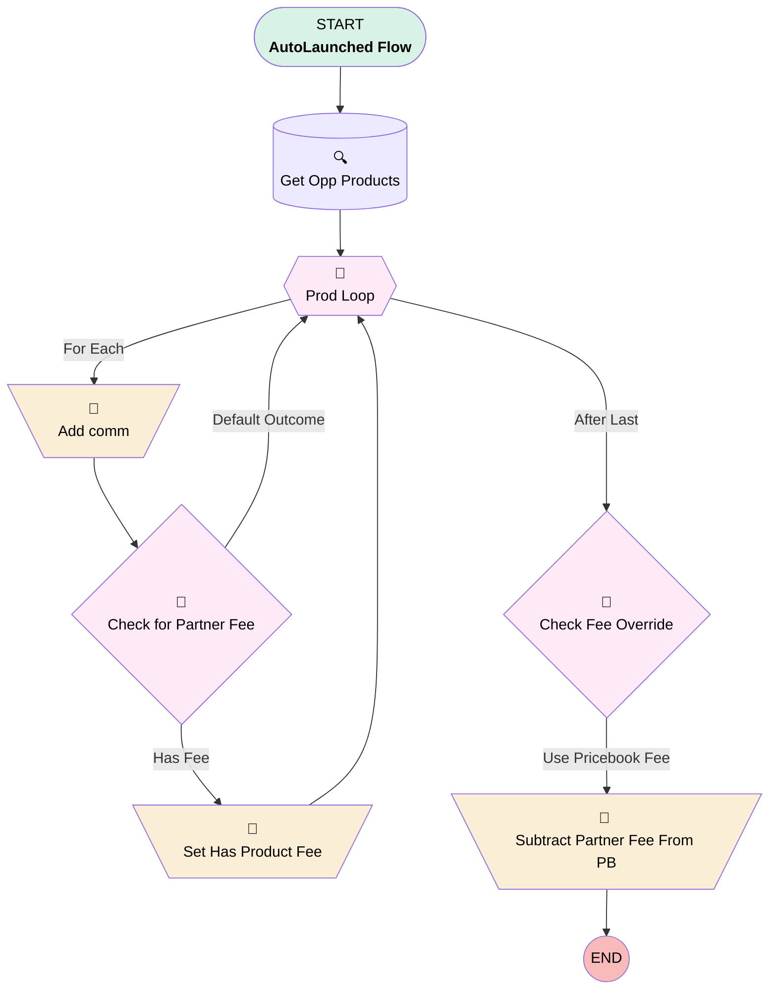

# Opportunity | Autolaunched | Calculate Commission

## Flow Diagram [(_View History_)](Opportunity_Autolaunched_Calculate_Commission-history.md)

<!-- Flow description -->

## General Information

|<!-- -->|<!-- -->|
|:---|:---|
|Process Type| Auto Launched Flow|
|Label|Opportunity | Autolaunched | Calculate Commission|
|Status|Active|
|Description|Calculates commission on opportunity by totaling commission from opp products.  Subtracts pricebook's partner fee from commission IF fee isn't being overridden by product-level fee.|
|Environments|Default|
|Interview Label|Opportunity | Autolaunched | Calculate Commission {!$Flow.CurrentDateTime}|
| Builder Type (PM)|LightningFlowBuilder|
| Canvas Mode (PM)|AUTO_LAYOUT_CANVAS|
| Origin Builder Type (PM)|LightningFlowBuilder|
|Connector|[Get_Opp_Products](#get_opp_products)|
|Next Node|[Get_Opp_Products](#get_opp_products)|

## Variables

|Name|Data Type|Is Collection|Is Input|Is Output|Object Type|Description|
|:-- |:--:|:--:|:--:|:--:|:--:|:--  |
|comm|Currency|⬜|⬜|✅|<!-- -->|<!-- -->|
|currentItem_Filter_for_prod_specific_fees|SObject|⬜|⬜|⬜|PricebookEntry|<!-- -->|
|disc|Currency|⬜|⬜|✅|<!-- -->|<!-- -->|
|hasProductFee|Boolean|⬜|⬜|⬜|<!-- -->|<!-- -->|
|oppRecord|SObject|⬜|✅|⬜|Opportunity|<!-- -->|
|partnerFee|Currency|⬜|⬜|⬜|<!-- -->|<!-- -->|

## Flow Nodes Details

### Add_comm

|<!-- -->|<!-- -->|
|:---|:---|
|Type|Assignment|
|Label|Add comm|
|Connector|[Check_for_Partner_Fee](#check_for_partner_fee)|

#### Assignments

|Assign To Reference|Operator|Value|
|:-- |:--:|:--: |
|comm| Add|Prod_Loop.Commissionable_Amount_Editable__c|
|disc| Add|Prod_Loop.Discount__c|

### Set_Has_Product_Fee

|<!-- -->|<!-- -->|
|:---|:---|
|Type|Assignment|
|Label|Set Has Product Fee|
|Connector|[Prod_Loop](#prod_loop)|

#### Assignments

|Assign To Reference|Operator|Value|
|:-- |:--:|:--: |
|hasProductFee| Assign|✅|

### Subtract_Partner_Fee_From_PB

|<!-- -->|<!-- -->|
|:---|:---|
|Type|Assignment|
|Label|Subtract Partner Fee From PB|

#### Assignments

|Assign To Reference|Operator|Value|
|:-- |:--:|:--: |
|comm| Subtract|oppRecord.Pricebook2.Partner_Fee__c|

### Check_Fee_Override

|<!-- -->|<!-- -->|
|:---|:---|
|Type|Decision|
|Label|Check Fee Override|
|Default Connector|[Subtract_Partner_Fee_From_PB](#subtract_partner_fee_from_pb)|
|Default Connector Label|Use Pricebook Fee|

#### Rule Use_Product_Fee (Use Product Fee)

|<!-- -->|<!-- -->|
|:---|:---|
|Condition Logic|and|

|Condition Id|Left Value Reference|Operator|Right Value|
|:-- |:-- |:--:|:--: |
|1|hasProductFee| Equal To|✅|

### Check_for_Partner_Fee

|<!-- -->|<!-- -->|
|:---|:---|
|Type|Decision|
|Label|Check for Partner Fee|
|Default Connector|[Prod_Loop](#prod_loop)|
|Default Connector Label|Default Outcome|

#### Rule Has_Fee (Has Fee)

|<!-- -->|<!-- -->|
|:---|:---|
|Connector|[Set_Has_Product_Fee](#set_has_product_fee)|
|Condition Logic|and|

|Condition Id|Left Value Reference|Operator|Right Value|
|:-- |:-- |:--:|:--: |
|1|Prod_Loop.PricebookEntry.Partner_Fee__c| Is Blank|⬜|

### Prod_Loop

|<!-- -->|<!-- -->|
|:---|:---|
|Type|Loop|
|Label|Prod Loop|
|Collection Reference|[Get_Opp_Products](#get_opp_products)|
|Iteration Order|Asc|
|Next Value Connector|[Add_comm](#add_comm)|
|No More Values Connector|[Check_Fee_Override](#check_fee_override)|

### Get_Opp_Products

|<!-- -->|<!-- -->|
|:---|:---|
|Type|Record Lookup|
|Object|OpportunityLineItem|
|Label|Get Opp Products|
|Assign Null Values If No Records Found|⬜|
|Get First Record Only|⬜|
|Queried Fields|- Id - Commissionable_Amount_Editable__c - PricebookEntryId - Discount__c |
|Store Output Automatically|✅|
|Connector|[Prod_Loop](#prod_loop)|

#### Filters (logic: **and**)

|Filter Id|Field|Operator|Value|
|:-- |:-- |:--:|:--: |
|1|OpportunityId| Equal To|oppRecord.Id|

___

_Documentation generated from branch monitoring_myubiquity by [sfdx-hardis](https://sfdx-hardis.cloudity.com), featuring [salesforce-flow-visualiser](https://github.com/toddhalfpenny/salesforce-flow-visualiser)_