# Opportunity | Before Create | Add Employee Referrer

## Flow Diagram [(_View History_)](Opportunity_Before_Create_Add_Employee_Referrer-history.md)

```mermaid
%% If you read this, your Markdown visualizer does not handle MermaidJS syntax.
%% - If you are in VS Code, install extension `Markdown Preview Mermaid Support` at https://marketplace.visualstudio.com/items?itemName=bierner.markdown-mermaid
%% - If you are using sfdx-hardis, try to define env variable `MERMAID_MODES=cli,docker` ,then run again the command to regenerate markdown with SVG images.
%% - If you are within mkdocs-material, define mermaid plugin in `mkdocs.yml` as described in https://squidfunk.github.io/mkdocs-material/extensions/mermaid/
%% - As a last resort, you can copy-paste this MermaidJS code into https://mermaid.live/ to see the flow diagram

flowchart TB
START(["START<br/><b>AutoLaunched Flow</b></br>Type: <b> Record Before Save</b>"]):::startClass
click START "#general-information" "1194139464"

Get_Emp_Contact[("🔍 <em></em><br/>Get Emp Contact")]:::recordLookups
click Get_Emp_Contact "#get_emp_contact" "494616330"

Add_Emp_Referrer[("🛠️ <em></em><br/>Add Emp Referrer")]:::recordUpdates
click Add_Emp_Referrer "#add_emp_referrer" "4002438798"

Get_Emp_Contact --> Add_Emp_Referrer
Add_Emp_Referrer --> END_Add_Emp_Referrer
START -->  Get_Emp_Contact
END_Add_Emp_Referrer(( END )):::endClass


classDef actionCalls fill:#D4E4FC,color:black,text-decoration:none,max-height:100px
classDef assignments fill:#FBEED7,color:black,text-decoration:none,max-height:100px
classDef collectionProcessors fill:#F0E3FA,color:black,text-decoration:none,max-height:100px
classDef customErrors fill:#FFE9E9,color:black,text-decoration:none,max-height:100px
classDef decisions fill:#FDEAF6,color:black,text-decoration:none,max-height:100px
classDef loops fill:#FDEAF6,color:black,text-decoration:none,max-height:100px
classDef recordCreates fill:#FFF8C9,color:black,text-decoration:none,max-height:100px
classDef recordDeletes fill:#FFF8C9,color:black,text-decoration:none,max-height:100px
classDef recordLookups fill:#EDEAFF,color:black,text-decoration:none,max-height:100px
classDef recordUpdates fill:#FFF8C9,color:black,text-decoration:none,max-height:100px
classDef screens fill:#DFF6FF,color:black,text-decoration:none,max-height:100px
classDef subflows fill:#D4E4FC,color:black,text-decoration:none,max-height:100px
classDef startClass fill:#D9F2E6,color:black,text-decoration:none,max-height:100px
classDef endClass fill:#F9BABA,color:black,text-decoration:none,max-height:100px
classDef transforms fill:#FDEAF6,color:black,text-decoration:none,max-height:100px


```

<!-- Flow description -->

## General Information

|<!-- -->|<!-- -->|
|:---|:---|
|Object|Opportunity|
|Process Type| Auto Launched Flow|
|Trigger Type| Record Before Save|
|Record Trigger Type| Create|
|Label|Opportunity | Before Create | Add Employee Referrer|
|Status|Active|
|Environments|Default|
|Interview Label|Opportunity | Before Create | Add Employee Referrer {!$Flow.CurrentDateTime}|
| Builder Type (PM)|LightningFlowBuilder|
| Canvas Mode (PM)|AUTO_LAYOUT_CANVAS|
| Origin Builder Type (PM)|LightningFlowBuilder|
|Connector|[Get_Emp_Contact](#get_emp_contact)|
|Next Node|[Get_Emp_Contact](#get_emp_contact)|

#### Filters (logic: **and**)

|Filter Id|Field|Operator|Value|
|:-- |:-- |:--:|:--: |
|1|LeadSourceDetail__c| Equal To|Ubiquity Employee|
|2|Referrer_s_Email__c| Is Null|<!-- -->|

## Flow Nodes Details

### Get_Emp_Contact

|<!-- -->|<!-- -->|
|:---|:---|
|Type|Record Lookup|
|Object|Contact|
|Label|Get Emp Contact|
|Assign Null Values If No Records Found|⬜|
|Get First Record Only|✅|
|Store Output Automatically|✅|
|Connector|[Add_Emp_Referrer](#add_emp_referrer)|

#### Filters (logic: **or**)

|Filter Id|Field|Operator|Value|
|:-- |:-- |:--:|:--: |
|1|Email| Equal To|$Record.Referrer_s_Email__c|
|2|Employee_Email__c| Equal To|$Record.Referrer_s_Email__c|

### Add_Emp_Referrer

|<!-- -->|<!-- -->|
|:---|:---|
|Type|Record Update|
|Label|Add Emp Referrer|
|Input Reference|$Record|

#### Input Assignments

|Field|Value|
|:-- |:--: |
|Ubiquity_Employee_Referred__c|Get_Emp_Contact.Id|

___

_Documentation generated from branch monitoring_myubiquity by [sfdx-hardis](https://sfdx-hardis.cloudity.com), featuring [salesforce-flow-visualiser](https://github.com/toddhalfpenny/salesforce-flow-visualiser)_