# Opportunity | Before Delete | Update Forecast

## Flow Diagram [(_View History_)](Opportunity_Before_Delete_Update_Forecast-history.md)

```mermaid
%% If you read this, your Markdown visualizer does not handle MermaidJS syntax.
%% - If you are in VS Code, install extension `Markdown Preview Mermaid Support` at https://marketplace.visualstudio.com/items?itemName=bierner.markdown-mermaid
%% - If you are using sfdx-hardis, try to define env variable `MERMAID_MODES=cli,docker` ,then run again the command to regenerate markdown with SVG images.
%% - If you are within mkdocs-material, define mermaid plugin in `mkdocs.yml` as described in https://squidfunk.github.io/mkdocs-material/extensions/mermaid/
%% - As a last resort, you can copy-paste this MermaidJS code into https://mermaid.live/ to see the flow diagram

flowchart TB
START(["START<br/><b>AutoLaunched Flow</b></br>Type: <b> Record Before Delete</b>"]):::startClass
click START "#general-information" "2217859054"

Define_Forecast2Update[\"🟰 <em></em><br/>Define Forecast2Update"/]:::assignments
click Define_Forecast2Update "#define_forecast2update" "1689143208"

Subtract_Opp_Values[\"🟰 <em></em><br/>Subtract Opp Values"/]:::assignments
click Subtract_Opp_Values "#subtract_opp_values" "1411282676"

Update_Forecast2Update[("🛠️ <em></em><br/>Update Forecast2Update")]:::recordUpdates
click Update_Forecast2Update "#update_forecast2update" "2867240908"

Define_Forecast2Update --> Subtract_Opp_Values
Subtract_Opp_Values --> Update_Forecast2Update
Update_Forecast2Update --> END_Update_Forecast2Update
START -->  Define_Forecast2Update
END_Update_Forecast2Update(( END )):::endClass


classDef actionCalls fill:#D4E4FC,color:black,text-decoration:none,max-height:100px
classDef assignments fill:#FBEED7,color:black,text-decoration:none,max-height:100px
classDef collectionProcessors fill:#F0E3FA,color:black,text-decoration:none,max-height:100px
classDef customErrors fill:#FFE9E9,color:black,text-decoration:none,max-height:100px
classDef decisions fill:#FDEAF6,color:black,text-decoration:none,max-height:100px
classDef loops fill:#FDEAF6,color:black,text-decoration:none,max-height:100px
classDef recordCreates fill:#FFF8C9,color:black,text-decoration:none,max-height:100px
classDef recordDeletes fill:#FFF8C9,color:black,text-decoration:none,max-height:100px
classDef recordLookups fill:#EDEAFF,color:black,text-decoration:none,max-height:100px
classDef recordUpdates fill:#FFF8C9,color:black,text-decoration:none,max-height:100px
classDef screens fill:#DFF6FF,color:black,text-decoration:none,max-height:100px
classDef subflows fill:#D4E4FC,color:black,text-decoration:none,max-height:100px
classDef startClass fill:#D9F2E6,color:black,text-decoration:none,max-height:100px
classDef endClass fill:#F9BABA,color:black,text-decoration:none,max-height:100px
classDef transforms fill:#FDEAF6,color:black,text-decoration:none,max-height:100px


```

<!-- Flow description -->

## General Information

|<!-- -->|<!-- -->|
|:---|:---|
|Object|Opportunity|
|Process Type| Auto Launched Flow|
|Trigger Type| Record Before Delete|
|Record Trigger Type| Delete|
|Label|Opportunity | Before Delete | Update Forecast|
|Status|⚠️ Draft|
|Environments|Default|
|Interview Label|Opportunity | Before Delete | Update Forecast {!$Flow.CurrentDateTime}|
| Builder Type (PM)|LightningFlowBuilder|
| Canvas Mode (PM)|AUTO_LAYOUT_CANVAS|
| Origin Builder Type (PM)|LightningFlowBuilder|
|Connector|[Define_Forecast2Update](#define_forecast2update)|
|Next Node|[Define_Forecast2Update](#define_forecast2update)|

#### Filters (logic: **and**)

|Filter Id|Field|Operator|Value|
|:-- |:-- |:--:|:--: |
|1|StageName| Equal To|Closed Won|
|2|Forecast__c| Not Equal To|stringValue: '' |

## Variables

|Name|Data Type|Is Collection|Is Input|Is Output|Object Type|Description|
|:-- |:--:|:--:|:--:|:--:|:--:|:--  |
|Forecast2Update|SObject|⬜|⬜|⬜|Forecast__c|<!-- -->|

## Flow Nodes Details

### Define_Forecast2Update

|<!-- -->|<!-- -->|
|:---|:---|
|Type|Assignment|
|Label|Define Forecast2Update|
|Connector|[Subtract_Opp_Values](#subtract_opp_values)|

#### Assignments

|Assign To Reference|Operator|Value|
|:-- |:--:|:--: |
|Forecast2Update.Id| Assign|$Record.Forecast__c|
|Forecast2Update.Actual_Revenue__c| Assign|$Record.Forecast__r.Actual_Revenue__c|
|Forecast2Update.Actual_Plan_Sales__c| Assign|$Record.Forecast__r.Actual_Plan_Sales__c|

### Subtract_Opp_Values

|<!-- -->|<!-- -->|
|:---|:---|
|Type|Assignment|
|Label|Subtract Opp Values|
|Connector|[Update_Forecast2Update](#update_forecast2update)|

#### Assignments

|Assign To Reference|Operator|Value|
|:-- |:--:|:--: |
|Forecast2Update.Actual_Revenue__c| Subtract|$Record.Amount|
|Forecast2Update.Actual_Plan_Sales__c| Subtract|1|

### Update_Forecast2Update

|<!-- -->|<!-- -->|
|:---|:---|
|Type|Record Update|
|Label|Update Forecast2Update|
|Input Reference|Forecast2Update|

___

_Documentation generated from branch monitoring_myubiquity by [sfdx-hardis](https://sfdx-hardis.cloudity.com), featuring [salesforce-flow-visualiser](https://github.com/toddhalfpenny/salesforce-flow-visualiser)_