# Opportunity | Button | Create OPD

## Flow Diagram [(_View History_)](Opportunity_Button_Create_OPD-history.md)

```mermaid
%% If you read this, your Markdown visualizer does not handle MermaidJS syntax.
%% - If you are in VS Code, install extension `Markdown Preview Mermaid Support` at https://marketplace.visualstudio.com/items?itemName=bierner.markdown-mermaid
%% - If you are using sfdx-hardis, try to define env variable `MERMAID_MODES=cli,docker` ,then run again the command to regenerate markdown with SVG images.
%% - If you are within mkdocs-material, define mermaid plugin in `mkdocs.yml` as described in https://squidfunk.github.io/mkdocs-material/extensions/mermaid/
%% - As a last resort, you can copy-paste this MermaidJS code into https://mermaid.live/ to see the flow diagram

flowchart TB
START(["START<br/><b>Screen Flow</b>"]):::startClass
click START "#general-information" "1186826909"

Go_to_OPD("⚡ <em></em><br/>Go to OPD"):::actionCalls
click Go_to_OPD "#go_to_opd" "1224061619"

Copy_1_of_Validation_Error_Message[\"🟰 <em></em><br/>Copy 1 of Validation Error Message"/]:::assignments
click Copy_1_of_Validation_Error_Message "#copy_1_of_validation_error_message" "3281983139"

Validation_Error_Message[\"🟰 <em></em><br/>Validation Error Message"/]:::assignments
click Validation_Error_Message "#validation_error_message" "551312391"

Create_OPD[("➕ <em></em><br/>Create OPD")]:::recordCreates
click Create_OPD "#create_opd" "3545309303"

Get_Opp[("🔍 <em></em><br/>Get Opp")]:::recordLookups
click Get_Opp "#get_opp" "2266107189"

Update_Opp[("🛠️ <em></em><br/>Update Opp")]:::recordUpdates
click Update_Opp "#update_opp" "760455315"

New_OPD(["💻 <em></em><br/>New OPD"]):::screens
click New_OPD "#new_opd" "2306609774"

Go_to_OPD --> END_Go_to_OPD
Copy_1_of_Validation_Error_Message --> New_OPD
Validation_Error_Message --> New_OPD
Create_OPD --> Go_to_OPD
Create_OPD -. Fault .->Validation_Error_Message
Get_Opp --> New_OPD
Update_Opp --> Create_OPD
Update_Opp -. Fault .->Copy_1_of_Validation_Error_Message
New_OPD --> Update_Opp
START -->  Get_Opp
END_Go_to_OPD(( END )):::endClass


classDef actionCalls fill:#D4E4FC,color:black,text-decoration:none,max-height:100px
classDef assignments fill:#FBEED7,color:black,text-decoration:none,max-height:100px
classDef collectionProcessors fill:#F0E3FA,color:black,text-decoration:none,max-height:100px
classDef customErrors fill:#FFE9E9,color:black,text-decoration:none,max-height:100px
classDef decisions fill:#FDEAF6,color:black,text-decoration:none,max-height:100px
classDef loops fill:#FDEAF6,color:black,text-decoration:none,max-height:100px
classDef recordCreates fill:#FFF8C9,color:black,text-decoration:none,max-height:100px
classDef recordDeletes fill:#FFF8C9,color:black,text-decoration:none,max-height:100px
classDef recordLookups fill:#EDEAFF,color:black,text-decoration:none,max-height:100px
classDef recordUpdates fill:#FFF8C9,color:black,text-decoration:none,max-height:100px
classDef screens fill:#DFF6FF,color:black,text-decoration:none,max-height:100px
classDef subflows fill:#D4E4FC,color:black,text-decoration:none,max-height:100px
classDef startClass fill:#D9F2E6,color:black,text-decoration:none,max-height:100px
classDef endClass fill:#F9BABA,color:black,text-decoration:none,max-height:100px
classDef transforms fill:#FDEAF6,color:black,text-decoration:none,max-height:100px


```

<!-- Flow description -->

## General Information

|<!-- -->|<!-- -->|
|:---|:---|
|Process Type| Flow|
|Label|Opportunity | Button | Create OPD|
|Status|Obsolete|
|Environments|Default|
|Interview Label|Opportunity | Button | Create OPD {!$Flow.CurrentDateTime}|
| Builder Type (PM)|LightningFlowBuilder|
| Canvas Mode (PM)|AUTO_LAYOUT_CANVAS|
| Origin Builder Type (PM)|LightningFlowBuilder|
|Connector|[Get_Opp](#get_opp)|
|Next Node|[Get_Opp](#get_opp)|

## Variables

|Name|Data Type|Is Collection|Is Input|Is Output|Object Type|Description|
|:-- |:--:|:--:|:--:|:--:|:--:|:--  |
|hitValidationError|Boolean|⬜|✅|⬜|<!-- -->|<!-- -->|
|recordId|String|⬜|✅|⬜|<!-- -->|<!-- -->|

## Formulas

|Name|Data Type|Expression|Description|
|:-- |:--:|:-- |:--  |
|validationMessage|String|IF(FIND("FIELD_CUSTOM_VALIDATION_EXCEPTION:", {!$Flow.FaultMessage}) != 0, (MID({!$Flow.FaultMessage}, FIND("FIELD_CUSTOM_VALIDATION_EXCEPTION:", {!$Flow.FaultMessage})+34, FIND("You can look up ExceptionCode values",{!$Flow.FaultMessage})-34-FIND("FIELD_CUSTOM_VALIDATION_EXCEPTION:", {!$Flow.FaultMessage}))), {!$Flow.FaultMessage})|<!-- -->|

## Flow Nodes Details

### Go_to_OPD

|<!-- -->|<!-- -->|
|:---|:---|
|Type|Action Call|
|Label|Go to OPD|
|Action Type|Component|
|Action Name|ecflc:flowIdRedirect|
|Flow Transaction Model|CurrentTransaction|
|Name Segment|ecflc:flowIdRedirect|
|Store Output Automatically|✅|
|Record Id (input)|[Create_OPD](#create_opd)|

### Copy_1_of_Validation_Error_Message

|<!-- -->|<!-- -->|
|:---|:---|
|Type|Assignment|
|Label|Copy 1 of Validation Error Message|
|Connector|isGoTo: true targetReference: New_OPD |

#### Assignments

|Assign To Reference|Operator|Value|
|:-- |:--:|:--: |
|hitValidationError| Assign|✅|

### Validation_Error_Message

|<!-- -->|<!-- -->|
|:---|:---|
|Type|Assignment|
|Label|Validation Error Message|
|Connector|isGoTo: true targetReference: New_OPD |

#### Assignments

|Assign To Reference|Operator|Value|
|:-- |:--:|:--: |
|hitValidationError| Assign|✅|

### Create_OPD

|<!-- -->|<!-- -->|
|:---|:---|
|Type|Record Create|
|Object|Proposal__c|
|Label|Create OPD|
|Fault Connector|[Validation_Error_Message](#validation_error_message)|
|Store Output Automatically|✅|
|Connector|[Go_to_OPD](#go_to_opd)|

#### Input Assignments

|Field|Value|
|:-- |:--: |
|Any_Current_Legal_Proceedings__c|Does_the_Company_have_any_current_legal_proceedings|
|Auto_Enrollment_Deferral_Escalation_Rate__c|Get_Opp.Auto_Enrollment_Deferral_Escalation_Rate__c|
|Auto_Enrollment__c|Get_Opp.AutoEnrollment__c|
|Brokerage_Accounts_PCRA__c|Get_Opp.Brokerage_Accounts_PCRA__c|
|Controlled_Affiliated_Group_Company_Name__c|If_Yes_Provide_the_Company_Name|
|Current_Recent_SIMPLE_Plan__c|Current_Recent_SIMPLE_Plan|
|Current_Sponsor_of_Other_Plans__c|Do_You_Currently_Sponsor_any_other_retirement_Plans|
|Custodian__c|Get_Opp.Custodian__c|
|Discretionary_Match__c|Get_Opp.Discretionary_Match__c|
|Eligibility_Age__c|Get_Opp.Eligibility_Age__c|
|Fund_List__c|Get_Opp.Fund_List__c|
|Government_Entity__c|Government_Entity|
|Grandfather_Date__c|Grandfather_Date|
|Hardships__c|Get_Opp.Hardships__c|
|Include_Company_in_UBQT_Plan__c|Include_Company_in_UBQT_Plan|
|Legal_Proceeding_Explanation__c|Legal_Proceeding_Explanation|
|Loans__c|Get_Opp.Loans__c|
|Longer_than_12_Months_with_Zero_Assets__c|Longer_than_12_Months_with_Zero_Assets|
|OPD_Notes__c|Get_Opp.Opportunity_Notes__c|
|OPD_Status__c|Created|
|Opportunity__c|Get_Opp.Id|
|Part_of_Controlled_or_Affiliated_Group__c|Part_of_Controlled_or_Affiliated_Group|
|Plan_Eligibility__c|Get_Opp.Plan_Eligibility__c|
|Plan_Entry_Frequency__c|Get_Opp.Plan_Entry_Frequency__c|
|Previously_Sponsored_401_k_Plan__c|Previously_Sponsored_401_k_Plan|
|Product_Type__c|Get_Opp.Product_Type__c|
|Profit_Sharing_Match_Vesting_Schedule__c|Get_Opp.Profit_Sharing_Match_Vesting_Schedule__c|
|Profit_Sharing__c|Get_Opp.Profit_Sharing__c|
|Publicly_Traded__c|Publicly_Traded|
|QACA_Safe_Harbor_Vesting_Schedule__c|Get_Opp.QACA_Safe_Harbor_Vesting_Schedule__c|
|RecordTypeId|0121G000000AjeLQAS|
|Roth_Contributions__c|Get_Opp.Roth__c|
|Safe_Harbor_Match_Determination_Period__c|Get_Opp.Safe_Harbor_Match_Determination_Period__c|
|Safe_Harbor__c|Get_Opp.Safe_Harbor__c|
|Service_Option__c|Get_Opp.Service_Option__c|
|Type_of_Current_Legal_Proceedings__c|If_Yes_which_of_the_following|
|X3_38__c|Get_Opp.X3_38__c|

### Get_Opp

|<!-- -->|<!-- -->|
|:---|:---|
|Type|Record Lookup|
|Object|Opportunity|
|Label|Get Opp|
|Assign Null Values If No Records Found|⬜|
|Get First Record Only|✅|
|Store Output Automatically|✅|
|Connector|[New_OPD](#new_opd)|

#### Filters (logic: **and**)

|Filter Id|Field|Operator|Value|
|:-- |:-- |:--:|:--: |
|1|Id| Equal To|recordId|

### Update_Opp

|<!-- -->|<!-- -->|
|:---|:---|
|Type|Record Update|
|Object|Opportunity|
|Label|Update Opp|
|Fault Connector|[Copy_1_of_Validation_Error_Message](#copy_1_of_validation_error_message)|
|Connector|[Create_OPD](#create_opd)|

#### Filters (logic: **and**)

|Filter Id|Field|Operator|Value|
|:-- |:-- |:--:|:--: |
|1|Id| Equal To|Get_Opp.Id|

#### Input Assignments

|Field|Value|
|:-- |:--: |
|AutoEnrollment__c|Get_Opp.AutoEnrollment__c|
|Auto_Enrollment_Deferral_Escalation_Rate__c|Get_Opp.Auto_Enrollment_Deferral_Escalation_Rate__c|
|Brokerage_Accounts_PCRA__c|Get_Opp.Brokerage_Accounts_PCRA__c|
|Custodian__c|Get_Opp.Custodian__c|
|Discretionary_Match__c|Get_Opp.Discretionary_Match__c|
|Eligibility_Age__c|Get_Opp.Eligibility_Age__c|
|Fund_List__c|Get_Opp.Fund_List__c|
|Hardships__c|Get_Opp.Hardships__c|
|Loans__c|Get_Opp.Loans__c|
|Opportunity_Notes__c|Get_Opp.Opportunity_Notes__c|
|Plan_Eligibility__c|Get_Opp.Plan_Eligibility__c|
|Plan_Entry_Frequency__c|Get_Opp.Plan_Entry_Frequency__c|
|Product_Type__c|Get_Opp.Product_Type__c|
|Profit_Sharing_Match_Vesting_Schedule__c|Get_Opp.Profit_Sharing_Match_Vesting_Schedule__c|
|Profit_Sharing__c|Get_Opp.Profit_Sharing__c|
|QACA_Safe_Harbor_Vesting_Schedule__c|Get_Opp.QACA_Safe_Harbor_Vesting_Schedule__c|
|Roth__c|Get_Opp.Roth__c|
|Safe_Harbor_Match_Determination_Period__c|Get_Opp.Safe_Harbor_Match_Determination_Period__c|
|Safe_Harbor__c|Get_Opp.Safe_Harbor__c|
|Service_Option__c|Get_Opp.Service_Option__c|
|X3_38__c|Get_Opp.X3_38__c|

### New_OPD

|<!-- -->|<!-- -->|
|:---|:---|
|Type|Screen|
|Label|New OPD|
|Allow Back|⬜|
|Allow Finish|✅|
|Allow Pause|⬜|
|Next Or Finish Button Label|Create OPD|
|Show Footer|✅|
|Show Header|⬜|
|Connector|[Update_Opp](#update_opp)|

#### qacaMismatchWarning

|<!-- -->|<!-- -->|
|:---|:---|
|Field Text|
{!$Label.FlowStyles_ErrorNotification}

{!validationMessage}
|
|Field Type| Display Text|
|Style Properties|verticalAlignment: &nbsp;&nbsp;stringValue: top width: &nbsp;&nbsp;stringValue: 12 |
|Visibility Rule|conditionLogic: and conditions: &nbsp;&nbsp;leftValueReference: hitValidationError &nbsp;&nbsp;operator: EqualTo &nbsp;&nbsp;rightValue: &nbsp;&nbsp;&nbsp;&nbsp;booleanValue: true |

#### Current_Recent_SIMPLE_Plan

|<!-- -->|<!-- -->|
|:---|:---|
|Data Type|String|
|Choice References|CurrentSIMPLE|
|Default Value|No|
|Field Text|Have you had a SIMPLE Plan this calendar year?|
|Field Type| Dropdown Box|
|Inputs On Next Nav To Assoc Scrn| Use Stored Values|
|Is Required|⬜|
|Style Properties|verticalAlignment: &nbsp;&nbsp;stringValue: top width: &nbsp;&nbsp;stringValue: 12 |
|Parent Field|[New_OPD_Section1_Column1](#new_opd_section1_column1)|

#### Previously_Sponsored_401_k_Plan

|<!-- -->|<!-- -->|
|:---|:---|
|Data Type|String|
|Choice References|Previous401Sponsor|
|Default Value|No|
|Field Text|Have you previously sponsored 401(k) plan?|
|Field Type| Dropdown Box|
|Inputs On Next Nav To Assoc Scrn| Use Stored Values|
|Is Required|⬜|
|Style Properties|verticalAlignment: &nbsp;&nbsp;stringValue: top width: &nbsp;&nbsp;stringValue: 12 |
|Parent Field|[New_OPD_Section1_Column1](#new_opd_section1_column1)|

#### Longer_than_12_Months_with_Zero_Assets

|<!-- -->|<!-- -->|
|:---|:---|
|Data Type|String|
|Choice References|TwelveMonthsZeroAssets|
|Field Text|If Yes, has it been longer than 12 months with zero assets|
|Field Type| Dropdown Box|
|Inputs On Next Nav To Assoc Scrn| Use Stored Values|
|Is Required|⬜|
|Style Properties|verticalAlignment: &nbsp;&nbsp;stringValue: top width: &nbsp;&nbsp;stringValue: 12 |
|Parent Field|[New_OPD_Section1_Column1](#new_opd_section1_column1)|

#### Grandfather_Date

|<!-- -->|<!-- -->|
|:---|:---|
|Data Type|Date|
|Field Text|Grandfather Date|
|Field Type| Input Field|
|Inputs On Next Nav To Assoc Scrn| Use Stored Values|
|Is Required|⬜|
|Style Properties|verticalAlignment: &nbsp;&nbsp;stringValue: top width: &nbsp;&nbsp;stringValue: 12 |
|Parent Field|[New_OPD_Section1_Column1](#new_opd_section1_column1)|

#### New_OPD_Section1_Column1

|<!-- -->|<!-- -->|
|:---|:---|
|Field Type| Region|
|Is Required|⬜|
|Parent Field|[New_OPD_Section1](#new_opd_section1)|
|Width (input)|6|

#### Do_You_Currently_Sponsor_any_other_retirement_Plans

|<!-- -->|<!-- -->|
|:---|:---|
|Data Type|String|
|Choice References|CurrentSponsorOtherPlans|
|Default Value|No|
|Field Text|Do you currently sponsor any other retirement plans?|
|Field Type| Dropdown Box|
|Inputs On Next Nav To Assoc Scrn| Use Stored Values|
|Is Required|⬜|
|Style Properties|verticalAlignment: &nbsp;&nbsp;stringValue: top width: &nbsp;&nbsp;stringValue: 12 |
|Parent Field|[New_OPD_Section1_Column2](#new_opd_section1_column2)|

#### Part_of_Controlled_or_Affiliated_Group

|<!-- -->|<!-- -->|
|:---|:---|
|Data Type|String|
|Choice References|ControlledAffiliatedGroup|
|Field Text|If Yes, is that plan a part of controlled or affiliated group|
|Field Type| Dropdown Box|
|Inputs On Next Nav To Assoc Scrn| Use Stored Values|
|Is Required|⬜|
|Style Properties|verticalAlignment: &nbsp;&nbsp;stringValue: top width: &nbsp;&nbsp;stringValue: 12 |
|Parent Field|[New_OPD_Section1_Column2](#new_opd_section1_column2)|

#### Include_Company_in_UBQT_Plan

|<!-- -->|<!-- -->|
|:---|:---|
|Data Type|String|
|Choice References|IncludeinUBQTPlan|
|Field Text|Will you include that company in Ubiquity Plan?|
|Field Type| Dropdown Box|
|Inputs On Next Nav To Assoc Scrn| Use Stored Values|
|Is Required|⬜|
|Style Properties|verticalAlignment: &nbsp;&nbsp;stringValue: top width: &nbsp;&nbsp;stringValue: 12 |
|Parent Field|[New_OPD_Section1_Column2](#new_opd_section1_column2)|

#### If_Yes_Provide_the_Company_Name

|<!-- -->|<!-- -->|
|:---|:---|
|Data Type|String|
|Field Text|If Yes, provide the company name|
|Field Type| Input Field|
|Inputs On Next Nav To Assoc Scrn| Use Stored Values|
|Is Required|⬜|
|Style Properties|verticalAlignment: &nbsp;&nbsp;stringValue: top width: &nbsp;&nbsp;stringValue: 12 |
|Parent Field|[New_OPD_Section1_Column2](#new_opd_section1_column2)|

#### Publicly_Traded

|<!-- -->|<!-- -->|
|:---|:---|
|Data Type|String|
|Choice References|Public|
|Default Value|No|
|Field Text|Publicly Traded?|
|Field Type| Dropdown Box|
|Inputs On Next Nav To Assoc Scrn| Use Stored Values|
|Is Required|⬜|
|Style Properties|verticalAlignment: &nbsp;&nbsp;stringValue: top width: &nbsp;&nbsp;stringValue: 12 |
|Visibility Rule|conditionLogic: and conditions: &nbsp;&nbsp;leftValueReference: Get_Opp.Account.Connected_Partner__c &nbsp;&nbsp;operator: Contains &nbsp;&nbsp;rightValue: &nbsp;&nbsp;&nbsp;&nbsp;stringValue: Schwab |
|Parent Field|[New_OPD_Section1_Column2](#new_opd_section1_column2)|

#### Government_Entity

|<!-- -->|<!-- -->|
|:---|:---|
|Data Type|String|
|Choice References|Government|
|Default Value|No|
|Field Text|Government Entity?|
|Field Type| Dropdown Box|
|Inputs On Next Nav To Assoc Scrn| Use Stored Values|
|Is Required|⬜|
|Style Properties|verticalAlignment: &nbsp;&nbsp;stringValue: top width: &nbsp;&nbsp;stringValue: 12 |
|Visibility Rule|conditionLogic: and conditions: &nbsp;&nbsp;leftValueReference: Get_Opp.Account.Connected_Partner__c &nbsp;&nbsp;operator: Contains &nbsp;&nbsp;rightValue: &nbsp;&nbsp;&nbsp;&nbsp;stringValue: Schwab |
|Parent Field|[New_OPD_Section1_Column2](#new_opd_section1_column2)|

#### Does_the_Company_have_any_current_legal_proceedings

|<!-- -->|<!-- -->|
|:---|:---|
|Data Type|String|
|Choice References|CurrentLegalProceedings|
|Default Value|No|
|Field Text|Does the company have any current legal proceedings?|
|Field Type| Dropdown Box|
|Inputs On Next Nav To Assoc Scrn| Use Stored Values|
|Is Required|⬜|
|Style Properties|verticalAlignment: &nbsp;&nbsp;stringValue: top width: &nbsp;&nbsp;stringValue: 12 |
|Visibility Rule|conditionLogic: and conditions: &nbsp;&nbsp;leftValueReference: Get_Opp.Account.Connected_Partner__c &nbsp;&nbsp;operator: Contains &nbsp;&nbsp;rightValue: &nbsp;&nbsp;&nbsp;&nbsp;stringValue: Schwab |
|Parent Field|[New_OPD_Section1_Column2](#new_opd_section1_column2)|

#### If_Yes_which_of_the_following

|<!-- -->|<!-- -->|
|:---|:---|
|Data Type|String|
|Choice References|FollowingLegalProceeding|
|Field Text|If Yes, which of the following?|
|Field Type| Dropdown Box|
|Inputs On Next Nav To Assoc Scrn| Use Stored Values|
|Is Required|⬜|
|Style Properties|verticalAlignment: &nbsp;&nbsp;stringValue: top width: &nbsp;&nbsp;stringValue: 12 |
|Visibility Rule|conditionLogic: and conditions: &nbsp;&nbsp;leftValueReference: Get_Opp.Account.Connected_Partner__c &nbsp;&nbsp;operator: Contains &nbsp;&nbsp;rightValue: &nbsp;&nbsp;&nbsp;&nbsp;stringValue: Schwab |
|Parent Field|[New_OPD_Section1_Column2](#new_opd_section1_column2)|

#### Legal_Proceeding_Explanation

|<!-- -->|<!-- -->|
|:---|:---|
|Field Text|Legal Proceeding Explanation|
|Field Type| Large Text Area|
|Inputs On Next Nav To Assoc Scrn| Use Stored Values|
|Is Required|⬜|
|Style Properties|verticalAlignment: &nbsp;&nbsp;stringValue: top width: &nbsp;&nbsp;stringValue: 12 |
|Visibility Rule|conditionLogic: and conditions: &nbsp;&nbsp;leftValueReference: Get_Opp.Account.Connected_Partner__c &nbsp;&nbsp;operator: Contains &nbsp;&nbsp;rightValue: &nbsp;&nbsp;&nbsp;&nbsp;stringValue: Schwab |
|Parent Field|[New_OPD_Section1_Column2](#new_opd_section1_column2)|

#### New_OPD_Section1_Column2

|<!-- -->|<!-- -->|
|:---|:---|
|Field Type| Region|
|Is Required|⬜|
|Parent Field|[New_OPD_Section1](#new_opd_section1)|
|Width (input)|6|

#### New_OPD_Section1

|<!-- -->|<!-- -->|
|:---|:---|
|Field Type| Region Container|
|Is Required|⬜|
|Region Container Type| Section Without Header|
|Style Properties|verticalAlignment: &nbsp;&nbsp;stringValue: top width: &nbsp;&nbsp;stringValue: 12 |

#### Confirm

|<!-- -->|<!-- -->|
|:---|:---|
|Field Text|
<strong>Confirm Plan Provisions</strong>
|
|Field Type| Display Text|
|Style Properties|verticalAlignment: &nbsp;&nbsp;stringValue: top width: &nbsp;&nbsp;stringValue: 12 |

#### Get_Opp.Product_Type__c

|<!-- -->|<!-- -->|
|:---|:---|
|Field Type| Object Provided|
|Inputs On Next Nav To Assoc Scrn| Use Stored Values|
|Is Required|⬜|
|Object Field Reference|Get_Opp.Product_Type__c|
|Style Properties|verticalAlignment: &nbsp;&nbsp;stringValue: top width: &nbsp;&nbsp;stringValue: 12 |
|Parent Field|[New_OPD_Section2_Column1](#new_opd_section2_column1)|

#### Get_Opp.Plan_Eligibility__c

|<!-- -->|<!-- -->|
|:---|:---|
|Field Type| Object Provided|
|Inputs On Next Nav To Assoc Scrn| Use Stored Values|
|Is Required|⬜|
|Object Field Reference|Get_Opp.Plan_Eligibility__c|
|Style Properties|verticalAlignment: &nbsp;&nbsp;stringValue: top width: &nbsp;&nbsp;stringValue: 12 |
|Parent Field|[New_OPD_Section2_Column1](#new_opd_section2_column1)|

#### Get_Opp.Plan_Entry_Frequency__c

|<!-- -->|<!-- -->|
|:---|:---|
|Field Type| Object Provided|
|Inputs On Next Nav To Assoc Scrn| Use Stored Values|
|Is Required|⬜|
|Object Field Reference|Get_Opp.Plan_Entry_Frequency__c|
|Style Properties|verticalAlignment: &nbsp;&nbsp;stringValue: top width: &nbsp;&nbsp;stringValue: 12 |
|Parent Field|[New_OPD_Section2_Column1](#new_opd_section2_column1)|

#### Get_Opp.AutoEnrollment__c

|<!-- -->|<!-- -->|
|:---|:---|
|Field Type| Object Provided|
|Inputs On Next Nav To Assoc Scrn| Use Stored Values|
|Is Required|⬜|
|Object Field Reference|Get_Opp.AutoEnrollment__c|
|Style Properties|verticalAlignment: &nbsp;&nbsp;stringValue: top width: &nbsp;&nbsp;stringValue: 12 |
|Visibility Rule|conditionLogic: and conditions: &nbsp;&nbsp;leftValueReference: Get_Opp.Service_Option__c &nbsp;&nbsp;operator: NotEqualTo &nbsp;&nbsp;rightValue: &nbsp;&nbsp;&nbsp;&nbsp;stringValue: Saver(k) |
|Parent Field|[New_OPD_Section2_Column1](#new_opd_section2_column1)|

#### Get_Opp.Profit_Sharing__c

|<!-- -->|<!-- -->|
|:---|:---|
|Field Type| Object Provided|
|Inputs On Next Nav To Assoc Scrn| Use Stored Values|
|Is Required|⬜|
|Object Field Reference|Get_Opp.Profit_Sharing__c|
|Style Properties|verticalAlignment: &nbsp;&nbsp;stringValue: top width: &nbsp;&nbsp;stringValue: 12 |
|Parent Field|[New_OPD_Section2_Column1](#new_opd_section2_column1)|

#### Get_Opp.Safe_Harbor__c

|<!-- -->|<!-- -->|
|:---|:---|
|Field Type| Object Provided|
|Inputs On Next Nav To Assoc Scrn| Use Stored Values|
|Is Required|⬜|
|Object Field Reference|Get_Opp.Safe_Harbor__c|
|Style Properties|verticalAlignment: &nbsp;&nbsp;stringValue: top width: &nbsp;&nbsp;stringValue: 12 |
|Parent Field|[New_OPD_Section2_Column1](#new_opd_section2_column1)|

#### Get_Opp.QACA_Safe_Harbor_Vesting_Schedule__c

|<!-- -->|<!-- -->|
|:---|:---|
|Field Type| Object Provided|
|Inputs On Next Nav To Assoc Scrn| Use Stored Values|
|Is Required|⬜|
|Object Field Reference|Get_Opp.QACA_Safe_Harbor_Vesting_Schedule__c|
|Style Properties|verticalAlignment: &nbsp;&nbsp;stringValue: top width: &nbsp;&nbsp;stringValue: 12 |
|Parent Field|[New_OPD_Section2_Column1](#new_opd_section2_column1)|

#### Get_Opp.Loans__c

|<!-- -->|<!-- -->|
|:---|:---|
|Field Type| Object Provided|
|Inputs On Next Nav To Assoc Scrn| Use Stored Values|
|Is Required|⬜|
|Object Field Reference|Get_Opp.Loans__c|
|Style Properties|verticalAlignment: &nbsp;&nbsp;stringValue: top width: &nbsp;&nbsp;stringValue: 12 |
|Parent Field|[New_OPD_Section2_Column1](#new_opd_section2_column1)|

#### Get_Opp.Custodian__c

|<!-- -->|<!-- -->|
|:---|:---|
|Field Type| Object Provided|
|Inputs On Next Nav To Assoc Scrn| Use Stored Values|
|Is Required|⬜|
|Object Field Reference|Get_Opp.Custodian__c|
|Style Properties|verticalAlignment: &nbsp;&nbsp;stringValue: top width: &nbsp;&nbsp;stringValue: 12 |
|Parent Field|[New_OPD_Section2_Column1](#new_opd_section2_column1)|

#### Get_Opp.Discretionary_Match__c

|<!-- -->|<!-- -->|
|:---|:---|
|Field Type| Object Provided|
|Inputs On Next Nav To Assoc Scrn| Use Stored Values|
|Is Required|⬜|
|Object Field Reference|Get_Opp.Discretionary_Match__c|
|Style Properties|verticalAlignment: &nbsp;&nbsp;stringValue: top width: &nbsp;&nbsp;stringValue: 12 |
|Parent Field|[New_OPD_Section2_Column1](#new_opd_section2_column1)|

#### New_OPD_Section2_Column1

|<!-- -->|<!-- -->|
|:---|:---|
|Field Type| Region|
|Is Required|⬜|
|Parent Field|[New_OPD_Section2](#new_opd_section2)|
|Width (input)|6|

#### Get_Opp.Service_Option__c

|<!-- -->|<!-- -->|
|:---|:---|
|Field Type| Object Provided|
|Inputs On Next Nav To Assoc Scrn| Use Stored Values|
|Is Required|⬜|
|Object Field Reference|Get_Opp.Service_Option__c|
|Style Properties|verticalAlignment: &nbsp;&nbsp;stringValue: top width: &nbsp;&nbsp;stringValue: 12 |
|Parent Field|[New_OPD_Section2_Column2](#new_opd_section2_column2)|

#### Get_Opp.Eligibility_Age__c

|<!-- -->|<!-- -->|
|:---|:---|
|Field Type| Object Provided|
|Inputs On Next Nav To Assoc Scrn| Use Stored Values|
|Is Required|⬜|
|Object Field Reference|Get_Opp.Eligibility_Age__c|
|Style Properties|verticalAlignment: &nbsp;&nbsp;stringValue: top width: &nbsp;&nbsp;stringValue: 12 |
|Parent Field|[New_OPD_Section2_Column2](#new_opd_section2_column2)|

#### Get_Opp.Roth__c

|<!-- -->|<!-- -->|
|:---|:---|
|Field Type| Object Provided|
|Inputs On Next Nav To Assoc Scrn| Use Stored Values|
|Is Required|⬜|
|Object Field Reference|Get_Opp.Roth__c|
|Style Properties|verticalAlignment: &nbsp;&nbsp;stringValue: top width: &nbsp;&nbsp;stringValue: 12 |
|Parent Field|[New_OPD_Section2_Column2](#new_opd_section2_column2)|

#### Get_Opp.Auto_Enrollment_Deferral_Escalation_Rate__c

|<!-- -->|<!-- -->|
|:---|:---|
|Field Type| Object Provided|
|Inputs On Next Nav To Assoc Scrn| Use Stored Values|
|Is Required|⬜|
|Object Field Reference|Get_Opp.Auto_Enrollment_Deferral_Escalation_Rate__c|
|Style Properties|verticalAlignment: &nbsp;&nbsp;stringValue: top width: &nbsp;&nbsp;stringValue: 12 |
|Visibility Rule|conditionLogic: and conditions: &nbsp;&nbsp;leftValueReference: Get_Opp.Service_Option__c &nbsp;&nbsp;operator: NotEqualTo &nbsp;&nbsp;rightValue: &nbsp;&nbsp;&nbsp;&nbsp;stringValue: Saver(k) |
|Parent Field|[New_OPD_Section2_Column2](#new_opd_section2_column2)|

#### Get_Opp.Profit_Sharing_Match_Vesting_Schedule__c

|<!-- -->|<!-- -->|
|:---|:---|
|Field Type| Object Provided|
|Inputs On Next Nav To Assoc Scrn| Use Stored Values|
|Is Required|⬜|
|Object Field Reference|Get_Opp.Profit_Sharing_Match_Vesting_Schedule__c|
|Style Properties|verticalAlignment: &nbsp;&nbsp;stringValue: top width: &nbsp;&nbsp;stringValue: 12 |
|Parent Field|[New_OPD_Section2_Column2](#new_opd_section2_column2)|

#### Get_Opp.Safe_Harbor_Match_Determination_Period__c

|<!-- -->|<!-- -->|
|:---|:---|
|Field Type| Object Provided|
|Inputs On Next Nav To Assoc Scrn| Use Stored Values|
|Is Required|⬜|
|Object Field Reference|Get_Opp.Safe_Harbor_Match_Determination_Period__c|
|Style Properties|verticalAlignment: &nbsp;&nbsp;stringValue: top width: &nbsp;&nbsp;stringValue: 12 |
|Parent Field|[New_OPD_Section2_Column2](#new_opd_section2_column2)|

#### Get_Opp.Hardships__c

|<!-- -->|<!-- -->|
|:---|:---|
|Field Type| Object Provided|
|Inputs On Next Nav To Assoc Scrn| Use Stored Values|
|Is Required|⬜|
|Object Field Reference|Get_Opp.Hardships__c|
|Style Properties|verticalAlignment: &nbsp;&nbsp;stringValue: top width: &nbsp;&nbsp;stringValue: 12 |
|Parent Field|[New_OPD_Section2_Column2](#new_opd_section2_column2)|

#### Get_Opp.Brokerage_Accounts_PCRA__c

|<!-- -->|<!-- -->|
|:---|:---|
|Field Type| Object Provided|
|Inputs On Next Nav To Assoc Scrn| Use Stored Values|
|Is Required|⬜|
|Object Field Reference|Get_Opp.Brokerage_Accounts_PCRA__c|
|Style Properties|verticalAlignment: &nbsp;&nbsp;stringValue: top width: &nbsp;&nbsp;stringValue: 12 |
|Parent Field|[New_OPD_Section2_Column2](#new_opd_section2_column2)|

#### Get_Opp.Fund_List__c

|<!-- -->|<!-- -->|
|:---|:---|
|Field Type| Object Provided|
|Inputs On Next Nav To Assoc Scrn| Use Stored Values|
|Is Required|⬜|
|Object Field Reference|Get_Opp.Fund_List__c|
|Style Properties|verticalAlignment: &nbsp;&nbsp;stringValue: top width: &nbsp;&nbsp;stringValue: 12 |
|Parent Field|[New_OPD_Section2_Column2](#new_opd_section2_column2)|

#### Get_Opp.X3_38__c

|<!-- -->|<!-- -->|
|:---|:---|
|Field Type| Object Provided|
|Inputs On Next Nav To Assoc Scrn| Use Stored Values|
|Is Required|⬜|
|Object Field Reference|Get_Opp.X3_38__c|
|Style Properties|verticalAlignment: &nbsp;&nbsp;stringValue: top width: &nbsp;&nbsp;stringValue: 12 |
|Parent Field|[New_OPD_Section2_Column2](#new_opd_section2_column2)|

#### New_OPD_Section2_Column2

|<!-- -->|<!-- -->|
|:---|:---|
|Field Type| Region|
|Is Required|⬜|
|Parent Field|[New_OPD_Section2](#new_opd_section2)|
|Width (input)|6|

#### New_OPD_Section2

|<!-- -->|<!-- -->|
|:---|:---|
|Field Type| Region Container|
|Is Required|⬜|
|Region Container Type| Section Without Header|
|Style Properties|verticalAlignment: &nbsp;&nbsp;stringValue: top width: &nbsp;&nbsp;stringValue: 12 |

#### Get_Opp.Opportunity_Notes__c

|<!-- -->|<!-- -->|
|:---|:---|
|Field Type| Object Provided|
|Inputs On Next Nav To Assoc Scrn| Use Stored Values|
|Is Required|⬜|
|Object Field Reference|Get_Opp.Opportunity_Notes__c|
|Style Properties|verticalAlignment: &nbsp;&nbsp;stringValue: top width: &nbsp;&nbsp;stringValue: 12 |

___

_Documentation generated from branch monitoring_myubiquity by [sfdx-hardis](https://sfdx-hardis.cloudity.com), featuring [salesforce-flow-visualiser](https://github.com/toddhalfpenny/salesforce-flow-visualiser)_