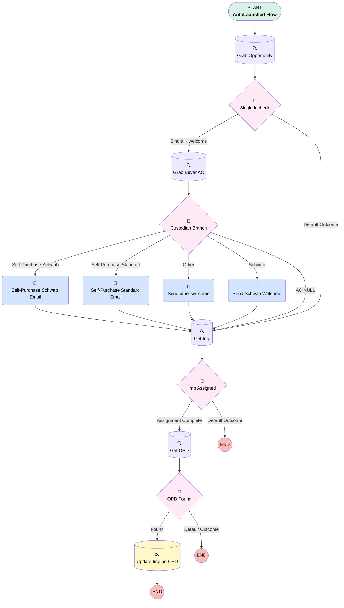

# Opportunity | Process | Send Welcome Email

## Flow Diagram [(_View History_)](Opportunity_Process_Send_Welcome_Email-history.md)

<!-- Flow description -->

## General Information

|<!-- -->|<!-- -->|
|:---|:---|
|Process Type| Auto Launched Flow|
|Label|Opportunity | Process | Send Welcome Email|
|Status|Active|
|Description|Deleted Pause Element (as of 15:00 pm 11/21/23)|
|Environments|Default|
|Interview Label|Opportunity | Process | Send Welcome Email {!$Flow.CurrentDateTime}|
| Builder Type (PM)|LightningFlowBuilder|
| Canvas Mode (PM)|AUTO_LAYOUT_CANVAS|
| Origin Builder Type (PM)|LightningFlowBuilder|
|Connector|[Grab_Opportunity](#grab_opportunity)|
|Next Node|[Grab_Opportunity](#grab_opportunity)|

## Variables

|Name|Data Type|Is Collection|Is Input|Is Output|Object Type|Description|
|:-- |:--:|:--:|:--:|:--:|:--:|:--  |
|newImp|SObject|⬜|✅|⬜|Implementation__c|<!-- -->|
|newProposal|SObject|⬜|✅|✅|Proposal__c|<!-- -->|
|recordId|String|⬜|✅|⬜|<!-- -->|<!-- -->|

## Formulas

|Name|Data Type|Expression|Description|
|:-- |:--:|:-- |:--  |
|nowMinus50|DateTime|{!$Flow.InterviewStartTime}-(50/1440)|<!-- -->|
|subject|String|"RPC Welcome Email Sent"|<!-- -->|
|today|Date|TODAY()|<!-- -->|

## Flow Nodes Details

### Self_Purchase_Schwab_Email

|<!-- -->|<!-- -->|
|:---|:---|
|Type|Action Call|
|Label|Self-Purchase Schwab Email|
|Action Type|Email Alert|
|Action Name|Associated_Contact__c.Single_k_Self_Purchase_Auto_Email_Schwab|
|Flow Transaction Model|CurrentTransaction|
|Name Segment|Associated_Contact__c.Single_k_Self_Purchase_Auto_Email_Schwab|
| SObject Row Id (input)|Grab_Buyer_AC.Id|
|Connector|[Get_Imp](#get_imp)|

### Self_Purchase_Standard_Email

|<!-- -->|<!-- -->|
|:---|:---|
|Type|Action Call|
|Label|Self-Purchase Standard Email|
|Action Type|Email Alert|
|Action Name|Associated_Contact__c.Single_k_Self_Purchase_Auto_Email_Standard|
|Flow Transaction Model|CurrentTransaction|
|Name Segment|Associated_Contact__c.Single_k_Self_Purchase_Auto_Email_Standard|
| SObject Row Id (input)|Grab_Buyer_AC.Id|
|Connector|[Get_Imp](#get_imp)|

### Send_other_welcome

|<!-- -->|<!-- -->|
|:---|:---|
|Type|Action Call|
|Label|Send other welcome|
|Action Type|Email Alert|
|Action Name|Associated_Contact__c.Single_k_Welcome_Email_Other_Custodian|
|Flow Transaction Model|CurrentTransaction|
|Name Segment|Associated_Contact__c.Single_k_Welcome_Email_Other_Custodian|
| SObject Row Id (input)|Grab_Buyer_AC.Id|
|Connector|[Get_Imp](#get_imp)|

### Send_Schwab_Welcome

|<!-- -->|<!-- -->|
|:---|:---|
|Type|Action Call|
|Label|Send Schwab Welcome|
|Action Type|Email Alert|
|Action Name|Associated_Contact__c.Single_k_Welcome_Email_Schwab|
|Flow Transaction Model|CurrentTransaction|
|Name Segment|Associated_Contact__c.Single_k_Welcome_Email_Schwab|
| SObject Row Id (input)|Grab_Buyer_AC.Id|
|Connector|[Get_Imp](#get_imp)|

### Custodian_Branch

|<!-- -->|<!-- -->|
|:---|:---|
|Type|Decision|
|Label|Custodian Branch|
|Default Connector|[Send_other_welcome](#send_other_welcome)|
|Default Connector Label|Other|

#### Rule AC_NULL (AC NULL)

|<!-- -->|<!-- -->|
|:---|:---|
|Connector|[Get_Imp](#get_imp)|
|Condition Logic|and|

|Condition Id|Left Value Reference|Operator|Right Value|
|:-- |:-- |:--:|:--: |
|1|Grab_Buyer_AC.Id| Is Null|✅|

#### Rule Self_Purchase_Schwab (Self-Purchase Schwab)

|<!-- -->|<!-- -->|
|:---|:---|
|Connector|[Self_Purchase_Schwab_Email](#self_purchase_schwab_email)|
|Condition Logic|(1 OR 2) AND (3 OR 4)|

|Condition Id|Left Value Reference|Operator|Right Value|
|:-- |:-- |:--:|:--: |
|1|Grab_Opportunity.Custodian__c| Equal To|Schwab Trust|
|2|Grab_Opportunity.Custodian__c| Equal To|Schwab & Co., Inc.|
|3|Grab_Opportunity.Campaign_Code__c| Equal To|Single(k) Long|
|4|Grab_Opportunity.Campaign_Code__c| Equal To|Single(k) Short|

#### Rule Schwab (Schwab)

|<!-- -->|<!-- -->|
|:---|:---|
|Connector|[Send_Schwab_Welcome](#send_schwab_welcome)|
|Condition Logic|or|

|Condition Id|Left Value Reference|Operator|Right Value|
|:-- |:-- |:--:|:--: |
|1|Grab_Opportunity.Custodian__c| Equal To|Schwab & Co., Inc.|
|2|Grab_Opportunity.Custodian__c| Equal To|Schwab Trust|

#### Rule Self_Purchase_Standard (Self-Purchase Standard)

|<!-- -->|<!-- -->|
|:---|:---|
|Connector|[Self_Purchase_Standard_Email](#self_purchase_standard_email)|
|Condition Logic|or|

|Condition Id|Left Value Reference|Operator|Right Value|
|:-- |:-- |:--:|:--: |
|1|Grab_Opportunity.Campaign_Code__c| Equal To|Single(k) Long|
|2|Grab_Opportunity.Campaign_Code__c| Equal To|Single(k) Short|

### Imp_Assigned

|<!-- -->|<!-- -->|
|:---|:---|
|Type|Decision|
|Label|Imp Assigned|
|Default Connector Label|Default Outcome|

#### Rule Assignment_Complete (Assignment Complete)

|<!-- -->|<!-- -->|
|:---|:---|
|Connector|[Get_OPD](#get_opd)|
|Condition Logic|and|

|Condition Id|Left Value Reference|Operator|Right Value|
|:-- |:-- |:--:|:--: |
|1|newImp.Id| Is Null|⬜|

### OPD_Found

|<!-- -->|<!-- -->|
|:---|:---|
|Type|Decision|
|Label|OPD Found|
|Default Connector Label|Default Outcome|

#### Rule Found (Found)

|<!-- -->|<!-- -->|
|:---|:---|
|Connector|[Update_Imp_on_OPD](#update_imp_on_opd)|
|Condition Logic|and|

|Condition Id|Left Value Reference|Operator|Right Value|
|:-- |:-- |:--:|:--: |
|1|[Get_OPD](#get_opd)| Is Null|⬜|

### Single_k_check

|<!-- -->|<!-- -->|
|:---|:---|
|Type|Decision|
|Label|Single k check|
|Default Connector|[Get_Imp](#get_imp)|
|Default Connector Label|Default Outcome|

#### Rule Single_K_welcome (Single K welcome)

|<!-- -->|<!-- -->|
|:---|:---|
|Connector|[Grab_Buyer_AC](#grab_buyer_ac)|
|Condition Logic|(1 OR 3) AND 2|

|Condition Id|Left Value Reference|Operator|Right Value|
|:-- |:-- |:--:|:--: |
|1|Grab_Opportunity.Service_Option__c| Equal To|Single(k)|
|2|Grab_Opportunity.LeadSourceDetail__c| Not Equal To|Advisor|
|3|Grab_Opportunity.Service_Option__c| Equal To|Mega Roth Single(k)|

### Get_Imp

|<!-- -->|<!-- -->|
|:---|:---|
|Type|Record Lookup|
|Object|Implementation__c|
|Label|Get Imp|
|Assign Null Values If No Records Found|✅|
|Output Reference|newImp|
|Queried Fields|- Id - Service_Option__c - Plan_Type__c |
|Connector|[Imp_Assigned](#imp_assigned)|

#### Filters (logic: **1 AND 2 AND NOT 3**)

|Filter Id|Field|Operator|Value|
|:-- |:-- |:--:|:--: |
|1|Opportunity_Name__c| Equal To|recordId|
|2|Implementation_Status__c| Contains|In Progress|
|3|Service_Option__c| Contains|Simply|

### Get_OPD

|<!-- -->|<!-- -->|
|:---|:---|
|Type|Record Lookup|
|Object|Proposal__c|
|Label|Get OPD|
|Assign Null Values If No Records Found|✅|
|Output Reference|newProposal|
|Queried Fields|- Id - Implementation__c |
|Sort Field|CreatedDate|
|Sort Order|Desc|
|Connector|[OPD_Found](#opd_found)|

#### Filters (logic: **and**)

|Filter Id|Field|Operator|Value|
|:-- |:-- |:--:|:--: |
|1|Opportunity__c| Equal To|recordId|

### Grab_Buyer_AC

|<!-- -->|<!-- -->|
|:---|:---|
|Type|Record Lookup|
|Object|Associated_Contact__c|
|Label|Grab Buyer AC|
|Assign Null Values If No Records Found|⬜|
|Get First Record Only|✅|
|Store Output Automatically|✅|
|Connector|[Custodian_Branch](#custodian_branch)|

#### Filters (logic: **1 AND (2 OR 3 OR 4)**)

|Filter Id|Field|Operator|Value|
|:-- |:-- |:--:|:--: |
|1|Opportunity__c| Equal To|recordId|
|2|Contact_Role__c| Equal To|Authorized Buyer|
|3|Primary__c| Equal To|✅|
|4|Contact_Role__c| Contains|Plan Sponsor|

### Grab_Opportunity

|<!-- -->|<!-- -->|
|:---|:---|
|Type|Record Lookup|
|Object|Opportunity|
|Label|Grab Opportunity|
|Assign Null Values If No Records Found|⬜|
|Get First Record Only|✅|
|Store Output Automatically|✅|
|Connector|[Single_k_check](#single_k_check)|

#### Filters (logic: **and**)

|Filter Id|Field|Operator|Value|
|:-- |:-- |:--:|:--: |
|1|Id| Equal To|recordId|

### Update_Imp_on_OPD

|<!-- -->|<!-- -->|
|:---|:---|
|Type|Record Update|
|Object|Proposal__c|
|Label|Update Imp on OPD|

#### Filters (logic: **and**)

|Filter Id|Field|Operator|Value|
|:-- |:-- |:--:|:--: |
|1|Opportunity__c| Equal To|recordId|

#### Input Assignments

|Field|Value|
|:-- |:--: |
|Implementation__c|newImp.Id|

___

_Documentation generated from branch monitoring_myubiquity by [sfdx-hardis](https://sfdx-hardis.cloudity.com), featuring [salesforce-flow-visualiser](https://github.com/toddhalfpenny/salesforce-flow-visualiser)_