# Opportunity Product | Before Save | Set Commission

## Flow Diagram [(_View History_)](Opportunity_Product_Before_Save_Set_Commission-history.md)

```mermaid
%% If you read this, your Markdown visualizer does not handle MermaidJS syntax.
%% - If you are in VS Code, install extension `Markdown Preview Mermaid Support` at https://marketplace.visualstudio.com/items?itemName=bierner.markdown-mermaid
%% - If you are using sfdx-hardis, try to define env variable `MERMAID_MODES=cli,docker` ,then run again the command to regenerate markdown with SVG images.
%% - If you are within mkdocs-material, define mermaid plugin in `mkdocs.yml` as described in https://squidfunk.github.io/mkdocs-material/extensions/mermaid/
%% - As a last resort, you can copy-paste this MermaidJS code into https://mermaid.live/ to see the flow diagram

flowchart TB
START(["START<br/><b>AutoLaunched Flow</b></br>Type: <b> Record Before Save</b>"]):::startClass
click START "#general-information" "2745706172"

Comm_on_record[\"🟰 <em></em><br/>Comm on record"/]:::assignments
click Comm_on_record "#comm_on_record" "1674171144"

Set_Default_Commission[\"🟰 <em></em><br/>Set Default Commission"/]:::assignments
click Set_Default_Commission "#set_default_commission" "541551001"

Subtract_From_Comm[\"🟰 <em></em><br/>Subtract From Comm"/]:::assignments
click Subtract_From_Comm "#subtract_from_comm" "4190037773"

Subtract_Partner_Fee[\"🟰 <em></em><br/>Subtract Partner Fee"/]:::assignments
click Subtract_Partner_Fee "#subtract_partner_fee" "4079267796"

Check_if_Promo_Found{"🔀 <em></em><br/>Check if Promo Found"}:::decisions
click Check_if_Promo_Found "#check_if_promo_found" "3690317407"

New_vs_Update_Check{"🔀 <em></em><br/>New vs Update Check"}:::decisions
click New_vs_Update_Check "#new_vs_update_check" "2100567042"

Promo_Loop{{"🔁 <em></em><br/>Promo Loop"}}:::loops
click Promo_Loop "#promo_loop" "2052462998"

Check_for_promo_comm_adjustment[("🔍 <em></em><br/>Check for promo comm adjustment")]:::recordLookups
click Check_for_promo_comm_adjustment "#check_for_promo_comm_adjustment" "3971703102"

Comm_on_record --> END_Comm_on_record
Set_Default_Commission --> New_vs_Update_Check
Subtract_From_Comm --> Promo_Loop
Subtract_Partner_Fee --> Comm_on_record
Check_if_Promo_Found --> |"Promo on Opp"| Promo_Loop
Check_if_Promo_Found --> |"Default Outcome"| Subtract_Partner_Fee
New_vs_Update_Check --> |"New"| Check_for_promo_comm_adjustment
New_vs_Update_Check --> |"Update"| Subtract_Partner_Fee
Promo_Loop --> |"For Each"|Subtract_From_Comm
Promo_Loop ---> |"After Last"|Subtract_Partner_Fee
Check_for_promo_comm_adjustment --> Check_if_Promo_Found
START -->  Set_Default_Commission
END_Comm_on_record(( END )):::endClass


classDef actionCalls fill:#D4E4FC,color:black,text-decoration:none,max-height:100px
classDef assignments fill:#FBEED7,color:black,text-decoration:none,max-height:100px
classDef collectionProcessors fill:#F0E3FA,color:black,text-decoration:none,max-height:100px
classDef customErrors fill:#FFE9E9,color:black,text-decoration:none,max-height:100px
classDef decisions fill:#FDEAF6,color:black,text-decoration:none,max-height:100px
classDef loops fill:#FDEAF6,color:black,text-decoration:none,max-height:100px
classDef recordCreates fill:#FFF8C9,color:black,text-decoration:none,max-height:100px
classDef recordDeletes fill:#FFF8C9,color:black,text-decoration:none,max-height:100px
classDef recordLookups fill:#EDEAFF,color:black,text-decoration:none,max-height:100px
classDef recordUpdates fill:#FFF8C9,color:black,text-decoration:none,max-height:100px
classDef screens fill:#DFF6FF,color:black,text-decoration:none,max-height:100px
classDef subflows fill:#D4E4FC,color:black,text-decoration:none,max-height:100px
classDef startClass fill:#D9F2E6,color:black,text-decoration:none,max-height:100px
classDef endClass fill:#F9BABA,color:black,text-decoration:none,max-height:100px
classDef transforms fill:#FDEAF6,color:black,text-decoration:none,max-height:100px


```

<!-- Flow description -->

## General Information

|<!-- -->|<!-- -->|
|:---|:---|
|Object|OpportunityLineItem|
|Process Type| Auto Launched Flow|
|Trigger Type| Record Before Save|
|Record Trigger Type| Create And Update|
|Label|Opportunity Product | Before Save | Set Commission|
|Status|Active|
|Filter Formula|(ISCHANGED({!$Record.UnitPrice}) || ISNEW() || ISBLANK({!$Record.Commissionable_Amount_Editable__c})) &&  NOT({!$Record.Promotion_Applied__c})|
|Description|Calculates commission for opp product.  Also checks for promos and applies in case product is being created after promo  Added update to assist w launch.  Now runs when comm is blank|
|Environments|Default|
|Interview Label|Opportunity Product | Before Save | Set Commission {!$Flow.CurrentDateTime}|
| Builder Type (PM)|LightningFlowBuilder|
| Canvas Mode (PM)|AUTO_LAYOUT_CANVAS|
| Origin Builder Type (PM)|LightningFlowBuilder|
|Connector|[Set_Default_Commission](#set_default_commission)|
|Next Node|[Set_Default_Commission](#set_default_commission)|

## Variables

|Name|Data Type|Is Collection|Is Input|Is Output|Object Type|Description|
|:-- |:--:|:--:|:--:|:--:|:--:|:--  |
|comm|Currency|⬜|⬜|⬜|<!-- -->|<!-- -->|

## Formulas

|Name|Data Type|Expression|Description|
|:-- |:--:|:-- |:--  |
|defaultComm|Currency|BLANKVALUE({!$Record.UnitPrice}, {!$Record.PricebookEntry.UnitPrice}) * {!$Record.Quantity}|<!-- -->|
|discountDollarAmount|Currency|{!defaultComm} * ({!Promo_Loop.Discount__c} / 100)|<!-- -->|
|isNew|Boolean|ISNEW()|<!-- -->|
|subtractFromComm|Currency|{!discountDollarAmount} - ({!discountDollarAmount} * ({!Promo_Loop.Commission__c} / 100))|<!-- -->|

## Flow Nodes Details

### Comm_on_record

|<!-- -->|<!-- -->|
|:---|:---|
|Type|Assignment|
|Label|Comm on record|

#### Assignments

|Assign To Reference|Operator|Value|
|:-- |:--:|:--: |
|$Record.Commissionable_Amount_Editable__c| Assign|comm|

### Set_Default_Commission

|<!-- -->|<!-- -->|
|:---|:---|
|Type|Assignment|
|Label|Set Default Commission|
|Connector|[New_vs_Update_Check](#new_vs_update_check)|

#### Assignments

|Assign To Reference|Operator|Value|
|:-- |:--:|:--: |
|comm| Assign|defaultComm|

### Subtract_From_Comm

|<!-- -->|<!-- -->|
|:---|:---|
|Type|Assignment|
|Label|Subtract From Comm|
|Connector|[Promo_Loop](#promo_loop)|

#### Assignments

|Assign To Reference|Operator|Value|
|:-- |:--:|:--: |
|comm| Subtract|subtractFromComm|

### Subtract_Partner_Fee

|<!-- -->|<!-- -->|
|:---|:---|
|Type|Assignment|
|Label|Subtract Partner Fee|
|Connector|[Comm_on_record](#comm_on_record)|

#### Assignments

|Assign To Reference|Operator|Value|
|:-- |:--:|:--: |
|comm| Subtract|$Record.PricebookEntry.Partner_Fee__c|

### Check_if_Promo_Found

|<!-- -->|<!-- -->|
|:---|:---|
|Type|Decision|
|Label|Check if Promo Found|
|Default Connector|[Subtract_Partner_Fee](#subtract_partner_fee)|
|Default Connector Label|Default Outcome|

#### Rule Promo_on_Opp (Promo on Opp)

|<!-- -->|<!-- -->|
|:---|:---|
|Connector|[Promo_Loop](#promo_loop)|
|Condition Logic|and|

|Condition Id|Left Value Reference|Operator|Right Value|
|:-- |:-- |:--:|:--: |
|1|[Check_for_promo_comm_adjustment](#check_for_promo_comm_adjustment)| Is Empty|⬜|

### New_vs_Update_Check

|<!-- -->|<!-- -->|
|:---|:---|
|Type|Decision|
|Label|New vs Update Check|
|Default Connector|[Subtract_Partner_Fee](#subtract_partner_fee)|
|Default Connector Label|Update|

#### Rule New (New)

|<!-- -->|<!-- -->|
|:---|:---|
|Connector|[Check_for_promo_comm_adjustment](#check_for_promo_comm_adjustment)|
|Condition Logic|or|

|Condition Id|Left Value Reference|Operator|Right Value|
|:-- |:-- |:--:|:--: |
|1|isNew| Equal To|✅|

### Promo_Loop

|<!-- -->|<!-- -->|
|:---|:---|
|Type|Loop|
|Label|Promo Loop|
|Collection Reference|[Check_for_promo_comm_adjustment](#check_for_promo_comm_adjustment)|
|Iteration Order|Asc|
|Next Value Connector|[Subtract_From_Comm](#subtract_from_comm)|
|No More Values Connector|[Subtract_Partner_Fee](#subtract_partner_fee)|

### Check_for_promo_comm_adjustment

|<!-- -->|<!-- -->|
|:---|:---|
|Type|Record Lookup|
|Object|Opportunity_Promotion__c|
|Label|Check for promo comm adjustment|
|Assign Null Values If No Records Found|⬜|
|Get First Record Only|⬜|
|Queried Fields|- Id - Commission__c - Discount__c |
|Store Output Automatically|✅|
|Connector|[Check_if_Promo_Found](#check_if_promo_found)|

#### Filters (logic: **and**)

|Filter Id|Field|Operator|Value|
|:-- |:-- |:--:|:--: |
|1|Opportunity__c| Equal To|$Record.OpportunityId|
|2|Product_Family__c| Equal To|$Record.Product2.Family|

___

_Documentation generated from branch monitoring_myubiquity by [sfdx-hardis](https://sfdx-hardis.cloudity.com), featuring [salesforce-flow-visualiser](https://github.com/toddhalfpenny/salesforce-flow-visualiser)_