# Opportunity Promotion | After Delete | Recalc Promo

## Flow Diagram [(_View History_)](Opportunity_Promotion_After_Delete_Recalc_Promo-history.md)

```mermaid
%% If you read this, your Markdown visualizer does not handle MermaidJS syntax.
%% - If you are in VS Code, install extension `Markdown Preview Mermaid Support` at https://marketplace.visualstudio.com/items?itemName=bierner.markdown-mermaid
%% - If you are using sfdx-hardis, try to define env variable `MERMAID_MODES=cli,docker` ,then run again the command to regenerate markdown with SVG images.
%% - If you are within mkdocs-material, define mermaid plugin in `mkdocs.yml` as described in https://squidfunk.github.io/mkdocs-material/extensions/mermaid/
%% - As a last resort, you can copy-paste this MermaidJS code into https://mermaid.live/ to see the flow diagram

flowchart TB
START(["START<br/><b>AutoLaunched Flow</b></br>Type: <b> Record Before Delete</b>"]):::startClass
click START "#general-information" "1749466677"

Recalc_Opp_Promo[["🔗 <em>Subflow</em><br/>Recalc Opp Promo"]]:::subflows
click Recalc_Opp_Promo "#recalc_opp_promo" "3938153394"

START -->  Recalc_Opp_Promo
Recalc_Opp_Promo --> END_Recalc_Opp_Promo
END_Recalc_Opp_Promo(( END )):::endClass


classDef actionCalls fill:#D4E4FC,color:black,text-decoration:none,max-height:100px
classDef assignments fill:#FBEED7,color:black,text-decoration:none,max-height:100px
classDef collectionProcessors fill:#F0E3FA,color:black,text-decoration:none,max-height:100px
classDef customErrors fill:#FFE9E9,color:black,text-decoration:none,max-height:100px
classDef decisions fill:#FDEAF6,color:black,text-decoration:none,max-height:100px
classDef loops fill:#FDEAF6,color:black,text-decoration:none,max-height:100px
classDef recordCreates fill:#FFF8C9,color:black,text-decoration:none,max-height:100px
classDef recordDeletes fill:#FFF8C9,color:black,text-decoration:none,max-height:100px
classDef recordLookups fill:#EDEAFF,color:black,text-decoration:none,max-height:100px
classDef recordUpdates fill:#FFF8C9,color:black,text-decoration:none,max-height:100px
classDef screens fill:#DFF6FF,color:black,text-decoration:none,max-height:100px
classDef subflows fill:#D4E4FC,color:black,text-decoration:none,max-height:100px
classDef startClass fill:#D9F2E6,color:black,text-decoration:none,max-height:100px
classDef endClass fill:#F9BABA,color:black,text-decoration:none,max-height:100px
classDef transforms fill:#FDEAF6,color:black,text-decoration:none,max-height:100px


```

<!-- Flow description -->

## General Information

|<!-- -->|<!-- -->|
|:---|:---|
|Object|Opportunity_Promotion__c|
|Process Type| Auto Launched Flow|
|Trigger Type| Record Before Delete|
|Record Trigger Type| Delete|
|Label|Opportunity Promotion | After Delete | Recalc Promo|
|Status|Active|
|Environments|Default|
|Interview Label|Opportunity Promotion | After Delete | Recalc Promo {!$Flow.CurrentDateTime}|
| Builder Type (PM)|LightningFlowBuilder|
| Canvas Mode (PM)|AUTO_LAYOUT_CANVAS|
| Origin Builder Type (PM)|LightningFlowBuilder|
|Connector|[Recalc_Opp_Promo](#recalc_opp_promo)|
|Next Node|[Recalc_Opp_Promo](#recalc_opp_promo)|

#### Filters (logic: **and**)

|Filter Id|Field|Operator|Value|
|:-- |:-- |:--:|:--: |
|1|Opportunity__c| Is Null|<!-- -->|

## Flow Nodes Details

### Recalc_Opp_Promo

|<!-- -->|<!-- -->|
|:---|:---|
|Type|Subflow|
|Label|Recalc Opp Promo|
|Flow Name|Update_Promotional_Discount|

#### Input Assignments

|Field|Value|
|:-- |:--: |
|<!-- -->|$Record.Id|
|<!-- -->|$Record.Opportunity__c|

___

_Documentation generated from branch monitoring_myubiquity by [sfdx-hardis](https://sfdx-hardis.cloudity.com), featuring [salesforce-flow-visualiser](https://github.com/toddhalfpenny/salesforce-flow-visualiser)_