# Opportunity Promotion | After Insert | Promo Code To Proposals

## Flow Diagram [(_View History_)](Opportunity_Promotion_After_Insert_Promo_Code_To_Proposals-history.md)

```mermaid
%% If you read this, your Markdown visualizer does not handle MermaidJS syntax.
%% - If you are in VS Code, install extension `Markdown Preview Mermaid Support` at https://marketplace.visualstudio.com/items?itemName=bierner.markdown-mermaid
%% - If you are using sfdx-hardis, try to define env variable `MERMAID_MODES=cli,docker` ,then run again the command to regenerate markdown with SVG images.
%% - If you are within mkdocs-material, define mermaid plugin in `mkdocs.yml` as described in https://squidfunk.github.io/mkdocs-material/extensions/mermaid/
%% - As a last resort, you can copy-paste this MermaidJS code into https://mermaid.live/ to see the flow diagram

flowchart TB
START(["START<br/><b>AutoLaunched Flow</b></br>Type: <b> Record After Save</b>"]):::startClass
click START "#general-information" "2982229846"

Add_Promo_Code[\"🟰 <em></em><br/>Add Promo Code"/]:::assignments
click Add_Promo_Code "#add_promo_code" "2443270627"

Add_Semi_Colon[\"🟰 <em></em><br/>Add Semi Colon"/]:::assignments
click Add_Semi_Colon "#add_semi_colon" "1664554273"

Add_to_update_collection[\"🟰 <em></em><br/>Add to update collection"/]:::assignments
click Add_to_update_collection "#add_to_update_collection" "2049453085"

Check_if_there_are_props_to_update{"🔀 <em></em><br/>Check if there are props to update"}:::decisions
click Check_if_there_are_props_to_update "#check_if_there_are_props_to_update" "2904165567"

Check_proposal_code{"🔀 <em></em><br/>Check proposal code"}:::decisions
click Check_proposal_code "#check_proposal_code" "3120658611"

Proposal_Loop{{"🔁 <em></em><br/>Proposal Loop"}}:::loops
click Proposal_Loop "#proposal_loop" "1085640196"

Find_Related_Proposals[("🔍 <em></em><br/>Find Related Proposals")]:::recordLookups
click Find_Related_Proposals "#find_related_proposals" "1334902781"

Update_props[("🛠️ <em></em><br/>Update props")]:::recordUpdates
click Update_props "#update_props" "4170331672"

Add_Promo_Code --> Add_to_update_collection
Add_Semi_Colon --> Add_Promo_Code
Add_to_update_collection --> Proposal_Loop
Check_if_there_are_props_to_update --> |"Props Needing Update"| Update_props
Check_if_there_are_props_to_update --> |"Default Outcome"| END_Check_if_there_are_props_to_update
Check_proposal_code --> |"This code present"| Proposal_Loop
Check_proposal_code --> |"Other codes present"| Add_Semi_Colon
Check_proposal_code --> |"Default Outcome"| Add_Promo_Code
Proposal_Loop --> |"For Each"|Check_proposal_code
Proposal_Loop ---> |"After Last"|Check_if_there_are_props_to_update
Find_Related_Proposals --> Proposal_Loop
Update_props --> END_Update_props
START -->  Find_Related_Proposals
END_Check_if_there_are_props_to_update(( END )):::endClass
END_Update_props(( END )):::endClass


classDef actionCalls fill:#D4E4FC,color:black,text-decoration:none,max-height:100px
classDef assignments fill:#FBEED7,color:black,text-decoration:none,max-height:100px
classDef collectionProcessors fill:#F0E3FA,color:black,text-decoration:none,max-height:100px
classDef customErrors fill:#FFE9E9,color:black,text-decoration:none,max-height:100px
classDef decisions fill:#FDEAF6,color:black,text-decoration:none,max-height:100px
classDef loops fill:#FDEAF6,color:black,text-decoration:none,max-height:100px
classDef recordCreates fill:#FFF8C9,color:black,text-decoration:none,max-height:100px
classDef recordDeletes fill:#FFF8C9,color:black,text-decoration:none,max-height:100px
classDef recordLookups fill:#EDEAFF,color:black,text-decoration:none,max-height:100px
classDef recordUpdates fill:#FFF8C9,color:black,text-decoration:none,max-height:100px
classDef screens fill:#DFF6FF,color:black,text-decoration:none,max-height:100px
classDef subflows fill:#D4E4FC,color:black,text-decoration:none,max-height:100px
classDef startClass fill:#D9F2E6,color:black,text-decoration:none,max-height:100px
classDef endClass fill:#F9BABA,color:black,text-decoration:none,max-height:100px
classDef transforms fill:#FDEAF6,color:black,text-decoration:none,max-height:100px


```

<!-- Flow description -->

## General Information

|<!-- -->|<!-- -->|
|:---|:---|
|Object|Opportunity_Promotion__c|
|Process Type| Auto Launched Flow|
|Trigger Type| Record After Save|
|Record Trigger Type| Create|
|Label|Opportunity Promotion | After Insert | Promo Code To Proposals|
|Status|Active|
|Description|Stamps promo code from new opp promotion to proposal records related to opp|
|Environments|Default|
|Interview Label|Opportunity Promotion | After Insert | Promo Code To Proposals {!$Flow.CurrentDateTime}|
| Builder Type (PM)|LightningFlowBuilder|
| Canvas Mode (PM)|AUTO_LAYOUT_CANVAS|
| Origin Builder Type (PM)|LightningFlowBuilder|
|Connector|[Find_Related_Proposals](#find_related_proposals)|
|Next Node|[Find_Related_Proposals](#find_related_proposals)|

#### Filters (logic: **and**)

|Filter Id|Field|Operator|Value|
|:-- |:-- |:--:|:--: |
|1|Opportunity__c| Is Null|<!-- -->|
|2|Promo_Code__c| Is Null|<!-- -->|

## Variables

|Name|Data Type|Is Collection|Is Input|Is Output|Object Type|Description|
|:-- |:--:|:--:|:--:|:--:|:--:|:--  |
|props2Update|SObject|✅|⬜|⬜|Proposal__c|<!-- -->|

## Flow Nodes Details

### Add_Promo_Code

|<!-- -->|<!-- -->|
|:---|:---|
|Type|Assignment|
|Label|Add Promo Code|
|Connector|[Add_to_update_collection](#add_to_update_collection)|

#### Assignments

|Assign To Reference|Operator|Value|
|:-- |:--:|:--: |
|Proposal_Loop.Promo_Code__c| Add|$Record.Promo_Code__c|

### Add_Semi_Colon

|<!-- -->|<!-- -->|
|:---|:---|
|Type|Assignment|
|Label|Add Semi Colon|
|Connector|isGoTo: true targetReference: Add_Promo_Code |

#### Assignments

|Assign To Reference|Operator|Value|
|:-- |:--:|:--: |
|Proposal_Loop.Promo_Code__c| Add|;|

### Add_to_update_collection

|<!-- -->|<!-- -->|
|:---|:---|
|Type|Assignment|
|Label|Add to update collection|
|Connector|[Proposal_Loop](#proposal_loop)|

#### Assignments

|Assign To Reference|Operator|Value|
|:-- |:--:|:--: |
|props2Update| Add|[Proposal_Loop](#proposal_loop)|

### Check_if_there_are_props_to_update

|<!-- -->|<!-- -->|
|:---|:---|
|Type|Decision|
|Label|Check if there are props to update|
|Default Connector Label|Default Outcome|

#### Rule Props_Needing_Update (Props Needing Update)

|<!-- -->|<!-- -->|
|:---|:---|
|Connector|[Update_props](#update_props)|
|Condition Logic|and|

|Condition Id|Left Value Reference|Operator|Right Value|
|:-- |:-- |:--:|:--: |
|1|props2Update| Is Empty|⬜|

### Check_proposal_code

|<!-- -->|<!-- -->|
|:---|:---|
|Type|Decision|
|Label|Check proposal code|
|Default Connector|[Add_Promo_Code](#add_promo_code)|
|Default Connector Label|Default Outcome|

#### Rule This_code_present (This code present)

|<!-- -->|<!-- -->|
|:---|:---|
|Connector|[Proposal_Loop](#proposal_loop)|
|Condition Logic|and|

|Condition Id|Left Value Reference|Operator|Right Value|
|:-- |:-- |:--:|:--: |
|1|Proposal_Loop.Promo_Code__c| Contains|$Record.Promo_Code__c|

#### Rule Other_codes_present (Other codes present)

|<!-- -->|<!-- -->|
|:---|:---|
|Connector|[Add_Semi_Colon](#add_semi_colon)|
|Condition Logic|and|

|Condition Id|Left Value Reference|Operator|Right Value|
|:-- |:-- |:--:|:--: |
|1|Proposal_Loop.Promo_Code__c| Is Blank|⬜|

### Proposal_Loop

|<!-- -->|<!-- -->|
|:---|:---|
|Type|Loop|
|Label|Proposal Loop|
|Collection Reference|[Find_Related_Proposals](#find_related_proposals)|
|Iteration Order|Asc|
|Next Value Connector|[Check_proposal_code](#check_proposal_code)|
|No More Values Connector|[Check_if_there_are_props_to_update](#check_if_there_are_props_to_update)|

### Find_Related_Proposals

|<!-- -->|<!-- -->|
|:---|:---|
|Type|Record Lookup|
|Object|Proposal__c|
|Label|Find Related Proposals|
|Assign Null Values If No Records Found|⬜|
|Get First Record Only|⬜|
|Queried Fields|- Id - Promo_Code__c |
|Store Output Automatically|✅|
|Connector|[Proposal_Loop](#proposal_loop)|

#### Filters (logic: **and**)

|Filter Id|Field|Operator|Value|
|:-- |:-- |:--:|:--: |
|1|Opportunity__c| Equal To|$Record.Opportunity__c|

### Update_props

|<!-- -->|<!-- -->|
|:---|:---|
|Type|Record Update|
|Label|Update props|
|Input Reference|props2Update|

___

_Documentation generated from branch monitoring_myubiquity by [sfdx-hardis](https://sfdx-hardis.cloudity.com), featuring [salesforce-flow-visualiser](https://github.com/toddhalfpenny/salesforce-flow-visualiser)_