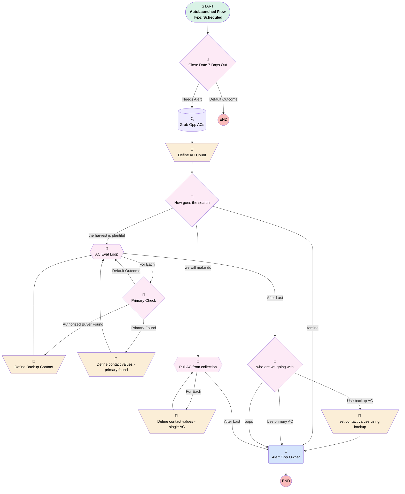

# Opportunity | Scheduled | 7 days to close

## Flow Diagram [(_View History_)](Opportunity_Scheduled_7_days_to_close-history.md)

<!-- Flow description -->

## General Information

|<!-- -->|<!-- -->|
|:---|:---|
|Object|Opportunity|
|Process Type| Auto Launched Flow|
|Trigger Type| Scheduled|
|Label|Opportunity | Scheduled | 7 days to close|
|Status|Active|
|Description|Added check for primary AC along with authorized buyer.  Fixed contact link showing up when no contact found.|
|Environments|Default|
|Interview Label|Opportunity | Scheduled | 7 days to close {!$Flow.CurrentDateTime}|
| Builder Type (PM)|LightningFlowBuilder|
| Canvas Mode (PM)|AUTO_LAYOUT_CANVAS|
| Origin Builder Type (PM)|LightningFlowBuilder|
|Connector|[Close_Date_7_Days_Out](#close_date_7_days_out)|
|Next Node|[Close_Date_7_Days_Out](#close_date_7_days_out)|

#### Schedules

|Frequency|Start Date|Start Time|
|:-- |:--:|:--: |
|Daily|Jun 1, 2023|06:00|

#### Filters (logic: **1 AND (2 OR 3 OR 4)**)

|Filter Id|Field|Operator|Value|
|:-- |:-- |:--:|:--: |
|1|IsClosed| Equal To|⬜|
|2|Type| Equal To|401(k) Plan Sale|
|3|Type| Equal To|Single(k)|
|4|Type| Equal To|Upgrade|

## Variables

|Name|Data Type|Is Collection|Is Input|Is Output|Object Type|Description|
|:-- |:--:|:--:|:--:|:--:|:--:|:--  |
|AcCount|Number|⬜|⬜|⬜|<!-- -->|<!-- -->|
|backupAC|SObject|⬜|⬜|⬜|Associated_Contact__c|<!-- -->|
|backupEmail|String|⬜|⬜|⬜|<!-- -->|<!-- -->|
|backupFound|Boolean|⬜|⬜|⬜|<!-- -->|<!-- -->|
|backupId|String|⬜|⬜|⬜|<!-- -->|<!-- -->|
|backupName|String|⬜|⬜|⬜|<!-- -->|<!-- -->|
|backupPhone|String|⬜|⬜|⬜|<!-- -->|<!-- -->|
|contactEmail|String|⬜|⬜|⬜|<!-- -->|<!-- -->|
|contactId|String|⬜|⬜|⬜|<!-- -->|<!-- -->|
|contactName|String|⬜|⬜|⬜|<!-- -->|<!-- -->|
|contactPhoneNumber|String|⬜|⬜|⬜|<!-- -->|<!-- -->|
|foundPrimary|Boolean|⬜|⬜|⬜|<!-- -->|<!-- -->|
|oppACs|SObject|✅|⬜|⬜|Associated_Contact__c|<!-- -->|
|primaryAC|SObject|⬜|⬜|⬜|Associated_Contact__c|<!-- -->|

## Formulas

|Name|Data Type|Expression|Description|
|:-- |:--:|:-- |:--  |
|contactInfo|String|IF(NOT(ISBLANK({!contactId})), "Primary Contact Info:" + BR() + IF(NOT(ISBLANK({!contactName})),"Name: " + {!contactName} + BR(),"") + IF(NOT(ISBLANK({!contactPhoneNumber})),"Phone: " + {!contactPhoneNumber} + BR(),"") + IF(NOT(ISBLANK({!contactEmail})),"Email: " + {!contactEmail} + BR(),"") + "Link: " + "https://myubiquity.lightning.force.com/lightning/r/Contact/"+{!contactId}+"/view" + BR() ,"")|<!-- -->|
|emailSubject|String|"Opportunity expiration warning - " + {!$Record.Name}|<!-- -->|
|x7daysOut|Date|{!$Flow.CurrentDate} + 7|<!-- -->|

## Flow Nodes Details

### Alert_Opp_Owner

|<!-- -->|<!-- -->|
|:---|:---|
|Type|Action Call|
|Label|Alert Opp Owner|
|Action Type|Email Simple|
|Action Name|emailSimple|
|Flow Transaction Model|CurrentTransaction|
|Name Segment|emailSimple|
|Email Body (input)|emailBody|
|Email Addresses (input)|$Record.Owner.Email|
|Sender Type (input)|DefaultWorkflowUser|
|Email Subject (input)|emailSubject|

### Define_AC_Count

|<!-- -->|<!-- -->|
|:---|:---|
|Type|Assignment|
|Label|Define AC Count|
|Connector|[How_goes_the_search](#how_goes_the_search)|

#### Assignments

|Assign To Reference|Operator|Value|
|:-- |:--:|:--: |
|AcCount| Assign Count|oppACs|

### Define_Backup_Contact

|<!-- -->|<!-- -->|
|:---|:---|
|Type|Assignment|
|Label|Define Backup Contact|
|Connector|[AC_Eval_Loop](#ac_eval_loop)|

#### Assignments

|Assign To Reference|Operator|Value|
|:-- |:--:|:--: |
|backupName| Assign|AC_Eval_Loop.Full_Name__c|
|backupPhone| Assign|AC_Eval_Loop.Contact__r.Phone|
|backupEmail| Assign|AC_Eval_Loop.Contact__r.Email|
|backupFound| Assign|✅|
|backupId| Assign|AC_Eval_Loop.Contact__c|

### Define_contact_values_primary_found

|<!-- -->|<!-- -->|
|:---|:---|
|Type|Assignment|
|Label|Define contact values - primary found|
|Connector|[AC_Eval_Loop](#ac_eval_loop)|

#### Assignments

|Assign To Reference|Operator|Value|
|:-- |:--:|:--: |
|contactPhoneNumber| Assign|AC_Eval_Loop.Contact__r.Phone|
|contactName| Assign|AC_Eval_Loop.Full_Name__c|
|contactEmail| Assign|AC_Eval_Loop.Contact__r.Email|
|foundPrimary| Assign|✅|
|contactId| Assign|AC_Eval_Loop.Contact__c|

### Define_contact_values_single_AC

|<!-- -->|<!-- -->|
|:---|:---|
|Type|Assignment|
|Label|Define contact values - single AC|
|Connector|[Pull_AC_from_collection](#pull_ac_from_collection)|

#### Assignments

|Assign To Reference|Operator|Value|
|:-- |:--:|:--: |
|contactPhoneNumber| Assign|Pull_AC_from_collection.Contact__r.Phone|
|contactName| Assign|Pull_AC_from_collection.Full_Name__c|
|contactEmail| Assign|Pull_AC_from_collection.Contact__r.Email|
|contactId| Assign|Pull_AC_from_collection.Contact__c|

### set_contact_values_using_backup

|<!-- -->|<!-- -->|
|:---|:---|
|Type|Assignment|
|Label|set contact values using backup|
|Connector|[Alert_Opp_Owner](#alert_opp_owner)|

#### Assignments

|Assign To Reference|Operator|Value|
|:-- |:--:|:--: |
|contactEmail| Assign|backupEmail|
|contactName| Assign|backupName|
|contactPhoneNumber| Assign|backupPhone|
|contactId| Assign|backupId|

### Close_Date_7_Days_Out

|<!-- -->|<!-- -->|
|:---|:---|
|Type|Decision|
|Label|Close Date 7 Days Out|
|Default Connector Label|Default Outcome|

#### Rule Needs_Alert (Needs Alert)

|<!-- -->|<!-- -->|
|:---|:---|
|Connector|[Grab_Opp_ACs](#grab_opp_acs)|
|Condition Logic|and|

|Condition Id|Left Value Reference|Operator|Right Value|
|:-- |:-- |:--:|:--: |
|1|$Record.CloseDate| Equal To|x7daysOut|

### How_goes_the_search

|<!-- -->|<!-- -->|
|:---|:---|
|Type|Decision|
|Label|How goes the search|
|Default Connector|[Alert_Opp_Owner](#alert_opp_owner)|
|Default Connector Label|famine|

#### Rule the_harvest_is_plentiful (the harvest is plentiful)

|<!-- -->|<!-- -->|
|:---|:---|
|Connector|[AC_Eval_Loop](#ac_eval_loop)|
|Condition Logic|and|

|Condition Id|Left Value Reference|Operator|Right Value|
|:-- |:-- |:--:|:--: |
|1|AcCount| Greater Than|1|

#### Rule we_will_make_do (we will make do)

|<!-- -->|<!-- -->|
|:---|:---|
|Connector|[Pull_AC_from_collection](#pull_ac_from_collection)|
|Condition Logic|and|

|Condition Id|Left Value Reference|Operator|Right Value|
|:-- |:-- |:--:|:--: |
|1|AcCount| Equal To|1|

### Primary_Check

|<!-- -->|<!-- -->|
|:---|:---|
|Type|Decision|
|Label|Primary Check|
|Default Connector|[AC_Eval_Loop](#ac_eval_loop)|
|Default Connector Label|Default Outcome|

#### Rule Primary_Found (Primary Found)

|<!-- -->|<!-- -->|
|:---|:---|
|Connector|[Define_contact_values_primary_found](#define_contact_values_primary_found)|
|Condition Logic|and|

|Condition Id|Left Value Reference|Operator|Right Value|
|:-- |:-- |:--:|:--: |
|1|AC_Eval_Loop.Primary__c| Equal To|✅|
|2|foundPrimary| Equal To|⬜|

#### Rule Authorized_Buyer_Found (Authorized Buyer Found)

|<!-- -->|<!-- -->|
|:---|:---|
|Connector|[Define_Backup_Contact](#define_backup_contact)|
|Condition Logic|and|

|Condition Id|Left Value Reference|Operator|Right Value|
|:-- |:-- |:--:|:--: |
|1|AC_Eval_Loop.Contact_Role__c| Equal To|Authorized Buyer|
|2|foundPrimary| Equal To|⬜|
|3|backupFound| Equal To|⬜|

### who_are_we_going_with

|<!-- -->|<!-- -->|
|:---|:---|
|Type|Decision|
|Label|who are we going with|
|Default Connector|[Alert_Opp_Owner](#alert_opp_owner)|
|Default Connector Label|oops|

#### Rule Use_primary_AC (Use primary AC)

|<!-- -->|<!-- -->|
|:---|:---|
|Connector|[Alert_Opp_Owner](#alert_opp_owner)|
|Condition Logic|and|

|Condition Id|Left Value Reference|Operator|Right Value|
|:-- |:-- |:--:|:--: |
|1|foundPrimary| Equal To|✅|

#### Rule Use_backup_AC (Use backup AC)

|<!-- -->|<!-- -->|
|:---|:---|
|Connector|[set_contact_values_using_backup](#set_contact_values_using_backup)|
|Condition Logic|and|

|Condition Id|Left Value Reference|Operator|Right Value|
|:-- |:-- |:--:|:--: |
|1|backupFound| Equal To|✅|

### AC_Eval_Loop

|<!-- -->|<!-- -->|
|:---|:---|
|Type|Loop|
|Label|AC Eval Loop|
|Collection Reference|oppACs|
|Iteration Order|Asc|
|Next Value Connector|[Primary_Check](#primary_check)|
|No More Values Connector|[who_are_we_going_with](#who_are_we_going_with)|

### Pull_AC_from_collection

|<!-- -->|<!-- -->|
|:---|:---|
|Type|Loop|
|Label|Pull AC from collection|
|Collection Reference|oppACs|
|Iteration Order|Asc|
|Next Value Connector|[Define_contact_values_single_AC](#define_contact_values_single_ac)|
|No More Values Connector|[Alert_Opp_Owner](#alert_opp_owner)|

### Grab_Opp_ACs

|<!-- -->|<!-- -->|
|:---|:---|
|Type|Record Lookup|
|Object|Associated_Contact__c|
|Label|Grab Opp ACs|
|Assign Null Values If No Records Found|✅|
|Output Reference|oppACs|
|Queried Fields|- Id - Contact__c - Full_Name__c - Contact_Role__c - Primary__c |
|Connector|[Define_AC_Count](#define_ac_count)|

#### Filters (logic: **and**)

|Filter Id|Field|Operator|Value|
|:-- |:-- |:--:|:--: |
|1|Opportunity__c| Equal To|$Record.Id|

___

_Documentation generated from branch monitoring_myubiquity by [sfdx-hardis](https://sfdx-hardis.cloudity.com), featuring [salesforce-flow-visualiser](https://github.com/toddhalfpenny/salesforce-flow-visualiser)_