# Partner Resource Request

## Flow Diagram [(_View History_)](Partner_Resource_Request-history.md)

```mermaid
%% If you read this, your Markdown visualizer does not handle MermaidJS syntax.
%% - If you are in VS Code, install extension `Markdown Preview Mermaid Support` at https://marketplace.visualstudio.com/items?itemName=bierner.markdown-mermaid
%% - If you are using sfdx-hardis, try to define env variable `MERMAID_MODES=cli,docker` ,then run again the command to regenerate markdown with SVG images.
%% - If you are within mkdocs-material, define mermaid plugin in `mkdocs.yml` as described in https://squidfunk.github.io/mkdocs-material/extensions/mermaid/
%% - As a last resort, you can copy-paste this MermaidJS code into https://mermaid.live/ to see the flow diagram

flowchart TB
START(["START<br/><b>AutoLaunched Flow</b></br>Type: <b> Record After Save</b>"]):::startClass
click START "#general-information" "3451396485"

Partner_Resource_Request("📧 <em></em><br/>Partner_Resource_Request__c.Partner_Resource_Request"):::actionCalls
click Partner_Resource_Request "#partner_resource_request" "1488572286"

Partner_Resource_Request --> END_Partner_Resource_Request
START -->  Partner_Resource_Request
END_Partner_Resource_Request(( END )):::endClass


classDef actionCalls fill:#D4E4FC,color:black,text-decoration:none,max-height:100px
classDef assignments fill:#FBEED7,color:black,text-decoration:none,max-height:100px
classDef collectionProcessors fill:#F0E3FA,color:black,text-decoration:none,max-height:100px
classDef customErrors fill:#FFE9E9,color:black,text-decoration:none,max-height:100px
classDef decisions fill:#FDEAF6,color:black,text-decoration:none,max-height:100px
classDef loops fill:#FDEAF6,color:black,text-decoration:none,max-height:100px
classDef recordCreates fill:#FFF8C9,color:black,text-decoration:none,max-height:100px
classDef recordDeletes fill:#FFF8C9,color:black,text-decoration:none,max-height:100px
classDef recordLookups fill:#EDEAFF,color:black,text-decoration:none,max-height:100px
classDef recordUpdates fill:#FFF8C9,color:black,text-decoration:none,max-height:100px
classDef screens fill:#DFF6FF,color:black,text-decoration:none,max-height:100px
classDef subflows fill:#D4E4FC,color:black,text-decoration:none,max-height:100px
classDef startClass fill:#D9F2E6,color:black,text-decoration:none,max-height:100px
classDef endClass fill:#F9BABA,color:black,text-decoration:none,max-height:100px
classDef transforms fill:#FDEAF6,color:black,text-decoration:none,max-height:100px


```

<!-- Flow description -->

## General Information

|<!-- -->|<!-- -->|
|:---|:---|
|Object|Partner_Resource_Request__c|
|Process Type| Auto Launched Flow|
|Trigger Type| Record After Save|
|Record Trigger Type| Create|
|Label|Partner Resource Request|
|Status|Active|
|Description|Migrated from the: Partner Resource Request workflow rule Workflow rule description: Alert project owner when partner resource request is created."|
|Migrated From Workflow Rule Name|Partner Resource Request|
| Canvas Mode (PM)|AUTO_LAYOUT_CANVAS|
|Connector|[Partner_Resource_Request](#partner_resource_request)|
|Next Node|[Partner_Resource_Request](#partner_resource_request)|

#### Filters (logic: **and**)

|Filter Id|Field|Operator|Value|
|:-- |:-- |:--:|:--: |
|1|Project_Owner__c| Is Null|<!-- -->|

## Flow Nodes Details

### Partner_Resource_Request

|<!-- -->|<!-- -->|
|:---|:---|
|Type|Action Call|
|Label|Partner_Resource_Request__c.Partner_Resource_Request|
|Action Type|Email Alert|
|Action Name|Partner_Resource_Request__c.Partner_Resource_Request|
|Flow Transaction Model|CurrentTransaction|
|Name Segment|Partner_Resource_Request__c.Partner_Resource_Request|
| SObject Row Id (input)|$Record.Id|

___

_Documentation generated from branch monitoring_myubiquity by [sfdx-hardis](https://sfdx-hardis.cloudity.com), featuring [salesforce-flow-visualiser](https://github.com/toddhalfpenny/salesforce-flow-visualiser)_