# Payroll | Default Team Member_1

## Flow Diagram [(_View History_)](Payroll_Default_Team_Member_1-history.md)

```mermaid
%% If you read this, your Markdown visualizer does not handle MermaidJS syntax.
%% - If you are in VS Code, install extension `Markdown Preview Mermaid Support` at https://marketplace.visualstudio.com/items?itemName=bierner.markdown-mermaid
%% - If you are using sfdx-hardis, try to define env variable `MERMAID_MODES=cli,docker` ,then run again the command to regenerate markdown with SVG images.
%% - If you are within mkdocs-material, define mermaid plugin in `mkdocs.yml` as described in https://squidfunk.github.io/mkdocs-material/extensions/mermaid/
%% - As a last resort, you can copy-paste this MermaidJS code into https://mermaid.live/ to see the flow diagram

flowchart TB
START(["START<br/><b>AutoLaunched Flow</b></br>Type: <b> Record After Save</b>"]):::startClass
click START "#general-information" "995836262"

myRule_1{"🔀 <em></em><br/>Payroll Case Brian"}:::decisions
click myRule_1 "#myrule_1" "3850258513"

myRule_11{"🔀 <em></em><br/>Reminder Task Stormy"}:::decisions
click myRule_11 "#myrule_11" "3796764583"

myRule_13{"🔀 <em></em><br/>Reminder Task Sonia"}:::decisions
click myRule_13 "#myrule_13" "1012731873"

myRule_15{"🔀 <em></em><br/>Reminder Task Sue"}:::decisions
click myRule_15 "#myrule_15" "1463022983"

myRule_17{"🔀 <em></em><br/>Funding Account Changed"}:::decisions
click myRule_17 "#myrule_17" "1562219736"

myRule_19{"🔀 <em></em><br/>Adjustment Case"}:::decisions
click myRule_19 "#myrule_19" "250041671"

myRule_22{"🔀 <em></em><br/>Fund Family Change"}:::decisions
click myRule_22 "#myrule_22" "2423884884"

myRule_24{"🔀 <em></em><br/>Pay Kon Future Call"}:::decisions
click myRule_24 "#myrule_24" "582441420"

myRule_26{"🔀 <em></em><br/>Schedule A Call"}:::decisions
click myRule_26 "#myrule_26" "1397579514"

myRule_28{"🔀 <em></em><br/>PayKon Int Inquiry"}:::decisions
click myRule_28 "#myrule_28" "822800435"

myRule_3{"🔀 <em></em><br/>Payroll Case Stormy"}:::decisions
click myRule_3 "#myrule_3" "159516391"

myRule_30{"🔀 <em></em><br/>PayKon Calendly"}:::decisions
click myRule_30 "#myrule_30" "1607591975"

myRule_32{"🔀 <em></em><br/>Follow Up/1st Payroll Submitted"}:::decisions
click myRule_32 "#myrule_32" "2615898845"

myRule_5{"🔀 <em></em><br/>Kotapay Case Received"}:::decisions
click myRule_5 "#myrule_5" "2800399861"

myRule_7{"🔀 <em></em><br/>Reminder Task Brian"}:::decisions
click myRule_7 "#myrule_7" "4023222285"

myRule_9{"🔀 <em></em><br/>Reminder Task Pattie"}:::decisions
click myRule_9 "#myrule_9" "3321596490"

myRule_11_A1[("🛠️ <em></em><br/>Team Member Stormy")]:::recordUpdates
click myRule_11_A1 "#myrule_11_a1" "4219070256"

myRule_13_A1[("🛠️ <em></em><br/>Team Member Sonia")]:::recordUpdates
click myRule_13_A1 "#myrule_13_a1" "3929104186"

myRule_15_A1[("🛠️ <em></em><br/>Team Member Sue")]:::recordUpdates
click myRule_15_A1 "#myrule_15_a1" "533861657"

myRule_17_A1[("🛠️ <em></em><br/>Team Member | Cat | SubCat")]:::recordUpdates
click myRule_17_A1 "#myrule_17_a1" "2946889451"

myRule_19_A1[("🛠️ <em></em><br/>Adjustment to Dave Y")]:::recordUpdates
click myRule_19_A1 "#myrule_19_a1" "1455924410"

myRule_1_A1[("🛠️ <em></em><br/>Team Member Brian")]:::recordUpdates
click myRule_1_A1 "#myrule_1_a1" "3296534159"

myRule_22_A1[("🛠️ <em></em><br/>Case to Drew")]:::recordUpdates
click myRule_22_A1 "#myrule_22_a1" "1117981694"

myRule_24_A1[("🛠️ <em></em><br/>Case to Brian")]:::recordUpdates
click myRule_24_A1 "#myrule_24_a1" "2887415832"

myRule_26_A1[("🛠️ <em></em><br/>Case to Melissa")]:::recordUpdates
click myRule_26_A1 "#myrule_26_a1" "4009000399"

myRule_28_A1[("🛠️ <em></em><br/>Case to Aaron")]:::recordUpdates
click myRule_28_A1 "#myrule_28_a1" "3603290030"

myRule_30_A1[("🛠️ <em></em><br/>Case Update")]:::recordUpdates
click myRule_30_A1 "#myrule_30_a1" "4075638815"

myRule_32_A1[("🛠️ <em></em><br/>Case to Aaron")]:::recordUpdates
click myRule_32_A1 "#myrule_32_a1" "2837607938"

myRule_3_A1[("🛠️ <em></em><br/>Team Member Stormy")]:::recordUpdates
click myRule_3_A1 "#myrule_3_a1" "135507634"

myRule_3_A3[("🛠️ <em></em><br/>EPS Category")]:::recordUpdates
click myRule_3_A3 "#myrule_3_a3" "3877347908"

myRule_5_A1[("🛠️ <em></em><br/>Case to Pattie")]:::recordUpdates
click myRule_5_A1 "#myrule_5_a1" "3273543133"

myRule_7_A1[("🛠️ <em></em><br/>Team Member Brian")]:::recordUpdates
click myRule_7_A1 "#myrule_7_a1" "3798868181"

myRule_9_A1[("🛠️ <em></em><br/>Team Member Pattie")]:::recordUpdates
click myRule_9_A1 "#myrule_9_a1" "1268421735"

myRule_1 --> |"TRUE_Payroll Case Brian"| myRule_1_A1
myRule_1 --> |"FALSE_Payroll Case Brian"| myRule_3
myRule_11 --> |"TRUE_Reminder Task Stormy"| myRule_11_A1
myRule_11 --> |"FALSE_Reminder Task Stormy"| myRule_13
myRule_13 --> |"TRUE_Reminder Task Sonia"| myRule_13_A1
myRule_13 --> |"FALSE_Reminder Task Sonia"| myRule_15
myRule_15 --> |"TRUE_Reminder Task Sue"| myRule_15_A1
myRule_15 --> |"FALSE_Reminder Task Sue"| myRule_17
myRule_17 --> |"TRUE_Funding Account Changed"| myRule_17_A1
myRule_17 --> |"FALSE_Funding Account Changed"| myRule_19
myRule_19 --> |"TRUE_Adjustment Case"| myRule_19_A1
myRule_19 --> |"FALSE_Adjustment Case"| myRule_22
myRule_22 --> |"TRUE_Fund Family Change"| myRule_22_A1
myRule_22 --> |"FALSE_Fund Family Change"| myRule_24
myRule_24 --> |"TRUE_Pay Kon Future Call"| myRule_24_A1
myRule_24 --> |"FALSE_Pay Kon Future Call"| myRule_26
myRule_26 --> |"TRUE_Schedule A Call"| myRule_26_A1
myRule_26 --> |"FALSE_Schedule A Call"| myRule_28
myRule_28 --> |"TRUE_PayKon Int Inquiry"| myRule_28_A1
myRule_28 --> |"FALSE_PayKon Int Inquiry"| myRule_30
myRule_3 --> |"TRUE_Payroll Case Stormy"| myRule_3_A1
myRule_3 --> |"FALSE_Payroll Case Stormy"| myRule_5
myRule_30 --> |"TRUE_PayKon Calendly"| myRule_30_A1
myRule_30 --> |"FALSE_PayKon Calendly"| myRule_32
myRule_32 --> |"TRUE_Follow Up/1st Payroll Submitted"| myRule_32_A1
myRule_32 --> |"FALSE_Follow Up/1st Payroll Submitted"| END_myRule_32
myRule_5 --> |"TRUE_Kotapay Case Received"| myRule_5_A1
myRule_5 --> |"FALSE_Kotapay Case Received"| myRule_7
myRule_7 --> |"TRUE_Reminder Task Brian"| myRule_7_A1
myRule_7 --> |"FALSE_Reminder Task Brian"| myRule_9
myRule_9 --> |"TRUE_Reminder Task Pattie"| myRule_9_A1
myRule_9 --> |"FALSE_Reminder Task Pattie"| myRule_11
myRule_11_A1 --> END_myRule_11_A1
myRule_13_A1 --> END_myRule_13_A1
myRule_15_A1 --> END_myRule_15_A1
myRule_17_A1 --> END_myRule_17_A1
myRule_19_A1 --> END_myRule_19_A1
myRule_1_A1 --> END_myRule_1_A1
myRule_22_A1 --> END_myRule_22_A1
myRule_24_A1 --> END_myRule_24_A1
myRule_26_A1 --> END_myRule_26_A1
myRule_28_A1 --> END_myRule_28_A1
myRule_30_A1 --> END_myRule_30_A1
myRule_32_A1 --> END_myRule_32_A1
myRule_3_A1 --> myRule_3_A3
myRule_3_A3 --> END_myRule_3_A3
myRule_5_A1 --> END_myRule_5_A1
myRule_7_A1 --> END_myRule_7_A1
myRule_9_A1 --> END_myRule_9_A1
START -->  myRule_1
END_myRule_32(( END )):::endClass
END_myRule_11_A1(( END )):::endClass
END_myRule_13_A1(( END )):::endClass
END_myRule_15_A1(( END )):::endClass
END_myRule_17_A1(( END )):::endClass
END_myRule_19_A1(( END )):::endClass
END_myRule_1_A1(( END )):::endClass
END_myRule_22_A1(( END )):::endClass
END_myRule_24_A1(( END )):::endClass
END_myRule_26_A1(( END )):::endClass
END_myRule_28_A1(( END )):::endClass
END_myRule_30_A1(( END )):::endClass
END_myRule_32_A1(( END )):::endClass
END_myRule_3_A3(( END )):::endClass
END_myRule_5_A1(( END )):::endClass
END_myRule_7_A1(( END )):::endClass
END_myRule_9_A1(( END )):::endClass


classDef actionCalls fill:#D4E4FC,color:black,text-decoration:none,max-height:100px
classDef assignments fill:#FBEED7,color:black,text-decoration:none,max-height:100px
classDef collectionProcessors fill:#F0E3FA,color:black,text-decoration:none,max-height:100px
classDef customErrors fill:#FFE9E9,color:black,text-decoration:none,max-height:100px
classDef decisions fill:#FDEAF6,color:black,text-decoration:none,max-height:100px
classDef loops fill:#FDEAF6,color:black,text-decoration:none,max-height:100px
classDef recordCreates fill:#FFF8C9,color:black,text-decoration:none,max-height:100px
classDef recordDeletes fill:#FFF8C9,color:black,text-decoration:none,max-height:100px
classDef recordLookups fill:#EDEAFF,color:black,text-decoration:none,max-height:100px
classDef recordUpdates fill:#FFF8C9,color:black,text-decoration:none,max-height:100px
classDef screens fill:#DFF6FF,color:black,text-decoration:none,max-height:100px
classDef subflows fill:#D4E4FC,color:black,text-decoration:none,max-height:100px
classDef startClass fill:#D9F2E6,color:black,text-decoration:none,max-height:100px
classDef endClass fill:#F9BABA,color:black,text-decoration:none,max-height:100px
classDef transforms fill:#FDEAF6,color:black,text-decoration:none,max-height:100px


```

<!-- Flow description -->

## General Information

|<!-- -->|<!-- -->|
|:---|:---|
|Object|Case|
|Process Type| Auto Launched Flow|
|Trigger Type| Record After Save|
|Record Trigger Type| Create|
|Label|Payroll | Default Team Member_1|
|Status|Active|
|Description|Migrated from the Payroll | Default Team Member process using multiple criteria. Default Team Member for Payroll & FinOps value based on certain Subject values|
|Environments|Default|
| Builder Type (PM)|LightningFlowBuilder|
| Canvas Mode (PM)|AUTO_LAYOUT_CANVAS|
|Connector|[myRule_1](#myrule_1)|
|Next Node|[myRule_1](#myrule_1)|

## Formulas

|Name|Data Type|Expression|Description|
|:-- |:--:|:-- |:--  |
|formula_1_myRule_19_A1_9233952008|String|"Advisory Fees for " + {!$Record.Account.Name}|<!-- -->|

## Flow Nodes Details

### myRule_1

|<!-- -->|<!-- -->|
|:---|:---|
|Type|Decision|
|Label|Payroll Case Brian|
|Default Connector|[myRule_3](#myrule_3)|
|Default Connector Label|FALSE_Payroll Case Brian|

#### Rule TRUE_myRule_1 (TRUE_Payroll Case Brian)

|<!-- -->|<!-- -->|
|:---|:---|
|Connector|[myRule_1_A1](#myrule_1_a1)|
|Condition Logic|7 AND 9 AND (1 OR 2 OR 3 OR 4 OR 5 OR 6 OR 8)|

|Condition Id|Left Value Reference|Operator|Right Value|
|:-- |:-- |:--:|:--: |
|1|$Record.Subject| Starts With|Payroll Reject - Errors|
|2|$Record.Subject| Starts With|Payroll Reject - Corrections|
|3|$Record.Subject| Starts With|Payroll Reject - Failures|
|4|$Record.Subject| Starts With|Census Reject - Errors|
|5|$Record.Subject| Starts With|Census Reject - Corrections|
|6|$Record.Subject| Starts With|Census Reject - Failures|
|7|$Record.OwnerId| Equal To|00537000002STLDAA4|
|8|$Record.SuppliedEmail| Equal To|SCASCIO@myubiquity.com|
|9|$Record.Team_Member__c| Not Equal To|Patricia Parisi|

### myRule_11

|<!-- -->|<!-- -->|
|:---|:---|
|Type|Decision|
|Label|Reminder Task Stormy|
|Default Connector|[myRule_13](#myrule_13)|
|Default Connector Label|FALSE_Reminder Task Stormy|

#### Rule TRUE_myRule_11 (TRUE_Reminder Task Stormy)

|<!-- -->|<!-- -->|
|:---|:---|
|Connector|[myRule_11_A1](#myrule_11_a1)|
|Condition Logic|and|

|Condition Id|Left Value Reference|Operator|Right Value|
|:-- |:-- |:--:|:--: |
|1|$Record.OwnerId| Equal To|00537000002STLDAA4|
|2|$Record.Subject| Starts With|REMINDER:|
|3|$Record.Description| Contains|Stormy|

### myRule_13

|<!-- -->|<!-- -->|
|:---|:---|
|Type|Decision|
|Label|Reminder Task Sonia|
|Default Connector|[myRule_15](#myrule_15)|
|Default Connector Label|FALSE_Reminder Task Sonia|

#### Rule TRUE_myRule_13 (TRUE_Reminder Task Sonia)

|<!-- -->|<!-- -->|
|:---|:---|
|Connector|[myRule_13_A1](#myrule_13_a1)|
|Condition Logic|and|

|Condition Id|Left Value Reference|Operator|Right Value|
|:-- |:-- |:--:|:--: |
|1|$Record.OwnerId| Equal To|00537000002STLDAA4|
|2|$Record.Subject| Starts With|REMINDER:|
|3|$Record.Description| Contains|Sonia|

### myRule_15

|<!-- -->|<!-- -->|
|:---|:---|
|Type|Decision|
|Label|Reminder Task Sue|
|Default Connector|[myRule_17](#myrule_17)|
|Default Connector Label|FALSE_Reminder Task Sue|

#### Rule TRUE_myRule_15 (TRUE_Reminder Task Sue)

|<!-- -->|<!-- -->|
|:---|:---|
|Connector|[myRule_15_A1](#myrule_15_a1)|
|Condition Logic|and|

|Condition Id|Left Value Reference|Operator|Right Value|
|:-- |:-- |:--:|:--: |
|1|$Record.OwnerId| Equal To|00537000002STLDAA4|
|2|$Record.Subject| Starts With|REMINDER:|
|3|$Record.Description| Contains|Sue|

### myRule_17

|<!-- -->|<!-- -->|
|:---|:---|
|Type|Decision|
|Label|Funding Account Changed|
|Default Connector|[myRule_19](#myrule_19)|
|Default Connector Label|FALSE_Funding Account Changed|

#### Rule TRUE_myRule_17 (TRUE_Funding Account Changed)

|<!-- -->|<!-- -->|
|:---|:---|
|Connector|[myRule_17_A1](#myrule_17_a1)|
|Condition Logic|and|

|Condition Id|Left Value Reference|Operator|Right Value|
|:-- |:-- |:--:|:--: |
|1|$Record.Subject| Starts With|[UBIQUITY]|
|2|$Record.Subject| Ends With|Ticket Opened|
|3|$Record.Description| Contains|Funding|
|4|$Record.OwnerId| Equal To|00537000002STLDAA4|

### myRule_19

|<!-- -->|<!-- -->|
|:---|:---|
|Type|Decision|
|Label|Adjustment Case|
|Default Connector|[myRule_22](#myrule_22)|
|Default Connector Label|FALSE_Adjustment Case|

#### Rule TRUE_myRule_19 (TRUE_Adjustment Case)

|<!-- -->|<!-- -->|
|:---|:---|
|Connector|[myRule_19_A1](#myrule_19_a1)|
|Condition Logic|and|

|Condition Id|Left Value Reference|Operator|Right Value|
|:-- |:-- |:--:|:--: |
|1|$Record.Original_Plan_Year__c| Is Null|⬜|

### myRule_22

|<!-- -->|<!-- -->|
|:---|:---|
|Type|Decision|
|Label|Fund Family Change|
|Default Connector|[myRule_24](#myrule_24)|
|Default Connector Label|FALSE_Fund Family Change|

#### Rule TRUE_myRule_22 (TRUE_Fund Family Change)

|<!-- -->|<!-- -->|
|:---|:---|
|Connector|[myRule_22_A1](#myrule_22_a1)|
|Condition Logic|and|

|Condition Id|Left Value Reference|Operator|Right Value|
|:-- |:-- |:--:|:--: |
|1|$Record.SuppliedEmail| Equal To|mscsfundupdate@broadridge.com|

### myRule_24

|<!-- -->|<!-- -->|
|:---|:---|
|Type|Decision|
|Label|Pay Kon Future Call|
|Default Connector|[myRule_26](#myrule_26)|
|Default Connector Label|FALSE_Pay Kon Future Call|

#### Rule TRUE_myRule_24 (TRUE_Pay Kon Future Call)

|<!-- -->|<!-- -->|
|:---|:---|
|Connector|[myRule_24_A1](#myrule_24_a1)|
|Condition Logic|and|

|Condition Id|Left Value Reference|Operator|Right Value|
|:-- |:-- |:--:|:--: |
|1|$Record.Origin| Equal To|Payroll Koncierge|
|2|$Record.Status| Equal To|Pending Future Call|

### myRule_26

|<!-- -->|<!-- -->|
|:---|:---|
|Type|Decision|
|Label|Schedule A Call|
|Default Connector|[myRule_28](#myrule_28)|
|Default Connector Label|FALSE_Schedule A Call|

#### Rule TRUE_myRule_26 (TRUE_Schedule A Call)

|<!-- -->|<!-- -->|
|:---|:---|
|Connector|[myRule_26_A1](#myrule_26_a1)|
|Condition Logic|and|

|Condition Id|Left Value Reference|Operator|Right Value|
|:-- |:-- |:--:|:--: |
|1|$Record.Origin| Equal To|Payroll Koncierge|
|2|$Record.Subject| Contains|Welcome to Ubiquity’s Payroll (K)oncierge|

### myRule_28

|<!-- -->|<!-- -->|
|:---|:---|
|Type|Decision|
|Label|PayKon Int Inquiry|
|Default Connector|[myRule_30](#myrule_30)|
|Default Connector Label|FALSE_PayKon Int Inquiry|

#### Rule TRUE_myRule_28 (TRUE_PayKon Int Inquiry)

|<!-- -->|<!-- -->|
|:---|:---|
|Connector|[myRule_28_A1](#myrule_28_a1)|
|Condition Logic|and|

|Condition Id|Left Value Reference|Operator|Right Value|
|:-- |:-- |:--:|:--: |
|1|$Record.Subject| Contains|Payroll Integration Inquiry|
|2|$Record.Origin| Equal To|Payroll Koncierge|
|3|$Record.SuppliedEmail| Contains|@calendly|

### myRule_3

|<!-- -->|<!-- -->|
|:---|:---|
|Type|Decision|
|Label|Payroll Case Stormy|
|Default Connector|[myRule_5](#myrule_5)|
|Default Connector Label|FALSE_Payroll Case Stormy|

#### Rule TRUE_myRule_3 (TRUE_Payroll Case Stormy)

|<!-- -->|<!-- -->|
|:---|:---|
|Connector|[myRule_3_A1](#myrule_3_a1)|
|Condition Logic|(1 OR 17) AND 6 AND (2 OR 3 OR 4 OR 5 OR 7 OR 8 OR 9 OR 10 OR 11 OR 12 OR 13 OR 14 OR 15) AND NOT 16|

|Condition Id|Left Value Reference|Operator|Right Value|
|:-- |:-- |:--:|:--: |
|1|$Record.OwnerId| Equal To|00537000002STLD|
|2|$Record.Subject| Starts With|New Enhanced Payroll Service sold to|
|3|$Record.Subject| Starts With|Run ADP Temp Credentials|
|4|$Record.Subject| Starts With|RUN Powered by ADP|
|5|$Record.SuppliedEmail| Equal To|MSRICA@myubiquity.com|
|6|$Record.Team_Member__c| Not Equal To|Stormy Bearry|
|7|$Record.Subject| Contains|Report 'EPS tasks - current week'|
|8|$Record.Subject| Contains|Report 'EPS aged tasks'|
|9|$Record.Subject| Contains|Report 'Closed Won EPS Opportunities'|
|10|$Record.Subject| Contains|Report 'Closed won EPS opp'|
|11|$Record.Subject| Contains|Report 'EPS Aged Tasks'|
|12|$Record.Subject| Contains|Report 'EPS Current Tasks'|
|13|$Record.SuppliedEmail| Ends With|@gusto.com|
|14|$Record.SuppliedEmail| Ends With|@adp.com|
|15|$Record.SuppliedEmail| Ends With|@paychex.com|
|16|$Record.Description| Contains|From: Kotapay|
|17|$Record.OwnerId| Equal To|00537000002STLD|

### myRule_30

|<!-- -->|<!-- -->|
|:---|:---|
|Type|Decision|
|Label|PayKon Calendly|
|Default Connector|[myRule_32](#myrule_32)|
|Default Connector Label|FALSE_PayKon Calendly|

#### Rule TRUE_myRule_30 (TRUE_PayKon Calendly)

|<!-- -->|<!-- -->|
|:---|:---|
|Connector|[myRule_30_A1](#myrule_30_a1)|
|Condition Logic|and|

|Condition Id|Left Value Reference|Operator|Right Value|
|:-- |:-- |:--:|:--: |
|1|$Record.Origin| Equal To|Payroll Koncierge|
|2|$Record.SuppliedEmail| Contains|@calendly|

### myRule_32

|<!-- -->|<!-- -->|
|:---|:---|
|Type|Decision|
|Label|Follow Up/1st Payroll Submitted|
|Default Connector Label|FALSE_Follow Up/1st Payroll Submitted|

#### Rule TRUE_myRule_32 (TRUE_Follow Up/1st Payroll Submitted)

|<!-- -->|<!-- -->|
|:---|:---|
|Connector|[myRule_32_A1](#myrule_32_a1)|
|Condition Logic|(1 OR 2) AND 3|

|Condition Id|Left Value Reference|Operator|Right Value|
|:-- |:-- |:--:|:--: |
|1|$Record.Subject| Equal To|1st Payroll Submitted for Implementation|
|2|$Record.Subject| Starts With|Case Follow Up with|
|3|$Record.OwnerId| Equal To|00537000002STLD|

### myRule_5

|<!-- -->|<!-- -->|
|:---|:---|
|Type|Decision|
|Label|Kotapay Case Received|
|Default Connector|[myRule_7](#myrule_7)|
|Default Connector Label|FALSE_Kotapay Case Received|

#### Rule TRUE_myRule_5 (TRUE_Kotapay Case Received)

|<!-- -->|<!-- -->|
|:---|:---|
|Connector|[myRule_5_A1](#myrule_5_a1)|
|Condition Logic|and|

|Condition Id|Left Value Reference|Operator|Right Value|
|:-- |:-- |:--:|:--: |
|1|$Record.Description| Contains|From: Kotapay|
|2|$Record.OwnerId| Equal To|00537000002STLDAA4|

### myRule_7

|<!-- -->|<!-- -->|
|:---|:---|
|Type|Decision|
|Label|Reminder Task Brian|
|Default Connector|[myRule_9](#myrule_9)|
|Default Connector Label|FALSE_Reminder Task Brian|

#### Rule TRUE_myRule_7 (TRUE_Reminder Task Brian)

|<!-- -->|<!-- -->|
|:---|:---|
|Connector|[myRule_7_A1](#myrule_7_a1)|
|Condition Logic|and|

|Condition Id|Left Value Reference|Operator|Right Value|
|:-- |:-- |:--:|:--: |
|1|$Record.OwnerId| Equal To|00537000002STLDAA4|
|2|$Record.Subject| Starts With|REMINDER:|
|3|$Record.Description| Contains|Brian|

### myRule_9

|<!-- -->|<!-- -->|
|:---|:---|
|Type|Decision|
|Label|Reminder Task Pattie|
|Default Connector|[myRule_11](#myrule_11)|
|Default Connector Label|FALSE_Reminder Task Pattie|

#### Rule TRUE_myRule_9 (TRUE_Reminder Task Pattie)

|<!-- -->|<!-- -->|
|:---|:---|
|Connector|[myRule_9_A1](#myrule_9_a1)|
|Condition Logic|and|

|Condition Id|Left Value Reference|Operator|Right Value|
|:-- |:-- |:--:|:--: |
|1|$Record.OwnerId| Equal To|00537000002STLDAA4|
|2|$Record.Subject| Starts With|REMINDER:|
|3|$Record.Description| Contains|Pattie|

### myRule_11_A1

|<!-- -->|<!-- -->|
|:---|:---|
|Type|Record Update|
|Label|Team Member Stormy|
|Input Reference|$Record|

#### Input Assignments

|Field|Value|
|:-- |:--: |
|Team_Member__c|Stormy Bearry|

### myRule_13_A1

|<!-- -->|<!-- -->|
|:---|:---|
|Type|Record Update|
|Label|Team Member Sonia|
|Input Reference|$Record|

#### Input Assignments

|Field|Value|
|:-- |:--: |
|Team_Member__c|Sonia Boily|

### myRule_15_A1

|<!-- -->|<!-- -->|
|:---|:---|
|Type|Record Update|
|Label|Team Member Sue|
|Input Reference|$Record|

#### Input Assignments

|Field|Value|
|:-- |:--: |
|Team_Member__c|Sue Cascio|

### myRule_17_A1

|<!-- -->|<!-- -->|
|:---|:---|
|Type|Record Update|
|Label|Team Member | Cat | SubCat|
|Input Reference|$Record|

#### Input Assignments

|Field|Value|
|:-- |:--: |
|Category__c|Deposits|
|Sub_Category__c|Funding Account Updates|
|Team_Member__c|Patricia Parisi|

### myRule_19_A1

|<!-- -->|<!-- -->|
|:---|:---|
|Type|Record Update|
|Label|Adjustment to Dave Y|
|Input Reference|$Record|

#### Filters (logic: **and**)

|Filter Id|Field|Operator|Value|
|:-- |:-- |:--:|:--: |
|1|Adjustment_Type__c| Equal To|Post Advisor Fees|

#### Input Assignments

|Field|Value|
|:-- |:--: |
|Category__c|Advisor Payments|
|OwnerId|005Ho00000AnvFJ|
|Subject|formula_1_myRule_19_A1_9233952008|
|Team_Member__c|David Yanagita|

### myRule_1_A1

|<!-- -->|<!-- -->|
|:---|:---|
|Type|Record Update|
|Label|Team Member Brian|
|Input Reference|$Record|

#### Input Assignments

|Field|Value|
|:-- |:--: |
|Team_Member__c|Liz Ohlhausen|

### myRule_22_A1

|<!-- -->|<!-- -->|
|:---|:---|
|Type|Record Update|
|Label|Case to Drew|
|Input Reference|$Record|

#### Input Assignments

|Field|Value|
|:-- |:--: |
|Team_Member__c|Drew Petit|

### myRule_24_A1

|<!-- -->|<!-- -->|
|:---|:---|
|Type|Record Update|
|Label|Case to Brian|
|Input Reference|$Record|

#### Input Assignments

|Field|Value|
|:-- |:--: |
|Team_Member__c|Brian Britt|

### myRule_26_A1

|<!-- -->|<!-- -->|
|:---|:---|
|Type|Record Update|
|Label|Case to Melissa|
|Input Reference|$Record|

#### Input Assignments

|Field|Value|
|:-- |:--: |
|Category__c|Scheduled Calls|
|Sub_Category__c|Initial Call|

### myRule_28_A1

|<!-- -->|<!-- -->|
|:---|:---|
|Type|Record Update|
|Label|Case to Aaron|
|Input Reference|$Record|

#### Input Assignments

|Field|Value|
|:-- |:--: |
|Category__c|FYI|
|Status|Assigned|
|Team_Member__c|Aaron Fekete|

### myRule_30_A1

|<!-- -->|<!-- -->|
|:---|:---|
|Type|Record Update|
|Label|Case Update|
|Input Reference|$Record|

#### Input Assignments

|Field|Value|
|:-- |:--: |
|Category__c|FYI|
|Status|Pending Future Call|
|Team_Member__c|Aaron Fekete|

### myRule_32_A1

|<!-- -->|<!-- -->|
|:---|:---|
|Type|Record Update|
|Label|Case to Aaron|
|Input Reference|$Record|

#### Input Assignments

|Field|Value|
|:-- |:--: |
|Team_Member__c|Aaron Fekete|

### myRule_3_A1

|<!-- -->|<!-- -->|
|:---|:---|
|Type|Record Update|
|Label|Team Member Stormy|
|Input Reference|$Record|
|Connector|[myRule_3_A3](#myrule_3_a3)|

#### Input Assignments

|Field|Value|
|:-- |:--: |
|Status|Assigned|
|Team_Member__c|Stormy Bearry|

### myRule_3_A3

|<!-- -->|<!-- -->|
|:---|:---|
|Type|Record Update|
|Label|EPS Category|
|Input Reference|$Record|

#### Filters (logic: **and**)

|Filter Id|Field|Operator|Value|
|:-- |:-- |:--:|:--: |
|1|Subject| Equal To|Report 'EPS Current Tasks'|
|2|Subject| Equal To|Report 'EPS Aged Tasks'|
|3|Subject| Equal To|Report 'closed won EPS opp'|

#### Input Assignments

|Field|Value|
|:-- |:--: |
|Category__c|Enhanced Payroll Services|

### myRule_5_A1

|<!-- -->|<!-- -->|
|:---|:---|
|Type|Record Update|
|Label|Case to Pattie|
|Input Reference|$Record|

#### Input Assignments

|Field|Value|
|:-- |:--: |
|Team_Member__c|Patricia Parisi|

### myRule_7_A1

|<!-- -->|<!-- -->|
|:---|:---|
|Type|Record Update|
|Label|Team Member Brian|
|Input Reference|$Record|

#### Input Assignments

|Field|Value|
|:-- |:--: |
|Team_Member__c|Brian Britt|

### myRule_9_A1

|<!-- -->|<!-- -->|
|:---|:---|
|Type|Record Update|
|Label|Team Member Pattie|
|Input Reference|$Record|

#### Input Assignments

|Field|Value|
|:-- |:--: |
|Team_Member__c|Patricia Parisi|

___

_Documentation generated from branch monitoring_myubiquity by [sfdx-hardis](https://sfdx-hardis.cloudity.com), featuring [salesforce-flow-visualiser](https://github.com/toddhalfpenny/salesforce-flow-visualiser)_