# Payroll | EPS Survey

## Flow Diagram [(_View History_)](Payroll_EPS_Survey-history.md)

```mermaid
%% If you read this, your Markdown visualizer does not handle MermaidJS syntax.
%% - If you are in VS Code, install extension `Markdown Preview Mermaid Support` at https://marketplace.visualstudio.com/items?itemName=bierner.markdown-mermaid
%% - If you are using sfdx-hardis, try to define env variable `MERMAID_MODES=cli,docker` ,then run again the command to regenerate markdown with SVG images.
%% - If you are within mkdocs-material, define mermaid plugin in `mkdocs.yml` as described in https://squidfunk.github.io/mkdocs-material/extensions/mermaid/
%% - As a last resort, you can copy-paste this MermaidJS code into https://mermaid.live/ to see the flow diagram

flowchart TB
START(["START<br/><b>simplesurvey__Survey__c</b></br>Type: <b>On All Changes</b>"]):::startClass
click START "#general-information" "2141735108"

START --> myDecision
myDecision{"🔀 <em></em><br/>myDecision"}:::decisions
click myDecision "#mydecision" "2445370853"

myRule_1_A1[("🛠️ <em></em><br/>Update EPS Add On Product")]:::recordUpdates
click myRule_1_A1 "#myrule_1_a1" "372844320"

myDecision --> |"EPS Onboarding"| myRule_1_A1
myDecision --> |"default"| END_myDecision
myRule_1_A1 --> END_myRule_1_A1
END_myDecision(( END )):::endClass
END_myRule_1_A1(( END )):::endClass


classDef actionCalls fill:#D4E4FC,color:black,text-decoration:none,max-height:100px
classDef assignments fill:#FBEED7,color:black,text-decoration:none,max-height:100px
classDef collectionProcessors fill:#F0E3FA,color:black,text-decoration:none,max-height:100px
classDef customErrors fill:#FFE9E9,color:black,text-decoration:none,max-height:100px
classDef decisions fill:#FDEAF6,color:black,text-decoration:none,max-height:100px
classDef loops fill:#FDEAF6,color:black,text-decoration:none,max-height:100px
classDef recordCreates fill:#FFF8C9,color:black,text-decoration:none,max-height:100px
classDef recordDeletes fill:#FFF8C9,color:black,text-decoration:none,max-height:100px
classDef recordLookups fill:#EDEAFF,color:black,text-decoration:none,max-height:100px
classDef recordUpdates fill:#FFF8C9,color:black,text-decoration:none,max-height:100px
classDef screens fill:#DFF6FF,color:black,text-decoration:none,max-height:100px
classDef subflows fill:#D4E4FC,color:black,text-decoration:none,max-height:100px
classDef startClass fill:#D9F2E6,color:black,text-decoration:none,max-height:100px
classDef endClass fill:#F9BABA,color:black,text-decoration:none,max-height:100px
classDef transforms fill:#FDEAF6,color:black,text-decoration:none,max-height:100px


```

<!-- Flow description -->

## General Information

|<!-- -->|<!-- -->|
|:---|:---|
|Process Type| Workflow|
|Label|Payroll | EPS Survey|
|Status|Active|
|Description|Updates EPS Object with Survey Answers|
|Interview Label|Payroll_EPS_Survey-5_InterviewLabel|
|Start Element Reference|[myDecision](#mydecision)|
| Object Type (PM)|simplesurvey__Survey__c|
| Object Variable (PM)|myVariable_current|
| Old Object Variable (PM)|myVariable_old|
| Trigger Type (PM)|onAllChanges|

## Variables

|Name|Data Type|Is Collection|Is Input|Is Output|Object Type|Description|
|:-- |:--:|:--:|:--:|:--:|:--:|:--  |
|myVariable_current|SObject|⬜|✅|✅|simplesurvey__Survey__c|<!-- -->|
|myVariable_old|SObject|⬜|✅|⬜|simplesurvey__Survey__c|<!-- -->|

## Formulas

|Name|Data Type|Expression|Description|
|:-- |:--:|:-- |:--  |
|formula_2_myRule_1_A1_3611916991|Date|TODAY()|<!-- -->|

## Flow Nodes Details

### myDecision

|<!-- -->|<!-- -->|
|:---|:---|
|Type|Decision|
|Label|[myDecision](#mydecision)|
|Default Connector Label|default|
|Index (PM)|numberValue: 0 |

#### Rule myRule_1 (EPS Onboarding)

|<!-- -->|<!-- -->|
|:---|:---|
|Connector|[myRule_1_A1](#myrule_1_a1)|
|Condition Logic|and|

|Condition Id|Left Value Reference|Operator|Right Value|
|:-- |:-- |:--:|:--: |
|1|myVariable_current.RecordTypeId| Equal To|0121G000000RlYwQAK|
|2|myVariable_current.simplesurvey__Status__c| Not Equal To|Responded|

### myRule_1_A1

|<!-- -->|<!-- -->|
|:---|:---|
|Type|Record Update|
|Object|Add_On_Products__c|
|Label|Update EPS Add On Product|
|Evaluation Type (PM)|always|
|Extra Type Info (PM)|<!-- -->|
|Is Child Relationship (PM)|⬜|
|Reference (PM)|[simplesurvey__Survey__c].Add-On Product|
|Reference Target Field (PM)|<!-- -->|

#### Filters (logic: **and**)

|Filter Id|Field|Operator|Value|
|:-- |:-- |:--:|:--: |
|1|Id| Equal To|myVariable_current.Add_On_Product__c|

#### Input Assignments

|Field|Value|
|:-- |:--: |
|Basic_Match_Source_Header_Name__c|myVariable_current.EPSO_Discretionary_Match_deductions__c|
|Compensation_Header_Name__c|myVariable_current.EPSO_Gross_Earnings__c|
|Discretionary_Match_Frequency__c|myVariable_current.EPSO_Discretionary_funding_frequency__c|
|Employee_Detail_Report_Name__c|myVariable_current.EPSO_Employee_detail_report__c|
|Hours_Header_Name__c|myVariable_current.EPSO_Employee_Hours__c|
|Loan_Source_Header_Name__c|myVariable_current.EPSO_Loan_deductions__c|
|Next_Payroll_Check_Date__c|myVariable_current.EPSO_Next_payroll_check_date__c|
|Off_Cycle_Contact__c|myVariable_current.EPSO_OffCycle_payroll_notification__c|
|Off_Cycle_Payrolls__c|myVariable_current.EPSO_OffCycle_payroll__c|
|Payroll_Report_Name__c|myVariable_current.EPSO_Payroll_report_name__c|
|Pretax_Catchup__c|myVariable_current.EPSO_Pretax_catch_up_deductions__c|
|Pretax_Source_Header_Name__c|myVariable_current.EPSO_Pretax_deductions__c|
|Profit_Sharing_Source_Header_Name__c|myVariable_current.EPSO_Profit_Sharing_deductions__c|
|Profit_Sharing_in_Payroll__c|myVariable_current.EPSO_Profit_Sharing_in_payroll__c|
|ROTH_Catchup_Source_Header_Name__c|myVariable_current.EPSO_ROTH_catch_up_deductions__c|
|Roth_Source_Header_Name__c|myVariable_current.EPSO_ROTH_deductions__c|
|SH_Match_Source_Field_Name__c|myVariable_current.EPSO_Safe_Harbor_deductions__c|
|Safe_Harbor_Frequency__c|myVariable_current.EPSO_Safe_Harbor_funding_frequency__c|
|Secondary_Payroll_Schedule__c|myVariable_current.EPSO_2nd_Payroll_Schedule__c|
|Source_Mapping_Received__c|formula_2_myRule_1_A1_3611916991|
|Tertiary_Payroll_Schedule__c|myVariable_current.EPSO_3rd_payroll_schedule__c|
|Verify_Data_Point_Accuracy__c|myVariable_current.EPSO_Field_naming_convention_integrity__c|
|X2nd_Payroll_Next_Check_Date__c|myVariable_current.EPSO_2nd_payroll_next_check_date__c|
|X3rd_Payroll_Next_Check_Date__c|myVariable_current.EPSO_3rd_payroll_next_check_date__c|

___

_Documentation generated from branch monitoring_myubiquity by [sfdx-hardis](https://sfdx-hardis.cloudity.com), featuring [salesforce-flow-visualiser](https://github.com/toddhalfpenny/salesforce-flow-visualiser)_