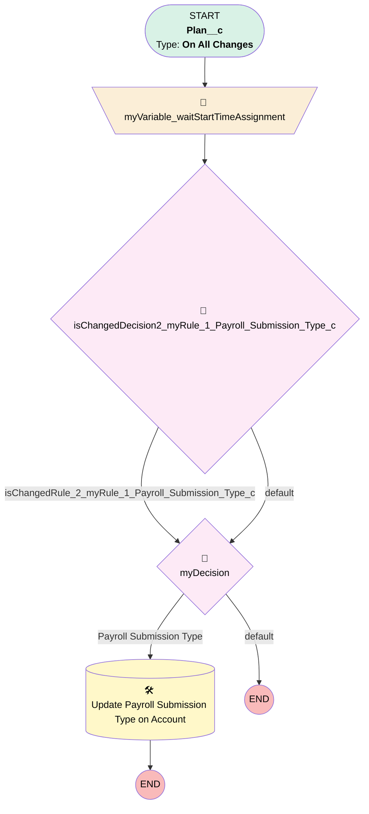

# Payroll Submission Type

## Flow Diagram [(_View History_)](Payroll_Submission_Type-history.md)

<!-- Flow description -->

## General Information

|<!-- -->|<!-- -->|
|:---|:---|
|Process Type| Workflow|
|Label|Payroll Submission Type|
|Status|Active|
|Description|Populates field on Account object when Plan object field is populated|
|Interview Label|Payroll_Submission_Type-1_InterviewLabel|
|Start Element Reference|[myVariable_waitStartTimeAssignment](#myvariable_waitstarttimeassignment)|
| Object Type (PM)|Plan__c|
| Object Variable (PM)|myVariable_current|
| Old Object Variable (PM)|myVariable_old|
| Trigger Type (PM)|onAllChanges|

## Variables

|Name|Data Type|Is Collection|Is Input|Is Output|Object Type|Description|
|:-- |:--:|:--:|:--:|:--:|:--:|:--  |
|myVariable_current|SObject|⬜|✅|✅|Plan__c|<!-- -->|
|myVariable_old|SObject|⬜|✅|⬜|Plan__c|<!-- -->|
|myVariable_waitStartTimeVariable|DateTime|⬜|⬜|⬜|<!-- -->|<!-- -->|

## Flow Nodes Details

### myVariable_waitStartTimeAssignment

|<!-- -->|<!-- -->|
|:---|:---|
|Type|Assignment|
|Label|[myVariable_waitStartTimeAssignment](#myvariable_waitstarttimeassignment)|
|Connector|[isChangedDecision2_myRule_1_Payroll_Submission_Type_c](#ischangeddecision2_myrule_1_payroll_submission_type_c)|

#### Assignments

|Assign To Reference|Operator|Value|
|:-- |:--:|:--: |
|myVariable_waitStartTimeVariable| Assign|$Flow.CurrentDateTime|

### isChangedDecision2_myRule_1_Payroll_Submission_Type_c

|<!-- -->|<!-- -->|
|:---|:---|
|Type|Decision|
|Label|[isChangedDecision2_myRule_1_Payroll_Submission_Type_c](#ischangeddecision2_myrule_1_payroll_submission_type_c)|
|Default Connector|[myDecision](#mydecision)|
|Default Connector Label|default|

#### Rule isChangedRule_2_myRule_1_Payroll_Submission_Type_c (isChangedRule_2_myRule_1_Payroll_Submission_Type_c)

|<!-- -->|<!-- -->|
|:---|:---|
|Connector|[myDecision](#mydecision)|
|Condition Logic|and|

|Condition Id|Left Value Reference|Operator|Right Value|
|:-- |:-- |:--:|:--: |
|1|myVariable_old| Is Null|⬜|
|2|myVariable_old.Payroll_Submission_Type__c| Not Equal To|myVariable_current.Payroll_Submission_Type__c|

### myDecision

|<!-- -->|<!-- -->|
|:---|:---|
|Type|Decision|
|Label|[myDecision](#mydecision)|
|Default Connector Label|default|
|Index (PM)|numberValue: 0 |

#### Rule myRule_1 (Payroll Submission Type)

|<!-- -->|<!-- -->|
|:---|:---|
|Connector|[myRule_1_A1](#myrule_1_a1)|
|Condition Logic|and|

|Condition Id|Left Value Reference|Operator|Right Value|
|:-- |:-- |:--:|:--: |
|1|isChangedRule_2_myRule_1_Payroll_Submission_Type_c| Equal To|✅|
|2|myVariable_current.Payroll_Submission_Type__c| Is Null|⬜|

### myRule_1_A1

|<!-- -->|<!-- -->|
|:---|:---|
|Type|Record Update|
|Object|Account|
|Label|Update Payroll Submission Type on Account|
|Evaluation Type (PM)|always|
|Is Child Relationship (PM)|⬜|
|Reference (PM)|[Plan__c].Account|

#### Filters (logic: **and**)

|Filter Id|Field|Operator|Value|
|:-- |:-- |:--:|:--: |
|1|Id| Equal To|myVariable_current.Account__c|

#### Input Assignments

|Field|Value|
|:-- |:--: |
|Payroll_Submission_Type__c|myVariable_current.Payroll_Submission_Type__c|

___

_Documentation generated from branch monitoring_myubiquity by [sfdx-hardis](https://sfdx-hardis.cloudity.com), featuring [salesforce-flow-visualiser](https://github.com/toddhalfpenny/salesforce-flow-visualiser)_