# Plan | After Save | Set Client Health Info

## Flow Diagram [(_View History_)](Plan_After_Save_Set_Client_Health_Info-history.md)

```mermaid
%% If you read this, your Markdown visualizer does not handle MermaidJS syntax.
%% - If you are in VS Code, install extension `Markdown Preview Mermaid Support` at https://marketplace.visualstudio.com/items?itemName=bierner.markdown-mermaid
%% - If you are using sfdx-hardis, try to define env variable `MERMAID_MODES=cli,docker` ,then run again the command to regenerate markdown with SVG images.
%% - If you are within mkdocs-material, define mermaid plugin in `mkdocs.yml` as described in https://squidfunk.github.io/mkdocs-material/extensions/mermaid/
%% - As a last resort, you can copy-paste this MermaidJS code into https://mermaid.live/ to see the flow diagram

flowchart TB
START(["START<br/><b>AutoLaunched Flow</b></br>Type: <b> Record After Save</b>"]):::startClass
click START "#general-information" "4230969806"

Assign_values_for_new_health_score_object[\"🟰 <em></em><br/>Assign values for new health score object"/]:::assignments
click Assign_values_for_new_health_score_object "#assign_values_for_new_health_score_object" "2383392892"

Set_health_score[\"🟰 <em></em><br/>Set health score"/]:::assignments
click Set_health_score "#set_health_score" "2860626079"

Set_new_health_info[\"🟰 <em></em><br/>Set new health info"/]:::assignments
click Set_new_health_info "#set_new_health_info" "2718177006"

Check_if_client_health_info_needs_update{"🔀 <em></em><br/>Check if client health info needs update"}:::decisions
click Check_if_client_health_info_needs_update "#check_if_client_health_info_needs_update" "2141162991"

Check_if_new_health_object_needed{"🔀 <em></em><br/>Check if new health object needed"}:::decisions
click Check_if_new_health_object_needed "#check_if_new_health_object_needed" "1612317953"

Create_new_health_obj[("➕ <em></em><br/>Create new health obj")]:::recordCreates
click Create_new_health_obj "#create_new_health_obj" "312078341"

Update_triggering_plan[("🛠️ <em></em><br/>Update triggering plan")]:::recordUpdates
click Update_triggering_plan "#update_triggering_plan" "2913737204"

Assign_values_for_new_health_score_object --> Create_new_health_obj
Set_health_score --> Update_triggering_plan
Set_new_health_info --> Check_if_new_health_object_needed
Check_if_client_health_info_needs_update --> |"Health info needs updating"| Set_new_health_info
Check_if_client_health_info_needs_update --> |"Default Outcome"| END_Check_if_client_health_info_needs_update
Check_if_new_health_object_needed --> |"Init score needed"| Set_health_score
Check_if_new_health_object_needed --> |"Score changed - create new client health obj"| Assign_values_for_new_health_score_object
Check_if_new_health_object_needed --> |"Default Outcome"| Update_triggering_plan
Create_new_health_obj --> Set_health_score
Update_triggering_plan --> END_Update_triggering_plan
START -->  Check_if_client_health_info_needs_update
END_Check_if_client_health_info_needs_update(( END )):::endClass
END_Update_triggering_plan(( END )):::endClass


classDef actionCalls fill:#D4E4FC,color:black,text-decoration:none,max-height:100px
classDef assignments fill:#FBEED7,color:black,text-decoration:none,max-height:100px
classDef collectionProcessors fill:#F0E3FA,color:black,text-decoration:none,max-height:100px
classDef customErrors fill:#FFE9E9,color:black,text-decoration:none,max-height:100px
classDef decisions fill:#FDEAF6,color:black,text-decoration:none,max-height:100px
classDef loops fill:#FDEAF6,color:black,text-decoration:none,max-height:100px
classDef recordCreates fill:#FFF8C9,color:black,text-decoration:none,max-height:100px
classDef recordDeletes fill:#FFF8C9,color:black,text-decoration:none,max-height:100px
classDef recordLookups fill:#EDEAFF,color:black,text-decoration:none,max-height:100px
classDef recordUpdates fill:#FFF8C9,color:black,text-decoration:none,max-height:100px
classDef screens fill:#DFF6FF,color:black,text-decoration:none,max-height:100px
classDef subflows fill:#D4E4FC,color:black,text-decoration:none,max-height:100px
classDef startClass fill:#D9F2E6,color:black,text-decoration:none,max-height:100px
classDef endClass fill:#F9BABA,color:black,text-decoration:none,max-height:100px
classDef transforms fill:#FDEAF6,color:black,text-decoration:none,max-height:100px


```

<!-- Flow description -->

## General Information

|<!-- -->|<!-- -->|
|:---|:---|
|Object|Plan__c|
|Process Type| Auto Launched Flow|
|Trigger Type| Record After Save|
|Record Trigger Type| Create And Update|
|Label|Plan | After Save | Set Client Health Info|
|Status|Obsolete|
|Environments|Default|
|Interview Label|Plan | After Save | Set Client Health Info {!$Flow.CurrentDateTime}|
| Builder Type (PM)|LightningFlowBuilder|
| Canvas Mode (PM)|AUTO_LAYOUT_CANVAS|
| Origin Builder Type (PM)|LightningFlowBuilder|
|Connector|[Check_if_client_health_info_needs_update](#check_if_client_health_info_needs_update)|
|Next Node|[Check_if_client_health_info_needs_update](#check_if_client_health_info_needs_update)|

## Variables

|Name|Data Type|Is Collection|Is Input|Is Output|Object Type|Description|
|:-- |:--:|:--:|:--:|:--:|:--:|:--  |
|newClientHealthScore|SObject|⬜|⬜|⬜|Client_Health_Score__c|<!-- -->|

## Formulas

|Name|Data Type|Expression|Description|
|:-- |:--:|:-- |:--  |
|healthInfoFormatted|String|CASE({!$Record.Billing_HM_Score__c},1,"Billing Current",-1,"Billing Behind","") & CASE({!$Record.Payroll_HM_Score__c},1,", Payroll Submission Current",-1,", Payroll Submission Behind","") & CASE({!$Record.CSAT_HM_Score__c},1,", Positive CSAT",-1,", Negative CSAT","") & CASE({!$Record.NPS_HM_Score__c} ,1,", Positive NPS",-1,", Negative NPS","") & CASE({!$Record.Review_HM_Score__c} ,1,", Positive Review",-1,", Negative Review","") & CASE({!$Record.Sentiment_HM_Score__c}  ,1,", Positive Sentiment",-1,", Negative Sentiment","") & IF({!$Record.Referral_HM_Score__c} =1,", Referral Given","")|<!-- -->|
|isNew|Boolean|ISNEW()|<!-- -->|

## Flow Nodes Details

### Assign_values_for_new_health_score_object

|<!-- -->|<!-- -->|
|:---|:---|
|Type|Assignment|
|Label|Assign values for new health score object|
|Connector|[Create_new_health_obj](#create_new_health_obj)|

#### Assignments

|Assign To Reference|Operator|Value|
|:-- |:--:|:--: |
|newClientHealthScore.Client_Health_Score__c| Assign|$Record.Client_Health_Metric_Score__c|
|newClientHealthScore.Date_Recorded__c| Assign|$Flow.CurrentDate|
|newClientHealthScore.Plan__c| Assign|$Record.Id|
|newClientHealthScore.Plan_Status__c| Assign|$Record.Status__c|
|newClientHealthScore.Record_Event__c| Assign|Live Change|

### Set_health_score

|<!-- -->|<!-- -->|
|:---|:---|
|Type|Assignment|
|Label|Set health score|
|Connector|[Update_triggering_plan](#update_triggering_plan)|

#### Assignments

|Assign To Reference|Operator|Value|
|:-- |:--:|:--: |
|$Record.Client_Health_Score__c| Assign|$Record.Client_Health_Metric_Score__c|

### Set_new_health_info

|<!-- -->|<!-- -->|
|:---|:---|
|Type|Assignment|
|Label|Set new health info|
|Connector|[Check_if_new_health_object_needed](#check_if_new_health_object_needed)|

#### Assignments

|Assign To Reference|Operator|Value|
|:-- |:--:|:--: |
|$Record.Client_Health_Information__c| Assign|healthInfoFormatted|

### Check_if_client_health_info_needs_update

|<!-- -->|<!-- -->|
|:---|:---|
|Type|Decision|
|Label|Check if client health info needs update|
|Default Connector Label|Default Outcome|

#### Rule Health_info_needs_updating (Health info needs updating)

|<!-- -->|<!-- -->|
|:---|:---|
|Connector|[Set_new_health_info](#set_new_health_info)|
|Condition Logic|or|

|Condition Id|Left Value Reference|Operator|Right Value|
|:-- |:-- |:--:|:--: |
|1|$Record.Client_Health_Information__c| Not Equal To|healthInfoFormatted|

### Check_if_new_health_object_needed

|<!-- -->|<!-- -->|
|:---|:---|
|Type|Decision|
|Label|Check if new health object needed|
|Default Connector|[Update_triggering_plan](#update_triggering_plan)|
|Default Connector Label|Default Outcome|

#### Rule Init_score_needed (Init score needed)

|<!-- -->|<!-- -->|
|:---|:---|
|Connector|[Set_health_score](#set_health_score)|
|Condition Logic|and|

|Condition Id|Left Value Reference|Operator|Right Value|
|:-- |:-- |:--:|:--: |
|1|$Record.Client_Health_Metric_Score__c| Is Null|⬜|
|2|$Record.Client_Health_Score__c| Is Null|✅|

#### Rule Score_changed_create_new_client_health_obj (Score changed - create new client health obj)

|<!-- -->|<!-- -->|
|:---|:---|
|Connector|[Assign_values_for_new_health_score_object](#assign_values_for_new_health_score_object)|
|Condition Logic|and|

|Condition Id|Left Value Reference|Operator|Right Value|
|:-- |:-- |:--:|:--: |
|1|$Record.Client_Health_Metric_Score__c| Not Equal To|$Record.Client_Health_Score__c|

### Create_new_health_obj

|<!-- -->|<!-- -->|
|:---|:---|
|Type|Record Create|
|Label|Create new health obj|
|Input Reference|newClientHealthScore|
|Connector|isGoTo: true targetReference: Set_health_score |

### Update_triggering_plan

|<!-- -->|<!-- -->|
|:---|:---|
|Type|Record Update|
|Label|Update triggering plan|
|Input Reference|$Record|

___

_Documentation generated from branch monitoring_myubiquity by [sfdx-hardis](https://sfdx-hardis.cloudity.com), featuring [salesforce-flow-visualiser](https://github.com/toddhalfpenny/salesforce-flow-visualiser)_