# Plan | After Trigger | Close Imp

## Flow Diagram [(_View History_)](Plan_After_Trigger_Close_Imp-history.md)

```mermaid
%% If you read this, your Markdown visualizer does not handle MermaidJS syntax.
%% - If you are in VS Code, install extension `Markdown Preview Mermaid Support` at https://marketplace.visualstudio.com/items?itemName=bierner.markdown-mermaid
%% - If you are using sfdx-hardis, try to define env variable `MERMAID_MODES=cli,docker` ,then run again the command to regenerate markdown with SVG images.
%% - If you are within mkdocs-material, define mermaid plugin in `mkdocs.yml` as described in https://squidfunk.github.io/mkdocs-material/extensions/mermaid/
%% - As a last resort, you can copy-paste this MermaidJS code into https://mermaid.live/ to see the flow diagram

flowchart TB
START(["START<br/><b>AutoLaunched Flow</b></br>Type: <b> Record After Save</b>"]):::startClass
click START "#general-information" "2482964470"

Email_Imp_Contacts_0("📧 <em></em><br/>Email Imp Contacts"):::actionCalls
click Email_Imp_Contacts_0 "#email_imp_contacts_0" "2129178878"

Email_Sallus_Contacts("📧 <em></em><br/>Email Sallus Contacts"):::actionCalls
click Email_Sallus_Contacts "#email_sallus_contacts" "1682922881"

Email_Simply_Contacts("📧 <em></em><br/>Email Simply Contacts"):::actionCalls
click Email_Simply_Contacts "#email_simply_contacts" "683977128"

Notify_Imp_Owner_and_Manager("📧 <em></em><br/>Notify Imp Owner and Manager"):::actionCalls
click Notify_Imp_Owner_and_Manager "#notify_imp_owner_and_manager" "2700343954"

Send_no_fund_email("📧 <em></em><br/>Send no fund email"):::actionCalls
click Send_no_fund_email "#send_no_fund_email" "1213499115"

Send_TPA_Email("📧 <em></em><br/>Send TPA Email"):::actionCalls
click Send_TPA_Email "#send_tpa_email" "4036323162"

sendAlertRichSallus("📧 <em></em><br/>sendAlertRichSallus"):::actionCalls
click sendAlertRichSallus "#sendalertrichsallus" "2551596967"

Add_Recipients[\"🟰 <em></em><br/>Add Recipients"/]:::assignments
click Add_Recipients "#add_recipients" "1066146583"

Add_to_Collection[\"🟰 <em></em><br/>Add to Collection"/]:::assignments
click Add_to_Collection "#add_to_collection" "2278392143"

Complete_Tasks[\"🟰 <em></em><br/>Complete Tasks"/]:::assignments
click Complete_Tasks "#complete_tasks" "3082272808"

Client_Verification{"🔀 <em></em><br/>Client Verification"}:::decisions
click Client_Verification "#client_verification" "2930524674"

Conversion_or_New_Plan{"🔀 <em></em><br/>Conversion or New Plan"}:::decisions
click Conversion_or_New_Plan "#conversion_or_new_plan" "1433042058"

Conversion_or_New_Plan_0{"🔀 <em></em><br/>Conversion or New Plan"}:::decisions
click Conversion_or_New_Plan_0 "#conversion_or_new_plan_0" "1997734089"

Eligible_to_Complete{"🔀 <em></em><br/>Eligible to Complete"}:::decisions
click Eligible_to_Complete "#eligible_to_complete" "234830124"

Error_Type{"🔀 <em></em><br/>Error Type"}:::decisions
click Error_Type "#error_type" "3762852049"

Null_Check{"🔀 <em></em><br/>Null Check"}:::decisions
click Null_Check "#null_check" "4054069861"

Onboarding_TPA_Found{"🔀 <em></em><br/>Onboarding TPA Found?"}:::decisions
click Onboarding_TPA_Found "#onboarding_tpa_found" "2195073017"

Payroll_Task{"🔀 <em></em><br/>Payroll Task"}:::decisions
click Payroll_Task "#payroll_task" "377130370"

Simply_Unbundled{"🔀 <em></em><br/>Simply Unbundled?"}:::decisions
click Simply_Unbundled "#simply_unbundled" "4114585906"

Task_Validation{"🔀 <em></em><br/>Task Validation"}:::decisions
click Task_Validation "#task_validation" "566098084"

Validate_User{"🔀 <em></em><br/>Validate User"}:::decisions
click Validate_User "#validate_user" "3433343354"

Close_Tasks{{"🔁 <em></em><br/>Close Tasks"}}:::loops
click Close_Tasks "#close_tasks" "3534489606"

Get_Client[("🔍 <em></em><br/>Get Client")]:::recordLookups
click Get_Client "#get_client" "4037530627"

Get_Imp[("🔍 <em></em><br/>Get Imp")]:::recordLookups
click Get_Imp "#get_imp" "3815391064"

Get_Onboarding_TPA[("🔍 <em></em><br/>Get Onboarding TPA")]:::recordLookups
click Get_Onboarding_TPA "#get_onboarding_tpa" "136129272"

Get_Open_Tasks[("🔍 <em></em><br/>Get Open Tasks")]:::recordLookups
click Get_Open_Tasks "#get_open_tasks" "1476611431"

Close_Imp_0_0_0[("🛠️ <em></em><br/>Close Imp")]:::recordUpdates
click Close_Imp_0_0_0 "#close_imp_0_0_0" "1158337888"

Close_Tasks_and_Imp_0[("🛠️ <em></em><br/>Close Tasks and Imp")]:::recordUpdates
click Close_Tasks_and_Imp_0 "#close_tasks_and_imp_0" "3204718034"

Update_plan_to_active[("🛠️ <em></em><br/>Update plan to active")]:::recordUpdates
click Update_plan_to_active "#update_plan_to_active" "712283828"

Email_Imp_Contacts_0 --> END_Email_Imp_Contacts_0
Email_Sallus_Contacts --> sendAlertRichSallus
Email_Simply_Contacts --> Simply_Unbundled
Notify_Imp_Owner_and_Manager --> END_Notify_Imp_Owner_and_Manager
Send_no_fund_email --> END_Send_no_fund_email
Send_TPA_Email --> END_Send_TPA_Email
sendAlertRichSallus --> END_sendAlertRichSallus
Add_Recipients --> Notify_Imp_Owner_and_Manager
Add_to_Collection --> Close_Tasks
Complete_Tasks --> Add_to_Collection
Client_Verification --> |"Completed without funding"| Send_no_fund_email
Client_Verification --> |"Client Found"| Email_Imp_Contacts_0
Client_Verification --> |"Simply Client Found"| Email_Simply_Contacts
Client_Verification --> |"Sallus Client Found"| Email_Sallus_Contacts
Client_Verification --> |"Client Missing"| END_Client_Verification
Conversion_or_New_Plan --> |"Conversion/New Plan"| Close_Tasks_and_Imp_0
Conversion_or_New_Plan --> |"Not Eligible"| Conversion_or_New_Plan_0
Conversion_or_New_Plan_0 --> |"Conversion/New Plan"| Close_Imp_0_0_0
Conversion_or_New_Plan_0 --> |"Not Eligible"| END_Conversion_or_New_Plan_0
Eligible_to_Complete --> |"Yes"| Get_Open_Tasks
Eligible_to_Complete --> |"Default Outcome"| END_Eligible_to_Complete
Error_Type --> |"Validation"| Add_Recipients
Error_Type --> |"Default Outcome"| END_Error_Type
Null_Check --> |"Tasks Found"| Conversion_or_New_Plan
Null_Check --> |"Default Outcome"| Conversion_or_New_Plan_0
Onboarding_TPA_Found --> |"Yes, Found"| Send_TPA_Email
Onboarding_TPA_Found --> |"Not Found"| END_Onboarding_TPA_Found
Payroll_Task --> |"Close Tasks"| Complete_Tasks
Payroll_Task --> |"Delete Tasks"| Close_Tasks
Payroll_Task --> |"Default Outcome"| Close_Tasks
Simply_Unbundled --> |"Unbundled"| Get_Onboarding_TPA
Simply_Unbundled --> |"No"| END_Simply_Unbundled
Task_Validation --> |"Tasks Found"| Close_Tasks
Task_Validation --> |"No Open Tasks"| Null_Check
Validate_User --> |"Funding after the fact"| Update_plan_to_active
Validate_User --> |"Valid"| Get_Imp
Close_Tasks --> |"For Each"|Payroll_Task
Close_Tasks ---> |"After Last"|Null_Check
Get_Client --> Client_Verification
Get_Imp --> Eligible_to_Complete
Get_Onboarding_TPA --> Onboarding_TPA_Found
Get_Open_Tasks --> Task_Validation
Close_Imp_0_0_0 --> Get_Client
Close_Imp_0_0_0 -. Fault .->Error_Type
Close_Tasks_and_Imp_0 --> Conversion_or_New_Plan_0
Close_Tasks_and_Imp_0 -. Fault .->Error_Type
Update_plan_to_active --> END_Update_plan_to_active
START -->  Validate_User
END_Email_Imp_Contacts_0(( END )):::endClass
END_Notify_Imp_Owner_and_Manager(( END )):::endClass
END_Send_no_fund_email(( END )):::endClass
END_Send_TPA_Email(( END )):::endClass
END_sendAlertRichSallus(( END )):::endClass
END_Client_Verification(( END )):::endClass
END_Conversion_or_New_Plan_0(( END )):::endClass
END_Eligible_to_Complete(( END )):::endClass
END_Error_Type(( END )):::endClass
END_Onboarding_TPA_Found(( END )):::endClass
END_Simply_Unbundled(( END )):::endClass
END_Update_plan_to_active(( END )):::endClass


classDef actionCalls fill:#D4E4FC,color:black,text-decoration:none,max-height:100px
classDef assignments fill:#FBEED7,color:black,text-decoration:none,max-height:100px
classDef collectionProcessors fill:#F0E3FA,color:black,text-decoration:none,max-height:100px
classDef customErrors fill:#FFE9E9,color:black,text-decoration:none,max-height:100px
classDef decisions fill:#FDEAF6,color:black,text-decoration:none,max-height:100px
classDef loops fill:#FDEAF6,color:black,text-decoration:none,max-height:100px
classDef recordCreates fill:#FFF8C9,color:black,text-decoration:none,max-height:100px
classDef recordDeletes fill:#FFF8C9,color:black,text-decoration:none,max-height:100px
classDef recordLookups fill:#EDEAFF,color:black,text-decoration:none,max-height:100px
classDef recordUpdates fill:#FFF8C9,color:black,text-decoration:none,max-height:100px
classDef screens fill:#DFF6FF,color:black,text-decoration:none,max-height:100px
classDef subflows fill:#D4E4FC,color:black,text-decoration:none,max-height:100px
classDef startClass fill:#D9F2E6,color:black,text-decoration:none,max-height:100px
classDef endClass fill:#F9BABA,color:black,text-decoration:none,max-height:100px
classDef transforms fill:#FDEAF6,color:black,text-decoration:none,max-height:100px


```

<!-- Flow description -->

## General Information

|<!-- -->|<!-- -->|
|:---|:---|
|Object|Plan__c|
|Process Type| Auto Launched Flow|
|Trigger Type| Record After Save|
|Record Trigger Type| Create And Update|
|Label|Plan | After Trigger | Close Imp|
|Status|Active|
|Description|If Payroll Submitted, Close Imp.  If Imp fails to close from missing data, alert imp owner.  Added check so plans are eligible for completion with EITHER a funding call OR self service|
|Environments|Default|
|Interview Label|Plan | After Trigger | Close Imp {!$Flow.CurrentDateTime}|
| Builder Type (PM)|LightningFlowBuilder|
| Canvas Mode (PM)|FREE_FORM_CANVAS|
| Origin Builder Type (PM)|LightningFlowBuilder|
|Connector|[Validate_User](#validate_user)|
|Next Node|[Validate_User](#validate_user)|

#### Filters (logic: **(((1 OR 7) AND 3) OR (8 AND 1)) AND 4 AND 5 AND 6 AND 2**)

|Filter Id|Field|Operator|Value|
|:-- |:-- |:--:|:--: |
|1|Most_Recent_Payroll_Submitted__c| Is Null|<!-- -->|
|2|Implementation__c| Is Null|<!-- -->|
|3|Implementation_Status__c| Contains|In Progress|
|4|Most_Recent_Case_Sentiment_S_T__c| Is Changed|⬜|
|5|Most_Recent_Case_Sentiment_Saver__c| Is Changed|⬜|
|6|Sentiment_HM_Score__c| Is Changed|⬜|
|7|Complete_without_funding__c| Equal To|✅|
|8|Status__c| Equal To|Active Not Funded|

## Variables

|Name|Data Type|Is Collection|Is Input|Is Output|Object Type|Description|
|:-- |:--:|:--:|:--:|:--:|:--:|:--  |
|aCon|SObject|⬜|✅|⬜|Associated_Contact__c|<!-- -->|
|completeTasks|SObject|✅|✅|⬜|Project_Task__c|<!-- -->|
|ErrorEmailRecipients|String|✅|⬜|⬜|<!-- -->|<!-- -->|
|onboardingTPA|SObject|⬜|✅|⬜|Associated_Contact__c|<!-- -->|
|openProjTasks|SObject|✅|✅|⬜|Project_Task__c|<!-- -->|

## Formulas

|Name|Data Type|Expression|Description|
|:-- |:--:|:-- |:--  |
|FormattedError|String|MID({!$Flow.FaultMessage}, FIND("FIELD_CUSTOM_VALIDATION_EXCEPTION:", {!$Flow.FaultMessage}), FIND("You can look up ExceptionCode values",{!$Flow.FaultMessage})-FIND("FIELD_CUSTOM_VALIDATION_EXCEPTION:", {!$Flow.FaultMessage}))|<!-- -->|
|now|DateTime|NOW()|<!-- -->|
|today|Date|TODAY()|<!-- -->|

## Text Templates

|Name|Text|Description|
|:-- |:-- |:--  |
|ErrorEmailBody|Hello {!$Record.Implementation__r.Owner:User.FirstName},  The implementation for {!$Record.Name} attempted to close, but it was stopped by a validation error.  Please review the message below, and complete the appropriate fields on the implementation.  {!FormattedError}  Link to implementation: https://myubiquity.lightning.force.com/lightning/r/Implementation__c/{!$Record.Implementation__r.Implementation_ID_18_Char__c}/view  Thanks!  BI Team ____________|<!-- -->|
|richAtSallusBody|This notice informs you a new Sallus plan has been created - {!$Record.Name} / {!$Record.Custodian_Account_ID__c}. Please reach out to your contact at Ubiquity with any questions.  Thank You,  Ubiquity|<!-- -->|

## Flow Nodes Details

### Email_Imp_Contacts_0

|<!-- -->|<!-- -->|
|:---|:---|
|Type|Action Call|
|Label|Email Imp Contacts|
|Action Type|Email Alert|
|Action Name|Associated_Contact__c.Implementation_Complete_Auto_Email|
|Flow Transaction Model|CurrentTransaction|
|Name Segment|Associated_Contact__c.Implementation_Complete_Auto_Email|
| SObject Row Id (input)|aCon.Id|

### Email_Sallus_Contacts

|<!-- -->|<!-- -->|
|:---|:---|
|Type|Action Call|
|Label|Email Sallus Contacts|
|Action Type|Email Alert|
|Action Name|Associated_Contact__c.Implementation_Complete_Auto_Email_Sallus|
|Flow Transaction Model|CurrentTransaction|
|Name Segment|Associated_Contact__c.Implementation_Complete_Auto_Email_Sallus|
| SObject Row Id (input)|aCon.Id|
|Connector|[sendAlertRichSallus](#sendalertrichsallus)|

### Email_Simply_Contacts

|<!-- -->|<!-- -->|
|:---|:---|
|Type|Action Call|
|Label|Email Simply Contacts|
|Action Type|Email Alert|
|Action Name|Associated_Contact__c.Implementation_Complete_Auto_Email_Simply|
|Flow Transaction Model|CurrentTransaction|
|Name Segment|Associated_Contact__c.Implementation_Complete_Auto_Email_Simply|
| SObject Row Id (input)|aCon.Id|
|Connector|[Simply_Unbundled](#simply_unbundled)|

### Notify_Imp_Owner_and_Manager

|<!-- -->|<!-- -->|
|:---|:---|
|Type|Action Call|
|Label|Notify Imp Owner and Manager|
|Action Type|Email Simple|
|Action Name|emailSimple|
|Flow Transaction Model|CurrentTransaction|
|Name Segment|emailSimple|
|Email Body (input)|ErrorEmailBody|
|Email Addresses Array (input)|ErrorEmailRecipients|
|Sender Type (input)|CurrentUser|
|Email Subject (input)|Missing data for {!$Record.Name}|

### Send_no_fund_email

|<!-- -->|<!-- -->|
|:---|:---|
|Type|Action Call|
|Label|Send no fund email|
|Action Type|Email Alert|
|Action Name|Associated_Contact__c.Implementation_Complete_no_funds_Auto_Email|
|Flow Transaction Model|CurrentTransaction|
|Name Segment|Associated_Contact__c.Implementation_Complete_no_funds_Auto_Email|
| SObject Row Id (input)|aCon.Id|

### Send_TPA_Email

|<!-- -->|<!-- -->|
|:---|:---|
|Type|Action Call|
|Label|Send TPA Email|
|Action Type|Email Alert|
|Action Name|Associated_Contact__c.Implementation_Complete_TPA_Form|
|Flow Transaction Model|CurrentTransaction|
|Name Segment|Associated_Contact__c.Implementation_Complete_TPA_Form|
| SObject Row Id (input)|onboardingTPA.Id|

### sendAlertRichSallus

|<!-- -->|<!-- -->|
|:---|:---|
|Type|Action Call|
|Label|[sendAlertRichSallus](#sendalertrichsallus)|
|Action Type|Email Simple|
|Action Name|emailSimple|
|Flow Transaction Model|CurrentTransaction|
|Name Segment|emailSimple|
|Email Addresses (input)|Richard.Henderson@broadridge.com, Eric.Schmitt@broadridge.com|
|Sender Address (input)|noreply@myubiquity.com|
|Email Subject (input)|New Sallus Account Created|
|Email Body (input)|richAtSallusBody|

### Add_Recipients

|<!-- -->|<!-- -->|
|:---|:---|
|Type|Assignment|
|Label|Add Recipients|
|Connector|[Notify_Imp_Owner_and_Manager](#notify_imp_owner_and_manager)|

#### Assignments

|Assign To Reference|Operator|Value|
|:-- |:--:|:--: |
|ErrorEmailRecipients| Add|$Record.Implementation__r.Owner:User.Email|
|ErrorEmailRecipients| Add|$Record.Implementation__r.Owner:User.Manager.Email|
|ErrorEmailRecipients| Add|$User.Email|

### Add_to_Collection

|<!-- -->|<!-- -->|
|:---|:---|
|Type|Assignment|
|Label|Add to Collection|
|Connector|[Close_Tasks](#close_tasks)|

#### Assignments

|Assign To Reference|Operator|Value|
|:-- |:--:|:--: |
|completeTasks| Add|[Close_Tasks](#close_tasks)|

### Complete_Tasks

|<!-- -->|<!-- -->|
|:---|:---|
|Type|Assignment|
|Label|Complete Tasks|
|Connector|[Add_to_Collection](#add_to_collection)|

#### Assignments

|Assign To Reference|Operator|Value|
|:-- |:--:|:--: |
|Close_Tasks.Actual_Completion_Date__c| Assign|now|
|Close_Tasks.Status__c| Assign|Completed|

### Client_Verification

|<!-- -->|<!-- -->|
|:---|:---|
|Type|Decision|
|Label|Client Verification|
|Default Connector Label|Client Missing|

#### Rule Completed_without_funding (Completed without funding)

|<!-- -->|<!-- -->|
|:---|:---|
|Connector|[Send_no_fund_email](#send_no_fund_email)|
|Condition Logic|and|

|Condition Id|Left Value Reference|Operator|Right Value|
|:-- |:-- |:--:|:--: |
|1|$Record.Complete_without_funding__c| Equal To|✅|

#### Rule Client_Found (Client Found)

|<!-- -->|<!-- -->|
|:---|:---|
|Connector|[Email_Imp_Contacts_0](#email_imp_contacts_0)|
|Condition Logic|1 AND NOT 2 AND 3|

|Condition Id|Left Value Reference|Operator|Right Value|
|:-- |:-- |:--:|:--: |
|1|aCon.Id| Is Null|⬜|
|2|$Record.Service_Option__c| Contains|Simply Retirement|
|3|$Record.Product_Type1__c| Not Equal To|PEP|

#### Rule Simply_Client_Found (Simply Client Found)

|<!-- -->|<!-- -->|
|:---|:---|
|Connector|[Email_Simply_Contacts](#email_simply_contacts)|
|Condition Logic|and|

|Condition Id|Left Value Reference|Operator|Right Value|
|:-- |:-- |:--:|:--: |
|1|aCon.Id| Is Null|⬜|
|2|$Record.Service_Option__c| Contains|Simply Retirement|

#### Rule Sallus_Client_Found (Sallus Client Found)

|<!-- -->|<!-- -->|
|:---|:---|
|Connector|[Email_Sallus_Contacts](#email_sallus_contacts)|
|Condition Logic|and|

|Condition Id|Left Value Reference|Operator|Right Value|
|:-- |:-- |:--:|:--: |
|1|aCon.Id| Is Null|⬜|
|2|$Record.Product_Type1__c| Equal To|PEP|

### Conversion_or_New_Plan

|<!-- -->|<!-- -->|
|:---|:---|
|Type|Decision|
|Label|Conversion or New Plan|
|Default Connector|[Conversion_or_New_Plan_0](#conversion_or_new_plan_0)|
|Default Connector Label|Not Eligible|

#### Rule Conversion (Conversion/New Plan)

|<!-- -->|<!-- -->|
|:---|:---|
|Connector|[Close_Tasks_and_Imp_0](#close_tasks_and_imp_0)|
|Condition Logic|(1 AND 2) OR 3|

|Condition Id|Left Value Reference|Operator|Right Value|
|:-- |:-- |:--:|:--: |
|1|$Record.Implementation__r.Plan_Type__c| Equal To|Conversion Plan|
|2|$Record.Implementation__r.Conversion_Assets_Posted__c| Is Null|⬜|
|3|$Record.Implementation__r.Plan_Type__c| Equal To|New Plan|

### Conversion_or_New_Plan_0

|<!-- -->|<!-- -->|
|:---|:---|
|Type|Decision|
|Label|Conversion or New Plan|
|Default Connector Label|Not Eligible|

#### Rule Conversion_0 (Conversion/New Plan)

|<!-- -->|<!-- -->|
|:---|:---|
|Connector|[Close_Imp_0_0_0](#close_imp_0_0_0)|
|Condition Logic|(1 AND 2) OR 3|

|Condition Id|Left Value Reference|Operator|Right Value|
|:-- |:-- |:--:|:--: |
|1|$Record.Implementation__r.Plan_Type__c| Equal To|Conversion Plan|
|2|$Record.Implementation__r.Conversion_Assets_Settled__c| Is Null|⬜|
|3|$Record.Implementation__r.Plan_Type__c| Equal To|New Plan|

### Eligible_to_Complete

|<!-- -->|<!-- -->|
|:---|:---|
|Type|Decision|
|Label|Eligible to Complete|
|Default Connector Label|Default Outcome|

#### Rule Yes (Yes)

|<!-- -->|<!-- -->|
|:---|:---|
|Connector|[Get_Open_Tasks](#get_open_tasks)|
|Condition Logic|or|

|Condition Id|Left Value Reference|Operator|Right Value|
|:-- |:-- |:--:|:--: |
|1|Get_Imp.Funding_Call_Complete__c| Equal To|✅|
|2|Get_Imp.Finch_Credential_Status__c| Equal To|active|
|3|Get_Imp.Census_Self_Service__c| Equal To|✅|

### Error_Type

|<!-- -->|<!-- -->|
|:---|:---|
|Type|Decision|
|Label|Error Type|
|Default Connector Label|Default Outcome|

#### Rule Validation (Validation)

|<!-- -->|<!-- -->|
|:---|:---|
|Connector|[Add_Recipients](#add_recipients)|
|Condition Logic|1 AND (2 OR 3)|

|Condition Id|Left Value Reference|Operator|Right Value|
|:-- |:-- |:--:|:--: |
|1|$Flow.FaultMessage| Contains|FIELD_CUSTOM_VALIDATION_EXCEPTION:|
|2|$User.Profile_ID__c| Equal To|00e1G0000011hdP|
|3|$User.Profile_ID__c| Equal To|00e00000006ohd0|

### Null_Check

|<!-- -->|<!-- -->|
|:---|:---|
|Type|Decision|
|Label|Null Check|
|Default Connector|[Conversion_or_New_Plan_0](#conversion_or_new_plan_0)|
|Default Connector Label|Default Outcome|

#### Rule Tasks_Found (Tasks Found)

|<!-- -->|<!-- -->|
|:---|:---|
|Connector|[Conversion_or_New_Plan](#conversion_or_new_plan)|
|Condition Logic|and|

|Condition Id|Left Value Reference|Operator|Right Value|
|:-- |:-- |:--:|:--: |
|1|completeTasks| Is Null|⬜|

### Onboarding_TPA_Found

|<!-- -->|<!-- -->|
|:---|:---|
|Type|Decision|
|Label|Onboarding TPA Found?|
|Default Connector Label|Not Found|

#### Rule Yes_Found (Yes, Found)

|<!-- -->|<!-- -->|
|:---|:---|
|Connector|[Send_TPA_Email](#send_tpa_email)|
|Condition Logic|and|

|Condition Id|Left Value Reference|Operator|Right Value|
|:-- |:-- |:--:|:--: |
|1|onboardingTPA.Id| Is Null|⬜|

### Payroll_Task

|<!-- -->|<!-- -->|
|:---|:---|
|Type|Decision|
|Label|Payroll Task|
|Default Connector|[Close_Tasks](#close_tasks)|
|Default Connector Label|Default Outcome|

#### Rule Close_Tasks_0 (Close Tasks)

|<!-- -->|<!-- -->|
|:---|:---|
|Connector|[Complete_Tasks](#complete_tasks)|
|Condition Logic|or|

|Condition Id|Left Value Reference|Operator|Right Value|
|:-- |:-- |:--:|:--: |
|1|Close_Tasks.Name| Contains|Upload 1st Payroll|
|2|Close_Tasks.Name| Contains|Complete Implementation|

#### Rule Delete_Tasks (Delete Tasks)

|<!-- -->|<!-- -->|
|:---|:---|
|Connector|[Close_Tasks](#close_tasks)|
|Condition Logic|NOT 1 AND NOT 2|

|Condition Id|Left Value Reference|Operator|Right Value|
|:-- |:-- |:--:|:--: |
|1|Close_Tasks.Name| Contains|Upload 1st Payroll|
|2|Close_Tasks.Name| Contains|Complete Implementation|

### Simply_Unbundled

|<!-- -->|<!-- -->|
|:---|:---|
|Type|Decision|
|Label|Simply Unbundled?|
|Default Connector Label|No|

#### Rule Unbundled (Unbundled)

|<!-- -->|<!-- -->|
|:---|:---|
|Connector|[Get_Onboarding_TPA](#get_onboarding_tpa)|
|Condition Logic|and|

|Condition Id|Left Value Reference|Operator|Right Value|
|:-- |:-- |:--:|:--: |
|1|Get_Imp.Service_Option__c| Equal To|Simply Retirement Unbundled|

### Task_Validation

|<!-- -->|<!-- -->|
|:---|:---|
|Type|Decision|
|Label|Task Validation|
|Default Connector|[Null_Check](#null_check)|
|Default Connector Label|No Open Tasks|

#### Rule Tasks_Found_0 (Tasks Found)

|<!-- -->|<!-- -->|
|:---|:---|
|Connector|[Close_Tasks](#close_tasks)|
|Condition Logic|and|

|Condition Id|Left Value Reference|Operator|Right Value|
|:-- |:-- |:--:|:--: |
|1|openProjTasks| Is Null|⬜|

### Validate_User

|<!-- -->|<!-- -->|
|:---|:---|
|Type|Decision|
|Label|Validate User|
|Description|Added path to account for plans that later fund after becoming active w/ no funding|
|Default Connector|[Get_Imp](#get_imp)|
|Default Connector Label|Valid|

#### Rule Saver_Success_Catch (Saver Success Catch)

|<!-- -->|<!-- -->|
|:---|:---|
|Condition Logic|and|

|Condition Id|Left Value Reference|Operator|Right Value|
|:-- |:-- |:--:|:--: |
|1|$User.Profile_ID__c| Equal To|00e1G0000011hjh|

#### Rule Funding_after_the_fact (Funding after the fact)

|<!-- -->|<!-- -->|
|:---|:---|
|Connector|[Update_plan_to_active](#update_plan_to_active)|
|Condition Logic|and|

|Condition Id|Left Value Reference|Operator|Right Value|
|:-- |:-- |:--:|:--: |
|1|$Record.Complete_without_funding__c| Equal To|✅|
|2|$Record.Status__c| Equal To|Active Not Funded|
|3|$Record.Most_Recent_Payroll_Submitted__c| Is Null|⬜|

### Close_Tasks

|<!-- -->|<!-- -->|
|:---|:---|
|Type|Loop|
|Label|Close Tasks|
|Collection Reference|openProjTasks|
|Iteration Order|Asc|
|Next Value Connector|[Payroll_Task](#payroll_task)|
|No More Values Connector|[Null_Check](#null_check)|

### Get_Client

|<!-- -->|<!-- -->|
|:---|:---|
|Type|Record Lookup|
|Object|Associated_Contact__c|
|Label|Get Client|
|Assign Null Values If No Records Found|✅|
|Output Assignments|assignToReference: aCon.Id field: Id |
|Sort Field|CreatedDate|
|Sort Order|Asc|
|Connector|[Client_Verification](#client_verification)|

#### Filters (logic: **1 AND (2 OR 3 OR 4)**)

|Filter Id|Field|Operator|Value|
|:-- |:-- |:--:|:--: |
|1|Implementation__c| Equal To|$Record.Implementation__c|
|2|Contact_Role__c| Contains|Plan Sponsor|
|3|Contact_Role__c| Contains|Trustee|
|4|Contact_Role__c| Equal To|Authorized Buyer|

### Get_Imp

|<!-- -->|<!-- -->|
|:---|:---|
|Type|Record Lookup|
|Object|Implementation__c|
|Label|Get Imp|
|Assign Null Values If No Records Found|⬜|
|Get First Record Only|✅|
|Queried Fields|- Id - Funding_Call_Complete__c - Finch_Credential_Status__c - Census_Self_Service__c - Service_Option__c |
|Store Output Automatically|✅|
|Connector|[Eligible_to_Complete](#eligible_to_complete)|

#### Filters (logic: **and**)

|Filter Id|Field|Operator|Value|
|:-- |:-- |:--:|:--: |
|1|Plan__c| Equal To|$Record.Id|

### Get_Onboarding_TPA

|<!-- -->|<!-- -->|
|:---|:---|
|Type|Record Lookup|
|Object|Associated_Contact__c|
|Label|Get Onboarding TPA|
|Assign Null Values If No Records Found|✅|
|Output Reference|onboardingTPA|
|Queried Fields|- Id - Useable_Email__c |
|Connector|[Onboarding_TPA_Found](#onboarding_tpa_found)|

#### Filters (logic: **and**)

|Filter Id|Field|Operator|Value|
|:-- |:-- |:--:|:--: |
|1|Implementation__c| Equal To|Get_Imp.Id|
|2|Contact_Role__c| Equal To|TPA - Onboarding|

### Get_Open_Tasks

|<!-- -->|<!-- -->|
|:---|:---|
|Type|Record Lookup|
|Object|Project_Task__c|
|Label|Get Open Tasks|
|Assign Null Values If No Records Found|✅|
|Output Reference|openProjTasks|
|Queried Fields|- Id - Name |
|Connector|[Task_Validation](#task_validation)|

#### Filters (logic: **and**)

|Filter Id|Field|Operator|Value|
|:-- |:-- |:--:|:--: |
|1|Implementation__c| Equal To|$Record.Implementation__c|
|2|Status__c| Not Equal To|Completed|
|3|Status__c| Not Equal To|Not Needed|
|4|Status__c| Not Equal To|Declined|

### Close_Imp_0_0_0

|<!-- -->|<!-- -->|
|:---|:---|
|Type|Record Update|
|Object|Implementation__c|
|Label|Close Imp|
|Fault Connector|[Error_Type](#error_type)|
|Connector|[Get_Client](#get_client)|

#### Filters (logic: **and**)

|Filter Id|Field|Operator|Value|
|:-- |:-- |:--:|:--: |
|1|Id| Equal To|$Record.Implementation__c|

#### Input Assignments

|Field|Value|
|:-- |:--: |
|Implementation_Completion_Date__c|today|
|Implementation_Stage__c|Completed|
|Implementation_Status__c|Completed|
|Implementation_Steps__c|Completed|
|X1st_Payroll_Date__c|$Record.Most_Recent_Payroll_Submitted__c|

### Close_Tasks_and_Imp_0

|<!-- -->|<!-- -->|
|:---|:---|
|Type|Record Update|
|Label|Close Tasks and Imp|
|Fault Connector|[Error_Type](#error_type)|
|Input Reference|completeTasks|
|Connector|[Conversion_or_New_Plan_0](#conversion_or_new_plan_0)|

### Update_plan_to_active

|<!-- -->|<!-- -->|
|:---|:---|
|Type|Record Update|
|Label|Update plan to active|
|Input Reference|$Record|

#### Input Assignments

|Field|Value|
|:-- |:--: |
|Status__c|Active|

___

_Documentation generated from branch monitoring_myubiquity by [sfdx-hardis](https://sfdx-hardis.cloudity.com), featuring [salesforce-flow-visualiser](https://github.com/toddhalfpenny/salesforce-flow-visualiser)_