# Plan | Map Sold Date Onto Account

## Flow Diagram [(_View History_)](Plan_Map_Sold_Date_Onto_Account-history.md)

```mermaid
%% If you read this, your Markdown visualizer does not handle MermaidJS syntax.
%% - If you are in VS Code, install extension `Markdown Preview Mermaid Support` at https://marketplace.visualstudio.com/items?itemName=bierner.markdown-mermaid
%% - If you are using sfdx-hardis, try to define env variable `MERMAID_MODES=cli,docker` ,then run again the command to regenerate markdown with SVG images.
%% - If you are within mkdocs-material, define mermaid plugin in `mkdocs.yml` as described in https://squidfunk.github.io/mkdocs-material/extensions/mermaid/
%% - As a last resort, you can copy-paste this MermaidJS code into https://mermaid.live/ to see the flow diagram

flowchart TB
START(["START<br/><b>Plan__c</b></br>Type: <b>On All Changes</b>"]):::startClass
click START "#general-information" "3920494987"

START --> isChangedDecision2_myRule_1_Status_c
myRule_1_A1("⚡ <em></em><br/>Update Account w/ Plan Sold Date"):::actionCalls
click myRule_1_A1 "#myrule_1_a1" "3302710906"

isChangedDecision2_myRule_1_Status_c{"🔀 <em></em><br/>isChangedDecision2_myRule_1_Status_c"}:::decisions
click isChangedDecision2_myRule_1_Status_c "#ischangeddecision2_myrule_1_status_c" "3972775828"

myDecision{"🔀 <em></em><br/>myDecision"}:::decisions
click myDecision "#mydecision" "2208060636"

myRule_1_A1 --> END_myRule_1_A1
isChangedDecision2_myRule_1_Status_c --> |"isChangedRule_2_myRule_1_Status_c"| myDecision
isChangedDecision2_myRule_1_Status_c --> |"default"| myDecision
myDecision --> |"Plan Status Changes"| myRule_1_A1
myDecision --> |"default"| END_myDecision
END_myRule_1_A1(( END )):::endClass
END_myDecision(( END )):::endClass


classDef actionCalls fill:#D4E4FC,color:black,text-decoration:none,max-height:100px
classDef assignments fill:#FBEED7,color:black,text-decoration:none,max-height:100px
classDef collectionProcessors fill:#F0E3FA,color:black,text-decoration:none,max-height:100px
classDef customErrors fill:#FFE9E9,color:black,text-decoration:none,max-height:100px
classDef decisions fill:#FDEAF6,color:black,text-decoration:none,max-height:100px
classDef loops fill:#FDEAF6,color:black,text-decoration:none,max-height:100px
classDef recordCreates fill:#FFF8C9,color:black,text-decoration:none,max-height:100px
classDef recordDeletes fill:#FFF8C9,color:black,text-decoration:none,max-height:100px
classDef recordLookups fill:#EDEAFF,color:black,text-decoration:none,max-height:100px
classDef recordUpdates fill:#FFF8C9,color:black,text-decoration:none,max-height:100px
classDef screens fill:#DFF6FF,color:black,text-decoration:none,max-height:100px
classDef subflows fill:#D4E4FC,color:black,text-decoration:none,max-height:100px
classDef startClass fill:#D9F2E6,color:black,text-decoration:none,max-height:100px
classDef endClass fill:#F9BABA,color:black,text-decoration:none,max-height:100px
classDef transforms fill:#FDEAF6,color:black,text-decoration:none,max-height:100px


```

<!-- Flow description -->

## General Information

|<!-- -->|<!-- -->|
|:---|:---|
|Process Type| Workflow|
|Label|Plan | Map Sold Date Onto Account|
|Status|Active|
|Description|For Anniversary Email Merge Fields - Map Plan Sold Date Onto Account If Plan Is Active|
|Interview Label|Plan_Map_Sold_Date_Onto_Account-1_InterviewLabel|
|Start Element Reference|[isChangedDecision2_myRule_1_Status_c](#ischangeddecision2_myrule_1_status_c)|
| Object Type (PM)|Plan__c|
| Object Variable (PM)|myVariable_current|
| Old Object Variable (PM)|myVariable_old|
| Trigger Type (PM)|onAllChanges|

## Variables

|Name|Data Type|Is Collection|Is Input|Is Output|Object Type|Description|
|:-- |:--:|:--:|:--:|:--:|:--:|:--  |
|myVariable_current|SObject|⬜|✅|✅|Plan__c|<!-- -->|
|myVariable_old|SObject|⬜|✅|⬜|Plan__c|<!-- -->|

## Flow Nodes Details

### myRule_1_A1

|<!-- -->|<!-- -->|
|:---|:---|
|Type|Action Call|
|Label|Update Account w/ Plan Sold Date|
|Action Type|Flow|
|Action Name|Account_Anniversary_Validation_Flow|
|Name Segment|Account_Anniversary_Validation_Flow|
| Action Call Type (PM)|flow|
|Flow Selection (PM)|Account Anniversary Validation Flow|
|Record Id (input)|myVariable_current.Account__c|

### isChangedDecision2_myRule_1_Status_c

|<!-- -->|<!-- -->|
|:---|:---|
|Type|Decision|
|Label|[isChangedDecision2_myRule_1_Status_c](#ischangeddecision2_myrule_1_status_c)|
|Default Connector|[myDecision](#mydecision)|
|Default Connector Label|default|

#### Rule isChangedRule_2_myRule_1_Status_c (isChangedRule_2_myRule_1_Status_c)

|<!-- -->|<!-- -->|
|:---|:---|
|Connector|[myDecision](#mydecision)|
|Condition Logic|and|

|Condition Id|Left Value Reference|Operator|Right Value|
|:-- |:-- |:--:|:--: |
|1|myVariable_old| Is Null|⬜|
|2|myVariable_old.Status__c| Not Equal To|myVariable_current.Status__c|

### myDecision

|<!-- -->|<!-- -->|
|:---|:---|
|Type|Decision|
|Label|[myDecision](#mydecision)|
|Default Connector Label|default|
|Index (PM)|numberValue: 0 |

#### Rule myRule_1 (Plan Status Changes)

|<!-- -->|<!-- -->|
|:---|:---|
|Connector|[myRule_1_A1](#myrule_1_a1)|
|Condition Logic|and|

|Condition Id|Left Value Reference|Operator|Right Value|
|:-- |:-- |:--:|:--: |
|1|isChangedRule_2_myRule_1_Status_c| Equal To|✅|
|2|myVariable_current.Account__c| Is Null|⬜|

___

_Documentation generated from branch monitoring_myubiquity by [sfdx-hardis](https://sfdx-hardis.cloudity.com), featuring [salesforce-flow-visualiser](https://github.com/toddhalfpenny/salesforce-flow-visualiser)_