# Project Task | After Trigger | Create Case for Billing

## Flow Diagram [(_View History_)](Project_Task_After_Trigger_Create_Case_for_Billing-history.md)

```mermaid
%% If you read this, your Markdown visualizer does not handle MermaidJS syntax.
%% - If you are in VS Code, install extension `Markdown Preview Mermaid Support` at https://marketplace.visualstudio.com/items?itemName=bierner.markdown-mermaid
%% - If you are using sfdx-hardis, try to define env variable `MERMAID_MODES=cli,docker` ,then run again the command to regenerate markdown with SVG images.
%% - If you are within mkdocs-material, define mermaid plugin in `mkdocs.yml` as described in https://squidfunk.github.io/mkdocs-material/extensions/mermaid/
%% - As a last resort, you can copy-paste this MermaidJS code into https://mermaid.live/ to see the flow diagram

flowchart TB
START(["START<br/><b>AutoLaunched Flow</b></br>Type: <b> Record After Save</b>"]):::startClass
click START "#general-information" "2240076911"

New_Plan{"🔀 <em></em><br/>New Plan?"}:::decisions
click New_Plan "#new_plan" "3220853011"

Create_Case_for_A_F[("➕ <em></em><br/>Create Case for A&F")]:::recordCreates
click Create_Case_for_A_F "#create_case_for_a_f" "3720311370"

Get_Imp[("🔍 <em></em><br/>Get Imp")]:::recordLookups
click Get_Imp "#get_imp" "2215804020"

New_Plan --> |"New"| Create_Case_for_A_F
New_Plan --> |"Default Outcome"| END_New_Plan
Create_Case_for_A_F --> END_Create_Case_for_A_F
Get_Imp --> New_Plan
START -->  Get_Imp
END_New_Plan(( END )):::endClass
END_Create_Case_for_A_F(( END )):::endClass


classDef actionCalls fill:#D4E4FC,color:black,text-decoration:none,max-height:100px
classDef assignments fill:#FBEED7,color:black,text-decoration:none,max-height:100px
classDef collectionProcessors fill:#F0E3FA,color:black,text-decoration:none,max-height:100px
classDef customErrors fill:#FFE9E9,color:black,text-decoration:none,max-height:100px
classDef decisions fill:#FDEAF6,color:black,text-decoration:none,max-height:100px
classDef loops fill:#FDEAF6,color:black,text-decoration:none,max-height:100px
classDef recordCreates fill:#FFF8C9,color:black,text-decoration:none,max-height:100px
classDef recordDeletes fill:#FFF8C9,color:black,text-decoration:none,max-height:100px
classDef recordLookups fill:#EDEAFF,color:black,text-decoration:none,max-height:100px
classDef recordUpdates fill:#FFF8C9,color:black,text-decoration:none,max-height:100px
classDef screens fill:#DFF6FF,color:black,text-decoration:none,max-height:100px
classDef subflows fill:#D4E4FC,color:black,text-decoration:none,max-height:100px
classDef startClass fill:#D9F2E6,color:black,text-decoration:none,max-height:100px
classDef endClass fill:#F9BABA,color:black,text-decoration:none,max-height:100px
classDef transforms fill:#FDEAF6,color:black,text-decoration:none,max-height:100px


```

<!-- Flow description -->

## General Information

|<!-- -->|<!-- -->|
|:---|:---|
|Object|Project_Task__c|
|Process Type| Auto Launched Flow|
|Trigger Type| Record After Save|
|Record Trigger Type| Update|
|Label|Project Task | After Trigger | Create Case for Billing|
|Status|Obsolete|
|Does Require Record Changed To Meet Criteria|✅|
|Environments|Default|
|Interview Label|Project Task | After Trigger | Create Case for Billing {!$Flow.CurrentDateTime}|
| Builder Type (PM)|LightningFlowBuilder|
| Canvas Mode (PM)|AUTO_LAYOUT_CANVAS|
| Origin Builder Type (PM)|LightningFlowBuilder|
|Connector|[Get_Imp](#get_imp)|
|Next Node|[Get_Imp](#get_imp)|

#### Filters (logic: **and**)

|Filter Id|Field|Operator|Value|
|:-- |:-- |:--:|:--: |
|1|Status__c| Equal To|Completed|
|2|Name| Contains|Activate in PRKS|

## Flow Nodes Details

### New_Plan

|<!-- -->|<!-- -->|
|:---|:---|
|Type|Decision|
|Label|New Plan?|
|Default Connector Label|Default Outcome|

#### Rule New (New)

|<!-- -->|<!-- -->|
|:---|:---|
|Connector|[Create_Case_for_A_F](#create_case_for_a_f)|
|Condition Logic|and|

|Condition Id|Left Value Reference|Operator|Right Value|
|:-- |:-- |:--:|:--: |
|1|Get_Imp.Plan_Type__c| Equal To|New Plan|

### Create_Case_for_A_F

|<!-- -->|<!-- -->|
|:---|:---|
|Type|Record Create|
|Object|Case|
|Label|Create Case for A&F|
|Store Output Automatically|✅|

#### Input Assignments

|Field|Value|
|:-- |:--: |
|AccountId|Get_Imp.Account__c|
|BusinessHoursId|01m37000000PC36|
|Case_Source__c|Internal|
|Case_Type__c|Single Case|
|Category__c|Billing|
|Department__c|Billing|
|Description|caseDescription|
|Implementation__c|$Record.Implementation__c|
|OwnerId|00500000006yEak|
|Plan__c|Get_Imp.Plan__c|
|Priority|High|
|RecordTypeId|01237000000Xu63|
|Status|New|
|Subject|Review Billing Subscription|

### Get_Imp

|<!-- -->|<!-- -->|
|:---|:---|
|Type|Record Lookup|
|Object|Implementation__c|
|Label|Get Imp|
|Assign Null Values If No Records Found|⬜|
|Get First Record Only|✅|
|Store Output Automatically|✅|
|Connector|[New_Plan](#new_plan)|

#### Filters (logic: **and**)

|Filter Id|Field|Operator|Value|
|:-- |:-- |:--:|:--: |
|1|Id| Equal To|$Record.Implementation__c|

___

_Documentation generated from branch monitoring_myubiquity by [sfdx-hardis](https://sfdx-hardis.cloudity.com), featuring [salesforce-flow-visualiser](https://github.com/toddhalfpenny/salesforce-flow-visualiser)_