# Project Task | Before Trigger | Box Folder Auto Complete

## Flow Diagram [(_View History_)](Project_Task_Before_Trigger_Box_Folder_Auto_Complete-history.md)

```mermaid
%% If you read this, your Markdown visualizer does not handle MermaidJS syntax.
%% - If you are in VS Code, install extension `Markdown Preview Mermaid Support` at https://marketplace.visualstudio.com/items?itemName=bierner.markdown-mermaid
%% - If you are using sfdx-hardis, try to define env variable `MERMAID_MODES=cli,docker` ,then run again the command to regenerate markdown with SVG images.
%% - If you are within mkdocs-material, define mermaid plugin in `mkdocs.yml` as described in https://squidfunk.github.io/mkdocs-material/extensions/mermaid/
%% - As a last resort, you can copy-paste this MermaidJS code into https://mermaid.live/ to see the flow diagram

flowchart TB
START(["START<br/><b>AutoLaunched Flow</b></br>Type: <b> Record After Save</b>"]):::startClass
click START "#general-information" "2651208576"

Copy_2_of_Copy_1_of_Copy_2_of_Box_Folder_linked{"🔀 <em></em><br/>Copy 2 of Copy 1 of Copy 2 of Box Folder linked?"}:::decisions
click Copy_2_of_Copy_1_of_Copy_2_of_Box_Folder_linked "#copy_2_of_copy_1_of_copy_2_of_box_folder_linked" "547680936"

Copy_1_of_Copy_1_of_Copy_1_of_Update_to_Complete[("🛠️ <em></em><br/>Copy 1 of Copy 1 of Copy 1 of Update to Complete")]:::recordUpdates
click Copy_1_of_Copy_1_of_Copy_1_of_Update_to_Complete "#copy_1_of_copy_1_of_copy_1_of_update_to_complete" "3990980840"

Copy_1_of_Update_Imp[("🛠️ <em></em><br/>Copy 1 of Update Imp")]:::recordUpdates
click Copy_1_of_Update_Imp "#copy_1_of_update_imp" "1517447194"

Copy_2_of_Copy_1_of_Copy_2_of_Box_Folder_linked --> |"Copy 2 of Copy 1 of Copy 2 of Yes, Linked"| Copy_1_of_Copy_1_of_Copy_1_of_Update_to_Complete
Copy_2_of_Copy_1_of_Copy_2_of_Box_Folder_linked --> |"Default Outcome"| END_Copy_2_of_Copy_1_of_Copy_2_of_Box_Folder_linked
Copy_1_of_Copy_1_of_Copy_1_of_Update_to_Complete --> Copy_1_of_Update_Imp
Copy_1_of_Update_Imp --> END_Copy_1_of_Update_Imp
START --> |"ef"| Copy_2_of_Copy_1_of_Copy_2_of_Box_Folder_linked
END_Copy_2_of_Copy_1_of_Copy_2_of_Box_Folder_linked(( END )):::endClass
END_Copy_1_of_Update_Imp(( END )):::endClass


classDef actionCalls fill:#D4E4FC,color:black,text-decoration:none,max-height:100px
classDef assignments fill:#FBEED7,color:black,text-decoration:none,max-height:100px
classDef collectionProcessors fill:#F0E3FA,color:black,text-decoration:none,max-height:100px
classDef customErrors fill:#FFE9E9,color:black,text-decoration:none,max-height:100px
classDef decisions fill:#FDEAF6,color:black,text-decoration:none,max-height:100px
classDef loops fill:#FDEAF6,color:black,text-decoration:none,max-height:100px
classDef recordCreates fill:#FFF8C9,color:black,text-decoration:none,max-height:100px
classDef recordDeletes fill:#FFF8C9,color:black,text-decoration:none,max-height:100px
classDef recordLookups fill:#EDEAFF,color:black,text-decoration:none,max-height:100px
classDef recordUpdates fill:#FFF8C9,color:black,text-decoration:none,max-height:100px
classDef screens fill:#DFF6FF,color:black,text-decoration:none,max-height:100px
classDef subflows fill:#D4E4FC,color:black,text-decoration:none,max-height:100px
classDef startClass fill:#D9F2E6,color:black,text-decoration:none,max-height:100px
classDef endClass fill:#F9BABA,color:black,text-decoration:none,max-height:100px
classDef transforms fill:#FDEAF6,color:black,text-decoration:none,max-height:100px


```

<!-- Flow description -->

## General Information

|<!-- -->|<!-- -->|
|:---|:---|
|Object|Project_Task__c|
|Process Type| Auto Launched Flow|
|Trigger Type| Record After Save|
|Record Trigger Type| Create|
|Label|Project Task | Before Trigger | Box Folder Auto Complete|
|Status|⚠️ Draft|
|Does Require Record Changed To Meet Criteria|✅|
|Description|This flow is used to complete the Create Client Folder project task in the interim between shutting off Automation Team's code and using the flow from BI while we ensure that the new flow works correctly. Once the flow is deemed to be working, we will remove the project task all together and turn off this flow|
|Environments|Default|
|Interview Label|Project Task | Before Trigger | Box Folder Auto Complete {!$Flow.CurrentDateTime}|
| Builder Type (PM)|LightningFlowBuilder|
| Canvas Mode (PM)|AUTO_LAYOUT_CANVAS|
| Origin Builder Type (PM)|LightningFlowBuilder|

#### Scheduled Paths

|Label|Name|Offset Number|Offset Unit|Record Field|Time Source|Connector|
|:-- |:-- |:-- |:-- |:-- |:-- |:--  |
|ef|ef|2|Minutes|CreatedDate|RecordField|[Copy_2_of_Copy_1_of_Copy_2_of_Box_Folder_linked](#copy_2_of_copy_1_of_copy_2_of_box_folder_linked)|

#### Filters (logic: **and**)

|Filter Id|Field|Operator|Value|
|:-- |:-- |:--:|:--: |
|1|Name| Equal To|Create Client Folders|
|2|Implementation__c| Is Null|<!-- -->|
|3|Status__c| Not Equal To|Completed|

## Formulas

|Name|Data Type|Expression|Description|
|:-- |:--:|:-- |:--  |
|impNotes|String|TEXT({!$Flow.CurrentDate}) & ": Created Box Folders"|<!-- -->|

## Flow Nodes Details

### Copy_2_of_Copy_1_of_Copy_2_of_Box_Folder_linked

|<!-- -->|<!-- -->|
|:---|:---|
|Type|Decision|
|Label|Copy 2 of Copy 1 of Copy 2 of Box Folder linked?|
|Default Connector Label|Default Outcome|

#### Rule Copy_2_of_Copy_1_of_Copy_2_of_Yes_Linked (Copy 2 of Copy 1 of Copy 2 of Yes, Linked)

|<!-- -->|<!-- -->|
|:---|:---|
|Connector|[Copy_1_of_Copy_1_of_Copy_1_of_Update_to_Complete](#copy_1_of_copy_1_of_copy_1_of_update_to_complete)|
|Condition Logic|and|

|Condition Id|Left Value Reference|Operator|Right Value|
|:-- |:-- |:--:|:--: |
|1|$Record.Implementation__r.Account__r.Box_Folder_Linked__c| Equal To|✅|

### Copy_1_of_Copy_1_of_Copy_1_of_Update_to_Complete

|<!-- -->|<!-- -->|
|:---|:---|
|Type|Record Update|
|Label|Copy 1 of Copy 1 of Copy 1 of Update to Complete|
|Input Reference|$Record|
|Connector|[Copy_1_of_Update_Imp](#copy_1_of_update_imp)|

#### Input Assignments

|Field|Value|
|:-- |:--: |
|Actual_Completion_Date__c|$Flow.CurrentDateTime|
|Actual_Start_Date__c|$Flow.CurrentDateTime|
|Status__c|Completed|

### Copy_1_of_Update_Imp

|<!-- -->|<!-- -->|
|:---|:---|
|Type|Record Update|
|Object|Implementation__c|
|Label|Copy 1 of Update Imp|

#### Filters (logic: **and**)

|Filter Id|Field|Operator|Value|
|:-- |:-- |:--:|:--: |
|1|Id| Equal To|$Record.Implementation__c|

#### Input Assignments

|Field|Value|
|:-- |:--: |
|Implementation_Notes__c|newNotes|

___

_Documentation generated from branch monitoring_myubiquity by [sfdx-hardis](https://sfdx-hardis.cloudity.com), featuring [salesforce-flow-visualiser](https://github.com/toddhalfpenny/salesforce-flow-visualiser)_