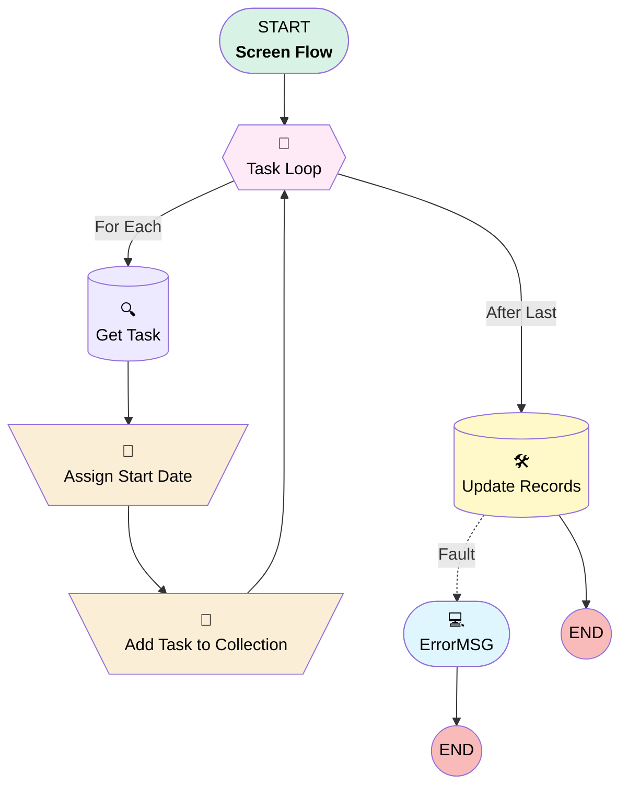

# Project Task | Button | Start Tasks

## Flow Diagram [(_View History_)](Project_Task_Button_Start_Tasks-history.md)

<!-- Flow description -->

## General Information

|<!-- -->|<!-- -->|
|:---|:---|
|Process Type| Flow|
|Label|Project Task | Button | Start Tasks|
|Status|Active|
|Environments|Default|
|Interview Label|Project Task | Button | Start Tasks {!$Flow.CurrentDateTime}|
| Builder Type (PM)|LightningFlowBuilder|
| Canvas Mode (PM)|FREE_FORM_CANVAS|
| Origin Builder Type (PM)|LightningFlowBuilder|
|Connector|[Task_Loop](#task_loop)|
|Next Node|[Task_Loop](#task_loop)|

## Variables

|Name|Data Type|Is Collection|Is Input|Is Output|Object Type|Description|
|:-- |:--:|:--:|:--:|:--:|:--:|:--  |
|id|String|⬜|✅|✅|<!-- -->|<!-- -->|
|ids|String|✅|✅|⬜|<!-- -->|<!-- -->|
|recordId|String|⬜|✅|✅|<!-- -->|<!-- -->|
|updateIds|SObject|✅|✅|✅|Project_Task__c|<!-- -->|

## Formulas

|Name|Data Type|Expression|Description|
|:-- |:--:|:-- |:--  |
|Now|DateTime|NOW()|<!-- -->|

## Flow Nodes Details

### Add_Task_to_Collection

|<!-- -->|<!-- -->|
|:---|:---|
|Type|Assignment|
|Label|Add Task to Collection|
|Connector|[Task_Loop](#task_loop)|

#### Assignments

|Assign To Reference|Operator|Value|
|:-- |:--:|:--: |
|updateIds| Add|[Get_Task](#get_task)|

### Assign_Start_Date

|<!-- -->|<!-- -->|
|:---|:---|
|Type|Assignment|
|Label|Assign Start Date|
|Connector|[Add_Task_to_Collection](#add_task_to_collection)|

#### Assignments

|Assign To Reference|Operator|Value|
|:-- |:--:|:--: |
|Get_Task.Actual_Start_Date__c| Assign|Now|
|Get_Task.Actual_Completion_Date__c| Assign|<!-- -->|
|Get_Task.Status__c| Assign|In Progress|

### Task_Loop

|<!-- -->|<!-- -->|
|:---|:---|
|Type|Loop|
|Label|Task Loop|
|Assign Next Value To Reference|id|
|Collection Reference|ids|
|Iteration Order|Asc|
|Next Value Connector|[Get_Task](#get_task)|
|No More Values Connector|[Update_Records](#update_records)|

### Get_Task

|<!-- -->|<!-- -->|
|:---|:---|
|Type|Record Lookup|
|Object|Project_Task__c|
|Label|Get Task|
|Assign Null Values If No Records Found|⬜|
|Get First Record Only|✅|
|Store Output Automatically|✅|
|Connector|[Assign_Start_Date](#assign_start_date)|

#### Filters (logic: **and**)

|Filter Id|Field|Operator|Value|
|:-- |:-- |:--:|:--: |
|1|Id| Equal To|id|

### Update_Records

|<!-- -->|<!-- -->|
|:---|:---|
|Type|Record Update|
|Label|Update Records|
|Fault Connector|[ErrorMSG](#errormsg)|
|Input Reference|updateIds|

### ErrorMSG

|<!-- -->|<!-- -->|
|:---|:---|
|Type|Screen|
|Label|[ErrorMSG](#errormsg)|
|Allow Back|✅|
|Allow Finish|✅|
|Allow Pause|✅|
|Show Footer|✅|
|Show Header|✅|

#### Error

|<!-- -->|<!-- -->|
|:---|:---|
|Field Text|
{!$Flow.FaultMessage}
|
|Field Type| Display Text|
|Style Properties|verticalAlignment: &nbsp;&nbsp;stringValue: top width: &nbsp;&nbsp;stringValue: 12 |

___

_Documentation generated from branch monitoring_myubiquity by [sfdx-hardis](https://sfdx-hardis.cloudity.com), featuring [salesforce-flow-visualiser](https://github.com/toddhalfpenny/salesforce-flow-visualiser)_