# Proposal | After Save | Assignment Task + Alert

## Flow Diagram [(_View History_)](Proposal_After_Save_Assignment_Task_Alert-history.md)

```mermaid
%% If you read this, your Markdown visualizer does not handle MermaidJS syntax.
%% - If you are in VS Code, install extension `Markdown Preview Mermaid Support` at https://marketplace.visualstudio.com/items?itemName=bierner.markdown-mermaid
%% - If you are using sfdx-hardis, try to define env variable `MERMAID_MODES=cli,docker` ,then run again the command to regenerate markdown with SVG images.
%% - If you are within mkdocs-material, define mermaid plugin in `mkdocs.yml` as described in https://squidfunk.github.io/mkdocs-material/extensions/mermaid/
%% - As a last resort, you can copy-paste this MermaidJS code into https://mermaid.live/ to see the flow diagram

flowchart TB
START(["START<br/><b>AutoLaunched Flow</b></br>Type: <b> Record After Save</b>"]):::startClass
click START "#general-information" "1273386889"

Send_Jotform_Alert("📧 <em></em><br/>Send Jotform Alert"):::actionCalls
click Send_Jotform_Alert "#send_jotform_alert" "4204338783"

Send_Principal_LSD_Proposal_Alert("📧 <em></em><br/>Send Principal LSD Proposal Alert"):::actionCalls
click Send_Principal_LSD_Proposal_Alert "#send_principal_lsd_proposal_alert" "3837406995"

Send_Principal_Proposal_Alert("📧 <em></em><br/>Send Principal Proposal Alert"):::actionCalls
click Send_Principal_Proposal_Alert "#send_principal_proposal_alert" "2664997135"

Send_Quick_Quote_Notif("📧 <em></em><br/>Send Quick Quote Notif"):::actionCalls
click Send_Quick_Quote_Notif "#send_quick_quote_notif" "1136671140"

Send_Sallus_Proposal_Alert("📧 <em></em><br/>Send Sallus Proposal Alert"):::actionCalls
click Send_Sallus_Proposal_Alert "#send_sallus_proposal_alert" "2662367607"

Assign_default_task_values[\"🟰 <em></em><br/>Assign default task values"/]:::assignments
click Assign_default_task_values "#assign_default_task_values" "1454868160"

Set_advisor_whoId[\"🟰 <em></em><br/>Set advisor whoId"/]:::assignments
click Set_advisor_whoId "#set_advisor_whoid" "2238653731"

Set_Jotform_Values[\"🟰 <em></em><br/>Set Jotform Values"/]:::assignments
click Set_Jotform_Values "#set_jotform_values" "608900097"

Set_Principal_Pricing_Values[\"🟰 <em></em><br/>Set Principal Pricing Values"/]:::assignments
click Set_Principal_Pricing_Values "#set_principal_pricing_values" "826531209"

Set_Principal_Provisions_Values[\"🟰 <em></em><br/>Set Principal Provisions Values"/]:::assignments
click Set_Principal_Provisions_Values "#set_principal_provisions_values" "3901582874"

Set_Sallus_Values[\"🟰 <em></em><br/>Set Sallus Values"/]:::assignments
click Set_Sallus_Values "#set_sallus_values" "1681065111"

Set_Special_Principal_Provisions_Values[\"🟰 <em></em><br/>Set Special Principal Provisions Values"/]:::assignments
click Set_Special_Principal_Provisions_Values "#set_special_principal_provisions_values" "3891368626"

Set_tpa_whoId[\"🟰 <em></em><br/>Set tpa whoId"/]:::assignments
click Set_tpa_whoId "#set_tpa_whoid" "3904093255"

Check_for_lsd{"🔀 <em></em><br/>Check for lsd"}:::decisions
click Check_for_lsd "#check_for_lsd" "739732501"

Check_Proposal_Type{"🔀 <em></em><br/>Check Proposal Type"}:::decisions
click Check_Proposal_Type "#check_proposal_type" "451576176"

Check_who_type{"🔀 <em></em><br/>Check who type"}:::decisions
click Check_who_type "#check_who_type" "2959445567"

Pricing_vs_Provisions{"🔀 <em></em><br/>Pricing vs Provisions"}:::decisions
click Pricing_vs_Provisions "#pricing_vs_provisions" "1037956457"

Create_Reach_Out_Task[("➕ <em></em><br/>Create Reach Out Task")]:::recordCreates
click Create_Reach_Out_Task "#create_reach_out_task" "963780244"

Uncheck_Pending_Alert[("🛠️ <em></em><br/>Uncheck Pending Alert")]:::recordUpdates
click Uncheck_Pending_Alert "#uncheck_pending_alert" "301750974"

Send_Jotform_Alert --> Check_who_type
Send_Principal_LSD_Proposal_Alert --> Check_who_type
Send_Principal_Proposal_Alert --> Check_who_type
Send_Quick_Quote_Notif --> Check_who_type
Send_Sallus_Proposal_Alert --> Check_who_type
Assign_default_task_values --> Create_Reach_Out_Task
Set_advisor_whoId --> Assign_default_task_values
Set_Jotform_Values --> Send_Jotform_Alert
Set_Principal_Pricing_Values --> Send_Quick_Quote_Notif
Set_Principal_Provisions_Values --> Send_Principal_Proposal_Alert
Set_Sallus_Values --> Send_Sallus_Proposal_Alert
Set_Special_Principal_Provisions_Values --> Send_Principal_LSD_Proposal_Alert
Set_tpa_whoId --> Assign_default_task_values
Check_for_lsd --> |"Has lsd value"| Set_Special_Principal_Provisions_Values
Check_for_lsd --> |"Default Outcome"| Set_Principal_Provisions_Values
Check_Proposal_Type --> |"Jotform"| Set_Jotform_Values
Check_Proposal_Type --> |"Principal"| Pricing_vs_Provisions
Check_Proposal_Type --> |"Sallus"| Set_Sallus_Values
Check_Proposal_Type --> |"Unknown"| END_Check_Proposal_Type
Check_who_type --> |"Advisor Referred - Advisor Present"| Set_advisor_whoId
Check_who_type --> |"TPA Referred - TPA Present"| Set_tpa_whoId
Check_who_type --> |"Default Outcome"| Assign_default_task_values
Pricing_vs_Provisions --> |"Pricing"| Set_Principal_Pricing_Values
Pricing_vs_Provisions --> |"Provisions"| Check_for_lsd
Create_Reach_Out_Task --> Uncheck_Pending_Alert
Uncheck_Pending_Alert --> END_Uncheck_Pending_Alert
START -->  Check_Proposal_Type
END_Check_Proposal_Type(( END )):::endClass
END_Uncheck_Pending_Alert(( END )):::endClass


classDef actionCalls fill:#D4E4FC,color:black,text-decoration:none,max-height:100px
classDef assignments fill:#FBEED7,color:black,text-decoration:none,max-height:100px
classDef collectionProcessors fill:#F0E3FA,color:black,text-decoration:none,max-height:100px
classDef customErrors fill:#FFE9E9,color:black,text-decoration:none,max-height:100px
classDef decisions fill:#FDEAF6,color:black,text-decoration:none,max-height:100px
classDef loops fill:#FDEAF6,color:black,text-decoration:none,max-height:100px
classDef recordCreates fill:#FFF8C9,color:black,text-decoration:none,max-height:100px
classDef recordDeletes fill:#FFF8C9,color:black,text-decoration:none,max-height:100px
classDef recordLookups fill:#EDEAFF,color:black,text-decoration:none,max-height:100px
classDef recordUpdates fill:#FFF8C9,color:black,text-decoration:none,max-height:100px
classDef screens fill:#DFF6FF,color:black,text-decoration:none,max-height:100px
classDef subflows fill:#D4E4FC,color:black,text-decoration:none,max-height:100px
classDef startClass fill:#D9F2E6,color:black,text-decoration:none,max-height:100px
classDef endClass fill:#F9BABA,color:black,text-decoration:none,max-height:100px
classDef transforms fill:#FDEAF6,color:black,text-decoration:none,max-height:100px


```

<!-- Flow description -->

## General Information

|<!-- -->|<!-- -->|
|:---|:---|
|Object|Proposal__c|
|Process Type| Auto Launched Flow|
|Trigger Type| Record After Save|
|Record Trigger Type| Update|
|Label|Proposal | After Save | Assignment Task + Alert|
|Status|Active|
|Does Require Record Changed To Meet Criteria|✅|
|Environments|Default|
|Interview Label|Proposal | After Save | Assignment Task + Alert {!$Flow.CurrentDateTime}|
| Builder Type (PM)|LightningFlowBuilder|
| Canvas Mode (PM)|AUTO_LAYOUT_CANVAS|
| Origin Builder Type (PM)|LightningFlowBuilder|
|Connector|[Check_Proposal_Type](#check_proposal_type)|
|Next Node|[Check_Proposal_Type](#check_proposal_type)|

#### Filters (logic: **and**)

|Filter Id|Field|Operator|Value|
|:-- |:-- |:--:|:--: |
|1|Pending_Alert__c| Equal To|✅|

## Variables

|Name|Data Type|Is Collection|Is Input|Is Output|Object Type|Description|
|:-- |:--:|:--:|:--:|:--:|:--:|:--  |
|newTask|SObject|⬜|⬜|⬜|Task|<!-- -->|

## Flow Nodes Details

### Send_Jotform_Alert

|<!-- -->|<!-- -->|
|:---|:---|
|Type|Action Call|
|Label|Send Jotform Alert|
|Action Type|Email Alert|
|Action Name|Proposal__c.Jotform_Proposal_Generated|
|Flow Transaction Model|CurrentTransaction|
|Name Segment|Proposal__c.Jotform_Proposal_Generated|
|Offset|0|
| SObject Row Id (input)|$Record.Id|
|Connector|[Check_who_type](#check_who_type)|

### Send_Principal_LSD_Proposal_Alert

|<!-- -->|<!-- -->|
|:---|:---|
|Type|Action Call|
|Label|Send Principal LSD Proposal Alert|
|Action Type|Email Alert|
|Action Name|Proposal__c.Proposal_Generated_LSD_Specific|
|Description|Alt alert that includes the proposal's lead source detail for select partnerships (mainly Leafhouse)|
|Flow Transaction Model|CurrentTransaction|
|Name Segment|Proposal__c.Proposal_Generated_LSD_Specific|
|Offset|0|
| SObject Row Id (input)|$Record.Id|
|Connector|[Check_who_type](#check_who_type)|

### Send_Principal_Proposal_Alert

|<!-- -->|<!-- -->|
|:---|:---|
|Type|Action Call|
|Label|Send Principal Proposal Alert|
|Action Type|Email Alert|
|Action Name|Proposal__c.Proposal_Generated|
|Flow Transaction Model|CurrentTransaction|
|Name Segment|Proposal__c.Proposal_Generated|
|Offset|0|
| SObject Row Id (input)|$Record.Id|
|Connector|[Check_who_type](#check_who_type)|

### Send_Quick_Quote_Notif

|<!-- -->|<!-- -->|
|:---|:---|
|Type|Action Call|
|Label|Send Quick Quote Notif|
|Action Type|Email Alert|
|Action Name|Proposal__c.Quick_Quote_Generated|
|Flow Transaction Model|CurrentTransaction|
|Name Segment|Proposal__c.Quick_Quote_Generated|
|Offset|0|
| SObject Row Id (input)|$Record.Id|
|Connector|[Check_who_type](#check_who_type)|

### Send_Sallus_Proposal_Alert

|<!-- -->|<!-- -->|
|:---|:---|
|Type|Action Call|
|Label|Send Sallus Proposal Alert|
|Action Type|Email Alert|
|Action Name|Proposal__c.Sallus_Proposal_Generated|
|Flow Transaction Model|CurrentTransaction|
|Name Segment|Proposal__c.Sallus_Proposal_Generated|
|Offset|0|
| SObject Row Id (input)|$Record.Id|
|Connector|[Check_who_type](#check_who_type)|

### Assign_default_task_values

|<!-- -->|<!-- -->|
|:---|:---|
|Type|Assignment|
|Label|Assign default task values|
|Connector|[Create_Reach_Out_Task](#create_reach_out_task)|

#### Assignments

|Assign To Reference|Operator|Value|
|:-- |:--:|:--: |
|newTask.OwnerId| Assign|$Record.OwnerId|
|newTask.WhatId| Assign|$Record.Id|
|newTask.Priority| Assign|Normal|
|newTask.Status| Assign|Not Started|
|newTask.ActivityDate| Assign|$Flow.CurrentDate|

### Set_advisor_whoId

|<!-- -->|<!-- -->|
|:---|:---|
|Type|Assignment|
|Label|Set advisor whoId|
|Connector|[Assign_default_task_values](#assign_default_task_values)|

#### Assignments

|Assign To Reference|Operator|Value|
|:-- |:--:|:--: |
|newTask.WhoId| Assign|$Record.Advisor_Contact__c|

### Set_Jotform_Values

|<!-- -->|<!-- -->|
|:---|:---|
|Type|Assignment|
|Label|Set Jotform Values|
|Connector|[Send_Jotform_Alert](#send_jotform_alert)|

#### Assignments

|Assign To Reference|Operator|Value|
|:-- |:--:|:--: |
|newTask.Subject| Assign|New Jotform Proposal - Reach Out to Referrer|

### Set_Principal_Pricing_Values

|<!-- -->|<!-- -->|
|:---|:---|
|Type|Assignment|
|Label|Set Principal Pricing Values|
|Connector|[Send_Quick_Quote_Notif](#send_quick_quote_notif)|

#### Assignments

|Assign To Reference|Operator|Value|
|:-- |:--:|:--: |
|newTask.Subject| Assign|New Simply Quick Quote - Reach Out to Referrer|

### Set_Principal_Provisions_Values

|<!-- -->|<!-- -->|
|:---|:---|
|Type|Assignment|
|Label|Set Principal Provisions Values|
|Connector|[Send_Principal_Proposal_Alert](#send_principal_proposal_alert)|

#### Assignments

|Assign To Reference|Operator|Value|
|:-- |:--:|:--: |
|newTask.Subject| Assign|New Simply Retirement Proposal for {!$Record.Client_Company_Name__c}|

### Set_Sallus_Values

|<!-- -->|<!-- -->|
|:---|:---|
|Type|Assignment|
|Label|Set Sallus Values|
|Connector|[Send_Sallus_Proposal_Alert](#send_sallus_proposal_alert)|

#### Assignments

|Assign To Reference|Operator|Value|
|:-- |:--:|:--: |
|newTask.Subject| Assign|New Sallus Proposal From {!$Record.Advisor_Contact__r.Full_Name__c}|

### Set_Special_Principal_Provisions_Values

|<!-- -->|<!-- -->|
|:---|:---|
|Type|Assignment|
|Label|Set Special Principal Provisions Values|
|Connector|[Send_Principal_LSD_Proposal_Alert](#send_principal_lsd_proposal_alert)|

#### Assignments

|Assign To Reference|Operator|Value|
|:-- |:--:|:--: |
|newTask.Subject| Assign|New Simply Retirement {!$Record.Lead_Source_Detail__c} Proposal for {!$Record.Client_Company_Name__c}|

### Set_tpa_whoId

|<!-- -->|<!-- -->|
|:---|:---|
|Type|Assignment|
|Label|Set tpa whoId|
|Connector|[Assign_default_task_values](#assign_default_task_values)|

#### Assignments

|Assign To Reference|Operator|Value|
|:-- |:--:|:--: |
|newTask.WhoId| Assign|$Record.TPA_Contact__c|

### Check_for_lsd

|<!-- -->|<!-- -->|
|:---|:---|
|Type|Decision|
|Label|Check for lsd|
|Description|😵‍💫|
|Default Connector|[Set_Principal_Provisions_Values](#set_principal_provisions_values)|
|Default Connector Label|Default Outcome|

#### Rule Has_lsd_value (Has lsd value)

|<!-- -->|<!-- -->|
|:---|:---|
|Connector|[Set_Special_Principal_Provisions_Values](#set_special_principal_provisions_values)|
|Condition Logic|and|

|Condition Id|Left Value Reference|Operator|Right Value|
|:-- |:-- |:--:|:--: |
|1|$Record.Lead_Source_Detail__c| Is Blank|⬜|

### Check_Proposal_Type

|<!-- -->|<!-- -->|
|:---|:---|
|Type|Decision|
|Label|Check Proposal Type|
|Default Connector Label|Unknown|

#### Rule Jotform (Jotform)

|<!-- -->|<!-- -->|
|:---|:---|
|Connector|[Set_Jotform_Values](#set_jotform_values)|
|Condition Logic|and|

|Condition Id|Left Value Reference|Operator|Right Value|
|:-- |:-- |:--:|:--: |
|1|$Record.MML_Form_Values__c| Is Blank|⬜|

#### Rule Principal (Principal)

|<!-- -->|<!-- -->|
|:---|:---|
|Connector|[Pricing_vs_Provisions](#pricing_vs_provisions)|
|Condition Logic|and|

|Condition Id|Left Value Reference|Operator|Right Value|
|:-- |:-- |:--:|:--: |
|1|$Record.Principal_Id__c| Is Blank|⬜|

#### Rule Sallus (Sallus)

|<!-- -->|<!-- -->|
|:---|:---|
|Connector|[Set_Sallus_Values](#set_sallus_values)|
|Condition Logic|and|

|Condition Id|Left Value Reference|Operator|Right Value|
|:-- |:-- |:--:|:--: |
|1|$Record.Sallus_ID__c| Is Blank|⬜|

### Check_who_type

|<!-- -->|<!-- -->|
|:---|:---|
|Type|Decision|
|Label|Check who type|
|Default Connector|[Assign_default_task_values](#assign_default_task_values)|
|Default Connector Label|Default Outcome|

#### Rule Advisor_Referred_Advisor_Present (Advisor Referred - Advisor Present)

|<!-- -->|<!-- -->|
|:---|:---|
|Connector|[Set_advisor_whoId](#set_advisor_whoid)|
|Condition Logic|and|

|Condition Id|Left Value Reference|Operator|Right Value|
|:-- |:-- |:--:|:--: |
|1|$Record.Referrer_Type__c| Equal To|Advisor|
|2|$Record.Advisor_Contact__c| Is Blank|⬜|

#### Rule TPA_Referred_TPA_Present (TPA Referred - TPA Present)

|<!-- -->|<!-- -->|
|:---|:---|
|Connector|[Set_tpa_whoId](#set_tpa_whoid)|
|Condition Logic|and|

|Condition Id|Left Value Reference|Operator|Right Value|
|:-- |:-- |:--:|:--: |
|1|$Record.Referrer_Type__c| Equal To|TPA|
|2|$Record.TPA_Contact__c| Is Blank|⬜|

### Pricing_vs_Provisions

|<!-- -->|<!-- -->|
|:---|:---|
|Type|Decision|
|Label|Pricing vs Provisions|
|Default Connector|[Check_for_lsd](#check_for_lsd)|
|Default Connector Label|Provisions|

#### Rule Pricing (Pricing)

|<!-- -->|<!-- -->|
|:---|:---|
|Connector|[Set_Principal_Pricing_Values](#set_principal_pricing_values)|
|Condition Logic|or|

|Condition Id|Left Value Reference|Operator|Right Value|
|:-- |:-- |:--:|:--: |
|1|$Record.Status__c| Equal To|Pricing|
|2|$Record.Status__c| Equal To|Quick Quote|

### Create_Reach_Out_Task

|<!-- -->|<!-- -->|
|:---|:---|
|Type|Record Create|
|Label|Create Reach Out Task|
|Input Reference|newTask|
|Connector|[Uncheck_Pending_Alert](#uncheck_pending_alert)|

### Uncheck_Pending_Alert

|<!-- -->|<!-- -->|
|:---|:---|
|Type|Record Update|
|Label|Uncheck Pending Alert|
|Input Reference|$Record|

#### Input Assignments

|Field|Value|
|:-- |:--: |
|Pending_Alert__c|⬜|

___

_Documentation generated from branch monitoring_myubiquity by [sfdx-hardis](https://sfdx-hardis.cloudity.com), featuring [salesforce-flow-visualiser](https://github.com/toddhalfpenny/salesforce-flow-visualiser)_