# Proposal | After Save | Related People

## Flow Diagram [(_View History_)](Proposal_After_Save_Related_People-history.md)

```mermaid
%% If you read this, your Markdown visualizer does not handle MermaidJS syntax.
%% - If you are in VS Code, install extension `Markdown Preview Mermaid Support` at https://marketplace.visualstudio.com/items?itemName=bierner.markdown-mermaid
%% - If you are using sfdx-hardis, try to define env variable `MERMAID_MODES=cli,docker` ,then run again the command to regenerate markdown with SVG images.
%% - If you are within mkdocs-material, define mermaid plugin in `mkdocs.yml` as described in https://squidfunk.github.io/mkdocs-material/extensions/mermaid/
%% - As a last resort, you can copy-paste this MermaidJS code into https://mermaid.live/ to see the flow diagram

flowchart TB
START(["START<br/><b>AutoLaunched Flow</b></br>Type: <b> Record After Save</b>"]):::startClass
click START "#general-information" "1741230717"

Convert_Advisor_Lead("⚙️ <em></em><br/>Convert Advisor Lead"):::actionCalls
click Convert_Advisor_Lead "#convert_advisor_lead" "3906630286"

New_form_advisor_alert("📧 <em></em><br/>New form advisor alert"):::actionCalls
click New_form_advisor_alert "#new_form_advisor_alert" "556446595"

Assign_Advisor_Values_to_Proposal[\"🟰 <em></em><br/>Assign Advisor Values to Proposal"/]:::assignments
click Assign_Advisor_Values_to_Proposal "#assign_advisor_values_to_proposal" "3511563417"

Advisor_Created_Check{"🔀 <em></em><br/>Advisor Created Check"}:::decisions
click Advisor_Created_Check "#advisor_created_check" "3759290316"

Advisor_Lead_Defined_Check{"🔀 <em></em><br/>Advisor Lead Defined Check"}:::decisions
click Advisor_Lead_Defined_Check "#advisor_lead_defined_check" "2670948499"

Advisor_present_check{"🔀 <em></em><br/>Advisor present check"}:::decisions
click Advisor_present_check "#advisor_present_check" "2568997900"

Check_if_needs_employer_lead{"🔀 <em></em><br/>Check if needs employer lead"}:::decisions
click Check_if_needs_employer_lead "#check_if_needs_employer_lead" "3894322308"

Employer_Lead_Defined_Check{"🔀 <em></em><br/>Employer Lead Defined Check"}:::decisions
click Employer_Lead_Defined_Check "#employer_lead_defined_check" "2661082014"

Employer_lead_found_check{"🔀 <em></em><br/>Employer lead found check"}:::decisions
click Employer_lead_found_check "#employer_lead_found_check" "360180475"

Prop_Update_Check{"🔀 <em></em><br/>Prop Update Check"}:::decisions
click Prop_Update_Check "#prop_update_check" "2192035271"

Create_Advisor_Lead[("➕ <em></em><br/>Create Advisor Lead")]:::recordCreates
click Create_Advisor_Lead "#create_advisor_lead" "2471430890"

Create_Employer_Lead[("➕ <em></em><br/>Create Employer Lead")]:::recordCreates
click Create_Employer_Lead "#create_employer_lead" "3507361339"

Create_New_Advisor_Task[("➕ <em></em><br/>Create New Advisor Task")]:::recordCreates
click Create_New_Advisor_Task "#create_new_advisor_task" "4014938711"

Grab_existing_employer[("🔍 <em></em><br/>Grab existing employer")]:::recordLookups
click Grab_existing_employer "#grab_existing_employer" "1952371326"

Commit_Proposal_Values[("🛠️ <em></em><br/>Commit Proposal Values")]:::recordUpdates
click Commit_Proposal_Values "#commit_proposal_values" "917537256"

Set_up_advisor_lead[["🔗 <em>Subflow</em><br/>Set up advisor lead"]]:::subflows
click Set_up_advisor_lead "#set_up_advisor_lead" "4276474953"

Set_up_employer_lead[["🔗 <em>Subflow</em><br/>Set up employer lead"]]:::subflows
click Set_up_employer_lead "#set_up_employer_lead" "3893565359"

Convert_Advisor_Lead --> Advisor_Created_Check
New_form_advisor_alert --> Check_if_needs_employer_lead
Assign_Advisor_Values_to_Proposal --> Create_New_Advisor_Task
Advisor_Created_Check --> |"New Advisor Conversion"| Assign_Advisor_Values_to_Proposal
Advisor_Created_Check --> |"Uh Oh"| Check_if_needs_employer_lead
Advisor_Lead_Defined_Check --> |"Advisor Lead Values"| Create_Advisor_Lead
Advisor_Lead_Defined_Check --> |"Default Outcome"| Check_if_needs_employer_lead
Advisor_present_check --> |"Need new advisor"| Set_up_advisor_lead
Advisor_present_check --> |"Default Outcome"| Check_if_needs_employer_lead
Check_if_needs_employer_lead --> |"New Proposal"| Grab_existing_employer
Check_if_needs_employer_lead --> |"Default Outcome"| Prop_Update_Check
Employer_Lead_Defined_Check --> |"Employer lead values"| Create_Employer_Lead
Employer_Lead_Defined_Check --> |"Default Outcome"| Prop_Update_Check
Employer_lead_found_check --> |"No existing employer lead"| Set_up_employer_lead
Employer_lead_found_check --> |"Default Outcome"| Prop_Update_Check
Prop_Update_Check --> |"Needs Prop Update"| Commit_Proposal_Values
Prop_Update_Check --> |"Default Outcome"| END_Prop_Update_Check
Create_Advisor_Lead --> Convert_Advisor_Lead
Create_Employer_Lead --> Prop_Update_Check
Create_New_Advisor_Task --> New_form_advisor_alert
Grab_existing_employer --> Employer_lead_found_check
Commit_Proposal_Values --> END_Commit_Proposal_Values
START -->  Advisor_present_check
Set_up_advisor_lead --> Advisor_Lead_Defined_Check
Set_up_employer_lead --> Employer_Lead_Defined_Check
END_Prop_Update_Check(( END )):::endClass
END_Commit_Proposal_Values(( END )):::endClass


classDef actionCalls fill:#D4E4FC,color:black,text-decoration:none,max-height:100px
classDef assignments fill:#FBEED7,color:black,text-decoration:none,max-height:100px
classDef collectionProcessors fill:#F0E3FA,color:black,text-decoration:none,max-height:100px
classDef customErrors fill:#FFE9E9,color:black,text-decoration:none,max-height:100px
classDef decisions fill:#FDEAF6,color:black,text-decoration:none,max-height:100px
classDef loops fill:#FDEAF6,color:black,text-decoration:none,max-height:100px
classDef recordCreates fill:#FFF8C9,color:black,text-decoration:none,max-height:100px
classDef recordDeletes fill:#FFF8C9,color:black,text-decoration:none,max-height:100px
classDef recordLookups fill:#EDEAFF,color:black,text-decoration:none,max-height:100px
classDef recordUpdates fill:#FFF8C9,color:black,text-decoration:none,max-height:100px
classDef screens fill:#DFF6FF,color:black,text-decoration:none,max-height:100px
classDef subflows fill:#D4E4FC,color:black,text-decoration:none,max-height:100px
classDef startClass fill:#D9F2E6,color:black,text-decoration:none,max-height:100px
classDef endClass fill:#F9BABA,color:black,text-decoration:none,max-height:100px
classDef transforms fill:#FDEAF6,color:black,text-decoration:none,max-height:100px


```

<!-- Flow description -->

## General Information

|<!-- -->|<!-- -->|
|:---|:---|
|Object|Proposal__c|
|Process Type| Auto Launched Flow|
|Trigger Type| Record After Save|
|Record Trigger Type| Create And Update|
|Label|Proposal | After Save | Related People|
|Status|Active|
|Does Require Record Changed To Meet Criteria|✅|
|Description|Updated to fix ubiquity employer subflow call|
|Environments|Default|
|Interview Label|Proposal | After Save | Related People {!$Flow.CurrentDateTime}|
| Builder Type (PM)|LightningFlowBuilder|
| Canvas Mode (PM)|AUTO_LAYOUT_CANVAS|
| Origin Builder Type (PM)|LightningFlowBuilder|
|Connector|[Advisor_present_check](#advisor_present_check)|
|Next Node|[Advisor_present_check](#advisor_present_check)|

#### Filters (logic: **and**)

|Filter Id|Field|Operator|Value|
|:-- |:-- |:--:|:--: |
|1|RecordTypeId| Equal To|0121G000000AjeLQAS|
|2|OwnerId| Starts With|5|
|3|MML_Form_Values__c| Is Null|<!-- -->|

## Variables

|Name|Data Type|Is Collection|Is Input|Is Output|Object Type|Description|
|:-- |:--:|:--:|:--:|:--:|:--:|:--  |
|autoConvertCollection|SObject|✅|⬜|⬜|Lead|Leads that aren't long for this world|
|employerLead|SObject|⬜|⬜|⬜|Lead|<!-- -->|
|newAssociatedContactId|String|⬜|⬜|⬜|<!-- -->|If an employer lead and advisor lead are both created, this is used to connect them|
|newLeadCollection|SObject|✅|⬜|⬜|Lead|<!-- -->|

## Flow Nodes Details

### Convert_Advisor_Lead

|<!-- -->|<!-- -->|
|:---|:---|
|Type|Action Call|
|Label|Convert Advisor Lead|
|Action Type|Apex|
|Action Name|[ModularAutoConvertLead](../apex/ModularAutoConvertLead.md)|
|Flow Transaction Model|CurrentTransaction|
|Name Segment|ModularAutoConvertLead|
|Store Output Automatically|✅|
|Create Opportunity (input)|⬜|
|Lead Id (input)|Set_up_advisor_lead.newLead.Id|
|Connector|[Advisor_Created_Check](#advisor_created_check)|

### New_form_advisor_alert

|<!-- -->|<!-- -->|
|:---|:---|
|Type|Action Call|
|Label|New form advisor alert|
|Action Type|Email Alert|
|Action Name|Contact.Advisor_Created_from_Proposal_Form|
|Flow Transaction Model|CurrentTransaction|
|Name Segment|Contact.Advisor_Created_from_Proposal_Form|
| SObject Row Id (input)|Convert_Advisor_Lead.convertedContactId|
|Connector|[Check_if_needs_employer_lead](#check_if_needs_employer_lead)|

### Assign_Advisor_Values_to_Proposal

|<!-- -->|<!-- -->|
|:---|:---|
|Type|Assignment|
|Label|Assign Advisor Values to Proposal|
|Connector|[Create_New_Advisor_Task](#create_new_advisor_task)|

#### Assignments

|Assign To Reference|Operator|Value|
|:-- |:--:|:--: |
|$Record.Advisor_Contact__c| Assign|Convert_Advisor_Lead.convertedContactId|
|$Record.Advisor_Account__c| Assign|Convert_Advisor_Lead.convertedAccountId|

### Advisor_Created_Check

|<!-- -->|<!-- -->|
|:---|:---|
|Type|Decision|
|Label|Advisor Created Check|
|Default Connector|[Check_if_needs_employer_lead](#check_if_needs_employer_lead)|
|Default Connector Label|Uh Oh|

#### Rule New_Advisor_Conversion (New Advisor Conversion)

|<!-- -->|<!-- -->|
|:---|:---|
|Connector|[Assign_Advisor_Values_to_Proposal](#assign_advisor_values_to_proposal)|
|Condition Logic|and|

|Condition Id|Left Value Reference|Operator|Right Value|
|:-- |:-- |:--:|:--: |
|1|Convert_Advisor_Lead.convertedContactId| Is Blank|⬜|

### Advisor_Lead_Defined_Check

|<!-- -->|<!-- -->|
|:---|:---|
|Type|Decision|
|Label|Advisor Lead Defined Check|
|Default Connector|[Check_if_needs_employer_lead](#check_if_needs_employer_lead)|
|Default Connector Label|Default Outcome|

#### Rule Advisor_Lead_Values (Advisor Lead Values)

|<!-- -->|<!-- -->|
|:---|:---|
|Connector|[Create_Advisor_Lead](#create_advisor_lead)|
|Condition Logic|and|

|Condition Id|Left Value Reference|Operator|Right Value|
|:-- |:-- |:--:|:--: |
|1|Set_up_advisor_lead.newLead| Is Null|⬜|

### Advisor_present_check

|<!-- -->|<!-- -->|
|:---|:---|
|Type|Decision|
|Label|Advisor present check|
|Default Connector|[Check_if_needs_employer_lead](#check_if_needs_employer_lead)|
|Default Connector Label|Default Outcome|

#### Rule Need_new_advisor (Need new advisor)

|<!-- -->|<!-- -->|
|:---|:---|
|Connector|[Set_up_advisor_lead](#set_up_advisor_lead)|
|Condition Logic|and|

|Condition Id|Left Value Reference|Operator|Right Value|
|:-- |:-- |:--:|:--: |
|1|$Record.Advisor_Contact__c| Is Blank|✅|
|2|$Record.Financial_Professional_Email__c| Not Equal To|$Record.Company_Email__c|
|3|$Record.Financial_Professional_Email__c| Is Blank|⬜|

### Check_if_needs_employer_lead

|<!-- -->|<!-- -->|
|:---|:---|
|Type|Decision|
|Label|Check if needs employer lead|
|Default Connector|[Prop_Update_Check](#prop_update_check)|
|Default Connector Label|Default Outcome|

#### Rule New_Proposal (New Proposal)

|<!-- -->|<!-- -->|
|:---|:---|
|Connector|[Grab_existing_employer](#grab_existing_employer)|
|Condition Logic|and|

|Condition Id|Left Value Reference|Operator|Right Value|
|:-- |:-- |:--:|:--: |
|1|$Record.Client_Company_Name__c| Is Blank|⬜|
|2|$Record.Company_Contact_First_Name__c| Is Blank|⬜|
|3|$Record.Company_Contact_Last_Name__c| Is Blank|⬜|
|4|$Record.Portfolio_Code__c| Equal To|mml|

### Employer_Lead_Defined_Check

|<!-- -->|<!-- -->|
|:---|:---|
|Type|Decision|
|Label|Employer Lead Defined Check|
|Default Connector|[Prop_Update_Check](#prop_update_check)|
|Default Connector Label|Default Outcome|

#### Rule Employer_lead_values (Employer lead values)

|<!-- -->|<!-- -->|
|:---|:---|
|Connector|[Create_Employer_Lead](#create_employer_lead)|
|Condition Logic|and|

|Condition Id|Left Value Reference|Operator|Right Value|
|:-- |:-- |:--:|:--: |
|1|Set_up_employer_lead.newLead| Is Null|⬜|

### Employer_lead_found_check

|<!-- -->|<!-- -->|
|:---|:---|
|Type|Decision|
|Label|Employer lead found check|
|Default Connector|[Prop_Update_Check](#prop_update_check)|
|Default Connector Label|Default Outcome|

#### Rule No_existing_employer_lead (No existing employer lead)

|<!-- -->|<!-- -->|
|:---|:---|
|Connector|[Set_up_employer_lead](#set_up_employer_lead)|
|Condition Logic|and|

|Condition Id|Left Value Reference|Operator|Right Value|
|:-- |:-- |:--:|:--: |
|1|employerLead| Is Null|✅|

### Prop_Update_Check

|<!-- -->|<!-- -->|
|:---|:---|
|Type|Decision|
|Label|Prop Update Check|
|Default Connector Label|Default Outcome|

#### Rule Needs_Prop_Update (Needs Prop Update)

|<!-- -->|<!-- -->|
|:---|:---|
|Connector|[Commit_Proposal_Values](#commit_proposal_values)|
|Condition Logic|or|

|Condition Id|Left Value Reference|Operator|Right Value|
|:-- |:-- |:--:|:--: |
|1|[Assign_Advisor_Values_to_Proposal](#assign_advisor_values_to_proposal)| Was Visited|✅|

### Create_Advisor_Lead

|<!-- -->|<!-- -->|
|:---|:---|
|Type|Record Create|
|Label|Create Advisor Lead|
|Input Reference|Set_up_advisor_lead.newLead|
|Connector|[Convert_Advisor_Lead](#convert_advisor_lead)|

### Create_Employer_Lead

|<!-- -->|<!-- -->|
|:---|:---|
|Type|Record Create|
|Label|Create Employer Lead|
|Input Reference|Set_up_employer_lead.newLead|
|Connector|[Prop_Update_Check](#prop_update_check)|

### Create_New_Advisor_Task

|<!-- -->|<!-- -->|
|:---|:---|
|Type|Record Create|
|Object|Task|
|Label|Create New Advisor Task|
|Store Output Automatically|✅|
|Connector|[New_form_advisor_alert](#new_form_advisor_alert)|

#### Input Assignments

|Field|Value|
|:-- |:--: |
|ActivityDate|$Flow.CurrentDate|
|OwnerId|$Record.OwnerId|
|Priority|Normal|
|Status|Not Started|
|Subject|New Advisor Created from Proposal Form|
|WhatId|$Record.Id|
|WhoId|Convert_Advisor_Lead.convertedContactId|

### Grab_existing_employer

|<!-- -->|<!-- -->|
|:---|:---|
|Type|Record Lookup|
|Object|Lead|
|Label|Grab existing employer|
|Assign Null Values If No Records Found|⬜|
|Get First Record Only|✅|
|Store Output Automatically|✅|
|Connector|[Employer_lead_found_check](#employer_lead_found_check)|

#### Filters (logic: **2 AND ((3 AND 4) OR (1 AND 5))**)

|Filter Id|Field|Operator|Value|
|:-- |:-- |:--:|:--: |
|1|Company| Equal To|$Record.Client_Company_Name__c|
|2|Lead_Type__c| Equal To|Employer|
|3|Email| Equal To|$Record.Company_Email__c|
|4|Email| Is Null|<!-- -->|
|5|Company| Is Null|<!-- -->|

### Commit_Proposal_Values

|<!-- -->|<!-- -->|
|:---|:---|
|Type|Record Update|
|Label|Commit Proposal Values|
|Input Reference|$Record|

### Set_up_advisor_lead

|<!-- -->|<!-- -->|
|:---|:---|
|Type|Subflow|
|Label|Set up advisor lead|
|Flow Name|Proposal_Autolaunched_Assign_Lead_Values_From_Proposal|
|Store Output Automatically|✅|
|Connector|[Advisor_Lead_Defined_Check](#advisor_lead_defined_check)|

#### Input Assignments

|Field|Value|
|:-- |:--: |
|<!-- -->|Ubiquity Advisor|
|<!-- -->|$Record|

### Set_up_employer_lead

|<!-- -->|<!-- -->|
|:---|:---|
|Type|Subflow|
|Label|Set up employer lead|
|Flow Name|Proposal_Autolaunched_Assign_Lead_Values_From_Proposal|
|Store Output Automatically|✅|
|Connector|[Employer_Lead_Defined_Check](#employer_lead_defined_check)|

#### Input Assignments

|Field|Value|
|:-- |:--: |
|<!-- -->|Ubiquity Employer|
|<!-- -->|$Record|

___

_Documentation generated from branch monitoring_myubiquity by [sfdx-hardis](https://sfdx-hardis.cloudity.com), featuring [salesforce-flow-visualiser](https://github.com/toddhalfpenny/salesforce-flow-visualiser)_