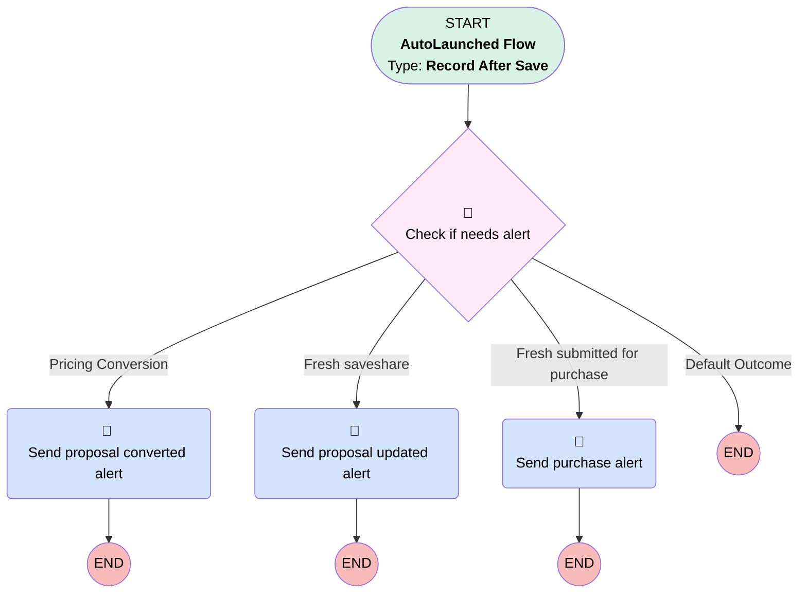

# Proposal | After Save | Send Update Alert

## Flow Diagram [(_View History_)](Proposal_After_Save_Send_Update_Alert-history.md)

<!-- Flow description -->

## General Information

|<!-- -->|<!-- -->|
|:---|:---|
|Object|Proposal__c|
|Process Type| Auto Launched Flow|
|Trigger Type| Record After Save|
|Record Trigger Type| Update|
|Label|Proposal | After Save | Send Update Alert|
|Status|Active|
|Description|Added specific email alert for when pricing proposals convert to full proposals  Pulled that alert from employer lead creation flow|
|Environments|Default|
|Interview Label|Proposal | After Save | Update Alert {!$Flow.CurrentDateTime}|
| Builder Type (PM)|LightningFlowBuilder|
| Canvas Mode (PM)|AUTO_LAYOUT_CANVAS|
| Origin Builder Type (PM)|LightningFlowBuilder|
|Connector|[Check_if_needs_alert](#check_if_needs_alert)|
|Next Node|[Check_if_needs_alert](#check_if_needs_alert)|

#### Filters (logic: **and**)

|Filter Id|Field|Operator|Value|
|:-- |:-- |:--:|:--: |
|1|Principal_Id__c| Is Null|<!-- -->|
|2|Status__c| Is Changed|✅|

## Flow Nodes Details

### Send_proposal_converted_alert

|<!-- -->|<!-- -->|
|:---|:---|
|Type|Action Call|
|Label|Send proposal converted alert|
|Action Type|Email Alert|
|Action Name|Proposal__c.Pricing_Proposal_Converted|
|Flow Transaction Model|CurrentTransaction|
|Name Segment|Proposal__c.Pricing_Proposal_Converted|
|Offset|0|
| SObject Row Id (input)|$Record.Id|

### Send_proposal_updated_alert

|<!-- -->|<!-- -->|
|:---|:---|
|Type|Action Call|
|Label|Send proposal updated alert|
|Action Type|Email Alert|
|Action Name|Proposal__c.Proposal_Updated|
|Flow Transaction Model|CurrentTransaction|
|Name Segment|Proposal__c.Proposal_Updated|
|Offset|0|
| SObject Row Id (input)|$Record.Id|

### Send_purchase_alert

|<!-- -->|<!-- -->|
|:---|:---|
|Type|Action Call|
|Label|Send purchase alert|
|Action Type|Email Alert|
|Action Name|Proposal__c.Simply_Purchase_Attempt|
|Flow Transaction Model|CurrentTransaction|
|Name Segment|Proposal__c.Simply_Purchase_Attempt|
|Offset|0|
| SObject Row Id (input)|$Record.Id|

### Check_if_needs_alert

|<!-- -->|<!-- -->|
|:---|:---|
|Type|Decision|
|Label|Check if needs alert|
|Description|Sends alert when a proposal is newly save/shared OR submitted for purchase.|
|Default Connector Label|Default Outcome|

#### Rule Pricing_Conversion (Pricing Conversion)

|<!-- -->|<!-- -->|
|:---|:---|
|Connector|[Send_proposal_converted_alert](#send_proposal_converted_alert)|
|Condition Logic|and|

|Condition Id|Left Value Reference|Operator|Right Value|
|:-- |:-- |:--:|:--: |
|1|$Record__Prior.Status__c| Equal To|Pricing|
|2|$Record.Status__c| Not Equal To|Pricing|
|3|$Record.Status__c| Not Equal To|Expired Save/Share|

#### Rule Fresh_saveshare (Fresh saveshare)

|<!-- -->|<!-- -->|
|:---|:---|
|Connector|[Send_proposal_updated_alert](#send_proposal_updated_alert)|
|Condition Logic|and|

|Condition Id|Left Value Reference|Operator|Right Value|
|:-- |:-- |:--:|:--: |
|1|$Record.Status__c| Equal To|Saved/Shared|

#### Rule Fresh_submitted_for_purchase (Fresh submitted for purchase)

|<!-- -->|<!-- -->|
|:---|:---|
|Connector|[Send_purchase_alert](#send_purchase_alert)|
|Condition Logic|and|

|Condition Id|Left Value Reference|Operator|Right Value|
|:-- |:-- |:--:|:--: |
|1|$Record.Status__c| Equal To|Submitted for Purchase|

___

_Documentation generated from branch monitoring_myubiquity by [sfdx-hardis](https://sfdx-hardis.cloudity.com), featuring [salesforce-flow-visualiser](https://github.com/toddhalfpenny/salesforce-flow-visualiser)_